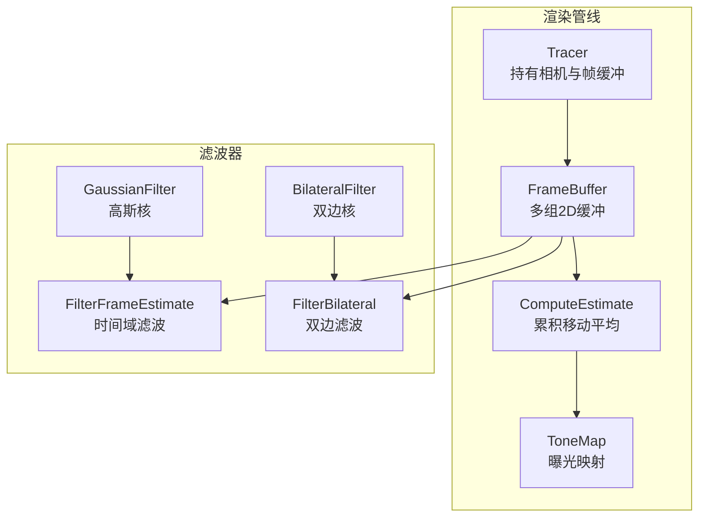
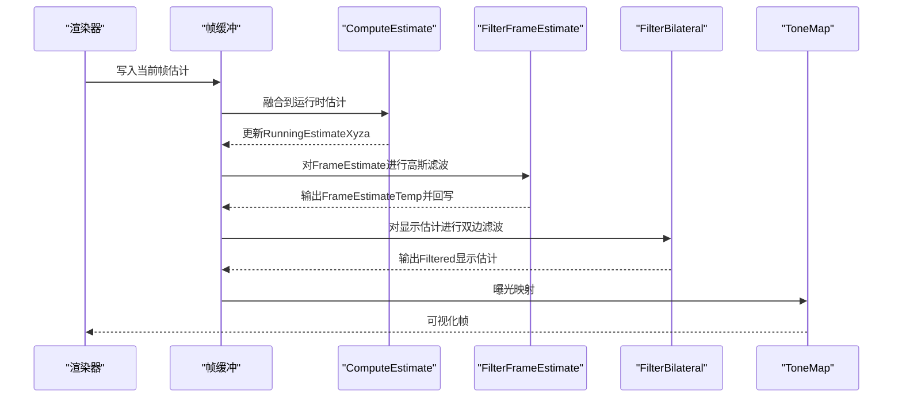
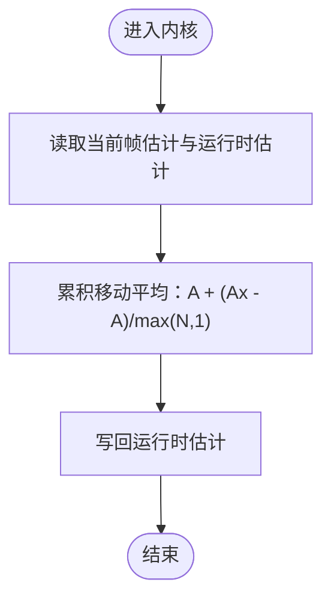
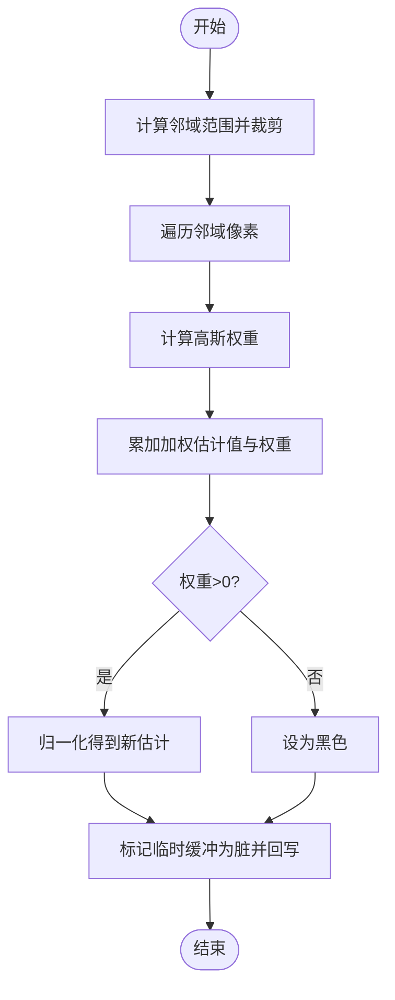
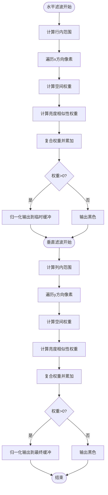
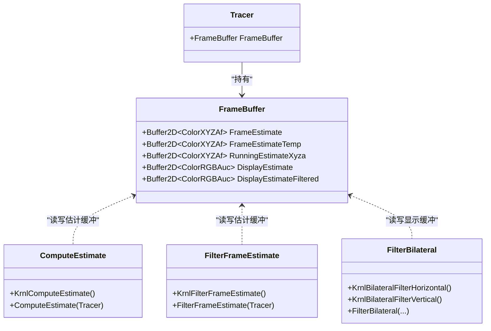

# 帧估计和滤波

<cite>
**本文引用的文件**
- [filterframeestimate.cuh](file://Source/filterframeestimate.cuh)
- [filterrunningestimate.cuh](file://Source/filterrunningestimate.cuh)
- [estimate.cuh](file://Source/estimate.cuh)
- [filter.h](file://Source/filter.h)
- [framebuffer.h](file://Source/framebuffer.h)
- [buffer2d.h](file://Source/buffer2d.h)
- [color.h](file://Source/color.h)
- [utilities.h](file://Source/utilities.h)
- [tonemap.cuh](file://Source/tonemap.cuh)
- [tracer.h](file://Source/tracer.h)
- [camera.h](file://Source/camera.h)
- [exposurerender.h](file://Source/exposurerender.h)
</cite>

## 目录
1. [简介](#简介)
2. [项目结构](#项目结构)
3. [核心组件](#核心组件)
4. [架构总览](#架构总览)
5. [详细组件分析](#详细组件分析)
6. [依赖关系分析](#依赖关系分析)
7. [性能考量](#性能考量)
8. [故障排查指南](#故障排查指南)
9. [结论](#结论)
10. [附录](#附录)

## 简介
本文件面向“帧估计与滤波”子系统，系统性阐述以下主题：
- 帧估计原理：以累积移动平均的方式融合多帧样本，提升信噪比与稳定性。
- 多帧采样策略：通过运行时迭代次数控制估计收敛速度与质量。
- 运行时估计更新机制：在每帧之间平滑更新全局估计，避免闪烁与抖动。
- 滤波算法实现：包含时间域高斯滤波与双边滤波（空间+亮度域）。
- 参数配置与收敛判断：核半径、权重表、相似性度量与归一化策略。
- 噪声控制与估计质量评估：基于累计均值与归一化权重的统计特性。
- 自适应采样与内存管理：缓冲区复用、临时缓冲与设备/主机内存分配策略。
- 性能优化：CUDA内核块/网格维度、共享内存使用与边界裁剪。

本文件兼顾初学者可读性与资深开发者的技术深度，所有技术细节均对应仓库中具体源码文件与行号。

## 项目结构
该子系统围绕“帧估计”和“后处理滤波”两条主线展开，涉及数据结构（帧缓冲）、颜色空间转换、CUDA内核与运行时参数等模块。

图示来源
- [tracer.h:31-55](file://Source/tracer.h#L31-L55)
- [framebuffer.h:26-105](file://Source/framebuffer.h#L26-L105)
- [estimate.cuh:27-38](file://Source/estimate.cuh#L27-L38)
- [tonemap.cuh:30-41](file://Source/tonemap.cuh#L30-L41)
- [filterframeestimate.cuh:33-74](file://Source/filterframeestimate.cuh#L33-L74)
- [filterrunningestimate.cuh:55-200](file://Source/filterrunningestimate.cuh#L55-L200)
- [filter.h:27-41](file://Source/filter.h#L27-L41)

章节来源
- [tracer.h:31-55](file://Source/tracer.h#L31-L55)
- [framebuffer.h:26-105](file://Source/framebuffer.h#L26-L105)

## 核心组件
- 帧缓冲（FrameBuffer）
  - 存储当前帧估计、临时估计、运行时估计以及显示估计等多组2D缓冲，支持设备/主机内存类型切换与重置。
- 帧估计计算（ComputeEstimate）
  - 使用累积移动平均将当前帧估计融合到运行时估计，随迭代次数增加逐步收敛。
- 时间域滤波（FilterFrameEstimate）
  - 对当前帧估计进行二维高斯加权平均，抑制噪声并平滑估计。
- 空间域滤波（FilterBilateral）
  - 双线性滤波的扩展：在空间邻域内按高斯距离权重，在亮度相似性上加权，实现边缘保持的去噪。
- 颜色与转换（Color/XYZ/RGB/RGBA）
  - 提供多种颜色表示与相互转换，支撑估计值与显示输出之间的色彩空间一致性。
- 渲染设置与相机（RenderSettings/Camera）
  - 暴露曝光、伽马等参数，影响色调映射与估计质量感知。

章节来源
- [framebuffer.h:26-105](file://Source/framebuffer.h#L26-L105)
- [estimate.cuh:27-38](file://Source/estimate.cuh#L27-L38)
- [filterframeestimate.cuh:33-74](file://Source/filterframeestimate.cuh#L33-L74)
- [filterrunningestimate.cuh:55-200](file://Source/filterrunningestimate.cuh#L55-L200)
- [color.h:59-142](file://Source/color.h#L59-L142)
- [tonemap.cuh:30-41](file://Source/tonemap.cuh#L30-L41)
- [camera.h:49-94](file://Source/camera.h#L49-L94)

## 架构总览
下图展示了从渲染器到估计与滤波的整体流程：渲染器生成当前帧估计，随后进行时间域与空间域滤波，并最终进行色调映射输出。

图示来源
- [estimate.cuh:27-38](file://Source/estimate.cuh#L27-L38)
- [filterframeestimate.cuh:33-74](file://Source/filterframeestimate.cuh#L33-L74)
- [filterrunningestimate.cuh:193-200](file://Source/filterrunningestimate.cuh#L193-L200)
- [tonemap.cuh:30-41](file://Source/tonemap.cuh#L30-L41)

## 详细组件分析

### 组件A：帧估计与运行时更新（ComputeEstimate）
- 工作原理
  - 每像素执行累积移动平均：将当前帧估计与历史运行时估计按迭代次数加权融合，实现无偏渐进估计。
- 关键点
  - 使用统一的累积移动平均函数，保证数值稳定与收敛性。
  - CUDA内核按像素并行，块/网格维度适配分辨率。
- 典型调用路径
  - [KrnlComputeEstimate:27-32](file://Source/estimate.cuh#L27-L32)
  - [ComputeEstimate:34-38](file://Source/estimate.cuh#L34-L38)

图示来源
- [estimate.cuh:27-38](file://Source/estimate.cuh#L27-L38)
- [utilities.h:59-67](file://Source/utilities.h#L59-L67)

章节来源
- [estimate.cuh:27-38](file://Source/estimate.cuh#L27-L38)
- [utilities.h:59-67](file://Source/utilities.h#L59-L67)

### 组件B：时间域高斯滤波（FilterFrameEstimate）
- 工作原理
  - 对每个像素的邻域（由核半径定义）应用二维高斯权重，对当前帧估计进行加权求和并归一化，得到平滑后的估计。
- 边界处理
  - 计算有效范围并裁剪至图像边界，确保索引安全。
- 参数与内存
  - 核半径与sigma在内核参数中指定；使用临时缓冲存放中间结果，最后回写覆盖原估计。
- 典型调用路径
  - [KrnlFilterFrameEstimate:33-64](file://Source/filterframeestimate.cuh#L33-L64)
  - [FilterFrameEstimate:66-74](file://Source/filterframeestimate.cuh#L66-L74)

图示来源
- [filterframeestimate.cuh:33-74](file://Source/filterframeestimate.cuh#L33-L74)

章节来源
- [filterframeestimate.cuh:33-74](file://Source/filterframeestimate.cuh#L33-L74)

### 组件C：双边滤波（FilterBilateral）
- 工作原理
  - 分水平与垂直两阶段滤波：先沿行方向按空间权重与亮度相似性权重复合，再沿列方向重复，实现边缘保持的平滑。
  - 空间权重由高斯核定义；亮度相似性通过预计算的高斯相似表实现。
- 共享内存与同步
  - 使用共享内存存储范围、权重、总权重与累加颜色，内核线程间通过同步屏障协调。
- 典型调用路径
  - [KrnlBilateralFilterHorizontal:55-122](file://Source/filterrunningestimate.cuh#L55-L122)
  - [KrnlBilateralFilterVertical:124-191](file://Source/filterrunningestimate.cuh#L124-L191)
  - [FilterBilateral:193-200](file://Source/filterrunningestimate.cuh#L193-L200)

图示来源
- [filterrunningestimate.cuh:55-200](file://Source/filterrunningestimate.cuh#L55-L200)
- [filter.h:27-41](file://Source/filter.h#L27-L41)

章节来源
- [filterrunningestimate.cuh:55-200](file://Source/filterrunningestimate.cuh#L55-L200)
- [filter.h:27-41](file://Source/filter.h#L27-L41)

### 组件D：颜色模型与转换（Color/XYZ/RGB/RGBA）
- 数据结构
  - 提供浮点与整型颜色类，支持构造、运算、最小最大值、夹取与黑场判定。
- 转换函数
  - RGB↔XYZ↔RGBA等转换，用于估计值与显示输出之间的色彩空间一致性。
- 在滤波中的作用
  - 双边滤波在亮度相似性比较时使用XYZ亮度，确保感知一致。

章节来源
- [color.h:59-142](file://Source/color.h#L59-L142)
- [color.h:144-258](file://Source/color.h#L144-L258)

### 组件E：色调映射（ToneMap）
- 功能
  - 将估计的XYZA值按曝光参数进行指数映射，限制到[0,1]区间，作为最终显示估计。
- 与滤波的关系
  - 在空间域滤波之后进行，确保滤波后的颜色经由曝光调整后输出。

章节来源
- [tonemap.cuh:30-41](file://Source/tonemap.cuh#L30-L41)

### 组件F：帧缓冲与内存管理（FrameBuffer/Buffer2D）
- 帧缓冲
  - 包含多组2D缓冲：当前帧估计、临时估计、运行时估计、显示估计及其滤波版本，支持尺寸变更与重置。
- 缓冲区基类
  - 支持主机/设备内存分配、重置、销毁与元素访问，提供插值采样接口。
- 内存与性能
  - 设备侧缓冲减少CPU-GPU拷贝；临时缓冲用于双阶段滤波；Dirty标志辅助脏页管理。

章节来源
- [framebuffer.h:26-105](file://Source/framebuffer.h#L26-L105)
- [buffer2d.h:26-289](file://Source/buffer2d.h#L26-L289)

### 组件G：渲染器与相机（Tracer/Camera/RenderSettings）
- Tracer
  - 承载渲染器状态与帧缓冲，负责根据相机分辨率初始化/重置缓冲。
- Camera
  - 暴露曝光、伽马、视野、焦距等参数，影响色调映射与估计质量感知。
- RenderSettings
  - 提供遍历与着色等渲染参数（与滤波无直接耦合，但影响估计输入质量）。

章节来源
- [tracer.h:31-55](file://Source/tracer.h#L31-L55)
- [camera.h:49-94](file://Source/camera.h#L49-L94)
- [rendersettings.h:27-131](file://Source/rendersettings.h#L27-L131)

## 依赖关系分析
- 模块耦合
  - Tracer持有FrameBuffer；FrameBuffer包含多组2D缓冲；ComputeEstimate与滤波器均依赖FrameBuffer中的估计缓冲。
- 外部依赖
  - CUDA运行时用于内核调度与内存管理；颜色/数学工具函数提供基础运算。
- 潜在循环依赖
  - 未见直接循环；滤波器仅消费估计缓冲，不反向写回估计。

图示来源
- [tracer.h:31-55](file://Source/tracer.h#L31-L55)
- [framebuffer.h:26-105](file://Source/framebuffer.h#L26-L105)
- [estimate.cuh:27-38](file://Source/estimate.cuh#L27-L38)
- [filterframeestimate.cuh:33-74](file://Source/filterframeestimate.cuh#L33-L74)
- [filterrunningestimate.cuh:55-200](file://Source/filterrunningestimate.cuh#L55-L200)

章节来源
- [tracer.h:31-55](file://Source/tracer.h#L31-L55)
- [framebuffer.h:26-105](file://Source/framebuffer.h#L26-L105)

## 性能考量
- 并行粒度
  - ComputeEstimate与滤波内核均采用2D像素级并行，块/网格维度与分辨率匹配，减少空闲线程。
- 共享内存利用
  - 双边滤波在共享内存中缓存范围、权重与累加颜色，降低全局内存访问开销。
- 边界裁剪与归一化
  - 通过边界裁剪避免无效访问；仅在总权重大于零时进行归一化，避免除零与无效计算。
- 内存带宽
  - 双阶段双边滤波使用临时缓冲，减少往返全局内存的次数；帧缓冲在设备侧分配，降低CPU-GPU拷贝。
- 参数敏感性
  - 核半径与sigma影响平滑程度与性能；过大核半径导致更多全局内存访问与更长内核执行时间。

章节来源
- [filterrunningestimate.cuh:55-200](file://Source/filterrunningestimate.cuh#L55-L200)
- [filterframeestimate.cuh:33-74](file://Source/filterframeestimate.cuh#L33-L74)
- [buffer2d.h:125-164](file://Source/buffer2d.h#L125-L164)

## 故障排查指南
- 估计发散或过亮/过暗
  - 检查曝光参数与伽马设置；确认色调映射是否正确应用。
  - 参考：[tonemap.cuh:30-41](file://Source/tonemap.cuh#L30-L41)，[camera.h:49-94](file://Source/camera.h#L49-L94)
- 滤波后出现条纹或边缘伪影
  - 调整双边滤波核半径与相似性权重表；检查亮度相似性计算是否合理。
  - 参考：[filterrunningestimate.cuh:35-53](file://Source/filterrunningestimate.cuh#L35-L53)，[filter.h:34-40](file://Source/filter.h#L34-L40)
- 显示估计未更新
  - 确认滤波后是否将临时缓冲回写到最终显示缓冲；检查Dirty标志与缓冲交换逻辑。
  - 参考：[filterframeestimate.cuh:71-74](file://Source/filterframeestimate.cuh#L71-L74)，[filterrunningestimate.cuh:193-200](file://Source/filterrunningestimate.cuh#L193-L200)
- 性能异常
  - 检查块/网格维度与分辨率匹配情况；核半径是否过大；共享内存是否溢出。
  - 参考：[filterrunningestimate.cuh:193-200](file://Source/filterrunningestimate.cuh#L193-L200)，[buffer2d.h:125-164](file://Source/buffer2d.h#L125-L164)

章节来源
- [tonemap.cuh:30-41](file://Source/tonemap.cuh#L30-L41)
- [camera.h:49-94](file://Source/camera.h#L49-L94)
- [filterrunningestimate.cuh:35-53](file://Source/filterrunningestimate.cuh#L35-L53)
- [filter.h:34-40](file://Source/filter.h#L34-L40)
- [filterframeestimate.cuh:71-74](file://Source/filterframeestimate.cuh#L71-L74)
- [filterrunningestimate.cuh:193-200](file://Source/filterrunningestimate.cuh#L193-L200)
- [buffer2d.h:125-164](file://Source/buffer2d.h#L125-L164)

## 结论
本子系统通过“帧估计+时间域与空间域滤波”的组合，实现了高质量、低噪声的体积渲染输出。其设计要点包括：
- 使用累积移动平均实现稳健的运行时估计；
- 通过高斯滤波与双边滤波分别在时间域与空间域抑制噪声；
- 以颜色空间转换与曝光映射确保视觉一致性；
- 以缓冲区与共享内存策略优化内存带宽与并行效率。

对于初学者，建议从帧估计与高斯滤波入手，逐步理解双边滤波与色调映射；对于高级用户，可关注核半径、相似性权重与共享内存使用的调优。

## 附录
- API与导出接口
  - 渲染与估计获取接口可用于外部绑定与集成。
  - 参考：[exposurerender.h:32-44](file://Source/exposurerender.h#L32-L44)

章节来源
- [exposurerender.h:32-44](file://Source/exposurerender.h#L32-L44)