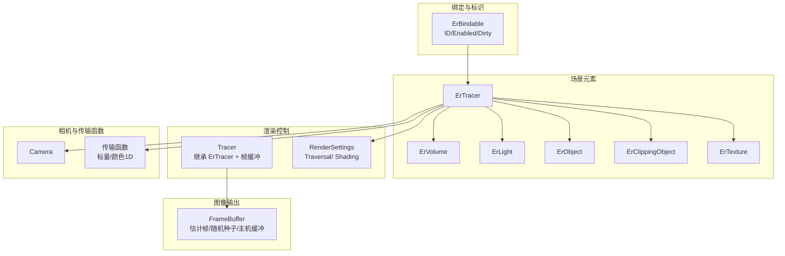
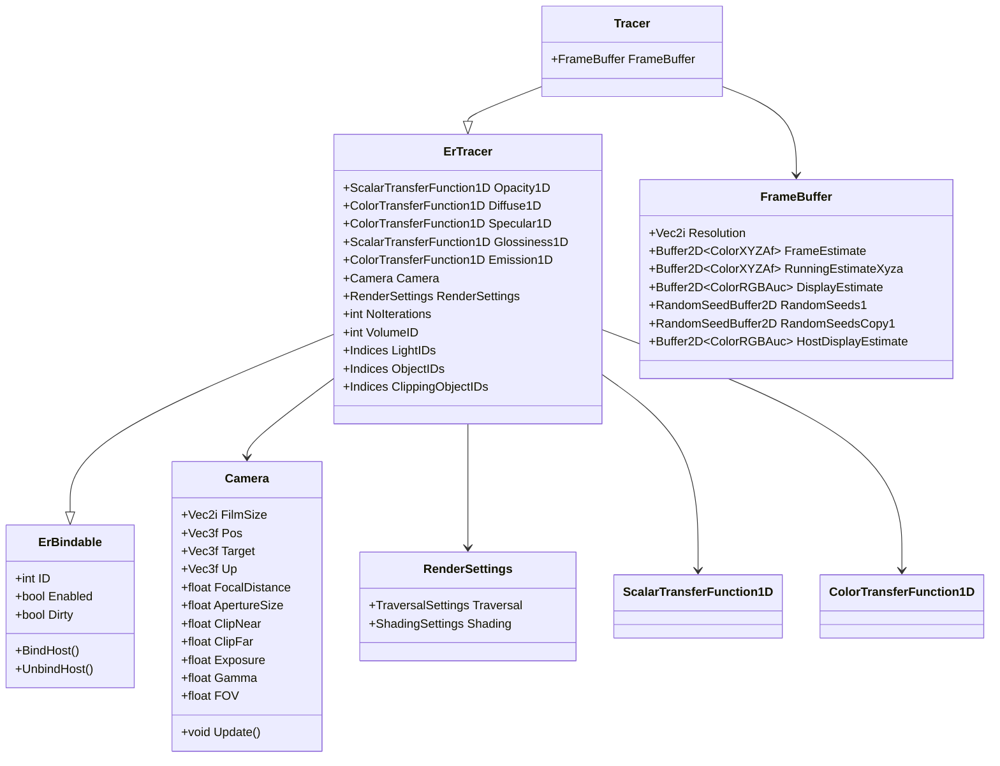
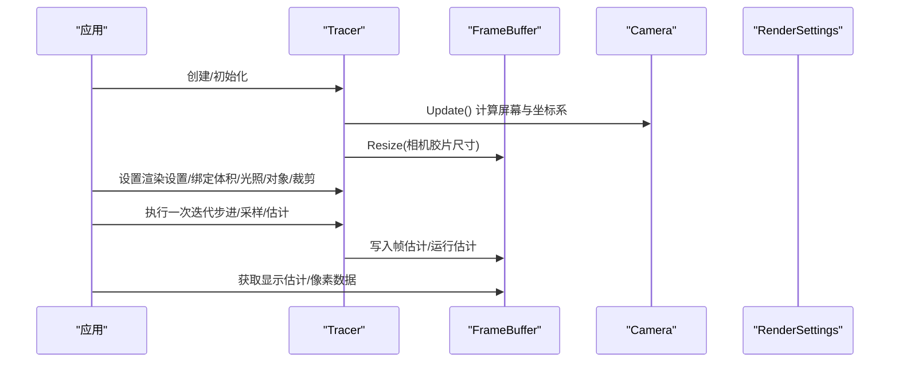
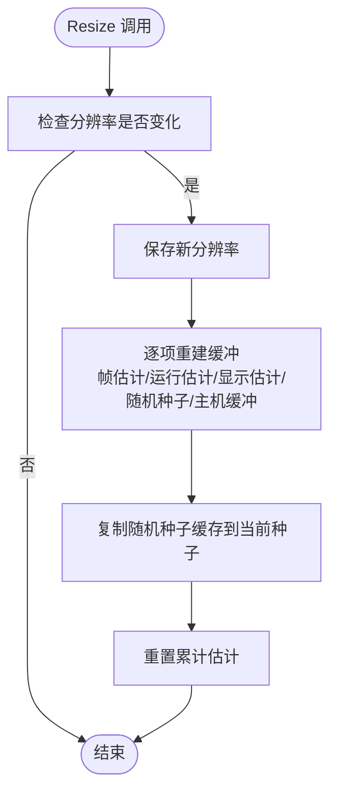

# 渲染引擎

<cite>
**本文引用的文件**
- [exposurerender.h](file://Source/exposurerender.h)
- [exposurerender.cpp](file://Source/exposurerender.cpp)
- [rendersettings.h](file://Source/rendersettings.h)
- [tracer.h](file://Source/tracer.h)
- [ertracer.h](file://Source/ertracer.h)
- [erbindable.h](file://Source/erbindable.h)
- [framebuffer.h](file://Source/framebuffer.h)
- [camera.h](file://Source/camera.h)
- [transferfunction.h](file://Source/transferfunction.h)
- [enums.h](file://Source/enums.h)
- [volume.h](file://Source/volume.h)
- [light.h](file://Source/light.h)
- [object.h](file://Source/object.h)
- [clippingobject.h](file://Source/clippingobject.h)
- [texture.h](file://Source/texture.h)
</cite>

## 目录
1. [简介](#简介)
2. [项目结构](#项目结构)
3. [核心组件](#核心组件)
4. [架构总览](#架构总览)
5. [详细组件分析](#详细组件分析)
6. [依赖分析](#依赖分析)
7. [性能考虑](#性能考虑)
8. [故障排查指南](#故障排查指南)
9. [结论](#结论)
10. [附录](#附录)

## 简介
本渲染引擎是一个面向交互式逼真体积渲染的框架，支持基于路径追踪与体积步进的渲染管线。其核心通过“绑定器”模式将场景元素（相机、体积、光照、对象、裁剪对象、纹理等）与渲染追踪器解耦，并以可配置的渲染设置驱动采样与着色流程。渲染结果以估计帧的形式在设备端累积，最终输出到显示缓冲区。

## 项目结构
- 源码采用分层与职责分离设计：基础类型与工具（如枚举、颜色、向量、缓冲区）位于顶层；渲染核心（追踪器、相机、传输函数、渲染设置）位于中间层；具体场景元素（体积、光照、对象、裁剪对象、纹理）作为绑定实体派生自通用基类。
- 关键模块划分：
  - 绑定与标识：ErBindable 提供统一的 ID、启用状态与脏标记管理。
  - 场景元素：ErTracer、ErVolume、ErLight、ErObject、ErClippingObject、ErTexture。
  - 渲染控制：Tracer（继承 ErTracer 并扩展帧缓冲）、RenderSettings（包含遍历与着色子设置）。
  - 图像输出：FrameBuffer（多缓冲估计与随机种子缓存）。
  - 相机系统：Camera（曝光、伽马、视场角、焦距、光圈、近远裁剪、屏幕坐标系）。
  - 传输函数：标量与颜色一维传输函数，用于密度/颜色映射。
  - 枚举与常量：内存类型、纹理/形状类型、散射模式、异常级别等。

图表来源
- [erbindable.h:28-71](file://Source/erbindable.h#L28-L71)
- [ertracer.h:33-117](file://Source/ertracer.h#L33-L117)
- [tracer.h:31-55](file://Source/tracer.h#L31-L55)
- [framebuffer.h:26-105](file://Source/framebuffer.h#L26-L105)
- [camera.h:26-116](file://Source/camera.h#L26-L116)
- [transferfunction.h:82-154](file://Source/transferfunction.h#L82-L154)
- [rendersettings.h:27-131](file://Source/rendersettings.h#L27-L131)

章节来源
- [erbindable.h:28-71](file://Source/erbindable.h#L28-L71)
- [ertracer.h:33-117](file://Source/ertracer.h#L33-L117)
- [tracer.h:31-55](file://Source/tracer.h#L31-L55)
- [framebuffer.h:26-105](file://Source/framebuffer.h#L26-L105)
- [camera.h:26-116](file://Source/camera.h#L26-L116)
- [transferfunction.h:82-154](file://Source/transferfunction.h#L82-L154)
- [rendersettings.h:27-131](file://Source/rendersettings.h#L27-L131)

## 核心组件
- 绑定器基类（ErBindable）
  - 职责：统一管理对象的唯一标识、启用状态与脏标记，便于宿主侧绑定与更新。
  - 关键属性：ID、Enabled、Dirty。
  - 方法：BindHost()/UnbindHost()（声明于头文件，具体实现在其他模块）。
- 场景元素（ErTracer、ErVolume、ErLight、ErObject、ErClippingObject、ErTexture）
  - ErTracer：继承自 ErBindable，组合相机、渲染设置、传输函数、迭代次数、体积与对象/光照/裁剪索引集合。
  - ErVolume：体积数据持有者，提供体素访问与边界盒信息。
  - ErLight/Object/ClippingObject/ErTexture：场景几何或纹理的抽象。
- 渲染控制（Tracer、RenderSettings）
  - Tracer：在 ErTracer 基础上增加 FrameBuffer，负责渲染帧缓冲的尺寸与资源管理。
  - RenderSettings：包含遍历设置（主次步长因子、阴影开关、最大阴影距离）与着色设置（类型、密度缩放、是否按密度调制、梯度计算方式与阈值/因子）。
- 图像输出（FrameBuffer）
  - 多缓冲估计：帧估计、运行估计、显示估计及其临时缓冲。
  - 随机种子：两套随机种子缓冲及缓存副本，支持重置与复制。
  - 主机侧显示缓冲：用于从设备端拷回像素数据。
- 相机（Camera）
  - 参数：胶片尺寸、位置/目标/上方向、焦距、光圈、近远裁剪、曝光、伽马、视场角。
  - 计算：逆曝光/逆伽马、相机坐标系基矢 N/U/V、屏幕范围与像素尺度。
- 传输函数（ScalarTransferFunction1D、ColorTransferFunction1D）
  - 支持节点化的一维标量/颜色插值，用于密度到不透明度/颜色的映射。

章节来源
- [erbindable.h:28-71](file://Source/erbindable.h#L28-L71)
- [ertracer.h:33-117](file://Source/ertracer.h#L33-L117)
- [tracer.h:31-55](file://Source/tracer.h#L31-L55)
- [rendersettings.h:27-131](file://Source/rendersettings.h#L27-L131)
- [framebuffer.h:26-105](file://Source/framebuffer.h#L26-L105)
- [camera.h:26-116](file://Source/camera.h#L26-L116)
- [transferfunction.h:82-154](file://Source/transferfunction.h#L82-L154)

## 架构总览
渲染引擎采用“场景元素 + 追踪器 + 输出缓冲”的分层架构。追踪器负责组织场景、执行步进与采样，并将结果写入帧缓冲；渲染设置控制步进策略与着色模式；传输函数将体密度映射为光学属性；相机提供视图变换与投影参数；帧缓冲承载估计与显示结果。

图表来源
- [erbindable.h:28-71](file://Source/erbindable.h#L28-L71)
- [ertracer.h:33-117](file://Source/ertracer.h#L33-L117)
- [tracer.h:31-55](file://Source/tracer.h#L31-L55)
- [framebuffer.h:26-105](file://Source/framebuffer.h#L26-L105)
- [camera.h:26-116](file://Source/camera.h#L26-L116)
- [rendersettings.h:27-131](file://Source/rendersettings.h#L27-L131)
- [transferfunction.h:82-154](file://Source/transferfunction.h#L82-L154)

## 详细组件分析

### 组件：渲染追踪器（ErTracer 与 Tracer）
- ErTracer
  - 组合了传输函数（标量/颜色各一维）、相机、渲染设置、迭代次数、体积ID以及光照/对象/裁剪对象索引集合。
  - 提供通用赋值与绑定方法，用于将外部索引映射到内部数组。
- Tracer
  - 在 ErTracer 基础上增加 FrameBuffer，并在拷贝构造时同步调整帧缓冲尺寸。

图表来源
- [tracer.h:31-55](file://Source/tracer.h#L31-L55)
- [framebuffer.h:45-74](file://Source/framebuffer.h#L45-L74)
- [camera.h:61-96](file://Source/camera.h#L61-L96)
- [ertracer.h:82-103](file://Source/ertracer.h#L82-L103)

章节来源
- [ertracer.h:33-117](file://Source/ertracer.h#L33-L117)
- [tracer.h:31-55](file://Source/tracer.h#L31-L55)
- [framebuffer.h:45-74](file://Source/framebuffer.h#L45-L74)
- [camera.h:61-96](file://Source/camera.h#L61-L96)

### 组件：渲染设置（RenderSettings）
- 遍历设置（TraversalSettings）
  - StepFactorPrimary/StepFactorShadow：主光/阴影步长因子。
  - Shadows：是否启用阴影。
  - MaxShadowDistance：最大阴影距离。
- 着色设置（ShadingSettings）
  - Type：着色模式类型。
  - DensityScale：密度缩放系数。
  - OpacityModulated：是否按密度调制不透明度。
  - GradientComputation：梯度计算方式（枚举）。
  - GradientThreshold/GradientFactor：梯度阈值与因子。

章节来源
- [rendersettings.h:27-131](file://Source/rendersettings.h#L27-L131)
- [enums.h:63-78](file://Source/enums.h#L63-L78)

### 组件：帧缓冲（FrameBuffer）
- 资源组成
  - 帧估计与临时缓冲：用于体积步进的中间估计。
  - 运行估计：累计估计（XYZA）。
  - 显示估计与过滤后显示估计：最终输出缓冲。
  - 随机种子缓冲与缓存副本：支持重置与一致性。
  - 主机侧显示缓冲：用于从设备端拷回像素。
- 关键操作
  - Resize：根据分辨率重建所有缓冲并重置随机种子。
  - Reset：将随机种子恢复至缓存副本。
  - Free：释放所有缓冲并清空分辨率。

图表来源
- [framebuffer.h:45-74](file://Source/framebuffer.h#L45-L74)

章节来源
- [framebuffer.h:26-105](file://Source/framebuffer.h#L26-L105)

### 组件：相机（Camera）
- 参数与计算
  - 更新函数会计算逆曝光、逆伽马、相机基矢 N/U/V、屏幕范围与像素尺度。
  - 若未指定焦距，则默认为目标与位置的距离。
- 使用要点
  - 胶片尺寸决定屏幕范围与像素尺度。
  - 视场角与宽高比影响屏幕范围。

章节来源
- [camera.h:26-116](file://Source/camera.h#L26-L116)

### 组件：传输函数（ScalarTransferFunction1D / ColorTransferFunction1D）
- 标量传输函数：支持添加节点与按强度求值。
- 颜色传输函数：RGB 三通道分别维护 PLF，按强度返回 XYZ 颜色。
- 应用：将体素密度映射为不透明度、漫反射/镜面反射颜色、光泽度与发射颜色。

章节来源
- [transferfunction.h:82-154](file://Source/transferfunction.h#L82-L154)

### 组件：体积（Volume）
- 数据与几何
  - 持有设备端体素缓冲与边界盒，提供体素访问运算符。
  - 根据体素分辨率、间距与归一化策略计算物理尺寸、逆尺寸与最小步长。
  - 梯度增量基于最小步长生成，用于梯度相关着色。
- 使用要点
  - 体素访问需先转换到本地坐标空间再采样。

章节来源
- [volume.h:26-150](file://Source/volume.h#L26-L150)

### 组件：光照、对象、裁剪对象、纹理（Light/Object/ClippingObject/Texture）
- Light/Object/ClippingObject/Texture 均为对应 Er* 类的简单包装，主要在赋值时触发必要的更新（如光源形状更新）。
- 作用：作为场景元素被 ErTracer 绑定并参与渲染。

章节来源
- [light.h:26-46](file://Source/light.h#L26-L46)
- [object.h:26-45](file://Source/object.h#L26-L45)
- [clippingobject.h:26-44](file://Source/clippingobject.h#L26-L44)
- [texture.h:26-45](file://Source/texture.h#L26-L45)

### 组件：导出接口（exposurerender.h）
- 绑定接口：将外部对象绑定到追踪器（可选解除绑定）。
- 渲染与查询：启动估计、获取估计数据、自动对焦距离、迭代次数查询。

章节来源
- [exposurerender.h:32-42](file://Source/exposurerender.h#L32-L42)

## 依赖分析
- 组件耦合
  - Tracer 强依赖 FrameBuffer（尺寸与资源管理）。
  - ErTracer 强依赖 Camera、RenderSettings、传输函数与各类索引集合。
  - ErBindable 为所有场景元素提供统一的生命周期与脏标记机制。
- 外部依赖
  - 缓冲区与颜色类型由底层工具模块提供（例如 Buffer2D、ColorRGBAuc、ColorXYZAf 等）。
  - 枚举与常量定义集中于 enums.h，被广泛使用。

```mermaid
graph LR
EB["ErBindable"] --> ET["ErTracer"]
ET --> CAM["Camera"]
ET --> RS["RenderSettings"]
ET --> TF["传输函数"]
ET --> T["Tracer"]
T --> FB["FrameBuffer"]
ET --> EV["ErVolume"]
ET --> EL["ErLight"]
ET --> EO["ErObject"]
ET --> EC["ErClippingObject"]
ET --> ERt["ErTexture"]
```

图表来源
- [erbindable.h:28-71](file://Source/erbindable.h#L28-L71)
- [ertracer.h:33-117](file://Source/ertracer.h#L33-L117)
- [tracer.h:31-55](file://Source/tracer.h#L31-L55)
- [framebuffer.h:26-105](file://Source/framebuffer.h#L26-L105)
- [camera.h:26-116](file://Source/camera.h#L26-L116)
- [transferfunction.h:82-154](file://Source/transferfunction.h#L82-L154)
- [rendersettings.h:27-131](file://Source/rendersettings.h#L27-L131)

章节来源
- [erbindable.h:28-71](file://Source/erbindable.h#L28-L71)
- [ertracer.h:33-117](file://Source/ertracer.h#L33-L117)
- [tracer.h:31-55](file://Source/tracer.h#L31-L55)
- [framebuffer.h:26-105](file://Source/framebuffer.h#L26-L105)
- [camera.h:26-116](file://Source/camera.h#L26-L116)
- [transferfunction.h:82-154](file://Source/transferfunction.h#L82-L154)
- [rendersettings.h:27-131](file://Source/rendersettings.h#L27-L131)

## 性能考虑
- 步长因子与阴影
  - 主光与阴影步长因子直接影响采样效率与质量平衡；过小导致迭代次数过多，过大可能引入噪声或伪影。
- 密度缩放与梯度
  - 密度缩放影响体积细节可见性；梯度计算方式与阈值/因子影响表面感与边缘锐利度。
- 帧缓冲尺寸
  - 分辨率越高，每帧计算量越大；建议按需求动态调整胶片尺寸。
- 随机种子与估计
  - 使用两套随机种子缓冲有助于稳定采样；重置种子可避免长期漂移。
- 设备/主机内存
  - 大型体积与高分辨率显示估计会占用较多显存；注意及时释放不再使用的缓冲。

## 故障排查指南
- 相机参数异常
  - 症状：画面比例异常或裁剪错误。
  - 排查：确认胶片尺寸、视场角与宽高比；调用更新函数重新计算屏幕范围。
- 曝光与伽马
  - 症状：过曝/欠曝或对比度过低。
  - 排查：检查曝光与伽马设置；逆曝光/逆伽马在更新中生效。
- 体积尺寸与步长
  - 症状：体积过亮/过暗或步进不稳定。
  - 排查：确认体素间距、归一化尺寸与最小步长；确保边界盒与尺寸计算正确。
- 帧缓冲尺寸不匹配
  - 症状：渲染结果错位或越界。
  - 排查：确保相机胶片尺寸与帧缓冲分辨率一致；调用 Resize 同步更新。
- 估计数据为空或闪烁
  - 症状：显示估计无内容或抖动。
  - 排查：检查随机种子缓存与重置逻辑；确认累计估计是否正常累加。

章节来源
- [camera.h:61-96](file://Source/camera.h#L61-L96)
- [framebuffer.h:45-74](file://Source/framebuffer.h#L45-L74)
- [volume.h:100-129](file://Source/volume.h#L100-L129)

## 结论
该渲染引擎通过清晰的层次化设计与绑定器模式，实现了体积渲染的模块化与可扩展性。ErTracer 作为核心控制器，结合相机、渲染设置、传输函数与帧缓冲，提供了高效的估计与输出流程。合理配置步长、密度与梯度参数，可获得高质量且交互式的体积渲染效果。

## 附录

### API 与使用模式概览
- 绑定与解绑
  - 将外部对象绑定到追踪器，支持可选解除绑定。
- 渲染与查询
  - 启动估计、获取估计数据、查询自动对焦距离与迭代次数。
- 典型工作流
  - 初始化追踪器与帧缓冲 → 设置相机与渲染设置 → 绑定体积/光照/对象/裁剪/纹理 → 循环执行估计直至满足条件 → 读取显示估计。

章节来源
- [exposurerender.h:32-42](file://Source/exposurerender.h#L32-L42)
- [tracer.h:31-55](file://Source/tracer.h#L31-L55)
- [framebuffer.h:45-74](file://Source/framebuffer.h#L45-L74)