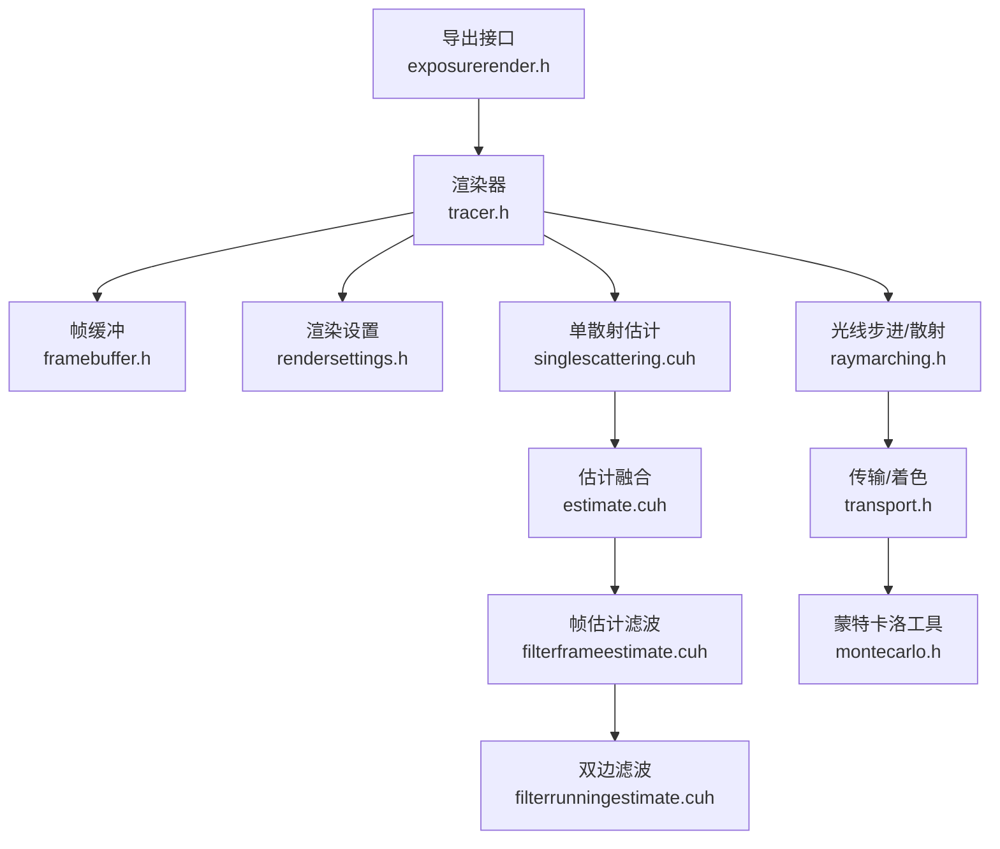
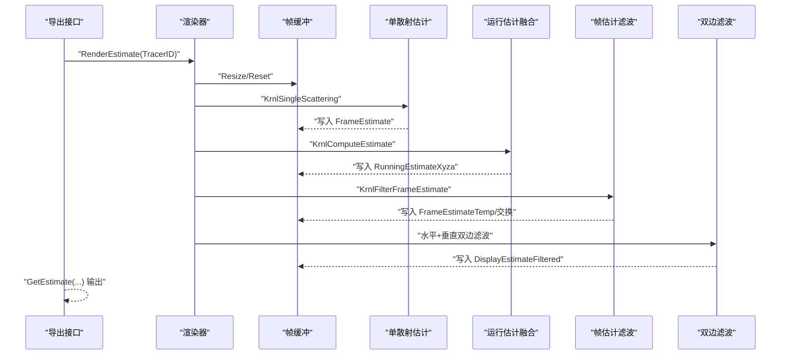
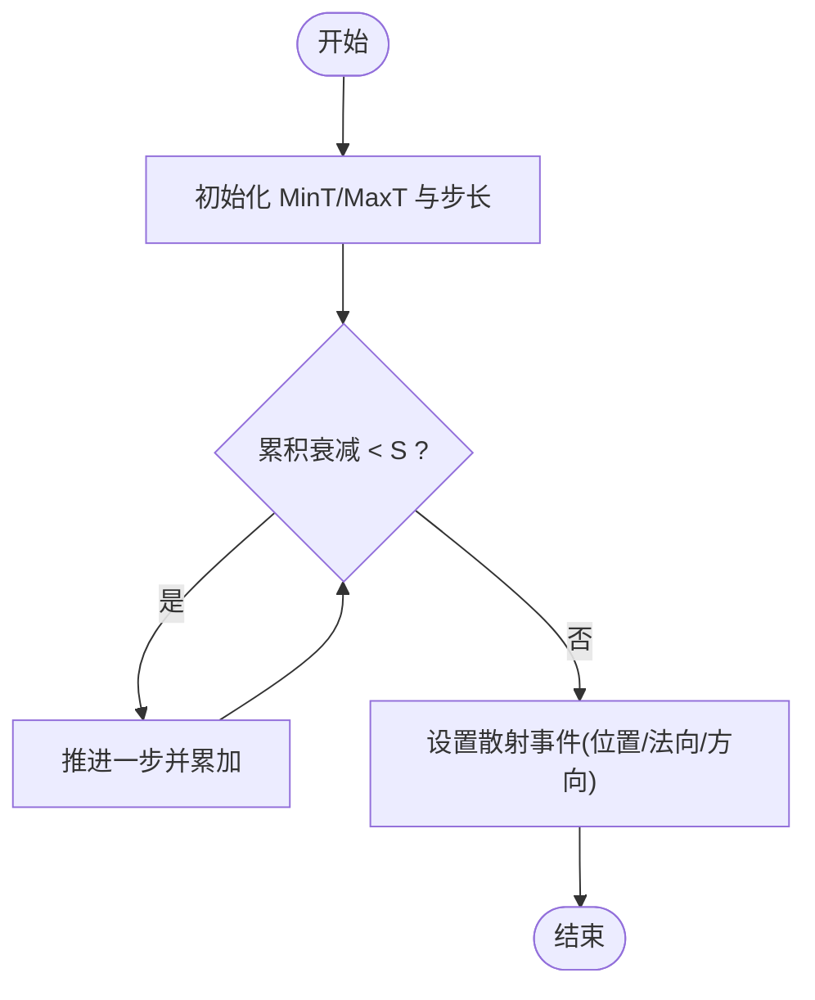
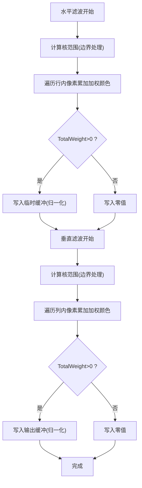
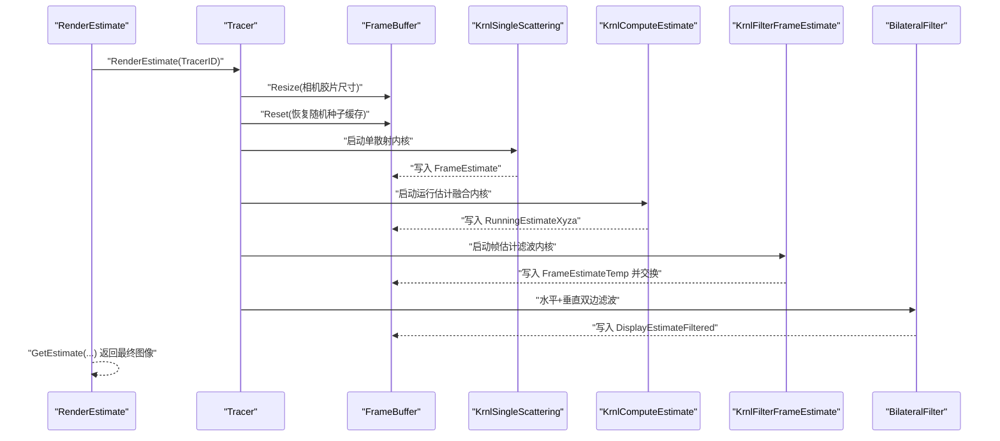
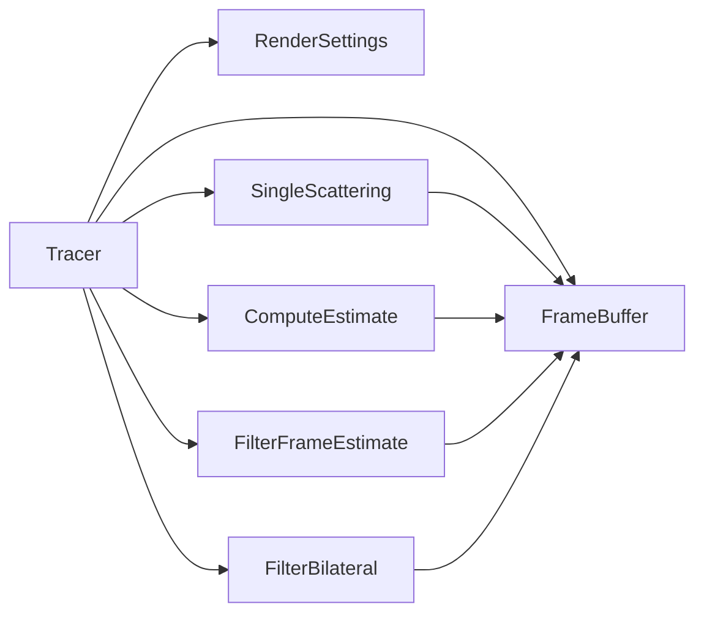

# 渲染流水线详解

<cite>
**本文引用的文件**
- [exposurerender.h](file://Source/exposurerender.h)
- [estimate.cuh](file://Source/estimate.cuh)
- [filterframeestimate.cuh](file://Source/filterframeestimate.cuh)
- [filterrunningestimate.cuh](file://Source/filterrunningestimate.cuh)
- [singlescattering.cuh](file://Source/singlescattering.cuh)
- [montecarlo.h](file://Source/montecarlo.h)
- [transport.h](file://Source/transport.h)
- [raymarching.h](file://Source/raymarching.h)
- [ertracer.h](file://Source/ertracer.h)
- [tracer.h](file://Source/tracer.h)
- [framebuffer.h](file://Source/framebuffer.h)
- [rendersettings.h](file://Source/rendersettings.h)
</cite>

## 目录
1. [引言](#引言)
2. [项目结构](#项目结构)
3. [核心组件](#核心组件)
4. [架构总览](#架构总览)
5. [详细组件分析](#详细组件分析)
6. [依赖分析](#依赖分析)
7. [性能考虑](#性能考虑)
8. [故障排查指南](#故障排查指南)
9. [结论](#结论)
10. [附录](#附录)

## 引言
本文件系统性阐述该体积渲染框架的渲染流水线：从光线在体积中的传播与散射事件采样，到帧估计生成、运行时估计融合、滤波处理，再到最终输出。文档以GPU内核实现为核心，结合具体源码路径，解释各阶段算法原理、数据流与同步机制，并给出面向初学者的渐进式说明与面向资深开发者的深度细节。

## 项目结构
该项目采用分层与按功能模块组织的结构：
- 核心渲染接口与导出：通过暴露的头文件对外提供渲染控制与查询能力
- 渲染器与帧缓冲：封装渲染器状态、相机、渲染设置以及帧缓冲区
- 光线步进与散射：体积内随机行走、散射事件判定与可见性检测
- 帧估计与估计融合：单次像素级估计生成与运行时移动平均融合
- 后处理滤波：高斯滤波与双边滤波（水平/垂直两阶段）
- 随机数与蒙特卡洛：球面/半球采样、PDF与重要性采样辅助

图表来源
- [exposurerender.h:39-42](file://Source/exposurerender.h#L39-L42)
- [tracer.h:31-55](file://Source/tracer.h#L31-L55)
- [framebuffer.h:26-105](file://Source/framebuffer.h#L26-L105)
- [singlescattering.cuh:27-38](file://Source/singlescattering.cuh#L27-L38)
- [estimate.cuh:27-38](file://Source/estimate.cuh#L27-L38)
- [filterframeestimate.cuh:33-74](file://Source/filterframeestimate.cuh#L33-L74)
- [filterrunningestimate.cuh:55-200](file://Source/filterrunningestimate.cuh#L55-L200)
- [raymarching.h:30-113](file://Source/raymarching.h#L30-L113)
- [transport.h:30-156](file://Source/transport.h#L30-L156)
- [montecarlo.h:27-227](file://Source/montecarlo.h#L27-L227)

章节来源
- [exposurerender.h:32-42](file://Source/exposurerender.h#L32-L42)
- [tracer.h:31-55](file://Source/tracer.h#L31-L55)
- [framebuffer.h:26-105](file://Source/framebuffer.h#L26-L105)

## 核心组件
- 导出接口：提供绑定渲染器、体积、光源、对象、裁剪对象、纹理与位图的接口，以及渲染估计、获取估计、自动对焦与迭代次数查询等API
- 渲染器与帧缓冲：渲染器持有相机、渲染设置、体积与光照索引；帧缓冲管理多组设备/主机缓冲（帧估计、运行估计、显示估计及其临时缓冲、随机种子等）
- 单散射估计：针对每个像素调用单散射内核，生成当前帧估计
- 运行估计融合：使用累计移动平均将当前帧估计融合入运行估计
- 帧估计滤波：高斯卷积平滑帧估计
- 双边滤波：利用亮度相似性权重进行边缘保持的双边滤波
- 光线步进与散射：体积内随机行走采样散射事件，支持阴影步进因子与最大阴影距离
- 传输与着色：直接光估计、可见性判断、BRDF/BSDF采样与功率权衡

章节来源
- [exposurerender.h:32-42](file://Source/exposurerender.h#L32-L42)
- [ertracer.h:33-117](file://Source/ertracer.h#L33-L117)
- [tracer.h:31-55](file://Source/tracer.h#L31-L55)
- [framebuffer.h:26-105](file://Source/framebuffer.h#L26-L105)
- [singlescattering.cuh:27-38](file://Source/singlescattering.cuh#L27-L38)
- [estimate.cuh:27-38](file://Source/estimate.cuh#L27-L38)
- [filterframeestimate.cuh:33-74](file://Source/filterframeestimate.cuh#L33-L74)
- [filterrunningestimate.cuh:55-200](file://Source/filterrunningestimate.cuh#L55-L200)
- [raymarching.h:30-113](file://Source/raymarching.h#L30-L113)
- [transport.h:30-156](file://Source/transport.h#L30-L156)
- [montecarlo.h:27-227](file://Source/montecarlo.h#L27-L227)

## 架构总览
渲染流水线由“估计生成—融合—滤波—输出”四段式构成，贯穿于每一轮渲染迭代。渲染器负责调度各阶段内核，帧缓冲作为数据枢纽承载中间结果与随机种子缓存。

图表来源
- [exposurerender.h:39-42](file://Source/exposurerender.h#L39-L42)
- [singlescattering.cuh:27-38](file://Source/singlescattering.cuh#L27-L38)
- [estimate.cuh:27-38](file://Source/estimate.cuh#L27-L38)
- [filterframeestimate.cuh:33-74](file://Source/filterframeestimate.cuh#L33-L74)
- [filterrunningestimate.cuh:193-200](file://Source/filterrunningestimate.cuh#L193-L200)

## 详细组件分析

### 渲染状态管理与错误处理
- 渲染状态：渲染器包含相机、渲染设置、体积ID、光照与对象索引等，用于驱动内核执行与参数传递
- 帧缓冲：统一管理分辨率变更、缓冲重置与释放，确保随机种子缓存与显示缓冲一致性
- 错误处理：散射事件与可见性检查中对无效交叠、边界条件与空PDF进行保护性分支

章节来源
- [ertracer.h:33-117](file://Source/ertracer.h#L33-L117)
- [tracer.h:31-55](file://Source/tracer.h#L31-L55)
- [framebuffer.h:45-91](file://Source/framebuffer.h#L45-L91)
- [transport.h:46-56](file://Source/transport.h#L46-L56)

### 光线传播与散射计算
- 体积内随机行走：根据密度尺度与步长因子推进，累积衰减至阈值后产生散射事件
- 阴影步进：用于遮挡检测的步进参数与最大遮挡距离限制
- 可见性：沿连接两点的射线进行一次遍历，若被遮挡则认为不可见

图表来源
- [raymarching.h:30-113](file://Source/raymarching.h#L30-L113)

章节来源
- [raymarching.h:30-113](file://Source/raymarching.h#L30-L113)
- [transport.h:46-56](file://Source/transport.h#L46-L56)

### 帧估计生成（单散射）
- 每个像素启动一个内核线程，调用单散射内核计算当前帧估计
- 内核直接写入帧缓冲的帧估计缓冲

章节来源
- [singlescattering.cuh:27-38](file://Source/singlescattering.cuh#L27-L38)

### 运行估计融合（累计移动平均）
- 使用二维内核遍历像素，将当前帧估计与运行估计按迭代次数进行累计移动平均
- 更新运行估计缓冲

章节来源
- [estimate.cuh:27-38](file://Source/estimate.cuh#L27-L38)

### 帧估计滤波（高斯卷积）
- 对每个像素在其局部范围内进行加权求和，权重为二维高斯
- 归一化后写入临时缓冲，随后交换回帧估计缓冲

章节来源
- [filterframeestimate.cuh:28-74](file://Source/filterframeestimate.cuh#L28-L74)

### 双边滤波（边缘保持）
- 分水平与垂直两个阶段，共享内存限定核范围
- 空间权重使用高斯，相似性权重基于亮度差的高斯核
- 支持归一化与边界处理

图表来源
- [filterrunningestimate.cuh:55-200](file://Source/filterrunningestimate.cuh#L55-L200)

章节来源
- [filterrunningestimate.cuh:55-200](file://Source/filterrunningestimate.cuh#L55-L200)

### 蒙特卡洛与重要性采样
- 提供半球/球面均匀采样、余弦加权半球采样、PDF与功率权衡等工具
- 用于着色模型采样与直接光估计中的权衡

章节来源
- [montecarlo.h:27-227](file://Source/montecarlo.h#L27-L227)
- [transport.h:58-156](file://Source/transport.h#L58-L156)

### 渲染估计工作流（RenderEstimate）
以下序列图对应导出接口的渲染估计流程，展示从入口到输出的关键步骤与内核调度：

图表来源
- [exposurerender.h:39-42](file://Source/exposurerender.h#L39-L42)
- [tracer.h:31-55](file://Source/tracer.h#L31-L55)
- [framebuffer.h:45-91](file://Source/framebuffer.h#L45-L91)
- [singlescattering.cuh:27-38](file://Source/singlescattering.cuh#L27-L38)
- [estimate.cuh:27-38](file://Source/estimate.cuh#L27-L38)
- [filterframeestimate.cuh:33-74](file://Source/filterframeestimate.cuh#L33-L74)
- [filterrunningestimate.cuh:193-200](file://Source/filterrunningestimate.cuh#L193-L200)

章节来源
- [exposurerender.h:39-42](file://Source/exposurerender.h#L39-L42)
- [tracer.h:31-55](file://Source/tracer.h#L31-L55)
- [framebuffer.h:45-91](file://Source/framebuffer.h#L45-L91)
- [singlescattering.cuh:27-38](file://Source/singlescattering.cuh#L27-L38)
- [estimate.cuh:27-38](file://Source/estimate.cuh#L27-L38)
- [filterframeestimate.cuh:33-74](file://Source/filterframeestimate.cuh#L33-L74)
- [filterrunningestimate.cuh:193-200](file://Source/filterrunningestimate.cuh#L193-L200)

## 依赖分析
- 组件耦合：渲染器持有帧缓冲与渲染设置；单散射、估计融合、滤波均依赖帧缓冲的分辨率与缓冲布局
- 数据依赖：帧估计依赖随机种子；运行估计融合依赖当前帧估计与迭代计数；滤波依赖帧估计与临时缓冲
- 同步点：双边滤波使用共享内存与同步屏障保证块内一致性

图表来源
- [tracer.h:31-55](file://Source/tracer.h#L31-L55)
- [framebuffer.h:26-105](file://Source/framebuffer.h#L26-L105)
- [singlescattering.cuh:27-38](file://Source/singlescattering.cuh#L27-L38)
- [estimate.cuh:27-38](file://Source/estimate.cuh#L27-L38)
- [filterframeestimate.cuh:33-74](file://Source/filterframeestimate.cuh#L33-L74)
- [filterrunningestimate.cuh:193-200](file://Source/filterrunningestimate.cuh#L193-L200)

章节来源
- [tracer.h:31-55](file://Source/tracer.h#L31-L55)
- [framebuffer.h:26-105](file://Source/framebuffer.h#L26-L105)

## 性能考虑
- 内核维度与块大小：各内核通过宏定义网格/块维度，平衡吞吐与寄存器压力
- 共享内存：双边滤波在块内使用共享内存存储范围、权重与累加和，减少全局访问
- 边界处理：滤波内核在核范围内进行边界裁剪，避免越界读取
- 步长与密度：渲染设置中的步长因子与密度尺度影响体积步进效率与噪声水平
- 随机种子复用：帧缓冲在分辨率变化时复制种子，避免跨分辨率抖动不一致

章节来源
- [filterrunningestimate.cuh:28-31](file://Source/filterrunningestimate.cuh#L28-L31)
- [filterrunningestimate.cuh:55-200](file://Source/filterrunningestimate.cuh#L55-L200)
- [framebuffer.h:45-74](file://Source/framebuffer.h#L45-L74)
- [rendersettings.h:30-64](file://Source/rendersettings.h#L30-L64)

## 故障排查指南
- 帧估计全黑或异常：检查单散射内核是否正确写入帧估计；确认渲染设置中的密度尺度与步长因子合理
- 迭代无收敛：确认运行估计融合内核已执行且迭代计数递增；检查累计移动平均的输入与输出缓冲交换
- 滤波后出现条纹或噪声：检查帧估计滤波的核半径与高斯Sigma；双边滤波的相似性表与空间权重是否正确
- 可见性误判：检查阴影步进参数与最大阴影距离；确认可见性函数的射线起点与终点偏移
- 性能骤降：核查块大小与网格维度；检查共享内存使用是否导致寄存器溢出；确认边界裁剪逻辑是否过度保守

章节来源
- [singlescattering.cuh:27-38](file://Source/singlescattering.cuh#L27-L38)
- [estimate.cuh:27-38](file://Source/estimate.cuh#L27-L38)
- [filterframeestimate.cuh:33-74](file://Source/filterframeestimate.cuh#L33-L74)
- [filterrunningestimate.cuh:55-200](file://Source/filterrunningestimate.cuh#L55-L200)
- [transport.h:46-56](file://Source/transport.h#L46-L56)

## 结论
该渲染流水线以“单散射估计—运行估计融合—帧估计滤波—双边滤波”的顺序组织，结合体积内随机行走与蒙特卡洛工具，形成可交互的体积渲染管线。通过帧缓冲统一管理中间结果与随机种子，配合双边滤波的边缘保持特性，可在保证质量的同时提升视觉稳定性。建议在不同场景下调整步长因子、密度尺度与滤波参数，以获得最佳的性能与质量平衡。

## 附录
- 关键API路径参考
  - [RenderEstimate](file://Source/exposurerender.h#L39)
  - [GetEstimate](file://Source/exposurerender.h#L40)
  - [GetNoIterations](file://Source/exposurerender.h#L42)
- 内核与函数路径参考
  - [KrnlSingleScattering](file://Source/singlescattering.cuh#L27)
  - [SingleScattering](file://Source/singlescattering.cuh#L34)
  - [KrnlComputeEstimate](file://Source/estimate.cuh#L27)
  - [ComputeEstimate](file://Source/estimate.cuh#L34)
  - [KrnlFilterFrameEstimate](file://Source/filterframeestimate.cuh#L33)
  - [FilterFrameEstimate](file://Source/filterframeestimate.cuh#L66)
  - [KrnlBilateralFilterHorizontal](file://Source/filterrunningestimate.cuh#L55)
  - [KrnlBilateralFilterVertical](file://Source/filterrunningestimate.cuh#L124)
  - [FilterBilateral](file://Source/filterrunningestimate.cuh#L193)
  - [SampleVolume](file://Source/raymarching.h#L30)
  - [ScatterEventInVolume](file://Source/raymarching.h#L73)
  - [Visible](file://Source/transport.h#L46)
  - [UniformSampleOneLight](file://Source/transport.h#L115)