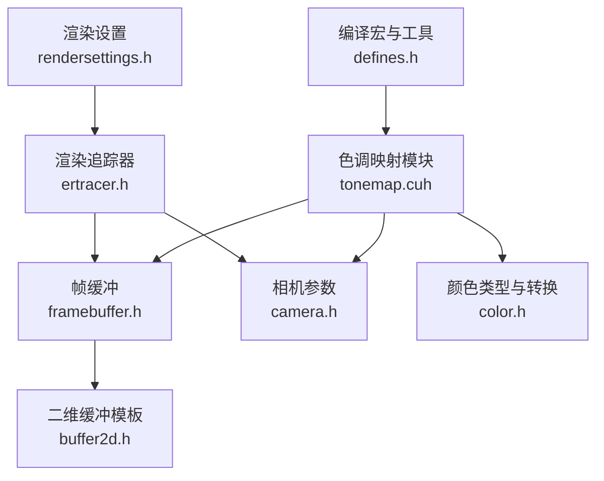
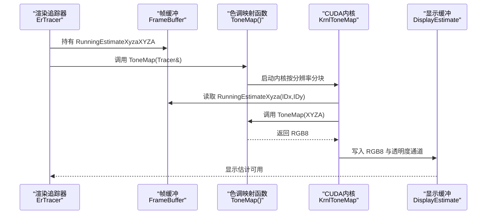
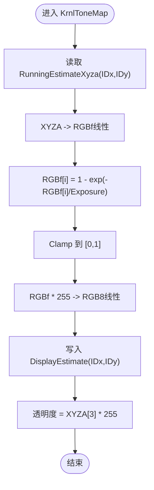
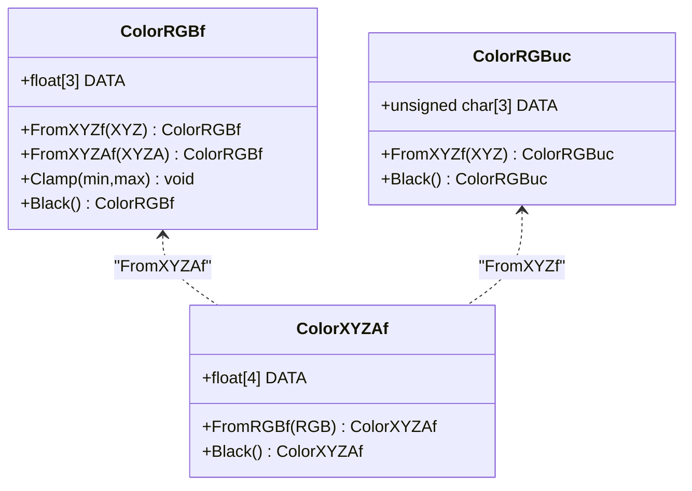
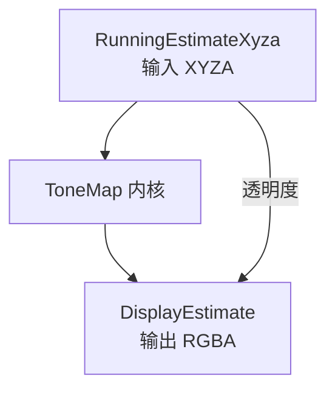
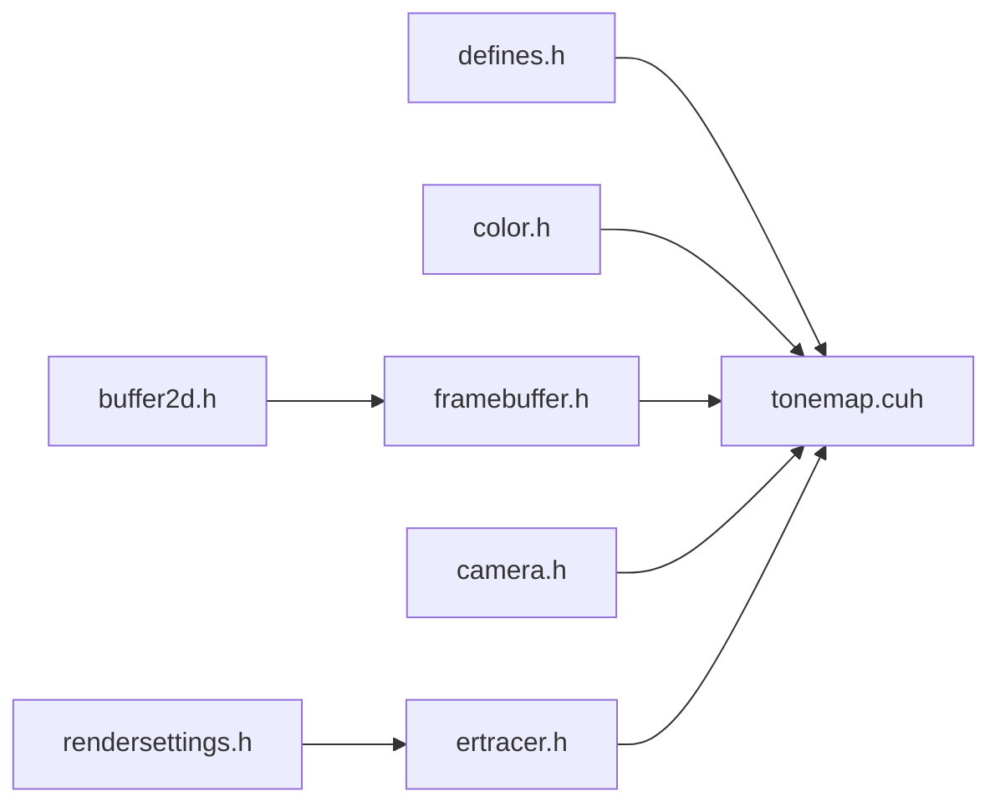

# 色调映射算法

<cite>
**本文引用的文件**
- [tonemap.cuh](file://Source/tonemap.cuh)
- [color.h](file://Source/color.h)
- [framebuffer.h](file://Source/framebuffer.h)
- [camera.h](file://Source/camera.h)
- [ertracer.h](file://Source/ertracer.h)
- [buffer2d.h](file://Source/buffer2d.h)
- [defines.h](file://Source/defines.h)
- [rendersettings.h](file://Source/rendersettings.h)
- [exposurerender.h](file://Source/exposurerender.h)
- [exposurerender.cpp](file://Source/exposurerender.cpp)
</cite>

## 目录
1. [引言](#引言)
2. [项目结构](#项目结构)
3. [核心组件](#核心组件)
4. [架构总览](#架构总览)
5. [详细组件分析](#详细组件分析)
6. [依赖关系分析](#依赖关系分析)
7. [性能考量](#性能考量)
8. [故障排查指南](#故障排查指南)
9. [结论](#结论)
10. [附录](#附录)

## 引言
本文件围绕“色调映射”（Tone Mapping）在该体积渲染框架中的实现与使用进行系统化说明。重点涵盖：
- 数学模型：基于曝光值的指数型压缩与线性归一化，以及从 XYZA 到 RGB 的颜色空间转换。
- GPU 内核实现：CUDA 核函数并行化执行，逐像素完成色调映射与显示缓冲写入。
- 参数配置：曝光、伽马校正接口（当前实现中未启用）、动态范围控制。
- 颜色保真与视觉优化：线性到 sRGB 的近似处理、Clamp 截断、透明度通道保持。
- 与其他模块的关系：渲染追踪器、帧缓冲、相机与渲染设置。

本说明力求对初学者友好，同时为有经验的开发者提供足够的技术深度与源码路径定位。

## 项目结构
与色调映射直接相关的核心文件与职责如下：
- Source/tonemap.cuh：定义了色调映射函数与 CUDA 内核，并提供对外的启动入口。
- Source/color.h：提供 XYZ/RGB 及其带 Alpha 的类型与相互转换方法。
- Source/framebuffer.h：管理运行时估计（XYZA）、显示估计（RGBA）等缓冲区。
- Source/camera.h：提供曝光、伽马等参数，以及派生的逆曝光、逆伽马。
- Source/ertracer.h：渲染追踪器，持有相机与帧缓冲等资源。
- Source/buffer2d.h：二维缓冲模板，支持主机/设备内存与读写操作。
- Source/defines.h：宏定义（如 KERNEL、HOST_DEVICE 等），统一宿主/设备编译环境。
- Source/rendersettings.h：渲染设置（遍历步长、阴影、密度缩放等），间接影响输入数据范围。
- Source/exposurerender.h / Source/exposurerender.cpp：导出 API 与 CUDA 架构宏定义。

图表来源
- [tonemap.cuh:30-67](file://Source/tonemap.cuh#L30-L67)
- [framebuffer.h:26-105](file://Source/framebuffer.h#L26-L105)
- [camera.h:26-116](file://Source/camera.h#L26-L116)
- [color.h:59-287](file://Source/color.h#L59-L287)
- [ertracer.h:33-117](file://Source/ertracer.h#L33-L117)
- [buffer2d.h:26-289](file://Source/buffer2d.h#L26-L289)
- [defines.h:37-114](file://Source/defines.h#L37-L114)
- [rendersettings.h:27-131](file://Source/rendersettings.h#L27-L131)

章节来源
- [tonemap.cuh:30-67](file://Source/tonemap.cuh#L30-L67)
- [framebuffer.h:26-105](file://Source/framebuffer.h#L26-L105)
- [camera.h:26-116](file://Source/camera.h#L26-L116)
- [color.h:59-287](file://Source/color.h#L59-L287)
- [ertracer.h:33-117](file://Source/ertracer.h#L33-L117)
- [buffer2d.h:26-289](file://Source/buffer2d.h#L26-L289)
- [defines.h:37-114](file://Source/defines.h#L37-L114)
- [rendersettings.h:27-131](file://Source/rendersettings.h#L27-L131)

## 核心组件
- 色调映射函数：将 XYZA（四通道，含透光度）转换为 RGB 并进行曝光压缩与截断，输出 RGB8。
- CUDA 内核：KrnlToneMap 并行遍历每个像素，调用 ToneMap 完成映射，并写入显示缓冲。
- 对外启动：ToneMap(Tracer&) 启动内核，传入帧分辨率与块尺寸。
- 颜色类型与转换：ColorRGBf/ColorXYZAf 提供从 XYZA 到 RGB 的线性转换。
- 帧缓冲：RunningEstimateXyza 输入，DisplayEstimate 输出，透明度通道保留。

章节来源
- [tonemap.cuh:30-67](file://Source/tonemap.cuh#L30-L67)
- [color.h:144-164](file://Source/color.h#L144-L164)
- [framebuffer.h:94-104](file://Source/framebuffer.h#L94-L104)

## 架构总览
色调映射在渲染管线中的位置与交互如下：

图表来源
- [tonemap.cuh:61-67](file://Source/tonemap.cuh#L61-L67)
- [tonemap.cuh:49-59](file://Source/tonemap.cuh#L49-L59)
- [framebuffer.h:94-104](file://Source/framebuffer.h#L94-L104)
- [ertracer.h:110-116](file://Source/ertracer.h#L110-L116)

## 详细组件分析

### 组件A：ToneMap 函数与 KrnlToneMap 内核
- 函数式映射流程
  - 将 XYZA 转换为 RGB（线性 RGB）。
  - 使用指数型曝光压缩：对每个 RGB 分量应用 1 - exp(-I / Exposure)，实现高亮抑制与动态范围压缩。
  - Clamp 截断至 [0,1]，防止溢出。
  - 线性映射到 [0,255]，得到 RGB8（当前注释掉伽马校正项，保留线性输出）。
  - 透明度通道直接从 XYZA 的第4通道乘以 255 写入。
- 内核并行化
  - KrnlToneMap 采用二维核网格，逐像素调用 ToneMap。
  - 读取 RunningEstimateXyza，写入 DisplayEstimate。
- 启动与调度
  - ToneMap(Tracer&) 设置块/网格维度并启动内核，带有计时与命名标注。

图表来源
- [tonemap.cuh:30-67](file://Source/tonemap.cuh#L30-L67)

章节来源
- [tonemap.cuh:30-67](file://Source/tonemap.cuh#L30-L67)

### 组件B：颜色类型与转换
- 类型与方法
  - ColorRGBf/ColorXYZAf 提供构造、运算符、Clamp、Black 等。
  - 提供 FromXYZf/FromXYZAf 等静态转换方法，用于线性 RGB 与 XYZ 之间的转换。
- 关键点
  - ToneMap 使用 FromXYZAf 将 XYZA 转换为 RGB（线性）。
  - 当前实现未启用伽马校正，RGB8 直接由 RGBf * 255 得到。

图表来源
- [color.h:59-287](file://Source/color.h#L59-L287)

章节来源
- [color.h:144-164](file://Source/color.h#L144-L164)
- [color.h:224-240](file://Source/color.h#L224-L240)

### 组件C：帧缓冲与数据流
- 缓冲区角色
  - RunningEstimateXyza：输入，四通道（XYZA），通常为累积的体积渲染估计。
  - DisplayEstimate：输出，三通道 RGB8 + 透明度通道。
- 访问方式
  - 通过 Buffer2D 的二维索引访问，支持整数坐标与双线性采样接口（模板通用）。
- 透明度通道
  - KrnlToneMap 将 XYZA[3] 放大 255 写入显示缓冲的 Alpha 通道，便于合成。

图表来源
- [framebuffer.h:94-104](file://Source/framebuffer.h#L94-L104)
- [tonemap.cuh:49-59](file://Source/tonemap.cuh#L49-L59)

章节来源
- [framebuffer.h:94-104](file://Source/framebuffer.h#L94-L104)
- [buffer2d.h:215-254](file://Source/buffer2d.h#L215-L254)

### 组件D：相机与参数
- 曝光与伽马
  - Camera 持有 Exposure、Gamma；内部维护 InvExposure、InvGamma。
  - ToneMap 使用 gpTracer->Camera.Exposure 进行指数压缩。
- 其他相机参数
  - FOV、FilmSize、Screen 等用于屏幕空间与采样，间接影响最终亮度分布。

章节来源
- [camera.h:106-116](file://Source/camera.h#L106-L116)
- [tonemap.cuh:34-36](file://Source/tonemap.cuh#L34-L36)

### 组件E：渲染设置与输入范围
- 密度缩放与步长
  - RenderSettings.Shading.DensityScale 与 Traversal.StepFactor 影响体积采样步长与吸收强度，从而改变输入 XYZA 的整体幅度。
- 对色调映射的影响
  - 输入幅度越大，指数压缩后仍可能保留更丰富的暗部细节；但需注意 Clamp 与 255 缩放后的截断。

章节来源
- [rendersettings.h:66-106](file://Source/rendersettings.h#L66-L106)

## 依赖关系分析
- 模块耦合
  - tonemap.cuh 依赖 color.h（颜色转换）、framebuffer.h（缓冲访问）、camera.h（曝光参数）、defines.h（编译宏）。
  - ertracer.h 持有 Camera 与 FrameBuffer，是 ToneMap 的上下文来源。
- 外部依赖
  - CUDA 宏与内核启动工具（LAUNCH_*）在 defines.h 中统一定义。
- 可能的循环依赖
  - 文件间为单向依赖（头文件 include），未见循环 include。

图表来源
- [tonemap.cuh:21-22](file://Source/tonemap.cuh#L21-L22)
- [color.h:21](file://Source/color.h#L21)
- [framebuffer.h:21](file://Source/framebuffer.h#L21)
- [camera.h:21](file://Source/camera.h#L21)
- [ertracer.h:23](file://Source/ertracer.h#L23)
- [buffer2d.h:21](file://Source/buffer2d.h#L21)
- [defines.h:37-56](file://Source/defines.h#L37-L56)
- [rendersettings.h:22](file://Source/rendersettings.h#L22)

章节来源
- [tonemap.cuh:21-22](file://Source/tonemap.cuh#L21-L22)
- [color.h:21](file://Source/color.h#L21)
- [framebuffer.h:21](file://Source/framebuffer.h#L21)
- [camera.h:21](file://Source/camera.h#L21)
- [ertracer.h:23](file://Source/ertracer.h#L23)
- [buffer2d.h:21](file://Source/buffer2d.h#L21)
- [defines.h:37-56](file://Source/defines.h#L37-L56)
- [rendersettings.h:22](file://Source/rendersettings.h#L22)

## 性能考量
- 并行粒度
  - KrnlToneMap 以像素为粒度，块大小为 16x8，网格按帧分辨率计算，适合 GPU 流水线并行。
- 内存访问
  - 顺序访问 RunningEstimateXyza 与 DisplayEstimate，局部性良好。
- 算法复杂度
  - 每像素常数时间操作（转换、指数、Clamp、乘法），整体 O(W×H)。
- 优化建议
  - 若需要非线性伽马校正，可启用对应分支以提升感知亮度一致性。
  - 对于高分辨率场景，可考虑分块或使用共享内存减少重复读取（当前实现未采用）。
  - 渲染设置中的密度缩放与步长直接影响输入动态范围，应与曝光参数协同调节。

## 故障排查指南
- 输出全黑或全白
  - 检查 Exposure 是否为 0 或过小导致除零风险；确认 InvExposure 初始化逻辑。
  - 检查 RunningEstimateXyza 是否有效且非黑。
- 亮度异常偏亮/偏暗
  - 调整 RenderSettings.Shading.DensityScale 与 Traversal.StepFactor，改变输入 XYZA 的幅度。
  - 调整 Camera.Exposure，避免过大或过小。
- 透明度异常
  - 确认 XYZA[3] 是否合理；KrnlToneMap 已将其乘以 255 写入 Alpha 通道。
- CUDA 启动失败
  - 确认 LAUNCH_DIMENSIONS 与块/网格参数与分辨率匹配；检查设备内存分配与拷贝。

章节来源
- [camera.h:61-96](file://Source/camera.h#L61-L96)
- [tonemap.cuh:61-67](file://Source/tonemap.cuh#L61-L67)
- [rendersettings.h:66-106](file://Source/rendersettings.h#L66-L106)

## 结论
本实现采用“线性 RGB + 指数曝光压缩”的简单而有效的色调映射策略，结合 GPU 并行内核实现高效渲染。其优势在于实现简洁、可扩展性强；在需要更高级的自适应或全局色调映射时，可在现有框架上叠加更多算法（例如基于直方图的自适应增益、局部对比度增强等），同时保持与帧缓冲与渲染追踪器的良好解耦。

## 附录

### A. 参数配置清单与建议
- 曝光（Exposure）
  - 控制指数压缩强度；增大可降低高亮，减小可提升暗部细节。
- 伽马（Gamma）
  - 当前实现注释掉伽马校正；若启用，可改善显示器感知亮度。
- 密度缩放（DensityScale）
  - 影响体积吸收与散射强度，决定输入 XYZA 的动态范围。
- 步长因子（StepFactorPrimary/Shadow）
  - 控制采样步长，影响噪声与速度平衡。
- 透明度通道（Alpha）
  - 由 XYZA[3] × 255 写入，用于合成。

章节来源
- [camera.h:106-116](file://Source/camera.h#L106-L116)
- [rendersettings.h:66-106](file://Source/rendersettings.h#L66-L106)
- [tonemap.cuh:58](file://Source/tonemap.cuh#L58)

### B. 与常见色调映射技术的对比与扩展思路
- 线性映射
  - 本实现即为线性映射的曝光版本（指数型压缩）。
- Reinhard 算法
  - 通常包含基于亮度的自适应缩放与白场设定；可在 ToneMap 中引入亮度估计与增益控制。
- 自适应色调映射
  - 可先计算局部直方图或亮度统计，再根据窗口内的平均亮度调整增益，最后进行指数或分段映射。
- 扩展建议
  - 在 RunningEstimateXyza 上增加亮度统计缓冲；
  - 在 KrnlToneMap 中加入局部窗口采样与增益计算；
  - 保留当前线性映射作为默认路径，其他算法作为可选分支。

[本节为概念性扩展说明，不直接分析具体文件，故无章节来源]