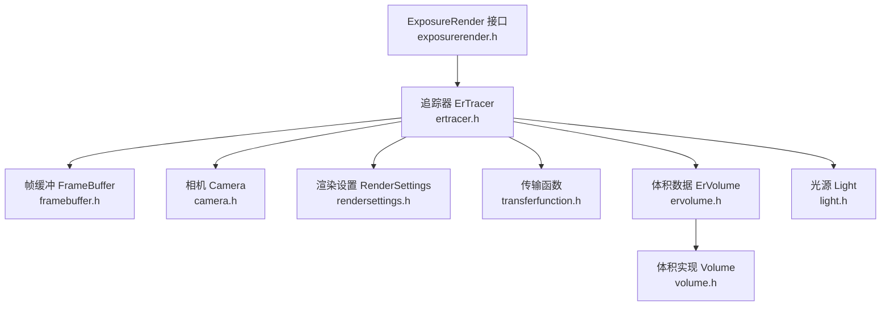
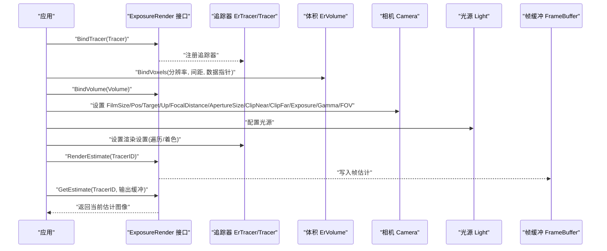
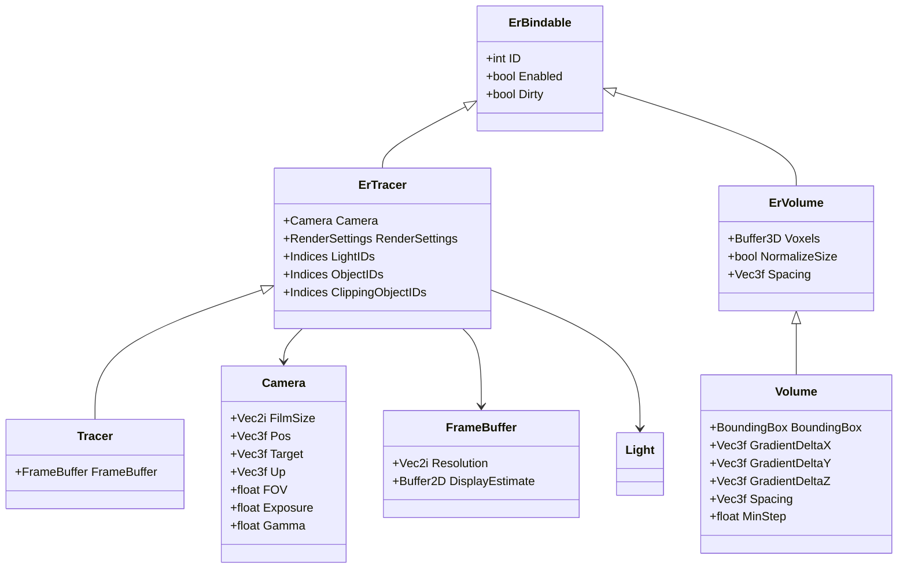

# 基础使用示例

<cite>
**本文档引用的文件**
- [exposurerender.h](file://Source/exposurerender.h)
- [exposurerender.cpp](file://Source/exposurerender.cpp)
- [ertracer.h](file://Source/ertracer.h)
- [tracer.h](file://Source/tracer.h)
- [ervolume.h](file://Source/ervolume.h)
- [volume.h](file://Source/volume.h)
- [camera.h](file://Source/camera.h)
- [light.h](file://Source/light.h)
- [rendersettings.h](file://Source/rendersettings.h)
- [transferfunction.h](file://Source/transferfunction.h)
- [framebuffer.h](file://Source/framebuffer.h)
- [erbindable.h](file://Source/erbindable.h)
- [README.md](file://README.md)
</cite>

## 目录
1. [简介](#简介)
2. [项目结构](#项目结构)
3. [核心组件](#核心组件)
4. [架构总览](#架构总览)
5. [详细组件分析](#详细组件分析)
6. [依赖关系分析](#依赖关系分析)
7. [性能考虑](#性能考虑)
8. [故障排除指南](#故障排除指南)
9. [结论](#结论)
10. [附录](#附录)

## 简介
本指南面向初学者，提供基于该体积渲染框架的基础使用示例与完整工作流程说明。你将学会：
- 初始化渲染器（绑定追踪器）
- 绑定体积数据（设置分辨率、体素间距等）
- 设置光源与相机参数
- 执行单帧渲染与多帧采样降噪
- 常见错误处理与调试技巧

该框架采用 CUDA 加速的体积光线投射管线，支持基于物理的光传输与交互式渲染。

章节来源
- [README.md:1-61](file://README.md#L1-L61)

## 项目结构
围绕“基础使用”，以下文件最为关键：
- 渲染接口与绑定：exposurerender.h/cpp
- 追踪器与帧缓冲：ertracer.h、tracer.h、framebuffer.h
- 体积数据：ervolume.h、volume.h
- 光源与相机：light.h、camera.h
- 渲染设置：rendersettings.h
- 传输函数：transferfunction.h
- 可绑定基类：erbindable.h

图表来源
- [exposurerender.h:32-42](file://Source/exposurerender.h#L32-L42)
- [ertracer.h:33-117](file://Source/ertracer.h#L33-L117)
- [tracer.h:31-55](file://Source/tracer.h#L31-L55)
- [framebuffer.h:26-105](file://Source/framebuffer.h#L26-L105)
- [ervolume.h:28-74](file://Source/ervolume.h#L28-L74)
- [volume.h:26-150](file://Source/volume.h#L26-L150)
- [light.h:26-46](file://Source/light.h#L26-L46)
- [camera.h:26-116](file://Source/camera.h#L26-L116)
- [rendersettings.h:27-131](file://Source/rendersettings.h#L27-L131)
- [transferfunction.h:82-154](file://Source/transferfunction.h#L82-L154)

章节来源
- [exposurerender.h:29-44](file://Source/exposurerender.h#L29-L44)
- [ertracer.h:33-117](file://Source/ertracer.h#L33-L117)
- [ervolume.h:28-74](file://Source/ervolume.h#L28-L74)
- [framebuffer.h:26-105](file://Source/framebuffer.h#L26-L105)
- [camera.h:26-116](file://Source/camera.h#L26-L116)
- [light.h:26-46](file://Source/light.h#L26-L46)
- [rendersettings.h:27-131](file://Source/rendersettings.h#L27-L131)
- [transferfunction.h:82-154](file://Source/transferfunction.h#L82-L154)

## 核心组件
- 渲染接口（ExposureRender）：提供绑定与渲染估计接口，如 BindTracer、BindVolume、RenderEstimate、GetEstimate 等。
- 追踪器（ErTracer/Tracer）：持有相机、渲染设置、传输函数、光照与对象索引等；派生类 Tracer 内含帧缓冲。
- 体积数据（ErVolume/Volume）：封装 3D 体数据（分辨率、间距、归一化等），并提供密度查询。
- 相机（Camera）：定义胶片尺寸、位置、目标、上方向、焦距、光圈、近远裁剪、曝光、伽马、视角等。
- 光源（Light）：继承自 ErLight，封装形状更新等。
- 渲染设置（RenderSettings）：包含遍历与着色两大子设置，如步长因子、阴影开关、密度缩放、梯度阈值等。
- 传输函数（ScalarTransferFunction1D/ColorTransferFunction1D）：用于映射标量/颜色到不透明度与颜色。
- 帧缓冲（FrameBuffer）：管理渲染中间态与最终显示缓冲，支持多帧随机种子与降噪。

章节来源
- [exposurerender.h:32-42](file://Source/exposurerender.h#L32-L42)
- [ertracer.h:33-117](file://Source/ertracer.h#L33-L117)
- [tracer.h:31-55](file://Source/tracer.h#L31-L55)
- [ervolume.h:28-74](file://Source/ervolume.h#L28-L74)
- [volume.h:26-150](file://Source/volume.h#L26-L150)
- [camera.h:26-116](file://Source/camera.h#L26-L116)
- [light.h:26-46](file://Source/light.h#L26-L46)
- [rendersettings.h:27-131](file://Source/rendersettings.h#L27-L131)
- [transferfunction.h:82-154](file://Source/transferfunction.h#L82-L154)
- [framebuffer.h:26-105](file://Source/framebuffer.h#L26-L105)

## 架构总览
下图展示了从应用层到渲染管线的关键调用链与数据流：

图表来源
- [exposurerender.h:32-42](file://Source/exposurerender.h#L32-L42)
- [ertracer.h:33-117](file://Source/ertracer.h#L33-L117)
- [tracer.h:31-55](file://Source/tracer.h#L31-L55)
- [ervolume.h:63-69](file://Source/ervolume.h#L63-L69)
- [camera.h:61-96](file://Source/camera.h#L61-L96)
- [light.h:26-46](file://Source/light.h#L26-L46)
- [framebuffer.h:45-74](file://Source/framebuffer.h#L45-L74)

## 详细组件分析

### 初始化渲染器与绑定追踪器
- 步骤
  - 创建追踪器实例（ErTracer 或其派生 Tracer）
  - 调用 BindTracer 将追踪器注册到渲染系统
  - 配置相机、渲染设置、传输函数
  - 准备体积数据并绑定
- 关键点
  - BindTracer 支持“绑定/解绑”模式，便于动态切换场景
  - 派生类 Tracer 内部维护 FrameBuffer，尺寸随相机胶片尺寸变化而调整

章节来源
- [exposurerender.h:32-33](file://Source/exposurerender.h#L32-L33)
- [ertracer.h:33-117](file://Source/ertracer.h#L33-L117)
- [tracer.h:31-55](file://Source/tracer.h#L31-L55)

### 绑定体积数据
- 步骤
  - 准备 3D 体数据（分辨率、体素间距、原始数据指针）
  - 调用 ErVolume::BindVoxels 完成绑定
  - 可选择是否按物理尺寸归一化
- 参数说明
  - 分辨率：体数据的 X/Y/Z 方向采样数
  - 间距：体素在世界坐标中的物理尺寸
  - 归一化：是否按最大维度缩放以适配相机视野
- 注意
  - 体积实现 Volume 会根据绑定后的数据计算边界盒、最小步长、梯度偏移等

章节来源
- [ervolume.h:63-69](file://Source/ervolume.h#L63-L69)
- [ervolume.h:30-51](file://Source/ervolume.h#L30-L51)
- [volume.h:100-129](file://Source/volume.h#L100-L129)

### 设置光源与相机参数
- 相机参数
  - 胶片尺寸：影响屏幕范围与像素比例
  - 位置/目标/上方向：决定视图矩阵
  - 焦距/光圈：景深效果
  - 近远裁剪：深度范围
  - 曝光/伽马：最终亮度与非线性映射
  - 视角：垂直或水平视角（内部转换为屏幕范围）
- 光源
  - 继承 ErLight，可通过派生 Light 的构造与赋值完成初始化
  - 更新形状（Update）以确保几何参数生效

章节来源
- [camera.h:98-116](file://Source/camera.h#L98-L116)
- [camera.h:61-96](file://Source/camera.h#L61-L96)
- [light.h:26-46](file://Source/light.h#L26-L46)

### 执行基本渲染操作
- 单帧渲染
  - 调用 RenderEstimate(TracerID) 启动一次渲染估计
  - 使用 GetEstimate(TracerID, 输出缓冲) 获取当前估计结果
- 多帧采样与降噪
  - 帧缓冲包含运行估计与随机种子，支持多次采样累积
  - 可通过重置随机种子或使用过滤后的显示缓冲获得更稳定的结果

章节来源
- [exposurerender.h:39-42](file://Source/exposurerender.h#L39-L42)
- [framebuffer.h:45-74](file://Source/framebuffer.h#L45-L74)

### 设置渲染参数（遍历与着色）
- 遍历设置
  - 主路径步长因子、阴影步长因子：控制光线步进大小
  - 是否开启阴影、最大阴影距离：影响阴影质量与性能
- 着色设置
  - 类型：渲染模型类型
  - 密度缩放：增强/减弱体积细节
  - 透光性是否受密度调制：影响材质表现
  - 梯度计算方式与阈值/因子：用于法向量估计与光照

章节来源
- [rendersettings.h:30-64](file://Source/rendersettings.h#L30-L64)
- [rendersettings.h:66-106](file://Source/rendersettings.h#L66-L106)

### 传输函数（TF）配置
- 标量传输函数：映射标量值到不透明度
- 颜色传输函数：分别映射到 RGB 通道的颜色
- 节点添加与评估：通过节点集合构建分段线性函数，在采样时进行查值

章节来源
- [transferfunction.h:82-116](file://Source/transferfunction.h#L82-L116)
- [transferfunction.h:118-154](file://Source/transferfunction.h#L118-L154)

## 依赖关系分析
- 组件耦合
  - ErTracer 依赖 Camera、RenderSettings、传输函数与索引集合
  - Tracer 在 ErTracer 基础上增加 FrameBuffer
  - Volume/ErVolume 提供密度查询与几何信息
  - ExposureRender 接口负责全局绑定与渲染估计
- 可能的循环依赖
  - 通过头文件分离与前置声明避免直接循环
- 外部依赖
  - CUDA 设备内存与内核执行（由框架内部管理）

图表来源
- [erbindable.h:28-68](file://Source/erbindable.h#L28-L68)
- [ertracer.h:33-117](file://Source/ertracer.h#L33-L117)
- [tracer.h:31-55](file://Source/tracer.h#L31-L55)
- [ervolume.h:28-74](file://Source/ervolume.h#L28-L74)
- [volume.h:26-150](file://Source/volume.h#L26-L150)
- [camera.h:26-116](file://Source/camera.h#L26-L116)
- [light.h:26-46](file://Source/light.h#L26-L46)
- [framebuffer.h:26-105](file://Source/framebuffer.h#L26-L105)

## 性能考虑
- 步长因子
  - 主路径与阴影步长因子过小会导致步数过多，增大渲染时间；过大则可能出现噪声或伪影
- 密度缩放
  - 过高的密度缩放会使细节过度增强，也可能导致数值不稳定
- 梯度阈值与因子
  - 合理设置可提升光照质量，但会增加计算开销
- 帧缓冲与随机种子
  - 多帧采样与过滤可显著降低噪声，但需要更多迭代次数
- 相机参数
  - 视角与胶片尺寸影响屏幕范围，进而影响步进数量与像素分布

章节来源
- [rendersettings.h:30-64](file://Source/rendersettings.h#L30-L64)
- [rendersettings.h:66-106](file://Source/rendersettings.h#L66-L106)
- [framebuffer.h:45-74](file://Source/framebuffer.h#L45-L74)

## 故障排除指南
- 相机未更新
  - 症状：视角异常、屏幕范围不正确
  - 处理：调用相机的 Update 方法以重新计算屏幕范围与单位基向量
- 体积未绑定或分辨率不匹配
  - 症状：渲染无体积或尺寸异常
  - 处理：确认已调用 BindVoxels 并检查分辨率与间距；必要时启用 NormalizeSize
- 光源未绑定
  - 症状：无阴影或光照异常
  - 处理：确保调用 BindLight 并在追踪器中绑定光源索引
- 噪声严重
  - 症状：画面闪烁或颗粒感强
  - 处理：增加迭代次数、降低步长因子、调整密度缩放与梯度参数
- 输出为空或全黑
  - 症状：GetEstimate 返回无效数据
  - 处理：确认已调用 RenderEstimate，检查相机近远裁剪与曝光设置

章节来源
- [camera.h:61-96](file://Source/camera.h#L61-L96)
- [ervolume.h:63-69](file://Source/ervolume.h#L63-L69)
- [exposurerender.h:39-42](file://Source/exposurerender.h#L39-L42)
- [framebuffer.h:45-74](file://Source/framebuffer.h#L45-L74)

## 结论
通过以上步骤，你可以完成从初始化渲染器、绑定体积数据、配置光源与相机，到执行单帧渲染与多帧降噪的完整流程。建议先以默认参数快速跑通流程，再逐步微调渲染设置与传输函数，以达到最佳画质与性能平衡。

## 附录
- 快速上手清单
  - 创建并绑定追踪器
  - 绑定体积数据（分辨率、间距、数据指针）
  - 配置相机参数（胶片尺寸、位置、目标、上方向、焦距、光圈、裁剪、曝光、伽马、视角）
  - 配置光源与渲染设置
  - 执行 RenderEstimate 并读取 GetEstimate
  - 如需降噪，进行多帧采样并使用帧缓冲的运行估计