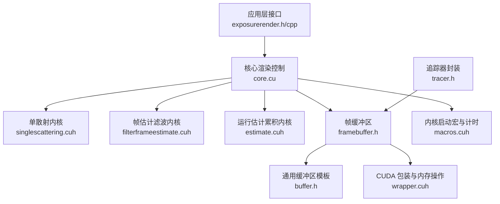
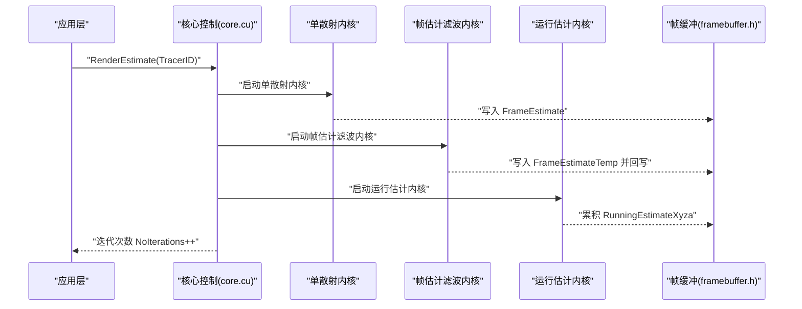
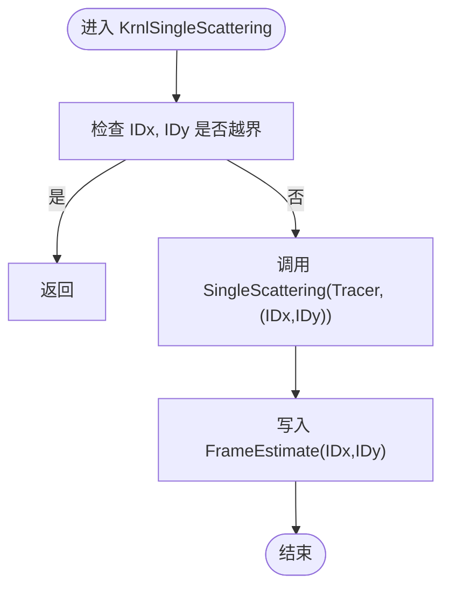
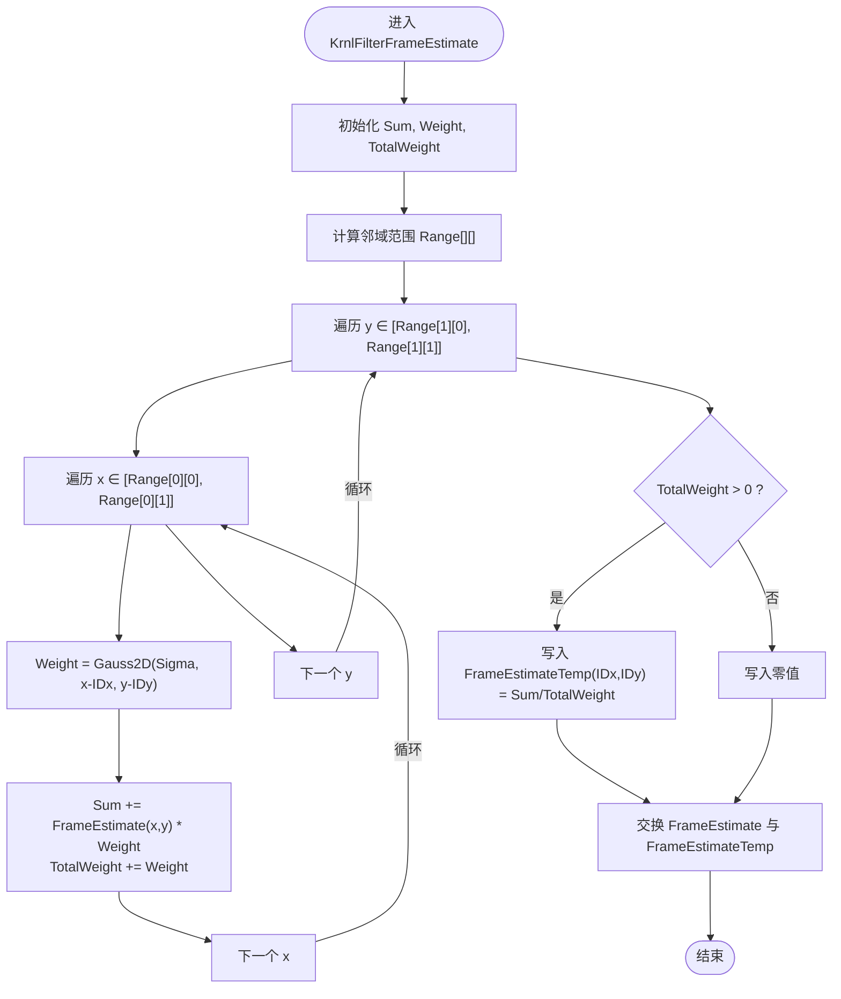
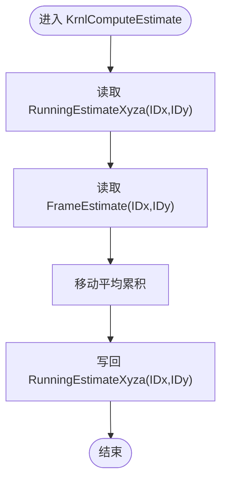
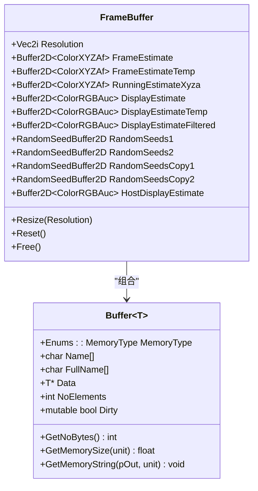
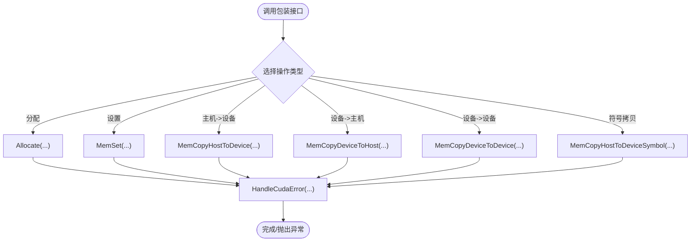
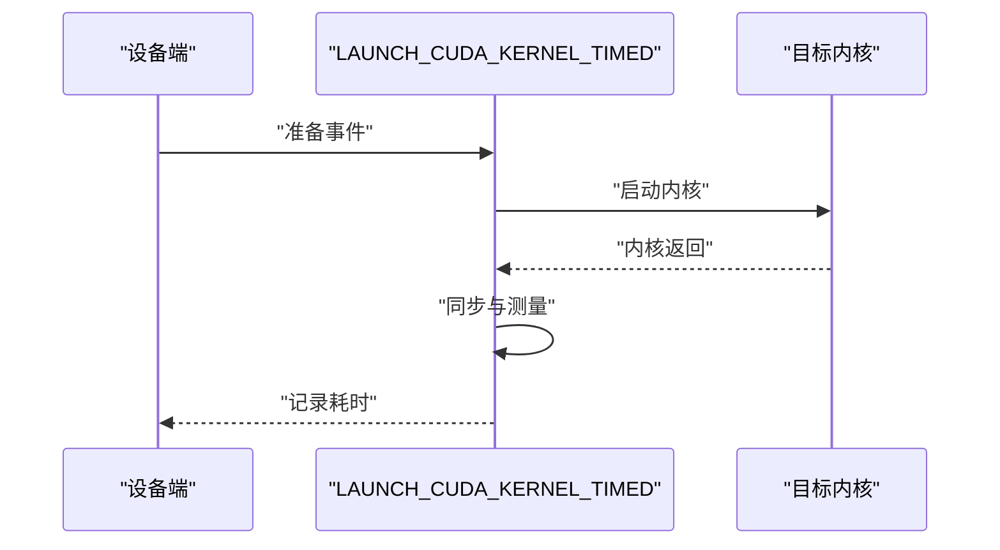
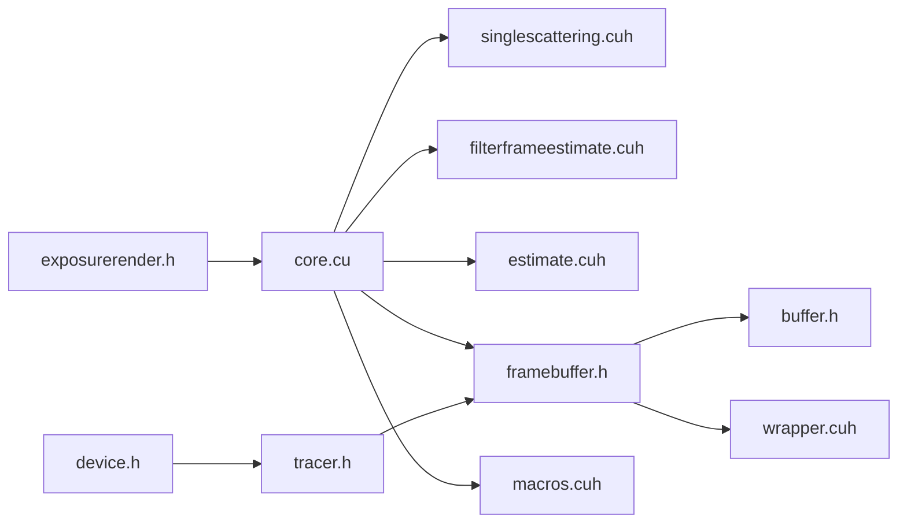

# 性能优化案例

<cite>
**本文引用的文件**
- [README.md](file://README.md)
- [exposurerender.cpp](file://Source/exposurerender.cpp)
- [exposurerender.h](file://Source/exposurerender.h)
- [core.cu](file://Source/core.cu)
- [device.h](file://Source/device.h)
- [singlescattering.cuh](file://Source/singlescattering.cuh)
- [filterframeestimate.cuh](file://Source/filterframeestimate.cuh)
- [estimate.cuh](file://Source/estimate.cuh)
- [timing.h](file://Source/timing.h)
- [buffer.h](file://Source/buffer.h)
- [wrapper.cuh](file://Source/wrapper.cuh)
- [macros.cuh](file://Source/macros.cuh)
- [framebuffer.h](file://Source/framebuffer.h)
- [tracer.h](file://Source/tracer.h)
</cite>

## 目录
1. [简介](#简介)
2. [项目结构](#项目结构)
3. [核心组件](#核心组件)
4. [架构总览](#架构总览)
5. [详细组件分析](#详细组件分析)
6. [依赖关系分析](#依赖关系分析)
7. [性能考量](#性能考量)
8. [故障排查指南](#故障排查指南)
9. [结论](#结论)
10. [附录](#附录)

## 简介
本项目是一个基于 CUDA 的体积光线渲染框架，采用物理上合理的光传输算法，支持交互式渲染与估计更新。渲染流程由多个 CUDA 内核组成：单散射估计、帧估计滤波、运行估计累积与色调映射。项目提供了绑定接口、帧缓冲区管理以及内核计时机制，便于进行性能分析与优化。

系统要求与已验证硬件配置表明该框架在多种 NVIDIA GPU 上可运行，适合开展不同硬件配置下的性能调优与基准测试。

章节来源
- [README.md:14-61](file://README.md#L14-L61)

## 项目结构
源码主要位于 Source 目录，按功能模块组织：
- 渲染控制与绑定接口：exposurerender.h/cpp
- 核心渲染管线：core.cu
- 帧缓冲与缓冲区抽象：framebuffer.h、buffer.h、wrapper.cuh
- 渲染内核与宏：singlescattering.cuh、filterframeestimate.cuh、estimate.cuh、macros.cuh
- 计时与设备对象：timing.h、device.h
- 追踪器与设备封装：tracer.h

图表来源
- [exposurerender.h:21-44](file://Source/exposurerender.h#L21-L44)
- [core.cu:22-51](file://Source/core.cu#L22-L51)
- [singlescattering.cuh:27-38](file://Source/singlescattering.cuh#L27-L38)
- [filterframeestimate.cuh:33-74](file://Source/filterframeestimate.cuh#L33-L74)
- [estimate.cuh:27-38](file://Source/estimate.cuh#L27-L38)
- [framebuffer.h:26-105](file://Source/framebuffer.h#L26-L105)
- [buffer.h:27-121](file://Source/buffer.h#L27-L121)
- [wrapper.cuh:35-143](file://Source/wrapper.cuh#L35-L143)
- [macros.cuh:27-101](file://Source/macros.cuh#L27-L101)
- [tracer.h:31-55](file://Source/tracer.h#L31-L55)

章节来源
- [exposurerender.cpp:19-23](file://Source/exposurerender.cpp#L19-L23)
- [exposurerender.h:21-44](file://Source/exposurerender.h#L21-L44)
- [core.cu:22-51](file://Source/core.cu#L22-L51)
- [framebuffer.h:26-105](file://Source/framebuffer.h#L26-L105)

## 核心组件
- 绑定接口：提供绑定/解绑追踪器、体积、光源、对象、裁剪对象、纹理与位图的函数，用于向 CUDA 设备侧注册资源。
- 渲染流程：单散射估计 → 帧估计滤波 → 运行估计累积 → 色调映射；每次迭代增加迭代次数。
- 帧缓冲区：包含帧估计、临时帧估计、运行估计、显示估计及其过滤版本，以及随机种子缓存与主机侧显示缓冲。
- 缓冲区抽象：通用 Buffer 模板类，支持主机/设备内存类型、脏标记与内存大小查询。
- CUDA 包装：统一的内存分配、拷贝、设置与符号拷贝接口，并提供错误处理。
- 内核启动与计时：宏定义用于计算网格/块维度、启动内核并记录事件时间。

章节来源
- [exposurerender.h:32-42](file://Source/exposurerender.h#L32-L42)
- [core.cu:56-153](file://Source/core.cu#L56-L153)
- [framebuffer.h:29-104](file://Source/framebuffer.h#L29-L104)
- [buffer.h:27-121](file://Source/buffer.h#L27-L121)
- [wrapper.cuh:53-135](file://Source/wrapper.cuh#L53-L135)
- [macros.cuh:41-73](file://Source/macros.cuh#L41-L73)

## 架构总览
渲染管线以“逐像素”方式执行，每个像素对应一个 CUDA 线程。渲染步骤如下：
1) 单散射估计：对每个像素计算一次散射贡献。
2) 帧估计滤波：对帧估计进行高斯加权邻域聚合，减少噪声。
3) 运行估计累积：使用移动平均累积历史估计。
4) 色调映射：将估计值映射到显示范围。

图表来源
- [core.cu:126-136](file://Source/core.cu#L126-L136)
- [singlescattering.cuh:34-38](file://Source/singlescattering.cuh#L34-L38)
- [filterframeestimate.cuh:66-74](file://Source/filterframeestimate.cuh#L66-L74)
- [estimate.cuh:34-38](file://Source/estimate.cuh#L34-L38)
- [framebuffer.h:94-104](file://Source/framebuffer.h#L94-L104)

## 详细组件分析

### 单散射估计内核
- 功能：对每个像素计算单次散射贡献，写入帧估计缓冲。
- 线程模型：二维线程索引，越界即返回。
- 启动参数：块维度与网格维度通过宏计算，内核计时宏记录耗时。

图表来源
- [singlescattering.cuh:27-32](file://Source/singlescattering.cuh#L27-L32)
- [singlescattering.cuh:34-38](file://Source/singlescattering.cuh#L34-L38)
- [macros.cuh:75-91](file://Source/macros.cuh#L75-L91)

章节来源
- [singlescattering.cuh:27-38](file://Source/singlescattering.cuh#L27-L38)
- [macros.cuh:27-39](file://Source/macros.cuh#L27-L39)

### 帧估计滤波内核
- 功能：对当前像素的邻域进行高斯加权求和，归一化后写入临时缓冲，再回写到帧估计。
- 边界处理：根据核半径限制搜索范围，避免越界。
- 数据流：输入 FrameEstimate，输出 FrameEstimateTemp 并交换。

图表来源
- [filterframeestimate.cuh:33-74](file://Source/filterframeestimate.cuh#L33-L74)
- [filterframeestimate.cuh:28-31](file://Source/filterframeestimate.cuh#L28-L31)

章节来源
- [filterframeestimate.cuh:33-74](file://Source/filterframeestimate.cuh#L33-L74)

### 运行估计累积内核
- 功能：使用移动平均公式累积运行估计，逐步降低噪声并稳定图像。
- 线程模型：二维像素级并行，直接写入 RunningEstimateXyza。

图表来源
- [estimate.cuh:27-38](file://Source/estimate.cuh#L27-L38)

章节来源
- [estimate.cuh:27-38](file://Source/estimate.cuh#L27-L38)

### 帧缓冲区与缓冲区抽象
- 帧缓冲区包含多组缓冲：帧估计、临时帧估计、运行估计、显示估计（含临时与过滤）、随机种子缓存与主机侧显示缓冲。
- Buffer 模板类提供内存类型、元素数量、脏标记与内存大小查询，便于统计与调试。
- Resize/Free 控制生命周期，Reset 复位随机种子缓存副本。

图表来源
- [framebuffer.h:26-105](file://Source/framebuffer.h#L26-L105)
- [buffer.h:27-121](file://Source/buffer.h#L27-L121)

章节来源
- [framebuffer.h:29-104](file://Source/framebuffer.h#L29-L104)
- [buffer.h:27-121](file://Source/buffer.h#L27-L121)

### CUDA 包装与内存管理
- 提供统一的内存分配、设置、主机-设备/设备-设备拷贝与符号拷贝接口。
- 错误处理封装，确保异常可捕获与定位。
- 支持 pitched 内存分配，便于高性能二维数据布局。

图表来源
- [wrapper.cuh:53-135](file://Source/wrapper.cuh#L53-L135)

章节来源
- [wrapper.cuh:35-143](file://Source/wrapper.cuh#L35-L143)

### 内核启动宏与计时
- LAUNCH_DIMENSIONS：根据分辨率与块维度计算网格维度。
- LAUNCH_CUDA_KERNEL_TIMED：记录事件时间，测量内核执行耗时。
- KERNEL_1D/2D/3D：生成线程序号与越界判断。

图表来源
- [macros.cuh:41-65](file://Source/macros.cuh#L41-L65)
- [macros.cuh:75-101](file://Source/macros.cuh#L75-L101)

章节来源
- [macros.cuh:27-65](file://Source/macros.cuh#L27-L65)

## 依赖关系分析
- 接口层依赖核心控制层；核心控制层依赖各内核实现与帧缓冲区。
- 帧缓冲区依赖缓冲区模板与随机种子缓冲类型；缓冲区模板依赖几何与包装头。
- 内核实现依赖几何、工具与颜色类型；计时与宏定义贯穿整个渲染流程。
- 设备对象基类提供统一的主机/设备生命周期管理。

图表来源
- [exposurerender.h:21-44](file://Source/exposurerender.h#L21-L44)
- [core.cu:22-51](file://Source/core.cu#L22-L51)
- [framebuffer.h:26-105](file://Source/framebuffer.h#L26-L105)
- [buffer.h:27-121](file://Source/buffer.h#L27-L121)
- [wrapper.cuh:35-143](file://Source/wrapper.cuh#L35-L143)
- [macros.cuh:27-101](file://Source/macros.cuh#L27-L101)
- [tracer.h:31-55](file://Source/tracer.h#L31-L55)
- [device.h:28-43](file://Source/device.h#L28-L43)

章节来源
- [exposurerender.h:21-44](file://Source/exposurerender.h#L21-L44)
- [core.cu:22-51](file://Source/core.cu#L22-L51)
- [framebuffer.h:26-105](file://Source/framebuffer.h#L26-L105)

## 性能考量

### CUDA 内核优化
- 线程利用率与块配置
  - 使用宏计算网格/块维度，确保线程覆盖完整分辨率且避免多余线程。
  - 针对 2D 渲染，块维度建议在 8×8 到 16×8 之间平衡吞吐与寄存器压力。
  - 参考路径：[宏定义网格/块计算:27-39](file://Source/macros.cuh#L27-L39)，[单散射内核启动:34-38](file://Source/singlescattering.cuh#L34-L38)，[运行估计内核启动:34-38](file://Source/estimate.cuh#L34-L38)。
- 内存访问模式
  - 帧估计与运行估计均为二维像素访问，建议使用连续内存布局与合适的块尺寸以提升全局内存带宽利用率。
  - 参考路径：[帧缓冲区二维缓冲:94-104](file://Source/framebuffer.h#L94-L104)，[缓冲区模板:27-121](file://Source/buffer.h#L27-L121)。
- 计算与内存的平衡
  - 帧估计滤波包含 O(k^2) 的邻域访问，核半径与 sigma 影响计算强度与内存往返。
  - 参考路径：[滤波内核邻域循环:48-56](file://Source/filterframeestimate.cuh#L48-L56)。

### 内存访问模式改进
- 分配与拷贝
  - 使用统一的包装接口进行内存分配与拷贝，减少重复错误处理代码。
  - 对于二维数据，考虑使用 pitched 分配以改善缓存局部性。
  - 参考路径：[内存分配/拷贝/设置:53-114](file://Source/wrapper.cuh#L53-L114)。
- 脏标记与最小化拷贝
  - Buffer 模板提供 Dirty 标记，可用于避免不必要的主机/设备拷贝。
  - 参考路径：[脏标记字段](file://Source/buffer.h#L120)。

### 批处理技术
- 多帧估计累积
  - 通过运行估计累积逐步收敛，减少每帧噪声，提高整体视觉质量。
  - 参考路径：[运行估计内核:27-38](file://Source/estimate.cuh#L27-L38)，[核心迭代递增](file://Source/core.cu#L135)。
- 随机种子缓存
  - 帧缓冲区维护随机种子的副本，可在重置时恢复一致性。
  - 参考路径：[随机种子缓冲:100-103](file://Source/framebuffer.h#L100-L103)，[重置逻辑:70-74](file://Source/framebuffer.h#L70-L74)。

### 多GPU支持
- 当前实现未见多 GPU 分布式或多实例并行的直接证据；若需扩展，建议：
  - 将帧缓冲区与随机种子拆分到不同 GPU，分别运行子区域。
  - 在核心控制层引入 GPU 选择与结果合并逻辑。
  - 使用 CUDA IPC 或统一内存进行跨 GPU 共享（需评估延迟与带宽）。
- 本节为概念性指导，不对应具体源码文件。

### 不同硬件配置下的调优案例
- 已验证硬件列表
  - 包含多种消费级与专业显卡，适合对比不同架构下的性能表现。
  - 参考路径：[系统配置列表:46-58](file://README.md#L46-L58)。
- 建议的调优方向
  - 低功耗/低显存设备：减小分辨率、降低滤波核半径、减少随机种子精度。
  - 高端设备：增大分辨率、使用更大核半径、启用更复杂的光照模型。
  - 参考路径：[滤波核参数:66-74](file://Source/filterframeestimate.cuh#L66-L74)，[帧缓冲区尺寸:45-68](file://Source/framebuffer.h#L45-L68)。

### 基准测试方法
- 内核粒度计时
  - 使用内核计时宏记录单个内核的执行时间，便于定位瓶颈。
  - 参考路径：[计时宏:41-65](file://Source/macros.cuh#L41-L65)。
- 迭代级性能
  - 通过多次迭代测量平均耗时，排除首次启动开销。
  - 参考路径：[核心渲染循环:126-136](file://Source/core.cu#L126-L136)。

### 性能监控工具使用指南
- CUDA 工具链
  - 使用 CUDA Events 记录内核时间，结合 Nsight Systems/Compute 进行可视化分析。
  - 参考路径：[计时宏实现:41-65](file://Source/macros.cuh#L41-L65)。
- 应用层日志
  - 结合 DebugLog 输出关键阶段信息，辅助定位问题。
  - 参考路径：[绑定接口日志:58-124](file://Source/core.cu#L58-L124)。

## 故障排查指南
- CUDA 错误处理
  - 所有 CUDA API 调用均通过包装接口进行错误检查，失败时抛出异常。
  - 参考路径：[错误处理与同步:38-51](file://Source/wrapper.cuh#L38-L51)，[异常类型](file://Source/exception.h)。
- 内核同步与最后错误
  - 启动内核后检查最后错误并同步线程，确保及时发现异常。
  - 参考路径：[内核启动与同步:49-52](file://Source/macros.cuh#L49-L52)。
- 帧缓冲区状态
  - 若出现显示异常，检查帧缓冲区尺寸是否匹配相机胶片尺寸，以及随机种子是否被正确重置。
  - 参考路径：[追踪器与帧缓冲区关联:40-52](file://Source/tracer.h#L40-L52)，[帧缓冲区重置:70-74](file://Source/framebuffer.h#L70-L74)。

章节来源
- [wrapper.cuh:38-51](file://Source/wrapper.cuh#L38-L51)
- [macros.cuh:49-52](file://Source/macros.cuh#L49-L52)
- [tracer.h:40-52](file://Source/tracer.h#L40-L52)
- [framebuffer.h:70-74](file://Source/framebuffer.h#L70-L74)

## 结论
本项目以清晰的模块化设计实现了体积渲染的核心流程，具备良好的可扩展性与可观测性。通过统一的缓冲区抽象、CUDA 包装与内核计时机制，能够有效定位与缓解渲染性能瓶颈。针对不同硬件配置，建议从线程块配置、内存访问模式、滤波核参数与批处理策略等方面入手进行系统性优化。

## 附录
- 关键实现路径参考
  - [渲染控制入口:126-136](file://Source/core.cu#L126-L136)
  - [单散射内核:27-38](file://Source/singlescattering.cuh#L27-L38)
  - [帧估计滤波:33-74](file://Source/filterframeestimate.cuh#L33-L74)
  - [运行估计累积:27-38](file://Source/estimate.cuh#L27-L38)
  - [帧缓冲区:29-104](file://Source/framebuffer.h#L29-L104)
  - [缓冲区模板:27-121](file://Source/buffer.h#L27-L121)
  - [CUDA 包装:53-135](file://Source/wrapper.cuh#L53-L135)
  - [内核启动与计时:41-65](file://Source/macros.cuh#L41-L65)
  - [追踪器封装:31-55](file://Source/tracer.h#L31-L55)
  - [设备对象基类:28-43](file://Source/device.h#L28-L43)