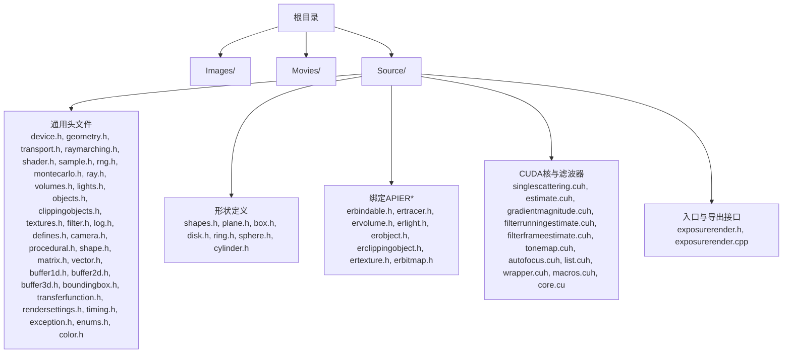
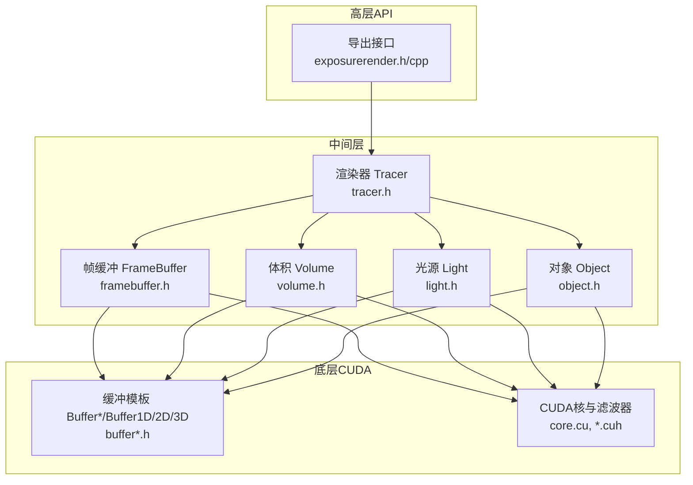
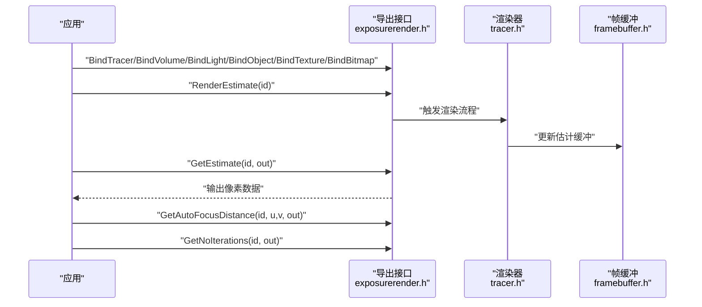
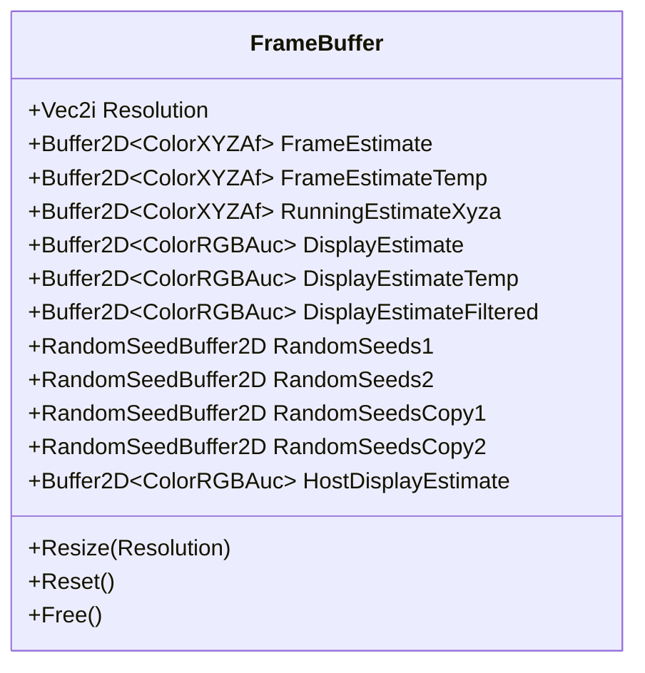
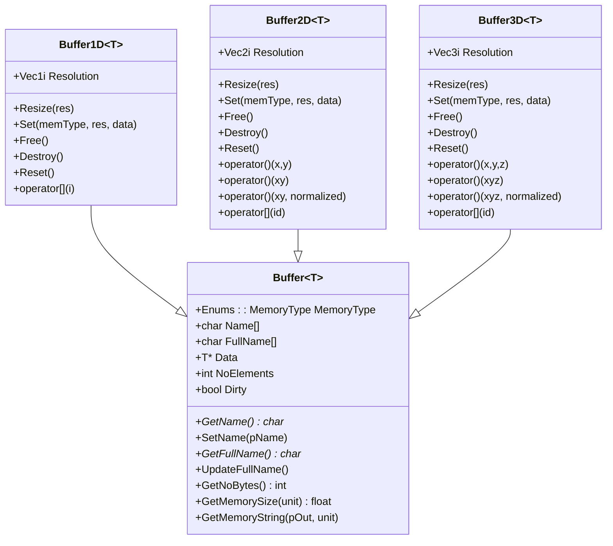
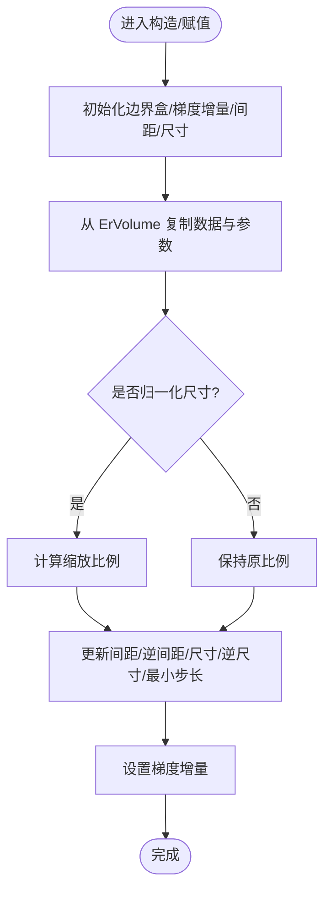
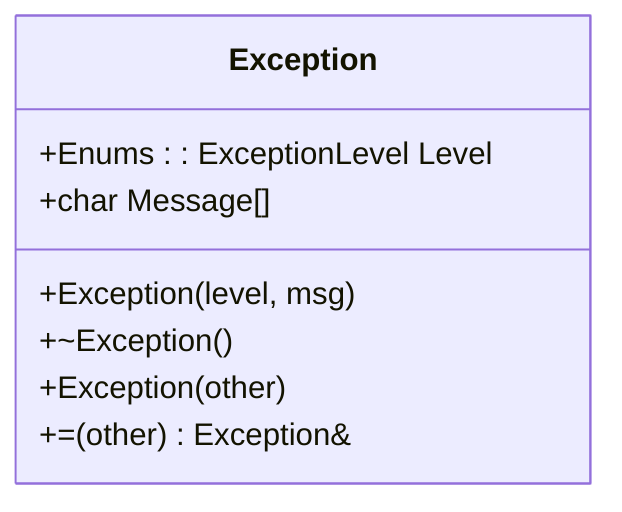
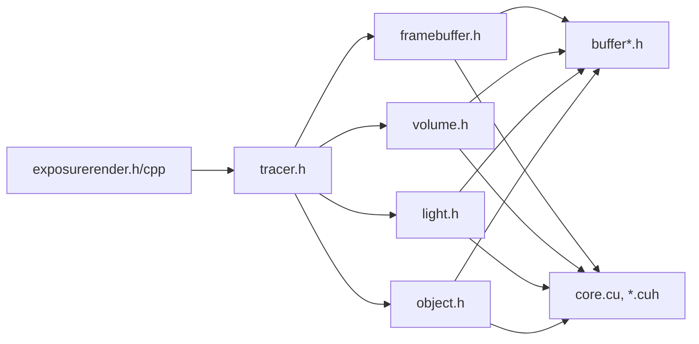

# 最佳实践指南

<cite>
**本文引用的文件**
- [README.md](file://README.md)
- [CMakeLists.txt](file://Source/CMakeLists.txt)
- [exposurerender.h](file://Source/exposurerender.h)
- [exposurerender.cpp](file://Source/exposurerender.cpp)
- [defines.h](file://Source/defines.h)
- [enums.h](file://Source/enums.h)
- [log.h](file://Source/log.h)
- [exception.h](file://Source/exception.h)
- [tracer.h](file://Source/tracer.h)
- [volume.h](file://Source/volume.h)
- [light.h](file://Source/light.h)
- [object.h](file://Source/object.h)
- [buffer.h](file://Source/buffer.h)
- [buffer1d.h](file://Source/buffer1d.h)
- [buffer2d.h](file://Source/buffer2d.h)
- [buffer3d.h](file://Source/buffer3d.h)
- [framebuffer.h](file://Source/framebuffer.h)
- [utilities.h](file://Source/utilities.h)
</cite>

## 目录
1. [简介](#简介)
2. [项目结构](#项目结构)
3. [核心组件](#核心组件)
4. [架构总览](#架构总览)
5. [详细组件分析](#详细组件分析)
6. [依赖关系分析](#依赖关系分析)
7. [性能考量](#性能考量)
8. [故障排查指南](#故障排查指南)
9. [结论](#结论)
10. [附录](#附录)

## 简介
本最佳实践指南面向长期维护与演进的大型渲染引擎项目，结合代码库现状，总结在代码组织、命名规范、错误处理、日志记录、内存与资源管理、CUDA 编程实践、构建与集成等方面的经验与建议。目标是帮助团队建立一致、可读、可维护、可扩展且高性能的开发习惯。

## 项目结构
该工程采用分层与按功能域划分相结合的组织方式：
- 根目录包含说明文档与版本信息
- Source 目录下按“通用头文件”、“形状”、“绑定API（ER*）”、“CUDA核与滤波器”等分组，便于模块化构建与职责分离
- 使用 CMake 进行跨平台构建，CUDA 作为独立源组参与编译

图表来源
- [CMakeLists.txt:47-152](file://Source/CMakeLists.txt#L47-L152)

章节来源
- [CMakeLists.txt:17-155](file://Source/CMakeLists.txt#L17-L155)

## 核心组件
- 导出与接口层：通过 DLL 宏与一组绑定函数对外暴露渲染能力，便于上层应用或脚本调用
- 渲染器与帧缓冲：封装渲染管线状态与多类缓冲（估计值、随机种子、显示缓冲等）
- 数据容器与内存管理：统一的 Buffer 模板体系，支持主机/设备内存分配、拷贝与重置
- 几何与采样：向量、矩阵、光线、相交、采样、蒙特卡洛等基础构件
- 错误与日志：异常类与可选调试日志接口，便于定位问题与记录运行时信息

章节来源
- [exposurerender.h:31-43](file://Source/exposurerender.h#L31-L43)
- [tracer.h:31-55](file://Source/tracer.h#L31-L55)
- [framebuffer.h:26-105](file://Source/framebuffer.h#L26-L105)
- [buffer.h:27-121](file://Source/buffer.h#L27-L121)
- [buffer1d.h:26-195](file://Source/buffer1d.h#L26-L195)
- [buffer2d.h:26-288](file://Source/buffer2d.h#L26-L288)
- [buffer3d.h:26-253](file://Source/buffer3d.h#L26-L253)
- [log.h:27-39](file://Source/log.h#L27-L39)
- [exception.h:27-55](file://Source/exception.h#L27-L55)

## 架构总览
整体采用“高层API + 中间层对象 + 底层CUDA核”的分层设计。渲染器持有帧缓冲，帧缓冲内部聚合多种缓冲与随机种子；对象（体积、光源、几何体）通过绑定接口接入；底层CUDA核负责计算密集型任务。

图表来源
- [exposurerender.h:31-43](file://Source/exposurerender.h#L31-L43)
- [tracer.h:31-55](file://Source/tracer.h#L31-L55)
- [framebuffer.h:26-105](file://Source/framebuffer.h#L26-L105)
- [buffer1d.h:26-195](file://Source/buffer1d.h#L26-L195)
- [buffer2d.h:26-288](file://Source/buffer2d.h#L26-L288)
- [buffer3d.h:26-253](file://Source/buffer3d.h#L26-L253)
- [CMakeLists.txt:137-149](file://Source/CMakeLists.txt#L137-L149)

## 详细组件分析

### 组件一：导出接口与绑定函数
- 职责：对外提供渲染控制与数据获取接口，如绑定渲染器、体积、光源、对象、纹理、位图；执行估计、获取估计结果、自动对焦距离、迭代次数查询等
- 设计要点：通过 DLL 宏实现跨模块导出；参数与返回值明确，便于上层调用方进行生命周期管理

图表来源
- [exposurerender.h:31-43](file://Source/exposurerender.h#L31-L43)
- [tracer.h:31-55](file://Source/tracer.h#L31-L55)
- [framebuffer.h:45-74](file://Source/framebuffer.h#L45-L74)

章节来源
- [exposurerender.h:31-43](file://Source/exposurerender.h#L31-L43)
- [exposurerender.cpp:21](file://Source/exposurerender.cpp#L21)

### 组件二：帧缓冲与估计缓冲
- 职责：管理渲染过程中的中间估计与最终显示缓冲，以及两套随机种子缓存，支持主机/设备间切换与复用
- 设计要点：统一 Resize/Reset/Free 流程；随机种子复制缓存用于迭代一致性；主机侧显示缓冲用于最终输出

图表来源
- [framebuffer.h:26-105](file://Source/framebuffer.h#L26-L105)

章节来源
- [framebuffer.h:26-105](file://Source/framebuffer.h#L26-L105)

### 组件三：缓冲模板体系（Buffer/Buffer1D/Buffer2D/Buffer3D）
- 职责：抽象主机/设备内存分配、拷贝、重置与查询，提供多维索引与插值接口
- 设计要点：模板化设计降低重复代码；统一的 Dirty 标记与 FullName 命名便于调试；支持主机到设备、设备到设备的拷贝路径

图表来源
- [buffer.h:27-121](file://Source/buffer.h#L27-L121)
- [buffer1d.h:26-195](file://Source/buffer1d.h#L26-L195)
- [buffer2d.h:26-288](file://Source/buffer2d.h#L26-L288)
- [buffer3d.h:26-253](file://Source/buffer3d.h#L26-L253)

章节来源
- [buffer.h:27-121](file://Source/buffer.h#L27-L121)
- [buffer1d.h:26-195](file://Source/buffer1d.h#L26-L195)
- [buffer2d.h:26-288](file://Source/buffer2d.h#L26-L288)
- [buffer3d.h:26-253](file://Source/buffer3d.h#L26-L253)

### 组件四：体积对象与几何初始化
- 职责：封装体积数据（体素）、间距、尺寸、边界盒与最小步长等，支持从外部 ErVolume 初始化
- 设计要点：构造/析构/拷贝/赋值流程清晰；根据分辨率与间距计算物理尺寸与梯度偏移；提供坐标映射与取值接口

图表来源
- [volume.h:26-129](file://Source/volume.h#L26-L129)

章节来源
- [volume.h:26-129](file://Source/volume.h#L26-L129)

### 组件五：异常与日志
- 异常：统一的异常类，包含等级与消息，便于上层捕获与分级处理
- 日志：提供可选的调试日志接口，便于跟踪构造/析构与关键路径

图表来源
- [exception.h:27-55](file://Source/exception.h#L27-L55)

章节来源
- [exception.h:27-55](file://Source/exception.h#L27-L55)
- [log.h:27-39](file://Source/log.h#L27-L39)

## 依赖关系分析
- 接口层依赖渲染器与各类对象；渲染器依赖帧缓冲；帧缓冲依赖缓冲模板；对象（体积/光源/几何）依赖 ER* 绑定接口；底层 CUDA 核依赖缓冲与工具函数
- CMake 将通用头文件、形状、绑定API、CUDA 源分别归组，形成清晰的构建依赖链

图表来源
- [CMakeLists.txt:47-152](file://Source/CMakeLists.txt#L47-L152)
- [exposurerender.h:31-43](file://Source/exposurerender.h#L31-L43)
- [tracer.h:31-55](file://Source/tracer.h#L31-L55)
- [framebuffer.h:26-105](file://Source/framebuffer.h#L26-L105)
- [buffer1d.h:26-195](file://Source/buffer1d.h#L26-L195)
- [buffer2d.h:26-288](file://Source/buffer2d.h#L26-L288)
- [buffer3d.h:26-253](file://Source/buffer3d.h#L26-L253)

章节来源
- [CMakeLists.txt:47-152](file://Source/CMakeLists.txt#L47-L152)

## 性能考量
- 内存管理
  - 明确区分主机与设备内存，避免不必要的频繁分配/释放
  - 使用统一的 Resize/Free/Reset 流程，减少碎片与拷贝开销
  - 对于大体积数据，优先考虑设备端连续内存布局与对齐
- 计算与核函数
  - 合理设置块/网格维度，确保充分利用 SM 并行度
  - 避免分支发散，尽量将条件逻辑向量化或提前分支消除
  - 利用共享内存缓存热点数据，减少全局内存访问
- 帧缓冲与估计
  - 在迭代过程中复用临时缓冲，减少多次分配
  - 控制估计缓冲精度与尺寸，平衡质量与速度
- 工具函数
  - 向量化转换与插值函数应内联，减少调用开销
  - 积累平均等操作注意数值稳定性与溢出防护

## 故障排查指南
- 常见问题与预防
  - 内存越界：严格检查索引范围与分辨率一致性，使用模板缓冲的 clamp 与边界检查
  - 主机/设备数据不一致：确保 Set/拷贝路径正确，必要时显式同步
  - CUDA 错误传播：在关键路径捕获并抛出异常，记录上下文信息
  - 日志辅助：启用调试日志，定位构造/析构与关键流程
- 解决方案模板
  - 分配失败：检查可用显存与主机内存，分批处理大数据集
  - 性能退化：核查分支发散、共享内存使用、内存带宽瓶颈
  - 结果异常：核对输入数据范围、坐标系变换、插值边界处理

章节来源
- [buffer2d.h:215-254](file://Source/buffer2d.h#L215-L254)
- [buffer3d.h:210-242](file://Source/buffer3d.h#L210-L242)
- [exception.h:27-55](file://Source/exception.h#L27-L55)
- [log.h:27-39](file://Source/log.h#L27-L39)

## 结论
本指南基于现有代码库提炼了工程化的最佳实践：以清晰的分层与模块化组织为基础，强化缓冲与内存管理的一致性，完善异常与日志机制，并在 CUDA 层面遵循性能优化原则。建议在后续迭代中持续完善测试策略与文档标准，确保高质量的长期演进。

## 附录

### 代码组织与命名规范建议
- 文件与目录
  - 按功能域分组：通用数学/几何、形状、绑定API、CUDA核与滤波器
  - 头文件与实现分离，公共接口置于头文件，实现细节隐藏于源文件
- 类与接口
  - 类名使用帕斯卡命名；方法与变量使用驼峰命名；枚举值全大写加下划线
  - 公共接口前缀统一（如 ExposureRender 命名空间），避免符号冲突
- CUDA 与宏
  - 使用统一的 KERNEL/HOST/DEVICE 宏屏蔽编译差异
  - 常量与数学宏集中管理，避免魔法数字

章节来源
- [defines.h:31-56](file://Source/defines.h#L31-L56)
- [enums.h:24-108](file://Source/enums.h#L24-L108)

### 开发流程规范建议
- 版本与构建
  - 使用 CMake 管理多平台构建，明确 CUDA 架构配置
  - 分离 Debug/Release 配置，开启必要的优化与断言
- 提交与审查
  - 变更需附带测试用例或性能回归报告
  - 代码审查关注内存安全、异常路径与日志覆盖

章节来源
- [CMakeLists.txt:17-42](file://Source/CMakeLists.txt#L17-L42)
- [README.md:14-22](file://README.md#L14-L22)

### 测试策略建议
- 单元测试
  - 针对缓冲模板的 Resize/Set/Free/Reset 进行边界与异常测试
  - 针对体积对象的坐标映射与取值进行插值一致性测试
- 集成测试
  - 覆盖渲染器与帧缓冲的完整渲染流程，验证估计与显示缓冲一致性
- 性能回归
  - 固定场景与分辨率，监控关键指标（帧率、内存占用、GPU 利用率）

### 文档编写标准建议
- 接口文档
  - 明确参数含义、返回值与异常；标注线程安全性与生命周期
- 架构文档
  - 统一术语表与模块关系图；标注关键决策与权衡
- 变更日志
  - 记录破坏性变更、性能影响与迁移步骤