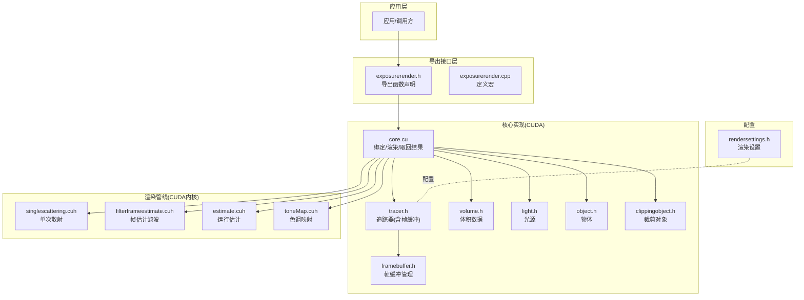
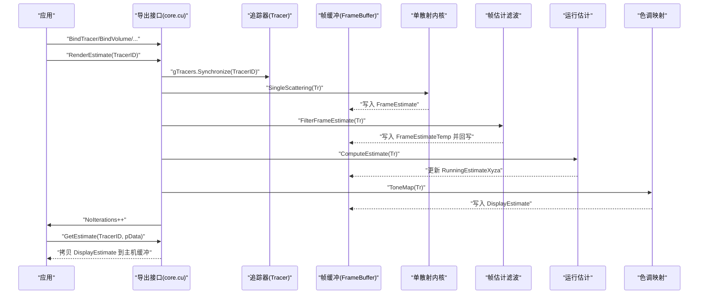
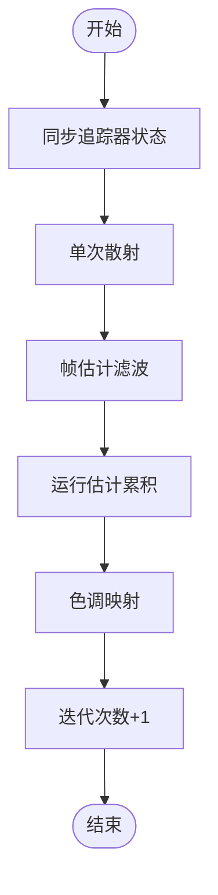
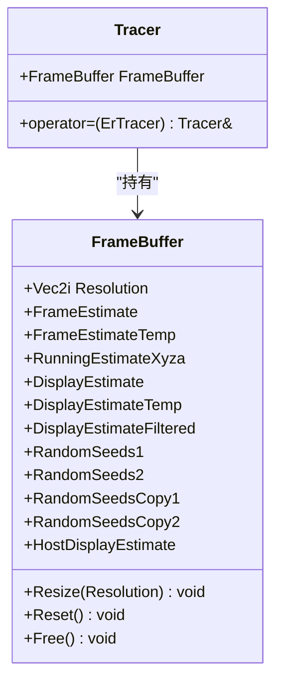
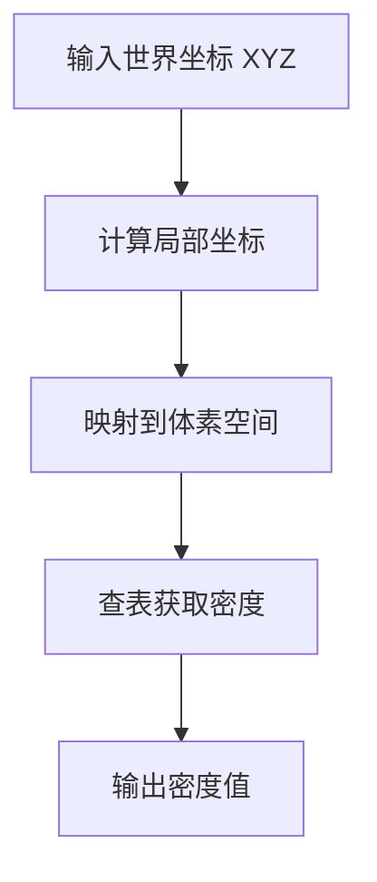
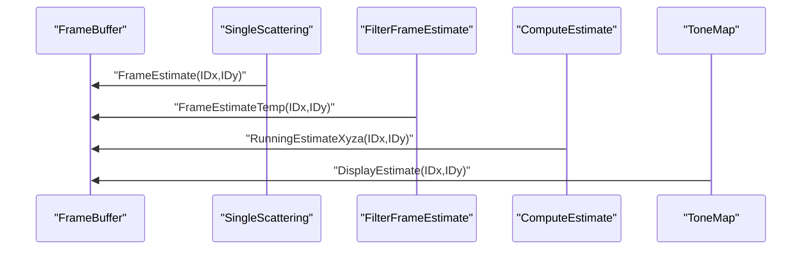
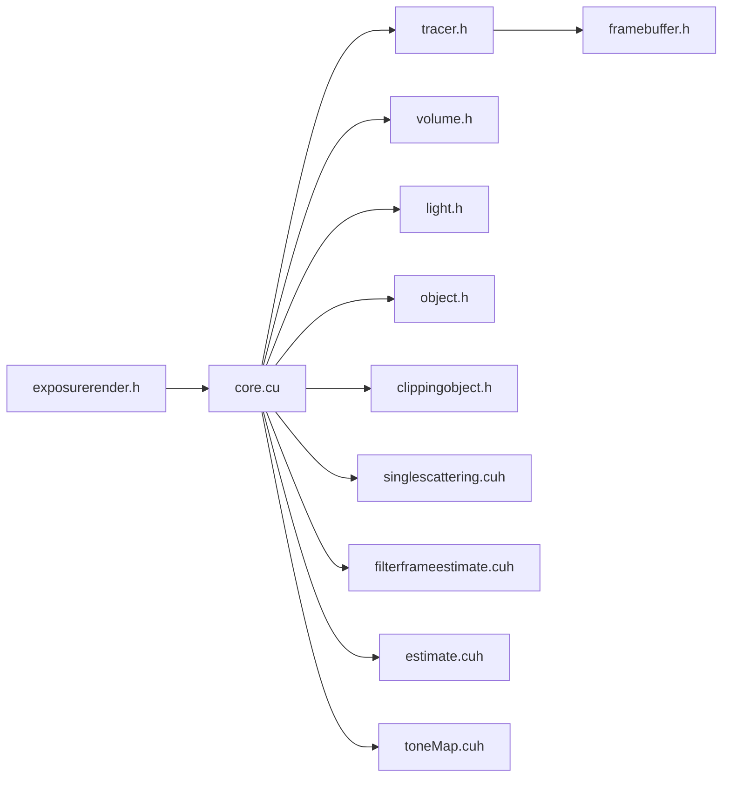

# 示例和教程

<cite>
**本文引用的文件**
- [README.md](file://README.md)
- [exposurerender.h](file://Source/exposurerender.h)
- [exposurerender.cpp](file://Source/exposurerender.cpp)
- [core.cu](file://Source/core.cu)
- [rendersettings.h](file://Source/rendersettings.h)
- [tracer.h](file://Source/tracer.h)
- [volume.h](file://Source/volume.h)
- [light.h](file://Source/light.h)
- [object.h](file://Source/object.h)
- [clippingobject.h](file://Source/clippingobject.h)
- [framebuffer.h](file://Source/framebuffer.h)
- [singlescattering.cuh](file://Source/singlescattering.cuh)
- [filterframeestimate.cuh](file://Source/filterframeestimate.cuh)
- [estimate.cuh](file://Source/estimate.cuh)
- [toneMap.cuh](file://Source/toneMap.cuh)
</cite>

## 目录
1. [简介](#简介)
2. [项目结构](#项目结构)
3. [核心组件](#核心组件)
4. [架构总览](#架构总览)
5. [详细组件分析](#详细组件分析)
6. [依赖分析](#依赖分析)
7. [性能考虑](#性能考虑)
8. [故障排查指南](#故障排查指南)
9. [结论](#结论)
10. [附录](#附录)

## 简介
本教程面向希望快速上手并深入理解基于 CUDA 的体积光线投射渲染框架“Exposure Render”的用户。文档从系统架构、核心数据模型与接口入手，逐步讲解渲染管线的关键步骤（单散射、帧估计滤波、运行估计累积、色调映射），并通过可操作的示例流程帮助读者完成一次完整的渲染迭代。同时，文档提供参数说明、常见问题与优化建议，兼顾初学者与有经验的开发者。

## 项目结构
该工程采用分层与按功能模块组织的结构：核心渲染逻辑位于 CUDA 源文件中，对外通过一组 DLL 导出函数暴露接口；渲染设置类用于控制遍历步长、阴影、着色等策略；各几何/材质对象封装在独立头文件中；帧缓冲区管理多份中间缓冲与随机种子以支持蒙特卡洛收敛与重播。

图表来源
- [exposurerender.h:32-43](file://Source/exposurerender.h#L32-L43)
- [core.cu:56-153](file://Source/core.cu#L56-L153)
- [tracer.h:31-55](file://Source/tracer.h#L31-L55)
- [framebuffer.h:26-105](file://Source/framebuffer.h#L26-L105)
- [volume.h:26-150](file://Source/volume.h#L26-L150)
- [light.h:26-46](file://Source/light.h#L26-L46)
- [object.h:26-45](file://Source/object.h#L26-L45)
- [clippingobject.h:26-44](file://Source/clippingobject.h#L26-L44)
- [singlescattering.cuh:27-38](file://Source/singlescattering.cuh#L27-L38)
- [filterframeestimate.cuh:33-74](file://Source/filterframeestimate.cuh#L33-L74)
- [estimate.cuh:27-38](file://Source/estimate.cuh#L27-L38)
- [toneMap.cuh:49-65](file://Source/toneMap.cuh#L49-L65)
- [rendersettings.h:27-131](file://Source/rendersettings.h#L27-L131)

章节来源
- [README.md:1-61](file://README.md#L1-L61)
- [exposurerender.h:32-43](file://Source/exposurerender.h#L32-L43)
- [core.cu:56-153](file://Source/core.cu#L56-L153)

## 核心组件
- 导出接口层
  - 绑定/解绑：绑定追踪器、体积、光源、物体、裁剪对象、纹理、位图。
  - 渲染与查询：执行一次渲染估计、获取估计图像、获取自动对焦距离、获取迭代次数。
- 追踪器与帧缓冲
  - 追踪器继承自外部接口类型，内部持有帧缓冲，负责尺寸同步与迭代计数。
  - 帧缓冲包含多组设备侧缓冲（帧估计、运行估计、显示估计等）以及主机侧拷贝缓冲。
- 体积数据
  - 封装体素网格、间距、尺寸、边界盒与梯度采样偏移，提供密度查询接口。
- 光源与物体
  - 光源与物体分别继承自外部接口类型，提供更新/赋值逻辑。
- 裁剪对象
  - 提供裁剪几何的封装与赋值。
- 渲染设置
  - 遍历设置：主路径步长因子、阴影步长因子、是否开启阴影、最大阴影距离。
  - 着色设置：类型、密度缩放、是否按不透明度调制、梯度计算方式与阈值、梯度因子。

章节来源
- [exposurerender.h:32-43](file://Source/exposurerender.h#L32-L43)
- [core.cu:56-153](file://Source/core.cu#L56-L153)
- [tracer.h:31-55](file://Source/tracer.h#L31-L55)
- [framebuffer.h:26-105](file://Source/framebuffer.h#L26-L105)
- [volume.h:26-150](file://Source/volume.h#L26-L150)
- [light.h:26-46](file://Source/light.h#L26-L46)
- [object.h:26-45](file://Source/object.h#L26-L45)
- [clippingobject.h:26-44](file://Source/clippingobject.h#L26-L44)
- [rendersettings.h:27-131](file://Source/rendersettings.h#L27-L131)

## 架构总览
下图展示了从应用调用到渲染管线执行的端到端流程，包括绑定阶段、一次完整渲染迭代的四个核心步骤，以及结果读回。

图表来源
- [core.cu:126-143](file://Source/core.cu#L126-L143)
- [singlescattering.cuh:34-38](file://Source/singlescattering.cuh#L34-L38)
- [filterframeestimate.cuh:66-74](file://Source/filterframeestimate.cuh#L66-L74)
- [estimate.cuh:34-38](file://Source/estimate.cuh#L34-L38)
- [toneMap.cuh:61-65](file://Source/toneMap.cuh#L61-L65)
- [framebuffer.h:94-104](file://Source/framebuffer.h#L94-L104)

## 详细组件分析

### 组件一：渲染接口与生命周期
- 绑定/解绑
  - 支持对追踪器、体积、光源、物体、裁剪对象、纹理、位图进行绑定或解绑。
  - 绑定后由全局列表维护，渲染时通过索引访问。
- 渲染估计
  - 同步追踪器状态后依次执行：单次散射、帧估计滤波、运行估计累积、色调映射。
  - 每次渲染后迭代计数自增。
- 结果读回
  - 将设备侧显示估计缓冲拷贝到主机缓冲，供上层显示或保存。

图表来源
- [core.cu:126-136](file://Source/core.cu#L126-L136)

章节来源
- [exposurerender.h:32-43](file://Source/exposurerender.h#L32-L43)
- [core.cu:56-153](file://Source/core.cu#L56-L153)

### 组件二：追踪器与帧缓冲
- 追踪器
  - 继承外部接口类型，构造时初始化帧缓冲并根据相机胶片尺寸调整大小。
  - 赋值运算符会同步帧缓冲尺寸。
- 帧缓冲
  - 包含帧估计、临时帧估计、运行估计、显示估计、滤波后显示估计、两套随机种子及其缓存、主机侧显示估计。
  - 提供 Resize/Reset/Free，确保尺寸变化与资源释放的一致性。

图表来源
- [tracer.h:31-55](file://Source/tracer.h#L31-L55)
- [framebuffer.h:26-105](file://Source/framebuffer.h#L26-L105)

章节来源
- [tracer.h:31-55](file://Source/tracer.h#L31-L55)
- [framebuffer.h:26-105](file://Source/framebuffer.h#L26-L105)

### 组件三：体积数据与密度查询
- 体积对象
  - 维护边界盒、间距、逆间距、尺寸、逆尺寸、最小步长与体素缓冲。
  - 提供从世界坐标到体素索引的归一化映射与密度查询。
- 梯度偏移
  - 根据最小步长生成沿三个轴的梯度采样偏移，用于着色与不透明度计算。

图表来源
- [volume.h:131-138](file://Source/volume.h#L131-L138)

章节来源
- [volume.h:26-150](file://Source/volume.h#L26-L150)

### 组件四：渲染管线内核与算法
- 单次散射
  - 每个像素启动一个 CUDA 内核，调用单散射函数计算帧估计。
- 帧估计滤波
  - 使用二维高斯核在局部范围内加权求和，抑制噪声并保留边缘。
- 运行估计
  - 使用累计移动平均将当前帧估计融合进运行估计，随迭代次数增长逐步收敛。
- 色调映射
  - 将 XYZA 色度空间估计映射到 RGB 并应用曝光与伽马修正，输出 RGBA 显示缓冲。

图表来源
- [singlescattering.cuh:27-38](file://Source/singlescattering.cuh#L27-L38)
- [filterframeestimate.cuh:33-74](file://Source/filterframeestimate.cuh#L33-L74)
- [estimate.cuh:27-38](file://Source/estimate.cuh#L27-L38)
- [toneMap.cuh:49-65](file://Source/toneMap.cuh#L49-L65)

章节来源
- [singlescattering.cuh:27-38](file://Source/singlescattering.cuh#L27-L38)
- [filterframeestimate.cuh:33-74](file://Source/filterframeestimate.cuh#L33-L74)
- [estimate.cuh:27-38](file://Source/estimate.cuh#L27-L38)
- [toneMap.cuh:30-65](file://Source/toneMap.cuh#L30-L65)

### 组件五：渲染设置与参数
- 遍历设置
  - StepFactorPrimary：主光线步长因子
  - StepFactorShadow：阴影光线步长因子
  - Shadows：是否启用阴影
  - MaxShadowDistance：最大阴影距离
- 着色设置
  - Type：着色类型
  - DensityScale：密度缩放
  - OpacityModulated：是否按不透明度调制
  - GradientComputation：梯度计算方式
  - GradientThreshold：梯度阈值
  - GradientFactor：梯度因子

章节来源
- [rendersettings.h:27-131](file://Source/rendersettings.h#L27-L131)

## 依赖分析
- 组件耦合
  - 导出接口层仅依赖核心实现层；核心实现层依赖追踪器与帧缓冲；渲染管线内核依赖追踪器与帧缓冲。
  - 体积、光源、物体、裁剪对象作为数据载体，被追踪器与帧缓冲间接使用。
- 外部依赖
  - CUDA 运行时与内核编排；随机种子缓冲用于蒙特卡洛采样；颜色空间转换与曝光映射。
- 可能的循环依赖
  - 当前结构清晰，未见直接循环包含；内核通过全局指针访问追踪器，属于单向依赖。

图表来源
- [exposurerender.h:32-43](file://Source/exposurerender.h#L32-L43)
- [core.cu:56-153](file://Source/core.cu#L56-L153)
- [tracer.h:31-55](file://Source/tracer.h#L31-L55)
- [framebuffer.h:26-105](file://Source/framebuffer.h#L26-L105)
- [volume.h:26-150](file://Source/volume.h#L26-L150)
- [light.h:26-46](file://Source/light.h#L26-L46)
- [object.h:26-45](file://Source/object.h#L26-L45)
- [clippingobject.h:26-44](file://Source/clippingobject.h#L26-L44)
- [singlescattering.cuh:27-38](file://Source/singlescattering.cuh#L27-L38)
- [filterframeestimate.cuh:33-74](file://Source/filterframeestimate.cuh#L33-L74)
- [estimate.cuh:27-38](file://Source/estimate.cuh#L27-L38)
- [toneMap.cuh:49-65](file://Source/toneMap.cuh#L49-L65)

## 性能考虑
- 步长与收敛
  - 主/阴影步长因子影响采样密度与噪声水平；过小导致迭代缓慢，过大可能产生振铃或漏光。
- 滤波与平滑
  - 帧估计滤波核半径与标准差平衡锐度与噪声；建议根据分辨率与目标信噪比调整。
- 迭代与随机种子
  - 运行估计采用累计移动平均，建议在尺寸变化时重置随机种子以避免伪影。
- 设备内存
  - 多份中间缓冲占用显著，需确保显存充足；必要时降低分辨率或减少缓冲数量。

## 故障排查指南
- 绑定无效或渲染无输出
  - 确认已正确绑定追踪器与体积；检查绑定函数的布尔参数是否为真。
- 显示全黑或全白
  - 检查曝光参数与色调映射；确认运行估计已累积且帧估计非空。
- 渲染闪烁或噪声大
  - 增加迭代次数；调整步长因子与滤波参数；检查随机种子是否重置。
- 性能异常
  - 检查分辨率与内核块/网格维度；确认未频繁切换尺寸导致重复分配。

章节来源
- [core.cu:56-153](file://Source/core.cu#L56-L153)
- [framebuffer.h:70-91](file://Source/framebuffer.h#L70-L91)

## 结论
本教程从接口、数据模型与渲染管线三个层面介绍了 Exposure Render 的使用方法与实现要点。通过绑定对象、执行一次渲染估计并读回结果，即可完成交互式体积渲染的核心流程。结合渲染设置与参数调优，可在质量与性能之间取得良好平衡。

## 附录

### 快速上手示例（步骤）
- 初始化
  - 创建并绑定追踪器与相机参数
  - 绑定体积数据（含间距、尺寸、边界盒）
  - 绑定光源与物体
- 渲染循环
  - 调用渲染估计函数执行一次迭代
  - 获取估计图像到主机缓冲
  - 更新显示或保存图像
- 参数建议
  - 初始步长因子设为较小值，逐步增大
  - 开启阴影并设置合理最大阴影距离
  - 使用适度的滤波核半径与标准差

章节来源
- [exposurerender.h:32-43](file://Source/exposurerender.h#L32-L43)
- [core.cu:126-143](file://Source/core.cu#L126-L143)
- [rendersettings.h:27-131](file://Source/rendersettings.h#L27-L131)