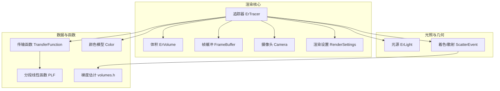
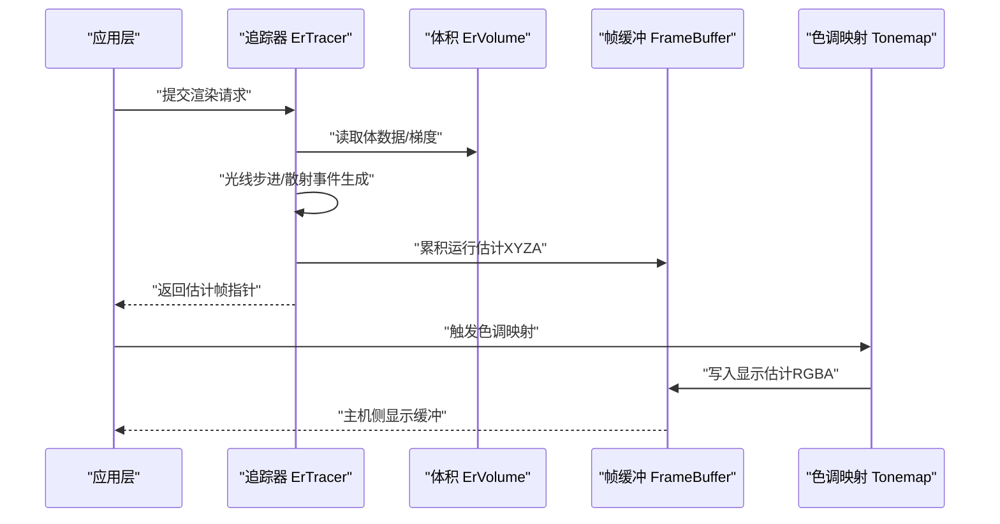
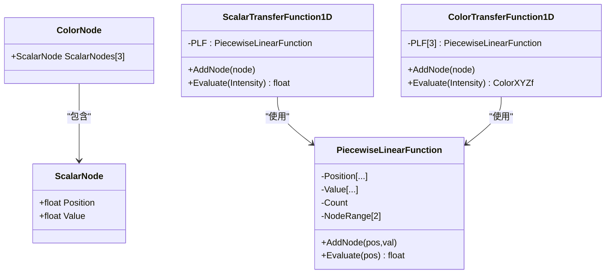
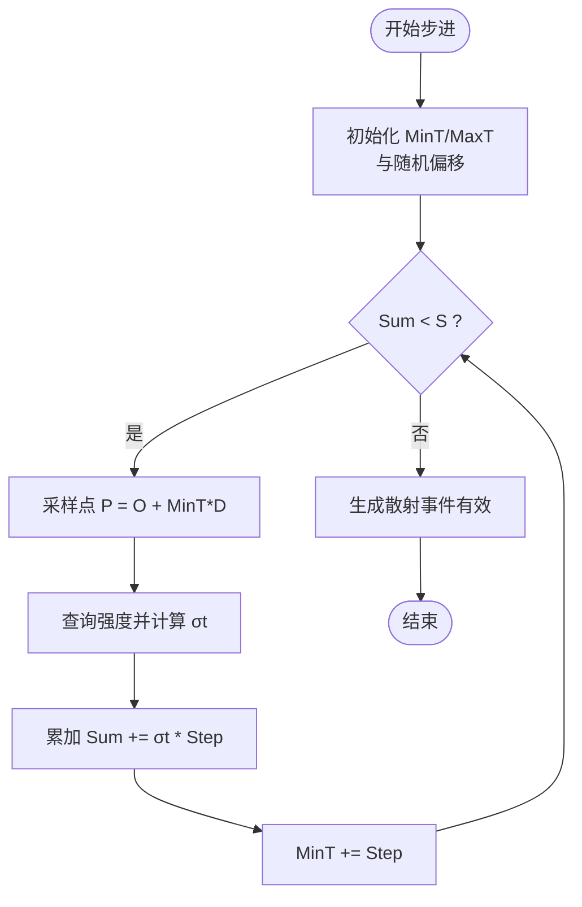
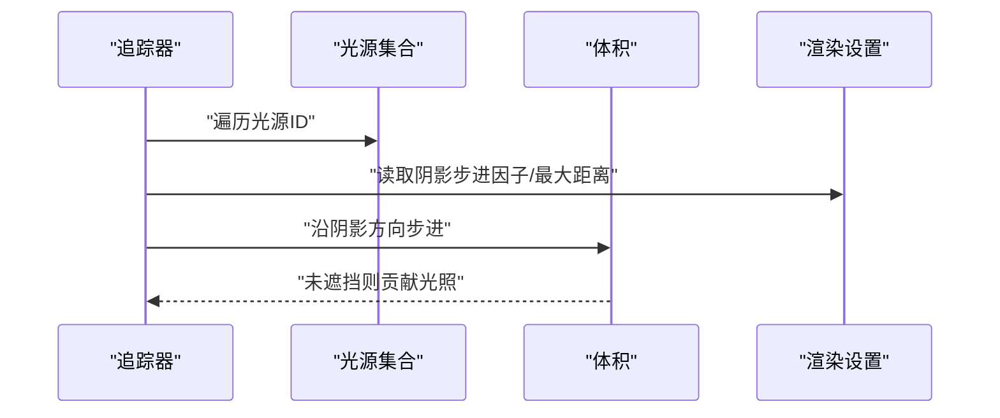
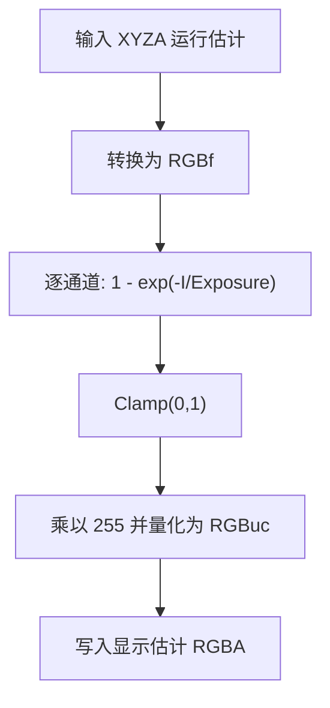
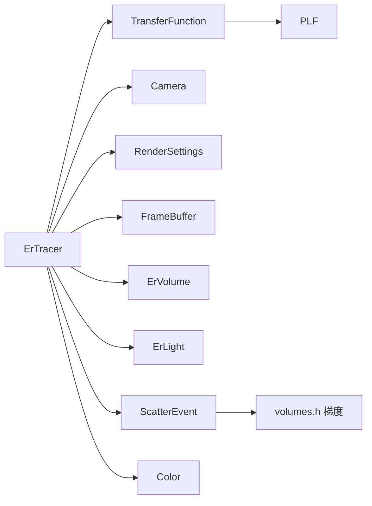

# 高级功能演示

<cite>
**本文引用的文件**
- [exposurerender.h](file://Source/exposurerender.h)
- [exposurerender.cpp](file://Source/exposurerender.cpp)
- [transferfunction.h](file://Source/transferfunction.h)
- [tonemap.cuh](file://Source/tonemap.cuh)
- [raymarching.h](file://Source/raymarching.h)
- [ertracer.h](file://Source/ertracer.h)
- [ervolume.h](file://Source/ervolume.h)
- [erlight.h](file://Source/erlight.h)
- [plf.h](file://Source/plf.h)
- [color.h](file://Source/color.h)
- [rendersettings.h](file://Source/rendersettings.h)
- [camera.h](file://Source/camera.h)
- [framebuffer.h](file://Source/framebuffer.h)
- [volumes.h](file://Source/volumes.h)
- [scatterevent.h](file://Source/scatterevent.h)
</cite>

## 目录
1. [简介](#简介)
2. [项目结构](#项目结构)
3. [核心组件](#核心组件)
4. [架构总览](#架构总览)
5. [详细组件分析](#详细组件分析)
6. [依赖关系分析](#依赖关系分析)
7. [性能考量](#性能考量)
8. [故障排查指南](#故障排查指南)
9. [结论](#结论)
10. [附录](#附录)

## 简介
本文件面向“高级功能演示”，聚焦于复杂体积渲染场景下的关键技术与工程实践，包括：
- 多光源系统与阴影追踪
- 复杂传输函数（标量/颜色）设计与实时调参
- 实时参数调整与交互式渲染控制
- 高级采样与噪声抑制（步长策略、梯度估计）
- 色调映射策略与显示管线
- 性能优化与内存管理最佳实践
- 实际项目应用与问题解决思路

目标是帮助读者在不深入源码的前提下，理解系统如何协同工作，并提供可直接落地的优化建议。

## 项目结构
该渲染框架采用模块化组织，核心围绕“追踪器（Tracer）+ 体积（Volume）+ 光源（Light）+ 传输函数（TF）+ 帧缓冲（FrameBuffer）+ 摄像头（Camera）+ 渲染设置（RenderSettings）”展开。下图给出高层结构示意：

图表来源
- [ertracer.h:33-117](file://Source/ertracer.h#L33-L117)
- [ervolume.h:28-74](file://Source/ervolume.h#L28-L74)
- [framebuffer.h:26-105](file://Source/framebuffer.h#L26-L105)
- [camera.h:26-116](file://Source/camera.h#L26-L116)
- [rendersettings.h:27-131](file://Source/rendersettings.h#L27-L131)
- [erlight.h:27-66](file://Source/erlight.h#L27-L66)
- [scatterevent.h:31-151](file://Source/scatterevent.h#L31-L151)
- [transferfunction.h:82-154](file://Source/transferfunction.h#L82-L154)
- [plf.h:26-92](file://Source/plf.h#L26-L92)
- [volumes.h:26-114](file://Source/volumes.h#L26-L114)
- [color.h:59-286](file://Source/color.h#L59-L286)

章节来源
- [ertracer.h:33-117](file://Source/ertracer.h#L33-L117)
- [ervolume.h:28-74](file://Source/ervolume.h#L28-L74)
- [framebuffer.h:26-105](file://Source/framebuffer.h#L26-L105)
- [camera.h:26-116](file://Source/camera.h#L26-L116)
- [rendersettings.h:27-131](file://Source/rendersettings.h#L27-L131)
- [erlight.h:27-66](file://Source/erlight.h#L27-L66)
- [scatterevent.h:31-151](file://Source/scatterevent.h#L31-L151)
- [transferfunction.h:82-154](file://Source/transferfunction.h#L82-L154)
- [plf.h:26-92](file://Source/plf.h#L26-L92)
- [volumes.h:26-114](file://Source/volumes.h#L26-L114)
- [color.h:59-286](file://Source/color.h#L59-L286)

## 核心组件
- 追踪器（ErTracer）：聚合传输函数、相机、渲染设置、光源/对象/裁剪对象索引、迭代次数等，作为渲染主控。
- 体积（ErVolume）：绑定体数据（体素），支持尺寸归一化与间距设置。
- 帧缓冲（FrameBuffer）：管理运行中估计、显示估计、随机种子缓存与主机侧输出缓冲。
- 摄像头（Camera）：曝光、伽马、视场角、焦距、光圈等参数，提供屏幕空间与坐标系更新。
- 渲染设置（RenderSettings）：遍历步长因子、阴影开关、密度缩放、梯度计算方式等。
- 传输函数（TransferFunction）：标量/颜色1D传输函数，基于分段线性插值（PLF）实现。
- 散射事件（ScatterEvent）：记录一次散射事件的几何、方向、发光与材质信息，支撑BRDF/相位函数混合。
- 梯度估计（volumes.h）：前向/中心差分与滤波梯度估计，用于阈值/幅度调制等着色策略。
- 色调映射（tonemap.cuh）：基于曝光的指数型色调映射与核函数并行执行。

章节来源
- [ertracer.h:33-117](file://Source/ertracer.h#L33-L117)
- [ervolume.h:28-74](file://Source/ervolume.h#L28-L74)
- [framebuffer.h:26-105](file://Source/framebuffer.h#L26-L105)
- [camera.h:26-116](file://Source/camera.h#L26-L116)
- [rendersettings.h:27-131](file://Source/rendersettings.h#L27-L131)
- [transferfunction.h:82-154](file://Source/transferfunction.h#L82-L154)
- [scatterevent.h:31-151](file://Source/scatterevent.h#L31-L151)
- [volumes.h:26-114](file://Source/volumes.h#L26-L114)
- [tonemap.cuh:30-67](file://Source/tonemap.cuh#L30-L67)

## 架构总览
渲染流程从追踪器发起，按像素遍历，沿光线步进采样体积，依据传输函数与着色策略合成颜色，最终经色调映射写入帧缓冲并显示。下图给出关键阶段的顺序关系：

图表来源
- [ertracer.h:33-117](file://Source/ertracer.h#L33-L117)
- [ervolume.h:28-74](file://Source/ervolume.h#L28-L74)
- [framebuffer.h:26-105](file://Source/framebuffer.h#L26-L105)
- [tonemap.cuh:61-67](file://Source/tonemap.cuh#L61-L67)

章节来源
- [ertracer.h:33-117](file://Source/ertracer.h#L33-L117)
- [ervolume.h:28-74](file://Source/ervolume.h#L28-L74)
- [framebuffer.h:26-105](file://Source/framebuffer.h#L26-L105)
- [tonemap.cuh:30-67](file://Source/tonemap.cuh#L30-L67)

## 详细组件分析

### 传输函数与实时参数调整
- 传输函数由标量与颜色两类1D函数组成，内部以分段线性函数（PLF）存储节点并进行线性插值评估。
- 应用可通过添加/修改节点的方式动态调整不透明度、漫反射、镜面反射、光泽度与发射项，从而实现交互式渲染控制。
- 评估接口在设备端可用，便于在内核中直接查询。

图表来源
- [transferfunction.h:27-154](file://Source/transferfunction.h#L27-L154)
- [plf.h:26-92](file://Source/plf.h#L26-L92)

章节来源
- [transferfunction.h:82-154](file://Source/transferfunction.h#L82-L154)
- [plf.h:26-92](file://Source/plf.h#L26-L92)

### 高级采样与噪声抑制
- 主线程步进采用指数分布步长，结合密度缩放与传输函数评估，确保在低密度区域减少步进次数，在高密度区域提升采样分辨率。
- 阴影步进步长与最大阴影距离可独立配置，支持快速近似阴影。
- 梯度估计提供前向/中心差分与滤波版本，用于阈值、幅度调制等策略；同时支持梯度幅度阈值与因子，实现自适应散射概率。

图表来源
- [raymarching.h:30-113](file://Source/raymarching.h#L30-L113)
- [volumes.h:26-114](file://Source/volumes.h#L26-L114)
- [rendersettings.h:30-106](file://Source/rendersettings.h#L30-L106)

章节来源
- [raymarching.h:30-113](file://Source/raymarching.h#L30-L113)
- [volumes.h:26-114](file://Source/volumes.h#L26-L114)
- [rendersettings.h:30-106](file://Source/rendersettings.h#L30-L106)

### 多光源系统与阴影追踪
- 追踪器维护光源ID集合，光线步进过程中可启用阴影步进与最大阴影距离限制，以加速阴影计算。
- 光源对象封装可见性、形状、纹理ID与发射倍数等属性，支持不同单位的发射量。

图表来源
- [ertracer.h:90-116](file://Source/ertracer.h#L90-L116)
- [erlight.h:27-66](file://Source/erlight.h#L27-L66)
- [rendersettings.h:30-64](file://Source/rendersettings.h#L30-L64)
- [raymarching.h:73-113](file://Source/raymarching.h#L73-L113)

章节来源
- [ertracer.h:90-116](file://Source/ertracer.h#L90-L116)
- [erlight.h:27-66](file://Source/erlight.h#L27-L66)
- [rendersettings.h:30-64](file://Source/rendersettings.h#L30-L64)
- [raymarching.h:73-113](file://Source/raymarching.h#L73-L113)

### 色调映射策略
- 基于曝光的指数型映射，对每个通道独立处理，随后进行0~1夹持与到8bit的线性量化。
- 内核并行执行，逐像素完成从运行估计（XYZA）到显示估计（RGBA）的转换。

图表来源
- [tonemap.cuh:30-59](file://Source/tonemap.cuh#L30-L59)
- [color.h:144-164](file://Source/color.h#L144-L164)

章节来源
- [tonemap.cuh:30-67](file://Source/tonemap.cuh#L30-L67)
- [color.h:144-164](file://Source/color.h#L144-L164)

### 交互式渲染控制与估计更新
- 提供估计获取与迭代次数查询接口，便于前端驱动的交互式渲染循环。
- 帧缓冲支持重置随机种子缓存，保证连续渲染的一致性与可重复性。

章节来源
- [exposurerender.h:32-42](file://Source/exposurerender.h#L32-L42)
- [framebuffer.h:70-74](file://Source/framebuffer.h#L70-L74)

## 依赖关系分析
- 组件耦合与职责边界清晰：追踪器聚合各子系统；传输函数与PLF解耦；色调映射独立于渲染管线；帧缓冲仅负责数据生命周期与拷贝。
- 关键外部依赖：CUDA内核启动宏、随机数生成器、颜色空间转换矩阵等。
- 可能的循环依赖风险：当前头文件组织未见直接循环包含；但需注意内核中对全局追踪器状态的访问应避免竞态。

图表来源
- [ertracer.h:33-117](file://Source/ertracer.h#L33-L117)
- [transferfunction.h:82-154](file://Source/transferfunction.h#L82-L154)
- [plf.h:26-92](file://Source/plf.h#L26-L92)
- [camera.h:26-116](file://Source/camera.h#L26-L116)
- [rendersettings.h:27-131](file://Source/rendersettings.h#L27-L131)
- [framebuffer.h:26-105](file://Source/framebuffer.h#L26-L105)
- [ervolume.h:28-74](file://Source/ervolume.h#L28-L74)
- [erlight.h:27-66](file://Source/erlight.h#L27-L66)
- [scatterevent.h:31-151](file://Source/scatterevent.h#L31-L151)
- [volumes.h:26-114](file://Source/volumes.h#L26-L114)
- [color.h:59-286](file://Source/color.h#L59-L286)

章节来源
- [ertracer.h:33-117](file://Source/ertracer.h#L33-L117)
- [transferfunction.h:82-154](file://Source/transferfunction.h#L82-L154)
- [plf.h:26-92](file://Source/plf.h#L26-L92)
- [camera.h:26-116](file://Source/camera.h#L26-L116)
- [rendersettings.h:27-131](file://Source/rendersettings.h#L27-L131)
- [framebuffer.h:26-105](file://Source/framebuffer.h#L26-L105)
- [ervolume.h:28-74](file://Source/ervolume.h#L28-L74)
- [erlight.h:27-66](file://Source/erlight.h#L27-L66)
- [scatterevent.h:31-151](file://Source/scatterevent.h#L31-L151)
- [volumes.h:26-114](file://Source/volumes.h#L26-L114)
- [color.h:59-286](file://Source/color.h#L59-L286)

## 性能考量
- 步长策略
  - 主路径与阴影路径分别配置步长因子，可在保证质量的同时显著降低计算量。
  - 密度缩放与指数步进结合，使高密度区域更精细，低密度区域更快。
- 梯度估计
  - 中心差分与滤波梯度在边缘细节与噪声之间取得平衡；根据场景选择合适策略。
  - 梯度幅度阈值与因子可用于自适应散射，减少无效步进。
- 帧缓冲与随机种子
  - 分离临时缓冲与运行估计，避免频繁同步。
  - 通过复制随机种子缓存并在重置时恢复，保障连续渲染稳定性。
- 色调映射
  - 内核并行化，像素粒度处理，避免CPU-GPU往返开销。
- CUDA 启动与内核
  - 使用统一的启动宏与计时工具，便于定位热点与优化。

章节来源
- [rendersettings.h:30-106](file://Source/rendersettings.h#L30-L106)
- [volumes.h:26-114](file://Source/volumes.h#L26-L114)
- [framebuffer.h:45-91](file://Source/framebuffer.h#L45-L91)
- [tonemap.cuh:61-67](file://Source/tonemap.cuh#L61-L67)

## 故障排查指南
- 渲染结果过暗或过亮
  - 检查曝光与伽马设置是否合理；确认色调映射是否正确应用。
- 阴影效果异常
  - 核对阴影步进因子与最大阴影距离；检查光源可见性与形状参数。
- 边缘噪声明显
  - 尝试提高步长因子或切换梯度估计方式；适当增大密度缩放。
- 显示卡顿
  - 关注内核启动时间与帧缓冲大小；确保随机种子缓存未被意外清空。
- 估计不收敛
  - 增加迭代次数或调整传输函数节点；检查体数据范围与归一化设置。

章节来源
- [camera.h:61-96](file://Source/camera.h#L61-L96)
- [tonemap.cuh:30-67](file://Source/tonemap.cuh#L30-L67)
- [rendersettings.h:30-106](file://Source/rendersettings.h#L30-L106)
- [framebuffer.h:70-91](file://Source/framebuffer.h#L70-L91)
- [ervolume.h:63-73](file://Source/ervolume.h#L63-L73)

## 结论
本框架通过模块化的追踪器、灵活的传输函数、稳健的帧缓冲与高效的色调映射，提供了构建高级体积渲染应用的基础能力。结合自适应步长、梯度估计与阴影策略，可在交互延迟与图像质量间取得良好平衡。建议在实际项目中：
- 将传输函数与渲染参数暴露为可调界面，配合估计查询实现实时反馈；
- 在大规模场景中优先采用滤波梯度与合理的步长策略；
- 利用帧缓冲的临时缓冲与随机种子缓存机制，稳定连续渲染体验；
- 通过内核计时与资源占用监控，持续优化关键路径。

## 附录
- 接口与导出
  - 对外提供绑定与渲染估计接口，便于上层应用集成与控制。
- 版本与许可
  - 项目遵循GPLv3许可，适用于开源与学术研究场景。

章节来源
- [exposurerender.h:32-42](file://Source/exposurerender.h#L32-L42)
- [exposurerender.cpp:21-24](file://Source/exposurerender.cpp#L21-L24)