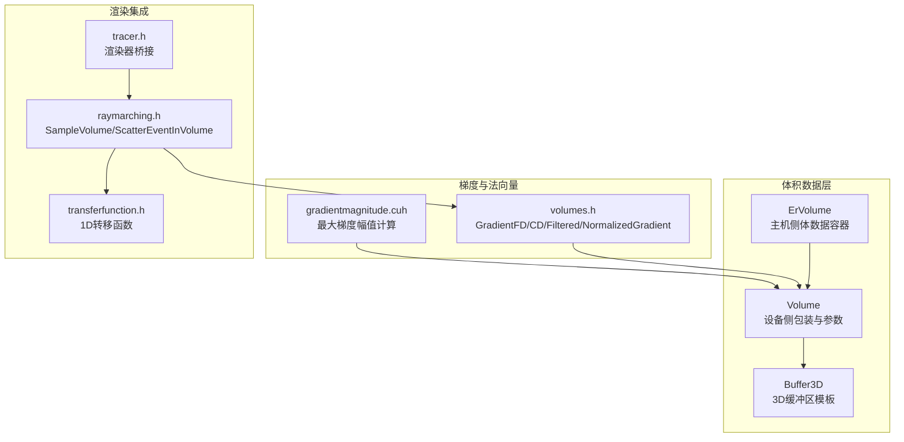
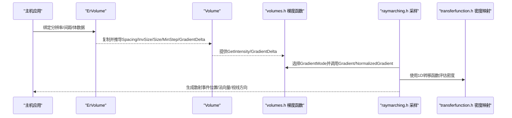
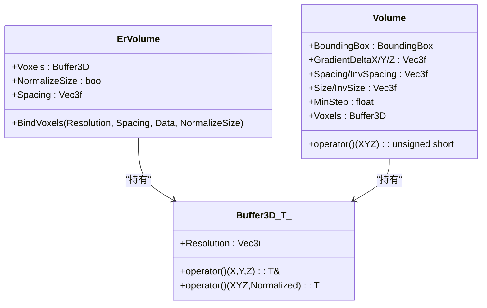
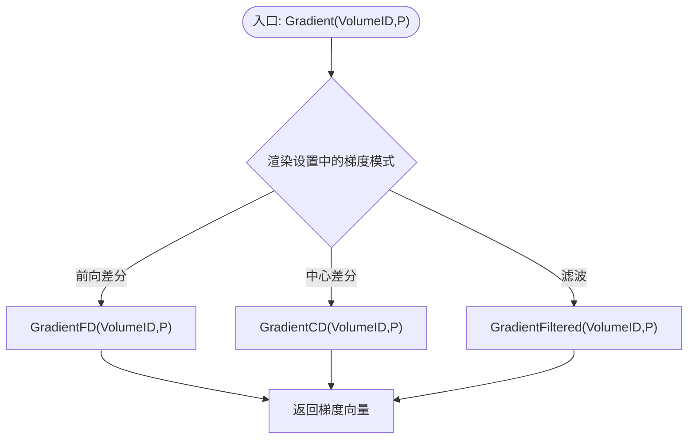
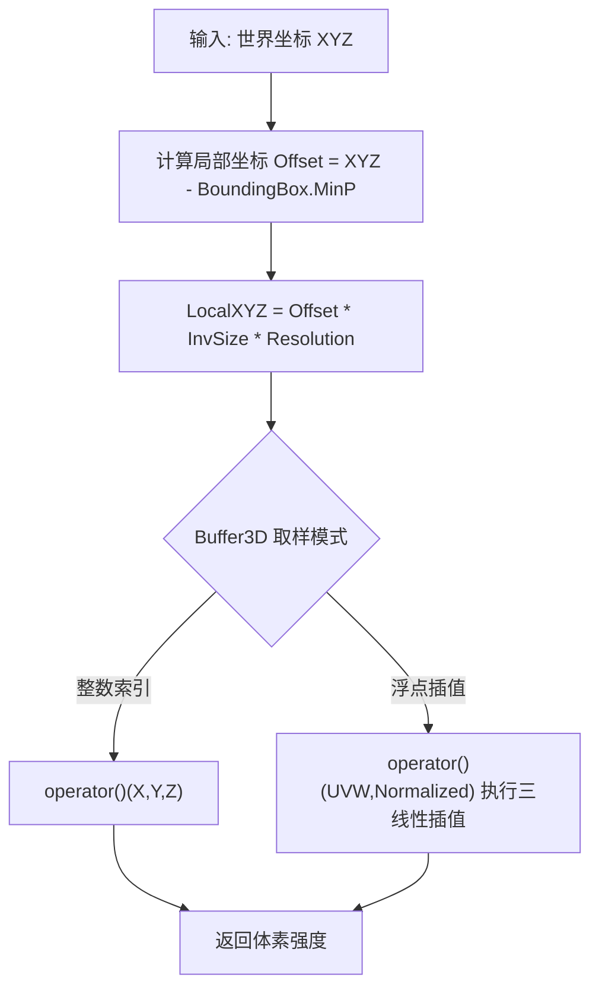
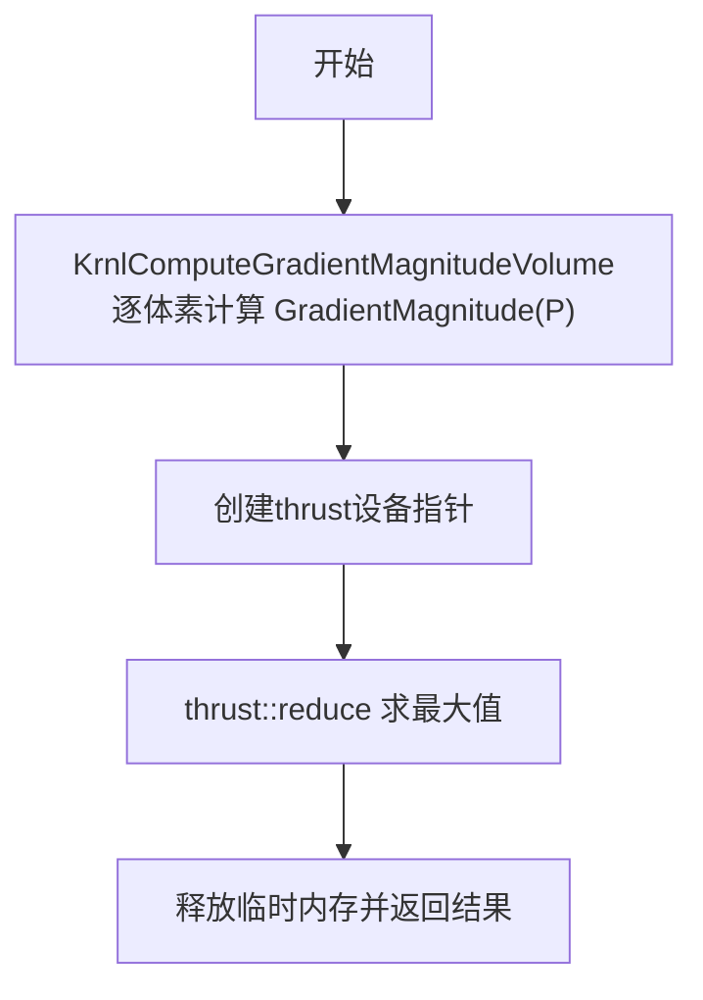
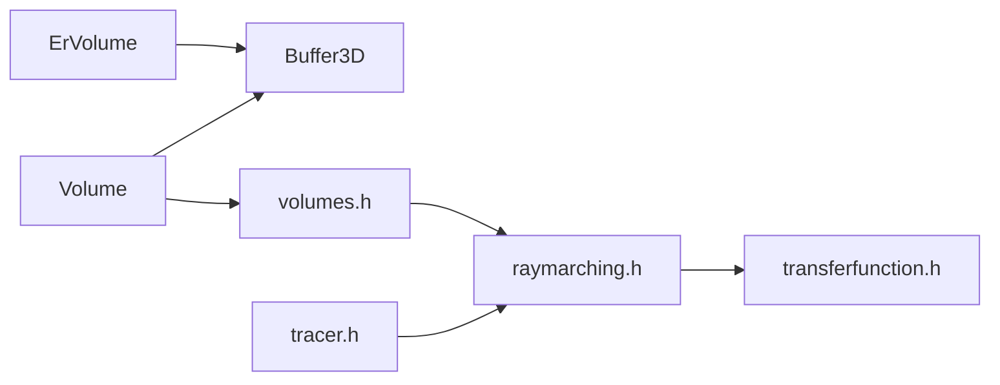

# 体积数据处理

<cite>
**本文引用的文件**
- [volume.h](file://Source/volume.h)
- [ervolume.h](file://Source/ervolume.h)
- [volumes.h](file://Source/volumes.h)
- [buffer3d.h](file://Source/buffer3d.h)
- [raymarching.h](file://Source/raymarching.h)
- [gradientmagnitude.cuh](file://Source/gradientmagnitude.cuh)
- [enums.h](file://Source/enums.h)
- [tracer.h](file://Source/tracer.h)
- [transferfunction.h](file://Source/transferfunction.h)
- [exception.h](file://Source/exception.h)
</cite>

## 目录
1. [简介](#简介)
2. [项目结构](#项目结构)
3. [核心组件](#核心组件)
4. [架构总览](#架构总览)
5. [详细组件分析](#详细组件分析)
6. [依赖分析](#依赖分析)
7. [性能考虑](#性能考虑)
8. [故障排查指南](#故障排查指南)
9. [结论](#结论)
10. [附录](#附录)

## 简介
本文件系统性阐述体积数据处理模块的设计与实现，覆盖以下主题：
- 体积数据的存储格式与内存布局
- 采样方法与步长控制
- 梯度计算（前向差分、中心差分、滤波梯度）
- 法向量生成与归一化
- 体积访问接口与三线性插值
- 与渲染管线的集成关系与内存管理机制
- 常见问题与优化策略

目标是让初学者快速上手，同时为有经验的开发者提供深入的技术细节与可操作的优化建议。

## 项目结构
围绕体积数据处理的关键源文件组织如下：
- 数据模型与存储：ErVolume、Volume、Buffer3D
- 梯度与法向量：volumes.h 中的梯度函数族
- 渲染集成：raymarching.h 中的采样流程
- 辅助类型：enums.h 中的梯度模式枚举
- 转移函数：transferfunction.h（用于密度/透明度映射）
- 内存与异常：buffer3d.h、exception.h



图表来源
- [ervolume.h:28-74](file://Source/ervolume.h#L28-L74)
- [volume.h:26-150](file://Source/volume.h#L26-L150)
- [buffer3d.h:26-251](file://Source/buffer3d.h#L26-L251)
- [volumes.h:26-117](file://Source/volumes.h#L26-L117)
- [gradientmagnitude.cuh:28-73](file://Source/gradientmagnitude.cuh#L28-L73)
- [raymarching.h:30-113](file://Source/raymarching.h#L30-L113)
- [tracer.h:31-55](file://Source/tracer.h#L31-L55)
- [transferfunction.h:82-154](file://Source/transferfunction.h#L82-L154)

章节来源
- [ervolume.h:28-74](file://Source/ervolume.h#L28-L74)
- [volume.h:26-150](file://Source/volume.h#L26-L150)
- [buffer3d.h:26-251](file://Source/buffer3d.h#L26-L251)
- [volumes.h:26-117](file://Source/volumes.h#L26-L117)
- [gradientmagnitude.cuh:28-73](file://Source/gradientmagnitude.cuh#L28-L73)
- [raymarching.h:30-113](file://Source/raymarching.h#L30-L113)
- [tracer.h:31-55](file://Source/tracer.h#L31-L55)
- [transferfunction.h:82-154](file://Source/transferfunction.h#L82-L154)

## 核心组件
- ErVolume：主机侧体数据容器，持有3D缓冲区、体元间距与尺寸归一化标志。
- Volume：设备侧包装类，维护包围盒、梯度步长、间距与分辨率等参数，并提供按世界坐标查询体素强度的访问接口。
- Buffer3D<T>：通用3D缓冲区模板，支持主机/设备内存分配、复制、重置与三线性插值取样。
- 梯度函数族：在volumes.h中定义了前向差分、中心差分、滤波梯度与法向量归一化、梯度幅值计算。
- 渲染集成：raymarching.h中的采样流程使用体积最小步长与转移函数评估密度，结合随机游走生成散射事件。
- 枚举与设置：enums.h中的GradientMode枚举决定梯度计算策略；渲染设置通过tracer.h桥接到渲染器。

章节来源
- [ervolume.h:28-74](file://Source/ervolume.h#L28-L74)
- [volume.h:26-150](file://Source/volume.h#L26-L150)
- [buffer3d.h:26-251](file://Source/buffer3d.h#L26-L251)
- [volumes.h:26-117](file://Source/volumes.h#L26-L117)
- [raymarching.h:30-113](file://Source/raymarching.h#L30-L113)
- [enums.h:73-78](file://Source/enums.h#L73-L78)
- [tracer.h:31-55](file://Source/tracer.h#L31-L55)

## 架构总览
体积数据处理贯穿“数据装载—参数初始化—梯度计算—渲染采样”的主路径。ErVolume负责数据绑定与参数推导；Volume封装设备侧访问与梯度步长；volumes.h提供梯度与法向量工具；raymarching.h将这些能力整合到光线步进与散射事件生成中。



图表来源
- [ervolume.h:63-69](file://Source/ervolume.h#L63-L69)
- [volume.h:100-129](file://Source/volume.h#L100-L129)
- [volumes.h:76-91](file://Source/volumes.h#L76-L91)
- [raymarching.h:30-71](file://Source/raymarching.h#L30-L71)
- [transferfunction.h:105-113](file://Source/transferfunction.h#L105-L113)

## 详细组件分析

### ErVolume 与 Volume：数据与参数
- ErVolume
  - 负责在主机侧持有3D体数据，提供BindVoxels接口以绑定外部内存与参数。
  - 关键字段：3D缓冲区、是否归一化尺寸、体元间距。
- Volume
  - 设备侧包装，从ErVolume拷贝参数，推导Spacing/InvSize/Size/MinStep以及各轴梯度步长。
  - 提供按世界坐标查询强度的访问接口，内部将世界坐标转换到体素局部坐标后调用Buffer3D取样。



图表来源
- [ervolume.h:28-74](file://Source/ervolume.h#L28-L74)
- [volume.h:26-150](file://Source/volume.h#L26-L150)
- [buffer3d.h:26-251](file://Source/buffer3d.h#L26-L251)

章节来源
- [ervolume.h:28-74](file://Source/ervolume.h#L28-L74)
- [volume.h:26-150](file://Source/volume.h#L26-L150)
- [buffer3d.h:26-251](file://Source/buffer3d.h#L26-L251)

### 梯度计算：前向差分、中心差分与滤波梯度
- 前向差分（GradientFD）
  - 在三个坐标轴上仅向前差分，计算梯度近似。
- 中心差分（GradientCD）
  - 在三个坐标轴上采用对称差分，精度更高。
- 滤波梯度（GradientFiltered）
  - 对中心差分结果进行多点采样与加权插值，进一步抑制噪声与提高稳定性。
- 法向量归一化（NormalizedGradient）与梯度幅值（GradientMagnitude）
  - 归一化梯度便于光照计算；梯度幅值可用于统计或自适应步长。



图表来源
- [volumes.h:76-86](file://Source/volumes.h#L76-L86)
- [volumes.h:43-54](file://Source/volumes.h#L43-L54)
- [volumes.h:31-41](file://Source/volumes.h#L31-L41)
- [volumes.h:56-74](file://Source/volumes.h#L56-L74)

章节来源
- [volumes.h:26-117](file://Source/volumes.h#L26-L117)
- [enums.h:73-78](file://Source/enums.h#L73-L78)

### 体积访问接口与三线性插值
- Buffer3D提供两种取样方式：
  - 整数索引：直接按体素坐标取值，自动边界钳制。
  - 浮点坐标：执行三线性插值，先在x/y/z三个方向分别线性插值，再组合得到最终强度。
- Volume的访问接口将世界坐标映射到体素局部坐标后调用Buffer3D取样，从而实现连续空间的强度查询。



图表来源
- [volume.h:131-138](file://Source/volume.h#L131-L138)
- [buffer3d.h:210-242](file://Source/buffer3d.h#L210-L242)

章节来源
- [volume.h:131-138](file://Source/volume.h#L131-L138)
- [buffer3d.h:210-242](file://Source/buffer3d.h#L210-L242)

### 渲染集成：光线步进与散射事件生成
- SampleVolume
  - 计算入射光线与体积包围盒的相交区间，按最小步长随机偏移起点后进行随机游走，累积透射直到满足阈值，生成散射事件（位置、法向量、视线方向）。
- ScatterEventInVolume
  - 阴影/次级光线场景下的散射事件判断，步长因子可配置。
- 与转移函数配合
  - 使用1D转移函数对强度进行密度映射，作为步进衰减系数的一部分。

```mermaid
sequenceDiagram
participant R as "Ray"
participant Box as "包围盒"
participant V as "Volume"
participant Grad as "volumes.h"
participant TF as "transferfunction.h"
R->>Box : 计算入/出点
Box-->>R : NearT/FarT
R->>V : 按MinStep随机步进
loop 步进循环
V-->>R : GetIntensity(P)
R->>TF : Evaluate(Intensity) -> 密度
R-->>R : 累积透射
end
R->>Grad : NormalizedGradient(P)
Grad-->>R : 法向量
R-->>R : 生成散射事件
```

图表来源
- [raymarching.h:30-71](file://Source/raymarching.h#L30-L71)
- [volumes.h:88-91](file://Source/volumes.h#L88-L91)
- [transferfunction.h:105-113](file://Source/transferfunction.h#L105-L113)

章节来源
- [raymarching.h:30-113](file://Source/raymarching.h#L30-L113)
- [transferfunction.h:105-113](file://Source/transferfunction.h#L105-L113)

### 最大梯度幅值计算（离线/辅助）
- gradientmagnitude.cuh提供计算整个体积梯度幅值场并求最大值的流程，使用CUDA核函数与thrust reduce完成归约，便于后续自适应步长或可视化。



图表来源
- [gradientmagnitude.cuh:28-73](file://Source/gradientmagnitude.cuh#L28-L73)

章节来源
- [gradientmagnitude.cuh:28-73](file://Source/gradientmagnitude.cuh#L28-L73)

## 依赖分析
- ErVolume → Buffer3D：ErVolume持有3D缓冲区，负责数据绑定与参数推导。
- Volume → ErVolume：从ErVolume拷贝参数并推导设备侧所需变量。
- volumes.h → Volume：通过全局体积表访问GetIntensity与GradientDelta。
- raymarching.h → volumes.h/transferfunction.h：采样流程依赖梯度与密度映射。
- tracer.h → raymarching.h：渲染器桥接，驱动采样与帧缓存。



图表来源
- [ervolume.h:28-74](file://Source/ervolume.h#L28-L74)
- [buffer3d.h:26-251](file://Source/buffer3d.h#L26-L251)
- [volume.h:26-150](file://Source/volume.h#L26-L150)
- [volumes.h:26-117](file://Source/volumes.h#L26-L117)
- [raymarching.h:30-113](file://Source/raymarching.h#L30-L113)
- [tracer.h:31-55](file://Source/tracer.h#L31-L55)
- [transferfunction.h:82-154](file://Source/transferfunction.h#L82-L154)

章节来源
- [ervolume.h:28-74](file://Source/ervolume.h#L28-L74)
- [buffer3d.h:26-251](file://Source/buffer3d.h#L26-L251)
- [volume.h:26-150](file://Source/volume.h#L26-L150)
- [volumes.h:26-117](file://Source/volumes.h#L26-L117)
- [raymarching.h:30-113](file://Source/raymarching.h#L30-L113)
- [tracer.h:31-55](file://Source/tracer.h#L31-L55)
- [transferfunction.h:82-154](file://Source/transferfunction.h#L82-L154)

## 性能考虑
- 步长策略
  - 使用体积最小步长作为基准，主光路与阴影步长可按比例因子调整，平衡质量与速度。
- 梯度计算
  - 中心差分通常优于前向差分；滤波梯度在噪声环境下更稳定但成本更高。
- 内存与带宽
  - 优先使用设备端Buffer3D，避免频繁主机/设备拷贝；三线性插值在设备端高效实现。
- 并行化
  - 梯度幅值归约使用CUDA核函数与thrust reduce，充分利用GPU并行能力。
- 自适应步长
  - 可基于梯度幅值动态调整步长，梯度大处更密采样，梯度小处放宽步长。

[本节为通用性能讨论，不直接分析具体文件]

## 故障排查指南
- 无散射事件
  - 检查光线与体积包围盒相交；确认步长与密度映射是否合理；验证随机种子与阈值。
- 梯度噪声或伪影
  - 切换到中心差分或滤波梯度；检查体元间距一致性；增大最小步长以减少欠采样。
- 内存不足
  - 减少体积分辨率；切换到主机侧缓冲区以降低显存占用；及时释放临时中间结果。
- 异常处理
  - 使用异常类记录错误级别与消息，便于定位问题来源。

章节来源
- [exception.h:27-55](file://Source/exception.h#L27-L55)

## 结论
该体积数据处理模块以ErVolume/Volume为核心，结合Buffer3D提供高效的3D数据访问与三线性插值；通过volumes.h的梯度函数族支持多种数值微分策略；raymarching.h将其无缝集成到光线步进与散射事件生成流程中。配合transferfunction.h的密度映射与tracer.h的渲染桥接，形成完整的体积渲染管线。针对性能与稳定性，建议根据场景特征选择合适的梯度模式与步长策略，并利用GPU并行能力优化关键路径。

[本节为总结性内容，不直接分析具体文件]

## 附录
- 关键实现路径参考
  - ErVolume绑定与参数推导：[ervolume.h:63-69](file://Source/ervolume.h#L63-L69)
  - Volume访问接口与参数推导：[volume.h:100-129](file://Source/volume.h#L100-L129)
  - 梯度函数族与法向量归一化：[volumes.h:31-91](file://Source/volumes.h#L31-L91)
  - 光线步进与散射事件生成：[raymarching.h:30-71](file://Source/raymarching.h#L30-L71)
  - 三线性插值实现：[buffer3d.h:222-242](file://Source/buffer3d.h#L222-L242)
  - 梯度幅值归约（离线）：[gradientmagnitude.cuh:46-71](file://Source/gradientmagnitude.cuh#L46-L71)
  - 渲染设置中的梯度模式枚举：[enums.h:73-78](file://Source/enums.h#L73-L78)

[本节为补充说明，不直接分析具体文件]