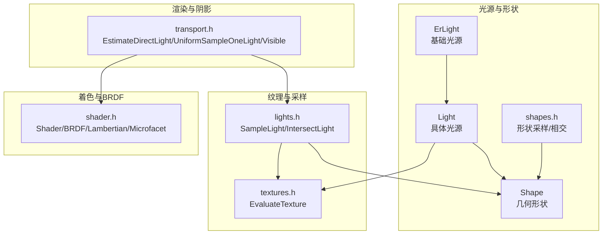
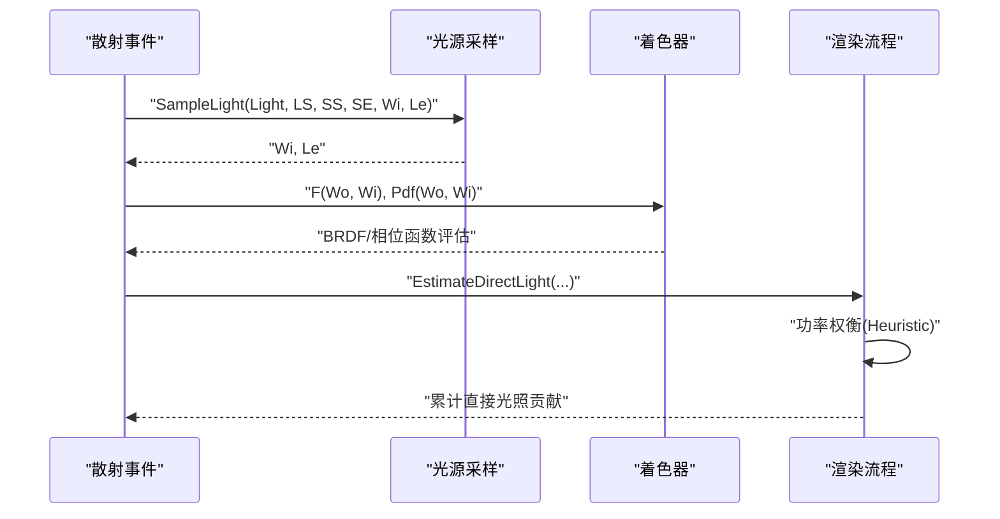
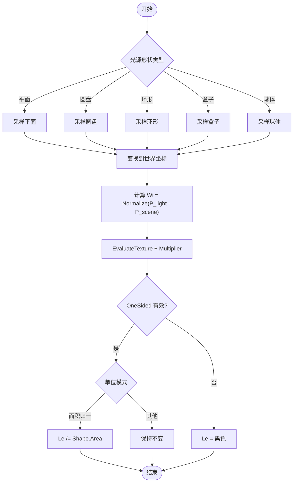
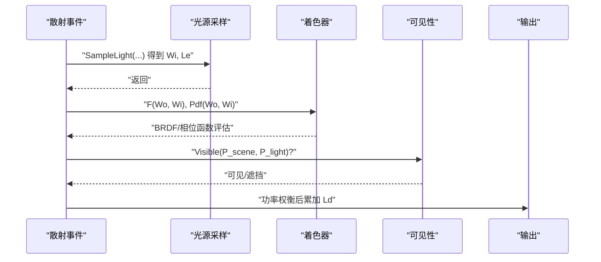
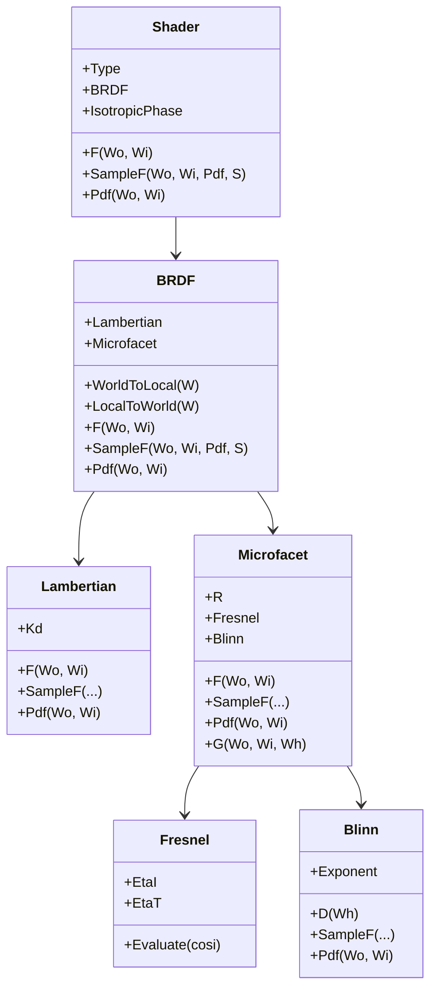
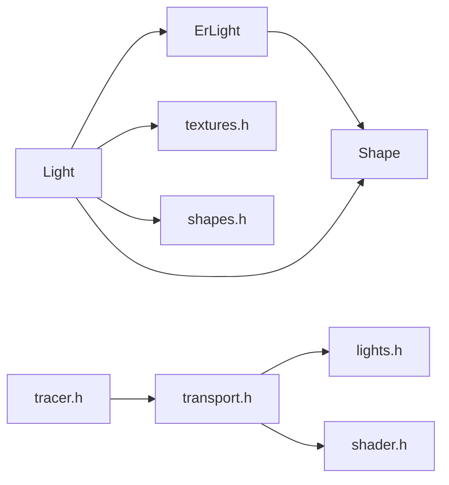

# 光源系统

<cite>
**本文引用的文件**
- [light.h](file://Source/light.h)
- [lights.h](file://Source/lights.h)
- [erlight.h](file://Source/erlight.h)
- [shader.h](file://Source/shader.h)
- [enums.h](file://Source/enums.h)
- [shape.h](file://Source/shape.h)
- [shapes.h](file://Source/shapes.h)
- [textures.h](file://Source/textures.h)
- [transport.h](file://Source/transport.h)
- [tracer.h](file://Source/tracer.h)
</cite>

## 目录
1. [简介](#简介)
2. [项目结构](#项目结构)
3. [核心组件](#核心组件)
4. [架构总览](#架构总览)
5. [详细组件分析](#详细组件分析)
6. [依赖分析](#依赖分析)
7. [性能考量](#性能考量)
8. [故障排查指南](#故障排查指南)
9. [结论](#结论)
10. [附录](#附录)

## 简介
本文件系统化阐述该光线追踪渲染器中的光源系统：包括光源类型定义、参数配置、采样与相交算法、衰减与单位模型、阴影计算以及与着色系统的集成（BRDF/相位函数）。文档以代码为依据，结合图示与分层讲解，既适合初学者快速上手，也为有经验的开发者提供深入的技术细节。

## 项目结构
光源系统主要由以下模块构成：
- 光源基类与派生类：ErLight、Light
- 形状系统：Shape 及其具体形状（平面、圆盘、环形、盒子、球体）
- 光源采样与相交：lights.h 中的 SampleLight、IntersectLight、IntersectLights
- 纹理与发光贴图：textures.h 的 EvaluateTexture
- 着色与BRDF：shader.h 的 Shader、BRDF、Lambertian、Microfacet、Blinn、Fresnel
- 渲染流程与阴影：transport.h 的 EstimateDirectLight、UniformSampleOneLight、Visible
- 枚举类型：enums.h 的 ShapeType、EmissionUnit、ScatterFunction 等

**图表来源**
- [light.h:26-46](file://Source/light.h#L26-L46)
- [erlight.h:27-66](file://Source/erlight.h#L27-L66)
- [shape.h:57-113](file://Source/shape.h#L57-L113)
- [shapes.h:31-72](file://Source/shapes.h#L31-L72)
- [textures.h:64-111](file://Source/textures.h#L64-111)
- [lights.h:28-88](file://Source/lights.h#L28-L88)
- [shader.h:415-483](file://Source/shader.h#L415-L483)
- [transport.h:58-156](file://Source/transport.h#L58-L156)

**章节来源**
- [light.h:26-46](file://Source/light.h#L26-L46)
- [erlight.h:27-66](file://Source/erlight.h#L27-L66)
- [shape.h:57-113](file://Source/shape.h#L57-L113)
- [shapes.h:31-72](file://Source/shapes.h#L31-L72)
- [textures.h:64-111](file://Source/textures.h#L64-111)
- [lights.h:28-88](file://Source/lights.h#L28-L88)
- [shader.h:415-483](file://Source/shader.h#L415-L483)
- [transport.h:58-156](file://Source/transport.h#L58-L156)

## 核心组件
- ErLight：光源抽象基类，包含可见性、形状、纹理ID、强度倍增器与单位枚举。
- Light：对 ErLight 的轻量封装，负责在赋值后更新形状面积。
- Shape：描述光源几何形状（平面、圆盘、环形、盒子、球体），并维护变换矩阵、单面属性与表面积。
- 纹理系统：EvaluateTexture 支持程序化纹理与位图纹理，支持重复、偏移、翻转与输出等级。
- 光源采样与相交：SampleLight 计算从场景点到光源表面的方向 Wi 与出射辐射 Le；IntersectLight/IntersectLights 用于求解光线与光源的相交。
- 着色系统：Shader 封装 BRDF 或相位函数；BRDF 组合 Lambertian（漫反射）与 Microfacet（镜面反射，基于Blinn分布与Fresnel）。
- 阴影与直接光照：EstimateDirectLight 使用重要性采样与功率权衡（Power Heuristic）估算直接光照贡献；UniformSampleOneLight 统一采样一个光源并叠加体积自发光。

**章节来源**
- [erlight.h:27-66](file://Source/erlight.h#L27-L66)
- [light.h:26-46](file://Source/light.h#L26-L46)
- [shape.h:57-113](file://Source/shape.h#L57-L113)
- [textures.h:64-111](file://Source/textures.h#L64-111)
- [lights.h:28-88](file://Source/lights.h#L28-L88)
- [shader.h:415-483](file://Source/shader.h#L415-L483)
- [transport.h:58-156](file://Source/transport.h#L58-L156)

## 架构总览
下图展示了从采样光源到着色与阴影的整体流程：

**图表来源**
- [lights.h:44-57](file://Source/lights.h#L44-L57)
- [shader.h:429-456](file://Source/shader.h#L429-L456)
- [transport.h:58-113](file://Source/transport.h#L58-L113)

## 详细组件分析

### 光源类型与参数
- 类型定义：通过 Shape.Type 指定光源几何类型（平面、圆盘、环形、盒子、球体等）。
- 参数配置：
  - 可见性：Visible 控制是否参与可见性测试。
  - 纹理ID：TextureID 指向纹理资源，用于表面辐射度贴图。
  - 强度倍增器：Multiplier 作为全局强度缩放。
  - 单位：Unit 选择功率（Power）、照度（Lux）、强度（Intensity）等单位模式。
  - 形状面积：Shape.Area 在 Shape.Update() 中按类型计算，影响单位换算与重要性采样权重。
- OneSided：单面属性决定法线朝向是否有效，避免反面发光。

**章节来源**
- [enums.h:52-61](file://Source/enums.h#L52-L61)
- [enums.h:88-93](file://Source/enums.h#L88-L93)
- [shape.h:92-103](file://Source/shape.h#L92-L103)
- [erlight.h:61-65](file://Source/erlight.h#L61-L65)

### 光源采样与相交
- SampleLightSurface：根据 Shape.Type 调用对应形状的表面采样函数，生成表面点与法线，并经由形状变换矩阵映射到世界空间。
- SampleLight：计算从散射点到光源表面的方向 Wi，并根据纹理与单位模式计算 Le；若 OneSided 且朝向不正确则返回黑光。
- IntersectLight/IntersectLights：将入射光线变换到光源局部坐标系，调用对应形状的相交函数；若命中，填充散射事件（位置、法线、UV、出射辐射 Le），并考虑单位换算。

**图表来源**
- [lights.h:28-57](file://Source/lights.h#L28-L57)
- [shapes.h:31-42](file://Source/shapes.h#L31-L42)
- [textures.h:64-111](file://Source/textures.h#L64-111)
- [shape.h:92-103](file://Source/shape.h#L92-L103)

**章节来源**
- [lights.h:28-88](file://Source/lights.h#L28-L88)
- [shapes.h:31-72](file://Source/shapes.h#L31-L72)
- [textures.h:64-111](file://Source/textures.h#L64-111)

### 衰减模型与单位
- 单位模式（Enums::EmissionUnit）：
  - 功率（Power）：单位为辐射功率，不进行面积归一。
  - 照度（Lux）：单位为照度，通常与距离平方成反比。
  - 强度（Intensity）：单位为发光强度，常用于点光源或方向光。
- 面光源面积归一：当单位为 Lux/Intensity 时，会将 Le 除以 Shape.Area，确保单位一致性。

**章节来源**
- [enums.h:88-93](file://Source/enums.h#L88-L93)
- [lights.h:55-56](file://Source/lights.h#L55-L56)
- [shape.h:92-103](file://Source/shape.h#L92-L103)

### 阴影计算
- 可见性检测：Visible 函数沿连接两点的射线步进，检查是否被体积或其他对象遮挡。
- 直接光照估计：EstimateDirectLight 使用重要性采样，结合光源采样概率 LightPdf 与BRDF采样概率 BsdfPdf，采用功率权衡（Power Heuristic）降低方差。
- 统一采样一个光源：UniformSampleOneLight 随机选择一个光源，构建对应 Shader（体积或物体材质），并调用 EstimateDirectLight 累计贡献。

**图表来源**
- [transport.h:47-56](file://Source/transport.h#L47-L56)
- [transport.h:58-113](file://Source/transport.h#L58-L113)
- [transport.h:115-156](file://Source/transport.h#L115-L156)

**章节来源**
- [transport.h:47-113](file://Source/transport.h#L47-L113)
- [transport.h:115-156](file://Source/transport.h#L115-L156)

### 与着色系统的集成与BRDF模型
- Shader 类型切换：根据场景类型（体积或物体）选择 BRDF 或相位函数。
- BRDF 组合：
  - Lambertian：漫反射项，双向各向同性。
  - Microfacet：镜面反射项，使用 Blinn 分布与 Fresnel 折射。
  - 组合策略：BRDF 对两个分量分别采样与PDF求和，实现混合BRDF。
- 本地-世界坐标转换：BRDF 内部通过法线与切线构造局部坐标系，保证BRDF在局部空间中正确评估。

**图表来源**
- [shader.h:415-483](file://Source/shader.h#L415-L483)
- [shader.h:29-70](file://Source/shader.h#L29-L70)
- [shader.h:198-274](file://Source/shader.h#L198-L274)
- [shader.h:79-128](file://Source/shader.h#L79-L128)
- [shader.h:130-196](file://Source/shader.h#L130-L196)

**章节来源**
- [shader.h:415-483](file://Source/shader.h#L415-L483)
- [shader.h:29-70](file://Source/shader.h#L29-L70)
- [shader.h:198-274](file://Source/shader.h#L198-L274)
- [shader.h:79-128](file://Source/shader.h#L79-L128)
- [shader.h:130-196](file://Source/shader.h#L130-L196)

### 不同光源类型的实现要点
- 平面光源（Plane）：适合做面光源或天光，可设置尺寸与单面属性。
- 圆盘光源（Disk）：常用于模拟点光源的柔化效果。
- 环形光源（Ring）：可用于环形灯带等特殊形状。
- 盒体光源（Box）：多边形面光源集合，适合大面积均匀照明。
- 球体光源（Sphere）：可作为体积光源或点光源使用。

这些类型均通过 SampleShape/IntersectShape 与 SampleLight/IntersectLight 进行统一处理，内部通过 switch 分发到具体形状函数。

**章节来源**
- [enums.h:52-61](file://Source/enums.h#L52-L61)
- [shapes.h:31-72](file://Source/shapes.h#L31-L72)
- [lights.h:28-88](file://Source/lights.h#L28-L88)

## 依赖分析
- Light 依赖 ErLight 提供基础属性；ErLight 依赖 Shape 描述几何。
- lights.h 依赖 shapes.h（形状采样/相交）与 textures.h（纹理评估）。
- transport.h 依赖 lights.h（光源采样/相交）与 shader.h（着色器）。
- tracer.h 为渲染器主控，承载帧缓冲等渲染状态（与光源系统间接关联）。

**图表来源**
- [light.h:26-46](file://Source/light.h#L26-L46)
- [erlight.h:27-66](file://Source/erlight.h#L27-L66)
- [shape.h:57-113](file://Source/shape.h#L57-L113)
- [textures.h:64-111](file://Source/textures.h#L64-111)
- [shapes.h:31-72](file://Source/shapes.h#L31-L72)
- [lights.h:28-88](file://Source/lights.h#L28-L88)
- [transport.h:58-156](file://Source/transport.h#L58-L156)
- [tracer.h:31-55](file://Source/tracer.h#L31-L55)

**章节来源**
- [light.h:26-46](file://Source/light.h#L26-L46)
- [erlight.h:27-66](file://Source/erlight.h#L27-L66)
- [shape.h:57-113](file://Source/shape.h#L57-L113)
- [textures.h:64-111](file://Source/textures.h#L64-111)
- [shapes.h:31-72](file://Source/shapes.h#L31-L72)
- [lights.h:28-88](file://Source/lights.h#L28-L88)
- [transport.h:58-156](file://Source/transport.h#L58-L156)
- [tracer.h:31-55](file://Source/tracer.h#L31-L55)

## 性能考量
- 形状相交优化：将光线变换到光源局部坐标系，减少复杂几何判断开销。
- 重要性采样与权衡：EstimateDirectLight 使用功率权衡平衡光源采样与BRDF采样的方差。
- 单面剔除：OneSided 可避免无效面的计算。
- 单位归一：对面积光源进行面积归一，避免单位不一致导致的能量放大。
- 阴影步进：Visible 沿射线步进，结合最大阴影距离限制，避免无限追踪。

[本节为通用性能讨论，无需特定文件引用]

## 故障排查指南
- 光源不发光或亮度异常
  - 检查 Multiplier 是否为零，TextureID 是否有效，EvaluateTexture 返回是否为黑色。
  - 若单位为 Lux/Intensity，请确认 Shape.Area 已正确更新（Light 赋值后会触发 Shape.Update）。
- 光源单面问题
  - OneSided 导致背面不发光，检查法线朝向与散射点相对光源表面的位置。
- 阴影错误
  - Visible 返回遮挡可能由步进步长或最大阴影距离设置不当引起；检查渲染设置中的阴影相关参数。
- BRDF/相位函数不匹配
  - 确认 Shader 类型（BRDF 或 PhaseFunction）与场景类型一致；材质参数（Kd/Ks/Ior/Exponent）是否合理。

**章节来源**
- [light.h:39-45](file://Source/light.h#L39-L45)
- [textures.h:64-111](file://Source/textures.h#L64-111)
- [transport.h:47-56](file://Source/transport.h#L47-L56)
- [shader.h:415-483](file://Source/shader.h#L415-L483)

## 结论
该光源系统以 ErLight 为核心，通过 Shape 描述几何、textures.h 提供辐射度贴图、lights.h 实现采样与相交、transport.h 完成重要性采样与阴影、shader.h 集成 BRDF/相位函数，形成完整的从几何到辐射度的管线。系统支持多种光源形状与单位模式，具备良好的扩展性与性能表现。

## 附录
- 关键路径参考
  - 光源采样与相交：[lights.h:28-88](file://Source/lights.h#L28-L88)
  - 纹理评估：[textures.h:64-111](file://Source/textures.h#L64-111)
  - 形状面积与更新：[shape.h:92-103](file://Source/shape.h#L92-L103)
  - 直接光照估计：[transport.h:58-113](file://Source/transport.h#L58-L113)
  - 着色器与BRDF：[shader.h:415-483](file://Source/shader.h#L415-L483)