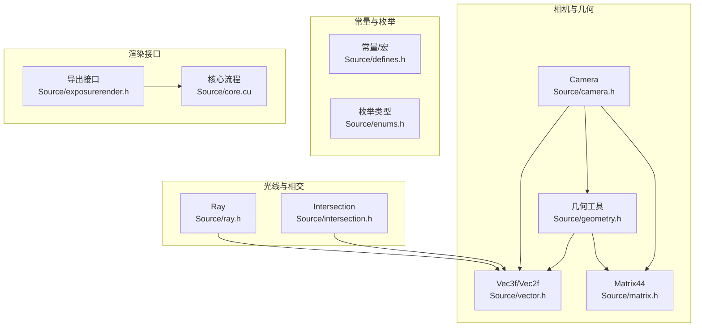
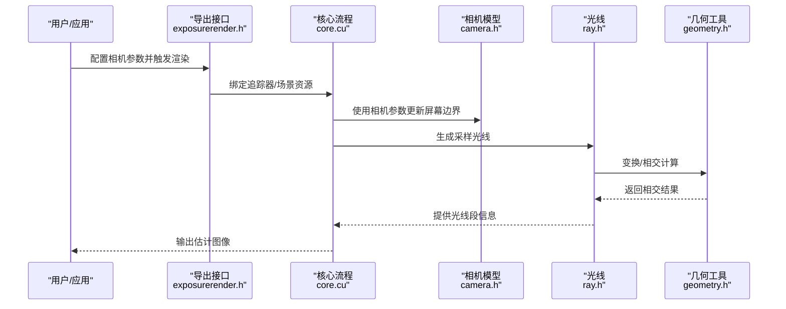
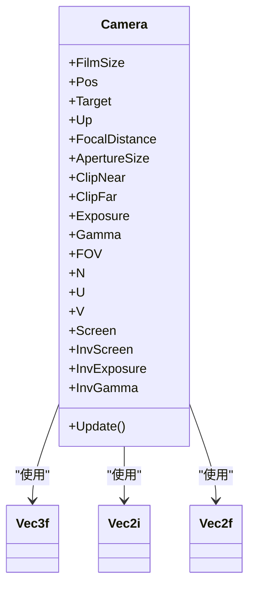
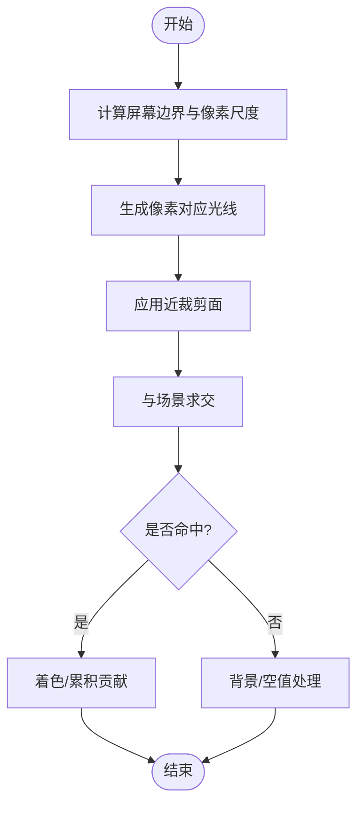
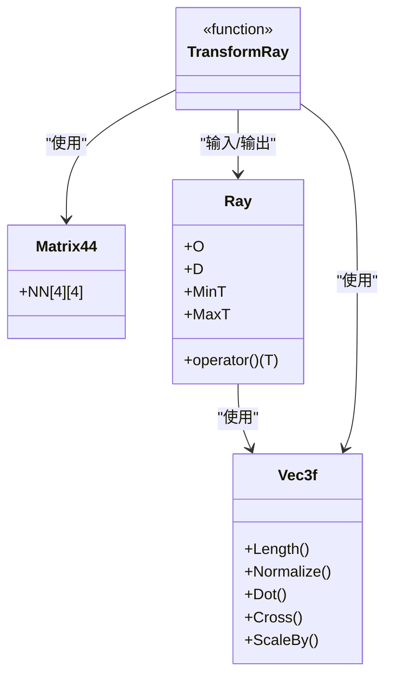
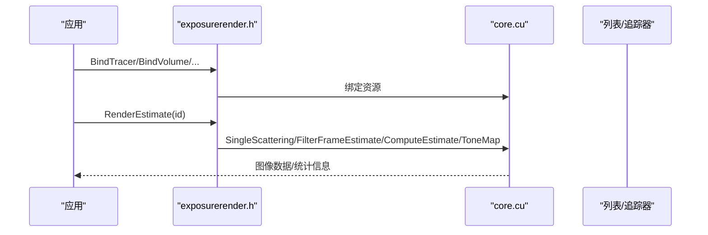
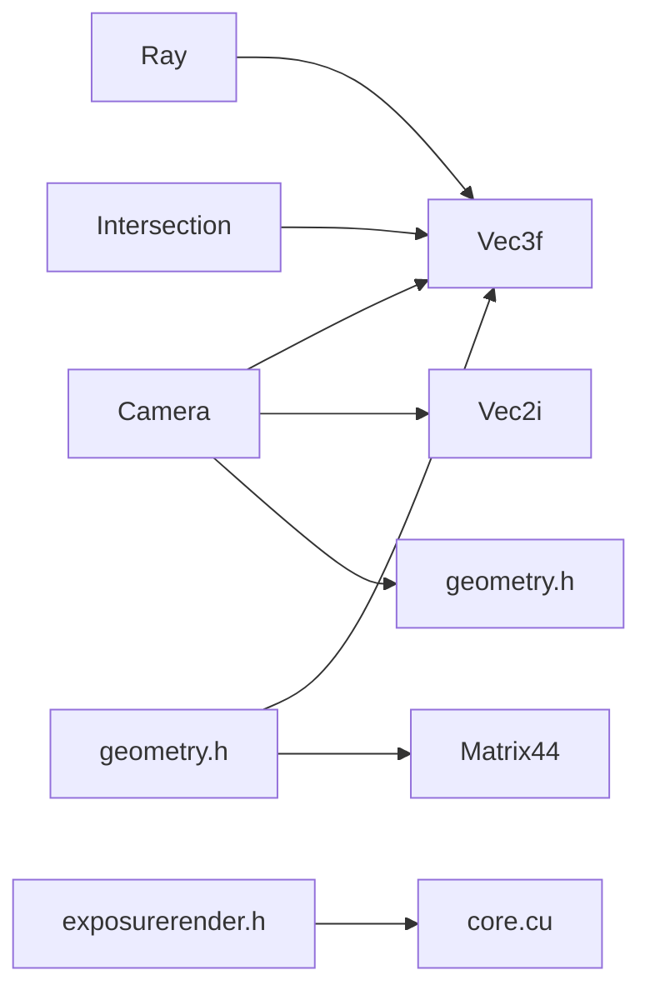

# 相机系统

<cite>
**本文引用的文件**
- [camera.h](file://Source/camera.h)
- [ray.h](file://Source/ray.h)
- [vector.h](file://Source/vector.h)
- [matrix.h](file://Source/matrix.h)
- [geometry.h](file://Source/geometry.h)
- [intersection.h](file://Source/intersection.h)
- [enums.h](file://Source/enums.h)
- [defines.h](file://Source/defines.h)
- [core.cu](file://Source/core.cu)
- [exposurerender.h](file://Source/exposurerender.h)
</cite>

## 目录
1. [引言](#引言)
2. [项目结构](#项目结构)
3. [核心组件](#核心组件)
4. [架构总览](#架构总览)
5. [详细组件分析](#详细组件分析)
6. [依赖关系分析](#依赖关系分析)
7. [性能考量](#性能考量)
8. [故障排查指南](#故障排查指南)
9. [结论](#结论)
10. [附录](#附录)

## 引言
本章节面向“相机系统”的完整说明，涵盖相机模型定义、参数配置、投影变换（含透视与景深）、光线生成与视锥裁剪机制。文档以代码库中的实际实现为依据，提供可追溯的来源路径，并通过图示帮助初学者理解，同时为有经验的开发者提供足够的技术深度。

## 项目结构
围绕相机系统的关键源文件组织如下：
- 模型与几何：camera.h、vector.h、matrix.h、geometry.h
- 光线与相交：ray.h、intersection.h
- 常量与枚举：defines.h、enums.h
- 渲染绑定接口：exposurerender.h
- 核心渲染流程：core.cu

**图表来源**
- [camera.h:1-119](file://Source/camera.h#L1-L119)
- [vector.h:450-495](file://Source/vector.h#L450-L495)
- [matrix.h:27-56](file://Source/matrix.h#L27-L56)
- [geometry.h:30-68](file://Source/geometry.h#L30-L68)
- [ray.h:26-56](file://Source/ray.h#L26-L56)
- [intersection.h:30-78](file://Source/intersection.h#L30-L78)
- [defines.h:58-76](file://Source/defines.h#L58-L76)
- [enums.h:24-108](file://Source/enums.h#L24-L108)
- [exposurerender.h:29-44](file://Source/exposurerender.h#L29-L44)
- [core.cu:53-156](file://Source/core.cu#L53-L156)

**章节来源**
- [camera.h:1-119](file://Source/camera.h#L1-L119)
- [vector.h:450-495](file://Source/vector.h#L450-L495)
- [matrix.h:27-56](file://Source/matrix.h#L27-L56)
- [geometry.h:30-68](file://Source/geometry.h#L30-L68)
- [ray.h:26-56](file://Source/ray.h#L26-L56)
- [intersection.h:30-78](file://Source/intersection.h#L30-L78)
- [defines.h:58-76](file://Source/defines.h#L58-L76)
- [enums.h:24-108](file://Source/enums.h#L24-L108)
- [exposurerender.h:29-44](file://Source/exposurerender.h#L29-L44)
- [core.cu:53-156](file://Source/core.cu#L53-L156)

## 核心组件
- 相机模型 Camera：负责位置、朝向、视野、胶片尺寸、近远裁剪面、曝光与伽马等参数；内部维护相机坐标系基向量与屏幕边界。
- 光线 Ray：表示起点与方向的光线，支持最小/最大步长截断。
- 相交 Intersection：记录最近相交信息（位置、法线、UV、有效标记）。
- 几何工具：向量运算、点/向量变换、球面坐标映射等。
- 矩阵 Matrix44：4×4齐次变换矩阵。
- 常量与枚举：数学常量、单位换算、内存类型等。

**章节来源**
- [camera.h:26-116](file://Source/camera.h#L26-L116)
- [ray.h:26-56](file://Source/ray.h#L26-L56)
- [intersection.h:30-78](file://Source/intersection.h#L30-L78)
- [vector.h:450-495](file://Source/vector.h#L450-L495)
- [matrix.h:27-56](file://Source/matrix.h#L27-L56)
- [geometry.h:30-68](file://Source/geometry.h#L30-L68)
- [defines.h:58-76](file://Source/defines.h#L58-L76)
- [enums.h:24-108](file://Source/enums.h#L24-L108)

## 架构总览
相机系统在渲染管线中的角色是：接收用户配置（位置、目标、上方向、视野角、胶片尺寸、焦距与光圈），计算相机坐标系与屏幕边界，生成从相机出发的光线，并与场景求交后参与渲染估计与色调映射。

**图表来源**
- [exposurerrender.h:32-43](file://Source/exposurerender.h#L32-L43)
- [core.cu:56-136](file://Source/core.cu#L56-L136)
- [camera.h:61-96](file://Source/camera.h#L61-L96)
- [ray.h:29-50](file://Source/ray.h#L29-L50)
- [geometry.h:54-68](file://Source/geometry.h#L54-L68)

## 详细组件分析

### 相机模型 Camera
- 参数与用途
  - 胶片尺寸：决定屏幕像素分辨率与像素尺度
  - 位置/目标/上方向：确定相机姿态与坐标系
  - 视野角：控制透视投影的张角
  - 近远裁剪面：限定可见深度范围
  - 曝光/伽马：用于最终显示调制
  - 焦距/光圈：用于景深模拟
- 关键计算
  - 更新函数会计算相机坐标系基向量与屏幕边界，以及像素尺度
  - 当未显式设置焦距时，自动使用目标到位置的距离作为焦距
  - 屏幕边界根据宽高比与视野角计算，确保纵横比正确

**图表来源**
- [camera.h:98-116](file://Source/camera.h#L98-L116)
- [camera.h:61-96](file://Source/camera.h#L61-L96)
- [vector.h:450-495](file://Source/vector.h#L450-L495)
- [vector.h:397-436](file://Source/vector.h#L397-L436)

**章节来源**
- [camera.h:26-116](file://Source/camera.h#L26-L116)
- [camera.h:61-96](file://Source/camera.h#L61-L96)

### 投影与屏幕边界
- 透视投影
  - 通过视野角与纵横比计算屏幕边界，形成标准的透视投影窗口
  - 像素尺度 InvScreen 用于将像素坐标映射到连续屏幕空间
- 正交投影
  - 在当前实现中未直接提供正交投影构造函数或切换逻辑
  - 若需正交投影，可在外部将相机参数转换为等效的正交参数，或扩展相机类以支持模式切换
- 景深效果
  - 通过焦距与光圈大小控制景深模糊强度
  - 光线生成阶段可基于光圈与焦距随机偏移主光线起点，实现浅景深效果

**章节来源**
- [camera.h:74-96](file://Source/camera.h#L74-L96)
- [camera.h:48-54](file://Source/camera.h#L48-L54)

### 光线生成与视锥裁剪
- 光线 Ray
  - 定义起点、方向、最小/最大步长
  - 支持按步长返回点位，便于沿光线采样
- 视锥裁剪
  - 近远裁剪面由相机参数提供，用于限制光线有效长度
  - 相交模块 Intersection 记录最近相交与前后表面标记，辅助裁剪与着色

**图表来源**
- [camera.h:61-96](file://Source/camera.h#L61-L96)
- [ray.h:29-50](file://Source/ray.h#L29-L50)
- [intersection.h:38-56](file://Source/intersection.h#L38-L56)

**章节来源**
- [ray.h:26-56](file://Source/ray.h#L26-L56)
- [intersection.h:30-78](file://Source/intersection.h#L30-L78)

### 几何与变换
- 向量与矩阵
  - Vec3f 提供点积、叉积、归一化、缩放等常用操作
  - Matrix44 为齐次变换矩阵，支持点与向量变换
- 射线变换
  - TransformRay 将世界空间光线变换到其他坐标系，保持方向一致性与距离映射

**图表来源**
- [vector.h:450-495](file://Source/vector.h#L450-L495)
- [matrix.h:27-56](file://Source/matrix.h#L27-L56)
- [geometry.h:54-68](file://Source/geometry.h#L54-L68)
- [ray.h:29-50](file://Source/ray.h#L29-L50)

**章节来源**
- [vector.h:450-495](file://Source/vector.h#L450-L495)
- [matrix.h:27-56](file://Source/matrix.h#L27-L56)
- [geometry.h:30-68](file://Source/geometry.h#L30-L68)

### 渲染绑定与流程
- 导出接口
  - 提供绑定追踪器、体积、光源、对象、裁剪对象、纹理与位图的函数
  - 提供渲染估计、获取估计图像、自动对焦距离与迭代次数查询的接口
- 核心流程
  - 绑定完成后执行单散射估计、滤波帧估计、估计计算与色调映射
  - 每次渲染增加迭代计数

**图表来源**
- [exposurerender.h:32-43](file://Source/exposurerender.h#L32-L43)
- [core.cu:56-136](file://Source/core.cu#L56-L136)

**章节来源**
- [exposurerender.h:29-44](file://Source/exposurerender.h#L29-L44)
- [core.cu:53-156](file://Source/core.cu#L53-L156)

## 依赖关系分析
- 内聚性
  - 相机模块内聚于姿态与投影参数，与几何工具紧密协作
- 耦合度
  - 光线与相交模块独立，通过公共向量类型耦合
  - 渲染接口与核心流程通过统一的绑定与渲染函数耦合
- 外部依赖
  - 数学常量与宏定义集中于 defines.h
  - 类型与枚举集中于 enums.h

**图表来源**
- [camera.h:98-116](file://Source/camera.h#L98-L116)
- [vector.h:450-495](file://Source/vector.h#L450-L495)
- [geometry.h:30-68](file://Source/geometry.h#L30-L68)
- [ray.h:29-50](file://Source/ray.h#L29-L50)
- [intersection.h:38-56](file://Source/intersection.h#L38-L56)
- [exposurerender.h:32-43](file://Source/exposurerender.h#L32-L43)
- [core.cu:56-136](file://Source/core.cu#L56-L136)

**章节来源**
- [camera.h:26-116](file://Source/camera.h#L26-L116)
- [vector.h:450-495](file://Source/vector.h#L450-L495)
- [geometry.h:30-68](file://Source/geometry.h#L30-L68)
- [ray.h:26-56](file://Source/ray.h#L26-L56)
- [intersection.h:30-78](file://Source/intersection.h#L30-L78)
- [exposurerender.h:29-44](file://Source/exposurerender.h#L29-L44)
- [core.cu:53-156](file://Source/core.cu#L53-L156)

## 性能考量
- 屏幕边界与像素尺度预计算：在相机更新时一次性计算，避免每像素重复昂贵三角函数
- 向量与矩阵运算：尽量使用内联与GPU友好的实现，减少函数调用开销
- 光线步长裁剪：合理设置 MinT/MaxT，减少无效采样
- 景深采样：适度降低采样率或采用分层策略，平衡质量与速度

## 故障排查指南
- 相机抖动或视角异常
  - 检查目标点与上方向是否共线导致坐标系计算失败
  - 确认视野角单位与实现一致（当前实现使用角度换算常量）
- 景深不生效
  - 确认焦距与光圈参数已设置且非默认值
  - 检查光线生成阶段是否应用了光圈偏移
- 像素坐标错位
  - 核对胶片尺寸与屏幕边界计算，确保纵横比分支逻辑正确
- 近远裁剪异常
  - 检查近远裁剪面设置顺序与数值范围

**章节来源**
- [camera.h:61-96](file://Source/camera.h#L61-L96)
- [defines.h:67-76](file://Source/defines.h#L67-L76)
- [geometry.h:54-68](file://Source/geometry.h#L54-L68)

## 结论
该相机系统以简洁的参数集实现了标准透视投影与景深功能，结合光线与相交模块完成高效的渲染流程。通过预计算屏幕边界与像素尺度、清晰的坐标系与变换接口，系统在易用性与性能之间取得良好平衡。对于正交投影与更复杂的镜头模型，可在现有框架上进行扩展。

## 附录
- 常用参数建议
  - 视野角：根据场景规模选择合适视角，避免过小导致细节丢失
  - 胶片尺寸：匹配目标分辨率，保证像素尺度合理
  - 近远裁剪面：根据场景深度范围设定，避免数值不稳定
  - 曝光与伽马：用于最终显示调制，注意与渲染估计的一致性