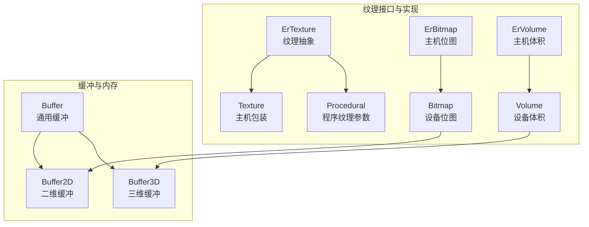
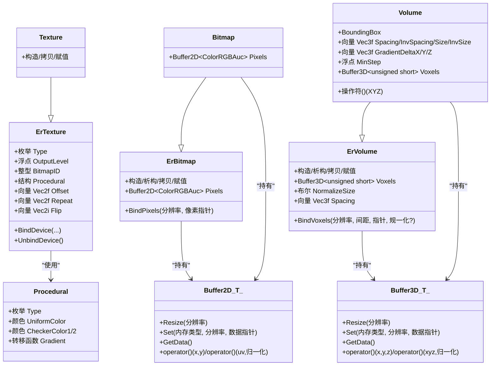
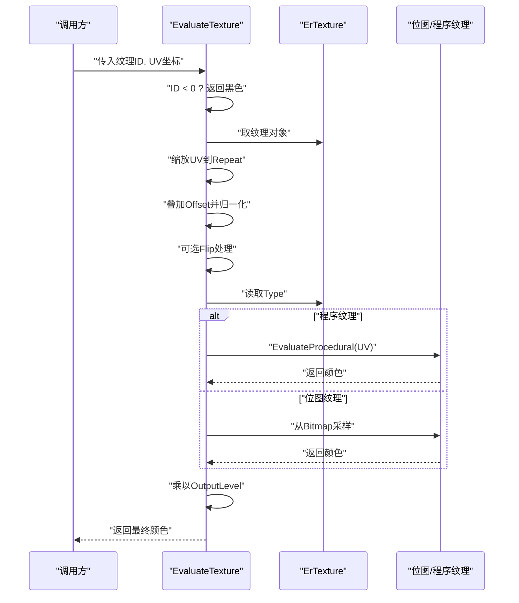
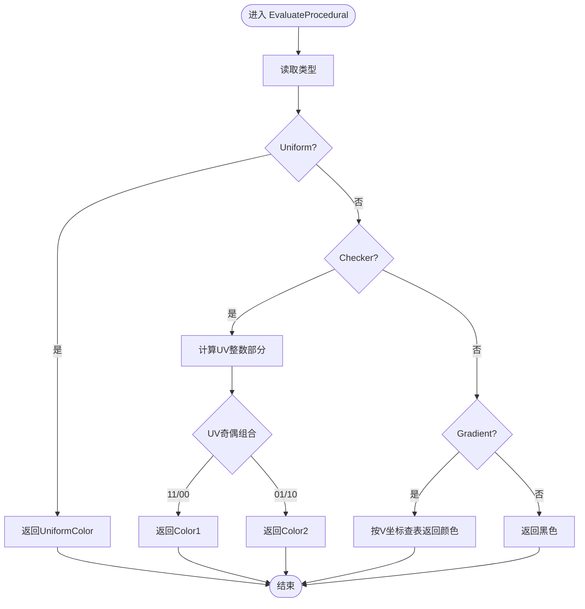
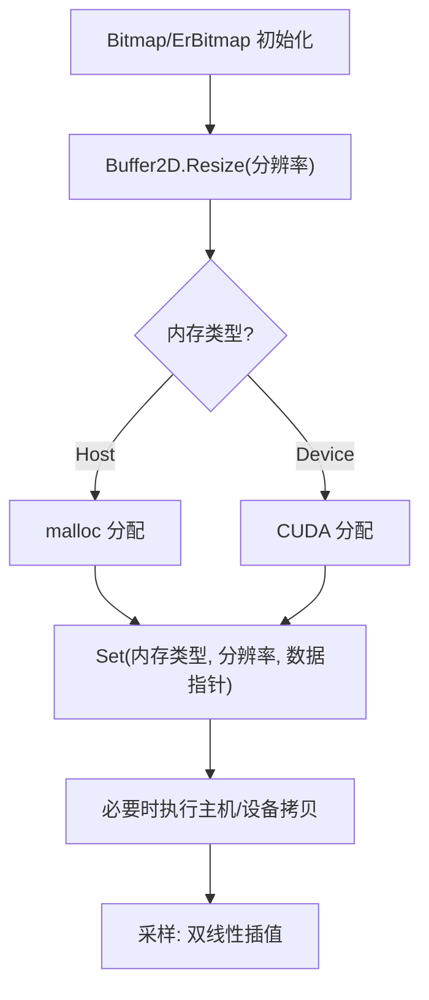
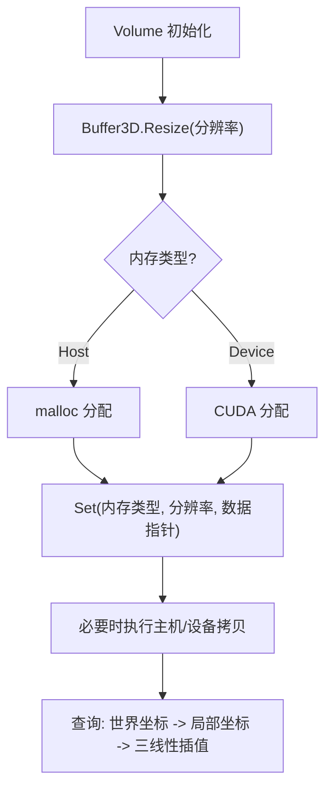
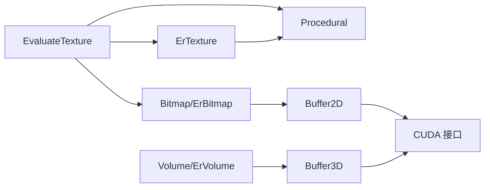

# 纹理管理

<cite>
**本文引用的文件**
- [texture.h](file://Source/texture.h)
- [textures.h](file://Source/textures.h)
- [bitmap.h](file://Source/bitmap.h)
- [procedural.h](file://Source/procedural.h)
- [volume.h](file://Source/volume.h)
- [ertexture.h](file://Source/ertexture.h)
- [erbitmap.h](file://Source/erbitmap.h)
- [ervolume.h](file://Source/ervolume.h)
- [enums.h](file://Source/enums.h)
- [buffer.h](file://Source/buffer.h)
- [buffer2d.h](file://Source/buffer2d.h)
- [buffer3d.h](file://Source/buffer3d.h)
</cite>

## 目录
1. [简介](#简介)
2. [项目结构](#项目结构)
3. [核心组件](#核心组件)
4. [架构总览](#架构总览)
5. [详细组件分析](#详细组件分析)
6. [依赖分析](#依赖分析)
7. [性能考虑](#性能考虑)
8. [故障排查指南](#故障排查指南)
9. [结论](#结论)
10. [附录](#附录)

## 简介
本文件系统性阐述该代码库中的纹理管理系统：涵盖纹理数据的存储格式、采样方法与缓存策略；说明位图纹理、程序纹理与体积纹理的处理流程；记录纹理的加载、绑定与内存管理机制；解释与渲染管线的集成关系及采样器配置要点，并提供常见纹理问题的诊断与解决建议。内容兼顾初学者易懂与资深开发者所需的技术深度。

## 项目结构
围绕纹理管理的关键源文件组织如下：
- 纹理类型与接口层：ErTexture（纹理抽象）、Texture（主机包装）
- 位图与像素缓冲：ErBitmap（主机位图）、Bitmap（设备位图）、Buffer2D（二维缓冲）
- 程序纹理：Procedural（程序纹理参数）
- 体积纹理：ErVolume（主机体积）、Volume（设备体积）、Buffer3D（三维缓冲）
- 枚举与通用缓冲：enums.h、buffer.h、buffer2d.h、buffer3d.h
- 纹理采样与评估：textures.h 中的 EvaluateTexture/EvaluateProcedural

**图表来源**
- [ertexture.h:27-82](file://Source/ertexture.h#L27-L82)
- [texture.h:26-45](file://Source/texture.h#L26-L45)
- [erbitmap.h:28-61](file://Source/erbitmap.h#L28-L61)
- [bitmap.h:27-74](file://Source/bitmap.h#L27-L74)
- [ervolume.h:28-74](file://Source/ervolume.h#L28-L74)
- [volume.h:26-150](file://Source/volume.h#L26-L150)
- [procedural.h:27-60](file://Source/procedural.h#L27-L60)
- [buffer2d.h:26-263](file://Source/buffer2d.h#L26-L263)
- [buffer3d.h:26-251](file://Source/buffer3d.h#L26-L251)
- [buffer.h:27-121](file://Source/buffer.h#L27-L121)

**章节来源**
- [texture.h:26-45](file://Source/texture.h#L26-L45)
- [textures.h:26-111](file://Source/textures.h#L26-L111)
- [bitmap.h:27-74](file://Source/bitmap.h#L27-L74)
- [procedural.h:27-60](file://Source/procedural.h#L27-L60)
- [volume.h:26-150](file://Source/volume.h#L26-L150)
- [ertexture.h:27-82](file://Source/ertexture.h#L27-L82)
- [erbitmap.h:28-61](file://Source/erbitmap.h#L28-L61)
- [ervolume.h:28-74](file://Source/ervolume.h#L28-L74)
- [enums.h:24-110](file://Source/enums.h#L24-L110)
- [buffer.h:27-121](file://Source/buffer.h#L27-L121)
- [buffer2d.h:26-263](file://Source/buffer2d.h#L26-L263)
- [buffer3d.h:26-251](file://Source/buffer3d.h#L26-L251)

## 核心组件
- 纹理抽象与主机包装
  - ErTexture：定义纹理类型、输出增益、位图ID、程序纹理参数、平移/重复/翻转等属性，并提供设备端绑定接口。
  - Texture：继承自 ErTexture 的主机侧包装类，便于统一管理与赋值。
- 位图与像素缓冲
  - ErBitmap：主机侧位图，持有主机侧二维颜色缓冲，支持绑定外部像素数据。
  - Bitmap：设备侧位图，持有设备侧二维颜色缓冲，用于GPU采样。
  - Buffer2D：通用二维缓冲模板，负责主机/设备内存分配、拷贝与重置。
- 程序纹理
  - Procedural：描述均匀、棋盘、梯度等程序纹理类型及其参数，用于实时生成颜色。
- 体积纹理
  - ErVolume：主机侧体积数据，绑定主机侧三维缓冲与间距信息。
  - Volume：设备侧体积数据，持有设备侧三维缓冲，提供体素查询与边界盒等辅助信息。
  - Buffer3D：通用三维缓冲模板，负责主机/设备内存分配、拷贝与重置。
- 采样与评估
  - EvaluateTexture：根据纹理ID与UV坐标进行采样，支持程序纹理与位图纹理，应用重复、偏移、翻转与输出增益。
  - EvaluateProcedural：按程序纹理类型计算颜色值。

**章节来源**
- [ertexture.h:27-82](file://Source/ertexture.h#L27-L82)
- [texture.h:26-45](file://Source/texture.h#L26-L45)
- [erbitmap.h:28-61](file://Source/erbitmap.h#L28-L61)
- [bitmap.h:27-74](file://Source/bitmap.h#L27-L74)
- [ervolume.h:28-74](file://Source/ervolume.h#L28-L74)
- [volume.h:26-150](file://Source/volume.h#L26-L150)
- [procedural.h:27-60](file://Source/procedural.h#L27-L60)
- [buffer2d.h:26-263](file://Source/buffer2d.h#L26-L263)
- [buffer3d.h:26-251](file://Source/buffer3d.h#L26-L251)
- [textures.h:26-111](file://Source/textures.h#L26-L111)

## 架构总览
纹理系统采用“主机侧数据 + 设备侧采样”的分层设计：
- 主机侧负责数据装载、参数配置与资源绑定（如位图像素、体积数据）。
- 设备侧负责纹理采样与体积查询，通过缓冲模板在主机/设备间高效传输。
- 枚举类型统一了纹理类型、程序纹理类型与内存类型，保证跨模块一致性。

**图表来源**
- [ertexture.h:27-82](file://Source/ertexture.h#L27-L82)
- [texture.h:26-45](file://Source/texture.h#L26-L45)
- [erbitmap.h:28-61](file://Source/erbitmap.h#L28-L61)
- [bitmap.h:27-74](file://Source/bitmap.h#L27-L74)
- [ervolume.h:28-74](file://Source/ervolume.h#L28-L74)
- [volume.h:26-150](file://Source/volume.h#L26-L150)
- [procedural.h:27-60](file://Source/procedural.h#L27-L60)
- [buffer2d.h:26-263](file://Source/buffer2d.h#L26-L263)
- [buffer3d.h:26-251](file://Source/buffer3d.h#L26-L251)

## 详细组件分析

### 纹理采样与评估流程
EvaluateTexture 负责根据纹理ID与UV坐标执行采样，流程包括：
- 参数校验与ID有效性检查
- 应用重复、偏移与翻转
- 根据纹理类型选择程序纹理或位图采样
- 应用输出增益并返回颜色

**图表来源**
- [textures.h:64-111](file://Source/textures.h#L64-L111)
- [ertexture.h:75-81](file://Source/ertexture.h#L75-L81)
- [bitmap.h](file://Source/bitmap.h#L73)
- [procedural.h:27-60](file://Source/procedural.h#L27-L60)

**章节来源**
- [textures.h:64-111](file://Source/textures.h#L64-L111)
- [ertexture.h:75-81](file://Source/ertexture.h#L75-L81)

### 程序纹理生成
程序纹理支持均匀、棋盘与梯度三种类型：
- 均匀：直接返回均匀颜色
- 棋盘：基于UV坐标的整数部分奇偶性切换两种颜色
- 梯度：使用一维转移函数按V坐标插值

**图表来源**
- [textures.h:26-62](file://Source/textures.h#L26-L62)
- [procedural.h:55-59](file://Source/procedural.h#L55-L59)

**章节来源**
- [textures.h:26-62](file://Source/textures.h#L26-L62)
- [procedural.h:27-60](file://Source/procedural.h#L27-L60)

### 位图纹理采样与内存管理
- 位图数据通过 ErBitmap/Bitmap 持有二维缓冲，支持主机/设备两端。
- Buffer2D 提供 Set/Resize/MemCopy 等能力，确保在主机与设备之间高效传输。
- 采样时支持双线性插值，按UV坐标归一化后进行四邻域插值。

**图表来源**
- [erbitmap.h:55-58](file://Source/erbitmap.h#L55-L58)
- [bitmap.h](file://Source/bitmap.h#L73)
- [buffer2d.h:125-198](file://Source/buffer2d.h#L125-L198)
- [textures.h:101-107](file://Source/textures.h#L101-L107)

**章节来源**
- [erbitmap.h:28-61](file://Source/erbitmap.h#L28-L61)
- [bitmap.h:27-74](file://Source/bitmap.h#L27-L74)
- [buffer2d.h:26-263](file://Source/buffer2d.h#L26-L263)
- [textures.h:101-107](file://Source/textures.h#L101-L107)

### 体积纹理采样与内存管理
- 体积数据通过 ErVolume/Volume 持有三维缓冲，支持主机/设备两端。
- Buffer3D 提供 Set/Resize/MemCopy 等能力，支持三线性插值采样。
- 体积查询时先将世界坐标映射到体素局部坐标，再进行三线性插值。

**图表来源**
- [ervolume.h:63-69](file://Source/ervolume.h#L63-L69)
- [volume.h:131-138](file://Source/volume.h#L131-L138)
- [buffer3d.h:125-198](file://Source/buffer3d.h#L125-L198)

**章节来源**
- [ervolume.h:28-74](file://Source/ervolume.h#L28-L74)
- [volume.h:26-150](file://Source/volume.h#L26-L150)
- [buffer3d.h:26-251](file://Source/buffer3d.h#L26-L251)

### 纹理类型与枚举
- 纹理类型：程序纹理、位图纹理
- 程序纹理类型：均匀、棋盘、梯度
- 内存类型：主机、设备

这些枚举贯穿纹理、位图与体积模块，确保类型安全与行为一致。

**章节来源**
- [enums.h:39-50](file://Source/enums.h#L39-L50)
- [enums.h:39-44](file://Source/enums.h#L39-L44)
- [enums.h:26-37](file://Source/enums.h#L26-L37)

## 依赖分析
- 组件耦合
  - ErTexture 依赖 Procedural 与枚举类型，用于程序纹理参数与类型判断。
  - Bitmap/ErBitmap 依赖 Buffer2D，Volume/ErVolume 依赖 Buffer3D。
  - EvaluateTexture 依赖全局纹理数组与位图数组，体现集中式纹理管理。
- 外部依赖
  - CUDA 内存分配/拷贝接口由 Buffer2D/Buffer3D 封装调用。
- 潜在循环依赖
  - 当前结构未见直接循环；EvaluateTexture 使用全局数组访问纹理/位图，属于集中式管理策略。

**图表来源**
- [textures.h:64-111](file://Source/textures.h#L64-L111)
- [ertexture.h:75-81](file://Source/ertexture.h#L75-L81)
- [bitmap.h](file://Source/bitmap.h#L73)
- [procedural.h:55-59](file://Source/procedural.h#L55-L59)
- [buffer2d.h:180-195](file://Source/buffer2d.h#L180-L195)
- [buffer3d.h:186-194](file://Source/buffer3d.h#L186-L194)

**章节来源**
- [textures.h:64-111](file://Source/textures.h#L64-L111)
- [buffer2d.h:180-195](file://Source/buffer2d.h#L180-L195)
- [buffer3d.h:186-194](file://Source/buffer3d.h#L186-L194)

## 性能考虑
- 采样路径优化
  - 程序纹理 EvaluateProcedural 仅做简单分支与查表，开销低。
  - 位图/体积采样采用双线性/三线性插值，建议在CPU端预热与复用采样结果，减少重复计算。
- 内存带宽
  - Buffer2D/Buffer3D 在 Set/Resize 时进行主机/设备拷贝，应避免频繁小块更新；尽量批量传输。
  - 设备侧纹理/体积数据尽量驻留GPU，减少反复迁移。
- 缓存策略
  - 集中式纹理数组访问（EvaluateTexture）在高并发下可能成为热点，建议：
    - 对常用纹理建立L1/L2缓存索引
    - 合理设置重复/偏移，降低边界重复带来的额外采样
- 纹理尺寸
  - 位图/体积分辨率越高，内存占用与采样成本越大；建议按需降采样或分层Mipmap（若扩展支持）。

[本节为通用性能建议，不直接分析具体文件]

## 故障排查指南
- 采样结果异常
  - 检查纹理ID是否有效（EvaluateTexture 对负ID返回黑色）
  - 核对重复/偏移/翻转参数是否符合预期
  - 确认程序纹理类型与参数正确（均匀/棋盘/梯度）
- 内存相关错误
  - Buffer2D/Buffer3D 在 Free/Resize 时会释放主机/设备内存，确认调用顺序与分辨率设置
  - Set 时注意内存类型匹配（主机↔设备），避免非法拷贝
- 体积采样越界
  - 体积查询前确保坐标已映射到局部空间，且分辨率非零
- GPU内存不足
  - 检查 Buffer2D/Buffer3D 的内存大小与设备显存容量，必要时降低分辨率或关闭不必要的纹理/体积

**章节来源**
- [textures.h:64-111](file://Source/textures.h#L64-L111)
- [buffer2d.h:67-198](file://Source/buffer2d.h#L67-L198)
- [buffer3d.h:67-198](file://Source/buffer3d.h#L67-L198)
- [volume.h:131-138](file://Source/volume.h#L131-L138)

## 结论
该纹理管理系统以 ErTexture/ErBitmap/ErVolume 为核心抽象，结合 Buffer2D/Buffer3D 实现主机/设备内存管理与高效传输；EvaluateTexture/EvaluateProcedural 提供统一的采样入口与程序纹理生成逻辑。通过枚举类型与模板缓冲，系统在类型安全与性能之间取得平衡。建议在工程实践中进一步完善纹理缓存与批量化传输策略，以提升大规模场景下的运行效率。

[本节为总结性内容，不直接分析具体文件]

## 附录
- 关键API与职责速览
  - ErTexture：纹理抽象与设备绑定
  - Texture：主机侧包装
  - ErBitmap/Bitmap：位图数据与采样
  - ErVolume/Volume：体积数据与采样
  - Buffer2D/Buffer3D：二维/三维缓冲与内存管理
  - EvaluateTexture/EvaluateProcedural：纹理采样与程序纹理生成

[本节为概览性内容，不直接分析具体文件]