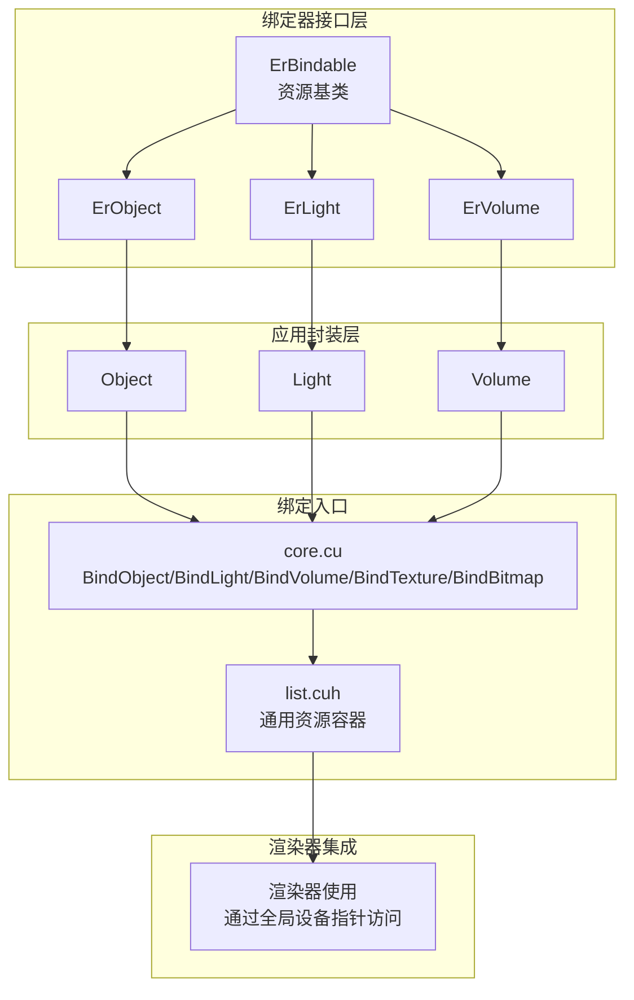
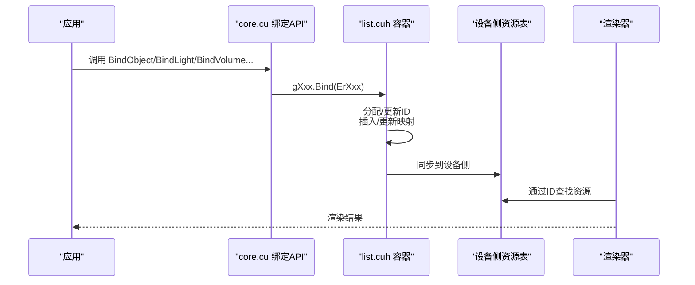
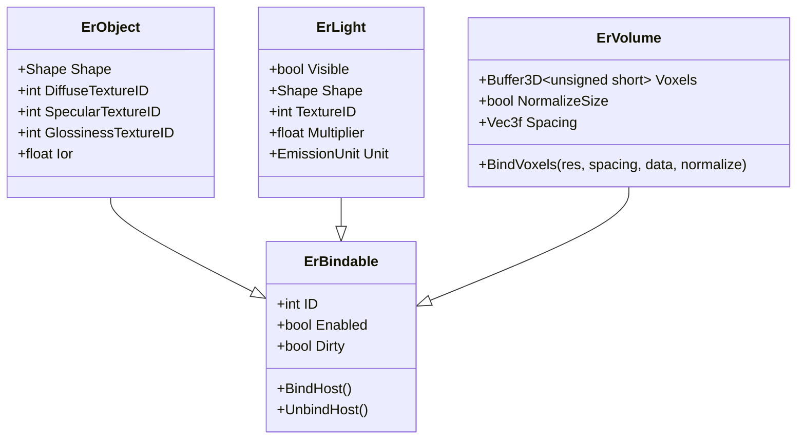
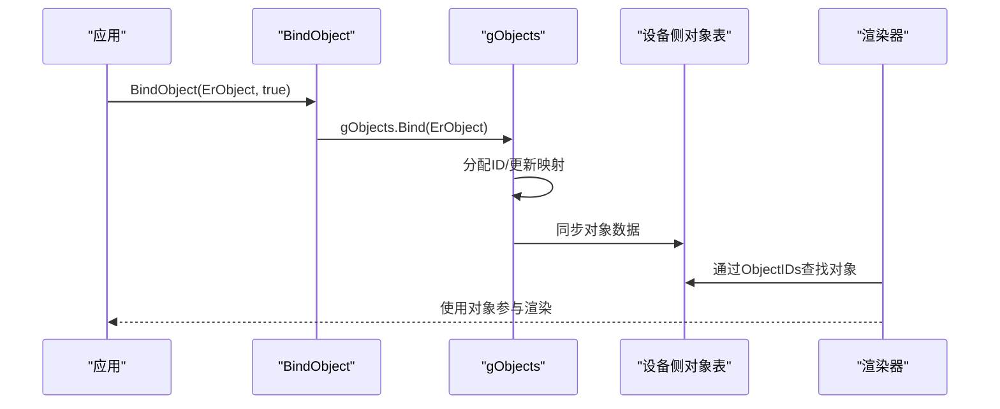
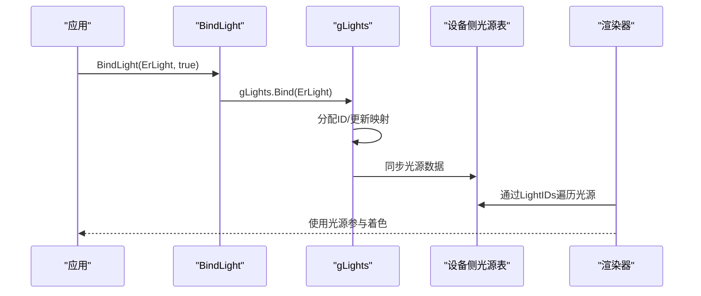
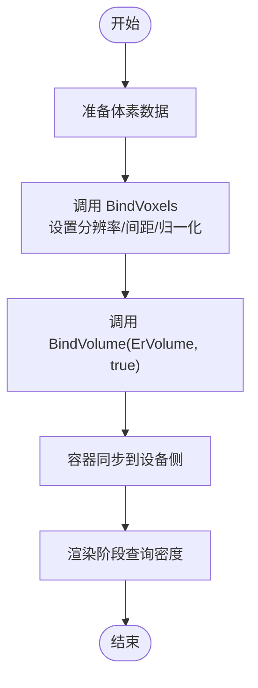
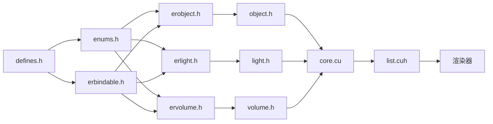

# 绑定器接口

<cite>
**本文引用的文件**
- [erbindable.h](file://Source/erbindable.h)
- [erobject.h](file://Source/erobject.h)
- [erlight.h](file://Source/erlight.h)
- [ervolume.h](file://Source/ervolume.h)
- [object.h](file://Source/object.h)
- [light.h](file://Source/light.h)
- [volume.h](file://Source/volume.h)
- [enums.h](file://Source/enums.h)
- [defines.h](file://Source/defines.h)
- [exception.h](file://Source/exception.h)
- [buffer3d.h](file://Source/buffer3d.h)
- [shape.h](file://Source/shape.h)
- [core.cu](file://Source/core.cu)
- [list.cuh](file://Source/list.cuh)
- [lights.h](file://Source/lights.h)
- [transport.h](file://Source/transport.h)
</cite>

## 目录
1. [简介](#简介)
2. [项目结构](#项目结构)
3. [核心组件](#核心组件)
4. [架构总览](#架构总览)
5. [详细组件分析](#详细组件分析)
6. [依赖分析](#依赖分析)
7. [性能考虑](#性能考虑)
8. [故障排查指南](#故障排查指南)
9. [结论](#结论)
10. [附录](#附录)

## 简介
本文件系统性阐述绑定器接口体系，围绕 ErBindable 基类的设计模式与资源绑定机制展开，覆盖对象、光源、体积等资源类型的绑定实现；说明绑定接口定义、生命周期管理与错误处理策略；解释与渲染管线的集成关系及资源查找机制；并提供常见绑定问题的诊断与解决建议。文档兼顾初学者可读性与资深开发者所需的技术深度。

## 项目结构
绑定器接口体系由“基础绑定类型 + 具体资源类型 + 绑定入口 + 资源容器 + 渲染器集成”构成：
- 基础绑定类型：ErBindable（统一的资源标识、启用状态、脏标记）
- 具体资源类型：ErObject、ErLight、ErVolume 及其上层封装 Object、Light、Volume
- 绑定入口：core.cu 中的 BindObject/BindLight/BindVolume/BindTexture/BindBitmap 等对外 API
- 资源容器：list.cuh 提供的通用列表容器，负责资源注册、ID 分配、同步
- 渲染器集成：渲染阶段通过全局设备指针访问已绑定资源，按 ID 查找并参与计算

图表来源
- [erbindable.h:28-68](file://Source/erbindable.h#L28-L68)
- [erobject.h:27-67](file://Source/erobject.h#L27-L67)
- [erlight.h:27-66](file://Source/erlight.h#L27-L66)
- [ervolume.h:28-74](file://Source/ervolume.h#L28-L74)
- [object.h:26-45](file://Source/object.h#L26-L45)
- [light.h:26-46](file://Source/light.h#L26-L46)
- [volume.h:26-150](file://Source/volume.h#L26-L150)
- [core.cu:40-124](file://Source/core.cu#L40-L124)
- [list.cuh:49-116](file://Source/list.cuh#L49-L116)

章节来源
- [erbindable.h:28-68](file://Source/erbindable.h#L28-L68)
- [core.cu:40-124](file://Source/core.cu#L40-L124)
- [list.cuh:49-116](file://Source/list.cuh#L49-L116)

## 核心组件
- ErBindable：所有可绑定资源的抽象基类，提供统一的 ID、Enabled、Dirty 字段，以及 BindHost/UnbindHost 接口占位，便于派生类扩展具体绑定行为。
- ErObject：继承自 ErBindable，增加几何形状、材质纹理 ID 与折射率等属性，用于场景对象的材质与几何描述。
- ErLight：继承自 ErBindable，包含可见性、几何形状、纹理 ID、辐射度乘数与单位等，用于光源描述。
- ErVolume：继承自 ErBindable，包含体数据缓冲区、归一化尺寸标志与体元间距等，用于体积数据的绑定与查询。
- 上层封装：Object/Light/Volume 在 ErObject/ErLight/ErVolume 基础上进行进一步封装，满足渲染器直接使用的语义。

章节来源
- [erbindable.h:28-68](file://Source/erbindable.h#L28-L68)
- [erobject.h:27-67](file://Source/erobject.h#L27-L67)
- [erlight.h:27-66](file://Source/erlight.h#L27-L66)
- [ervolume.h:28-74](file://Source/ervolume.h#L28-L74)
- [object.h:26-45](file://Source/object.h#L26-L45)
- [light.h:26-46](file://Source/light.h#L26-L46)
- [volume.h:26-150](file://Source/volume.h#L26-L150)

## 架构总览
绑定器接口通过“资源类型 → 绑定入口 → 容器 → 渲染器”的链路工作：
- 资源类型：ErObject/ErLight/ErVolume 等承载数据与属性
- 绑定入口：core.cu 暴露 BindObject/BindLight/BindVolume/BindTexture/BindBitmap 等函数
- 容器：list.cuh 的 List 模板类负责资源注册、ID 分配、存在性检查、同步
- 渲染器：在渲染阶段通过全局设备指针访问已绑定资源，按 ID 查询并参与计算

图表来源
- [core.cu:66-124](file://Source/core.cu#L66-L124)
- [list.cuh:59-106](file://Source/list.cuh#L59-L106)

章节来源
- [core.cu:66-124](file://Source/core.cu#L66-L124)
- [list.cuh:59-106](file://Source/list.cuh#L59-L106)

## 详细组件分析

### ErBindable 基类设计与生命周期
- 设计要点
  - 统一标识：ID 作为资源唯一索引，初始化为无效值，由容器分配
  - 运行时控制：Enabled 控制资源是否参与渲染，Dirty 标记数据变更以触发同步
  - 接口占位：BindHost/UnbindHost 为未来扩展预留，当前容器负责底层绑定细节
- 生命周期
  - 构造：初始化 ID=-1、Enabled=true、Dirty=false
  - 复制：浅拷贝字段，保持 ID 独立性
  - 绑定：通过容器分配 ID 并注册，随后由容器同步至设备侧
  - 解绑：从容器移除并释放映射，必要时同步清理
- 错误处理
  - 容器在绑定/解绑失败时记录日志并返回，避免崩溃
  - 异常类型：Exception 封装级别与消息，配合日志定位问题

图表来源
- [erbindable.h:28-68](file://Source/erbindable.h#L28-L68)
- [erobject.h:27-67](file://Source/erobject.h#L27-L67)
- [erlight.h:27-66](file://Source/erlight.h#L27-L66)
- [ervolume.h:28-74](file://Source/ervolume.h#L28-L74)

章节来源
- [erbindable.h:28-68](file://Source/erbindable.h#L28-L68)
- [exception.h:27-55](file://Source/exception.h#L27-L55)

### 对象绑定（ErObject → Object）
- 关键点
  - ErObject 承载几何形状与材质纹理 ID、折射率等
  - Object 作为上层封装，简化构造与赋值
  - 绑定时，容器分配 ID 并注册；解绑时移除映射
- 使用流程
  - 创建 Object 实例，设置 Shape 与纹理 ID
  - 调用 BindObject(ErObject, true/false) 完成绑定或解绑
  - 渲染阶段通过 Tracer 的 ObjectIDs 映射访问对应对象

图表来源
- [object.h:26-45](file://Source/object.h#L26-L45)
- [erobject.h:27-67](file://Source/erobject.h#L27-L67)
- [core.cu:86-94](file://Source/core.cu#L86-L94)
- [list.cuh:59-83](file://Source/list.cuh#L59-L83)

章节来源
- [object.h:26-45](file://Source/object.h#L26-L45)
- [erobject.h:27-67](file://Source/erobject.h#L27-L67)
- [core.cu:86-94](file://Source/core.cu#L86-L94)
- [list.cuh:59-83](file://Source/list.cuh#L59-L83)

### 光源绑定（ErLight → Light）
- 关键点
  - ErLight 描述可见性、形状、纹理 ID、辐射度乘数与单位
  - Light 在赋值时调用 Shape.Update() 更新面积等派生属性
  - 绑定后可通过 Tracer 的 LightIDs 访问光源集合
- 使用流程
  - 创建 Light 实例，配置 Shape 与纹理参数
  - 调用 BindLight(ErLight, true/false) 完成绑定或解绑
  - 渲染阶段在光照采样与阴影检测中使用

图表来源
- [light.h:26-46](file://Source/light.h#L26-L46)
- [erlight.h:27-66](file://Source/erlight.h#L27-L66)
- [core.cu:76-84](file://Source/core.cu#L76-L84)
- [list.cuh:59-83](file://Source/list.cuh#L59-L83)

章节来源
- [light.h:26-46](file://Source/light.h#L26-L46)
- [erlight.h:27-66](file://Source/erlight.h#L27-L66)
- [core.cu:76-84](file://Source/core.cu#L76-L84)
- [list.cuh:59-83](file://Source/list.cuh#L59-L83)

### 体积绑定（ErVolume → Volume）
- 关键点
  - ErVolume 提供 BindVoxels 接口绑定体素数据，设置分辨率、间距与归一化选项
  - Volume 在赋值时根据体素分辨率与间距计算物理尺寸、最小步长与梯度增量
  - 渲染阶段通过 VolumeID 与 TransferFunction 计算体积积分
- 使用流程
  - 准备体素数据，调用 ErVolume::BindVoxels 设置分辨率与间距
  - 调用 BindVolume(ErVolume, true/false) 完成绑定或解绑
  - 渲染阶段通过 Volume::operator() 查询体素密度

图表来源
- [ervolume.h:63-74](file://Source/ervolume.h#L63-L74)
- [volume.h:100-129](file://Source/volume.h#L100-L129)
- [core.cu:66-74](file://Source/core.cu#L66-L74)
- [list.cuh:59-83](file://Source/list.cuh#L59-L83)

章节来源
- [ervolume.h:63-74](file://Source/ervolume.h#L63-L74)
- [volume.h:100-129](file://Source/volume.h#L100-L129)
- [core.cu:66-74](file://Source/core.cu#L66-L74)
- [list.cuh:59-83](file://Source/list.cuh#L59-L83)

### 纹理与位图绑定
- ErTexture/ErBitmap 提供纹理与位图数据绑定能力，通过 BindTexture/BindBitmap 完成注册与同步
- 渲染阶段通过纹理 ID 在光照与材质评估中采样颜色

章节来源
- [core.cu:106-124](file://Source/core.cu#L106-L124)

### 形状与材质属性
- Shape 类型与面积计算：支持平面、圆盘、环形、盒子、球体、圆柱等，用于光源与对象的几何描述
- 材质属性：反射/透射参数、纹理 ID 等在 ErObject 中体现

章节来源
- [shape.h:57-113](file://Source/shape.h#L57-L113)
- [erobject.h:62-66](file://Source/erobject.h#L62-L66)

### 渲染器集成与资源查找
- 渲染器通过 Tracer 的 LightIDs/ObjectIDs/VolumeID 等索引访问绑定资源
- 光照模块根据 LightIDs 遍历光源并执行相交与采样
- 传输与着色模块依据 VolumeID 与 TransferFunction 计算体积贡献

章节来源
- [lights.h:90-133](file://Source/lights.h#L90-L133)
- [transport.h:30-143](file://Source/transport.h#L30-L143)
- [ertracer.h:93-119](file://Source/ertracer.h#L93-L119)

## 依赖分析
- 组件耦合
  - ErObject/ErLight/ErVolume 与 ErBindable 强耦合，继承带来稳定的资源标识与生命周期
  - 上层封装（Object/Light/Volume）仅做语义增强，不改变绑定协议
- 容器与渲染器
  - list.cuh 的 List 模板类是绑定的核心基础设施，负责 ID 分配、存在性检查与同步
  - 渲染器通过全局设备指针访问容器，按 ID 快速定位资源
- 外部依赖
  - defines.h 提供 HOST/DEVICE 宏与数学常量，支撑跨主机/设备编译
  - enums.h 定义内存类型、形状类型、发射单位等枚举，统一资源语义

图表来源
- [defines.h:37-114](file://Source/defines.h#L37-L114)
- [enums.h:24-111](file://Source/enums.h#L24-L111)
- [erbindable.h:25-68](file://Source/erbindable.h#L25-L68)
- [erobject.h:21-67](file://Source/erobject.h#L21-L67)
- [erlight.h:21-66](file://Source/erlight.h#L21-L66)
- [ervolume.h:21-74](file://Source/ervolume.h#L21-L74)
- [object.h:21-45](file://Source/object.h#L21-L45)
- [light.h:21-46](file://Source/light.h#L21-L46)
- [volume.h:25-150](file://Source/volume.h#L25-L150)
- [core.cu:40-124](file://Source/core.cu#L40-L124)
- [list.cuh:49-116](file://Source/list.cuh#L49-L116)

章节来源
- [defines.h:37-114](file://Source/defines.h#L37-L114)
- [enums.h:24-111](file://Source/enums.h#L24-L111)
- [core.cu:40-124](file://Source/core.cu#L40-L124)

## 性能考虑
- 数据同步开销
  - 容器在绑定/解绑时进行同步，频繁调用会引入 CPU/GPU 同步成本；应批量操作并减少不必要的重复绑定
- 内存布局与带宽
  - 体积数据采用 3D 缓冲区，分辨率越高内存占用越大；合理设置分辨率与间距可降低带宽压力
- 脏标记优化
  - ErBindable 的 Dirty 标志用于指示数据变更；容器在复制赋值时重置 Dirty，避免无谓同步
- CUDA 设备内存管理
  - Buffer3D 支持主机/设备内存切换，注意在设备侧读取前确保数据已同步

章节来源
- [buffer3d.h:52-198](file://Source/buffer3d.h#L52-L198)
- [ervolume.h:63-74](file://Source/ervolume.h#L63-L74)
- [list.cuh:52-65](file://Source/list.cuh#L52-L65)

## 故障排查指南
- 绑定失败
  - 现象：日志提示“max. no. items reached”或“resource item with ID:... does not exist”
  - 原因：达到最大资源数量限制；尝试解绑后再绑定；确认 ID 是否有效
  - 处理：调用 Unbind 对应资源释放 ID；检查是否存在重复绑定
- 无法找到资源
  - 现象：渲染阶段按 ID 查不到对象/光源/体积
  - 原因：未正确绑定或 ID 未同步到设备侧
  - 处理：确保调用 BindXXX 并等待容器同步；核对 Tracer 的索引映射
- 体积数据异常
  - 现象：渲染出现噪声或空白区域
  - 原因：分辨率/间距设置不当、未设置归一化或数据越界
  - 处理：检查 BindVoxels 参数；确认体素数据范围与插值边界条件
- 材质/纹理无效
  - 现象：对象表面颜色异常
  - 原因：纹理 ID 未绑定或未同步
  - 处理：先绑定纹理再绑定对象；确认纹理缓冲区已设置

章节来源
- [list.cuh:49-106](file://Source/list.cuh#L49-L106)
- [core.cu:66-124](file://Source/core.cu#L66-L124)
- [ervolume.h:63-74](file://Source/ervolume.h#L63-L74)

## 结论
绑定器接口体系以 ErBindable 为核心，通过统一的 ID/Enabled/Dirty 协议与容器化的资源管理，实现了对象、光源、体积、纹理等资源的标准化绑定与高效访问。结合渲染器的索引映射机制，系统在保证易用性的同时提供了良好的扩展性与性能表现。遵循本文的绑定流程、生命周期管理与故障排查建议，可显著提升开发效率与稳定性。

## 附录
- 关键枚举与宏
  - 内存类型：Host/Device
  - 形状类型：Plane/Disk/Ring/Box/Sphere/Cylinder
  - 发射单位：Power/Lux/Intensity
  - 编译宏：HOST/DEVICE/HOST_DEVICE 等

章节来源
- [enums.h:24-111](file://Source/enums.h#L24-L111)
- [defines.h:37-114](file://Source/defines.h#L37-L114)