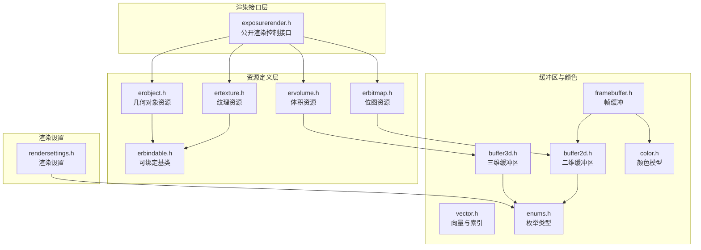
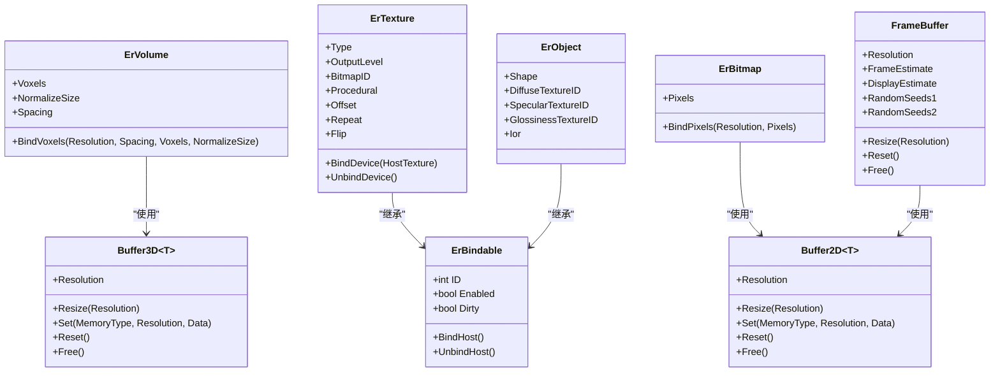
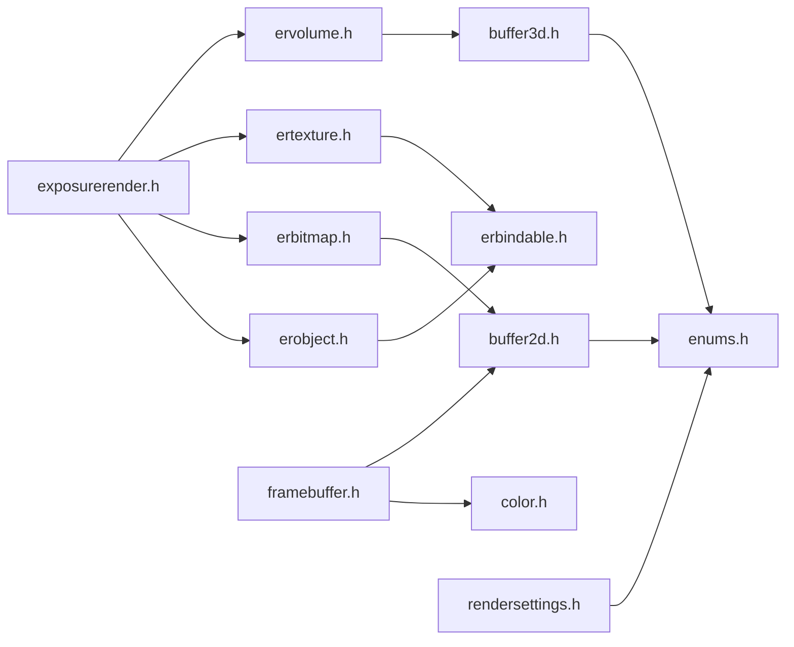

# 资源管理系统

<cite>
**本文引用的文件**
- [README.md](file://README.md)
- [exposurerender.h](file://Source/exposurerender.h)
- [exposurerender.cpp](file://Source/exposurerender.cpp)
- [rendersettings.h](file://Source/rendersettings.h)
- [framebuffer.h](file://Source/framebuffer.h)
- [buffer2d.h](file://Source/buffer2d.h)
- [buffer3d.h](file://Source/buffer3d.h)
- [erbitmap.h](file://Source/erbitmap.h)
- [ertexture.h](file://Source/ertexture.h)
- [ervolume.h](file://Source/ervolume.h)
- [erobject.h](file://Source/erobject.h)
- [erbindable.h](file://Source/erbindable.h)
- [color.h](file://Source/color.h)
- [vector.h](file://Source/vector.h)
- [enums.h](file://Source/enums.h)
</cite>

## 目录
1. [简介](#简介)
2. [项目结构](#项目结构)
3. [核心组件](#核心组件)
4. [架构总览](#架构总览)
5. [详细组件分析](#详细组件分析)
6. [依赖分析](#依赖分析)
7. [性能考虑](#性能考虑)
8. [故障排查指南](#故障排查指南)
9. [结论](#结论)
10. [附录](#附录)

## 简介
本资源管理系统是基于 CUDA 的交互式真实感体积渲染框架的一部分，负责管理渲染过程中的各类资源（如体积数据、纹理、位图、帧缓冲等），并提供绑定、解绑、尺寸调整与内存分配等能力。系统通过统一的可绑定基类与模板化缓冲区抽象，实现了主机与设备之间的高效数据传输与生命周期管理。

## 项目结构
该仓库采用按功能域划分的头文件组织方式，核心资源类型集中在 Source 目录下，配合渲染设置、颜色与向量等通用工具类，形成清晰的分层结构。

图表来源
- [exposurerender.h:1-45](file://Source/exposurerender.h#L1-L45)
- [ervolume.h:1-77](file://Source/ervolume.h#L1-L77)
- [ertexture.h:1-85](file://Source/ertexture.h#L1-L85)
- [erbitmap.h:1-64](file://Source/erbitmap.h#L1-L64)
- [erobject.h:1-70](file://Source/erobject.h#L1-L70)
- [buffer2d.h:1-289](file://Source/buffer2d.h#L1-L289)
- [buffer3d.h:1-254](file://Source/buffer3d.h#L1-L254)
- [framebuffer.h:1-108](file://Source/framebuffer.h#L1-L108)
- [rendersettings.h:1-134](file://Source/rendersettings.h#L1-L134)
- [color.h:1-287](file://Source/color.h#L1-L287)
- [vector.h:1-582](file://Source/vector.h#L1-L582)
- [enums.h:1-111](file://Source/enums.h#L1-L111)

章节来源
- [README.md:1-61](file://README.md#L1-L61)
- [exposurerender.h:1-45](file://Source/exposurerender.h#L1-L45)

## 核心组件
- 可绑定基类：提供资源标识、启用状态与脏标记，并声明主机/设备绑定接口，作为所有资源类型的共同基类。
- 体积资源：封装三维体数据与间距信息，支持主机侧绑定与规范化尺寸选项。
- 纹理资源：支持程序化纹理与位图纹理两种类型，包含输出等级、偏移、重复与翻转等参数。
- 位图资源：以二维像素缓冲承载图像数据，便于与纹理系统集成。
- 几何对象资源：封装形状与材质属性（漫反射、镜面反射、光泽度纹理与折射率）。
- 帧缓冲：管理渲染估计与显示估计的多通道缓冲，以及随机种子缓冲，支持分辨率变更与重置。
- 渲染设置：包含遍历与着色两大子设置，用于控制步长因子、阴影、密度缩放、梯度计算等。
- 颜色与向量：提供多种颜色空间转换与向量运算，支撑渲染管线的颜色处理与几何计算。
- 枚举：统一内存类型、纹理类型、形状类型、着色模式等语义。

章节来源
- [erbindable.h:1-71](file://Source/erbindable.h#L1-L71)
- [ervolume.h:1-77](file://Source/ervolume.h#L1-L77)
- [ertexture.h:1-85](file://Source/ertexture.h#L1-L85)
- [erbitmap.h:1-64](file://Source/erbitmap.h#L1-L64)
- [erobject.h:1-70](file://Source/erobject.h#L1-L70)
- [framebuffer.h:1-108](file://Source/framebuffer.h#L1-L108)
- [rendersettings.h:1-134](file://Source/rendersettings.h#L1-L134)
- [color.h:1-287](file://Source/color.h#L1-L287)
- [vector.h:1-582](file://Source/vector.h#L1-L582)
- [enums.h:1-111](file://Source/enums.h#L1-L111)

## 架构总览
资源管理遵循“可绑定基类 + 模板缓冲区”的设计，通过统一的接口完成主机与设备之间的数据传输与同步。渲染控制接口对外暴露绑定、渲染估计与查询等能力，内部则依赖资源与缓冲区完成渲染流程。

图表来源
- [erbindable.h:1-71](file://Source/erbindable.h#L1-L71)
- [ervolume.h:1-77](file://Source/ervolume.h#L1-L77)
- [ertexture.h:1-85](file://Source/ertexture.h#L1-L85)
- [erbitmap.h:1-64](file://Source/erbitmap.h#L1-L64)
- [erobject.h:1-70](file://Source/erobject.h#L1-L70)
- [buffer2d.h:1-289](file://Source/buffer2d.h#L1-L289)
- [buffer3d.h:1-254](file://Source/buffer3d.h#L1-L254)
- [framebuffer.h:1-108](file://Source/framebuffer.h#L1-L108)

## 详细组件分析

### 渲染控制接口（exposurerender）
- 绑定接口：将渲染器、体积、光源、对象、裁剪对象、纹理与位图与当前上下文进行绑定或解绑。
- 渲染估计：根据指定追踪器ID执行估计计算，并提供获取估计结果与自动对焦距离、迭代次数等查询接口。
- 设计要点：通过ID机制区分多个渲染实例；布尔参数控制绑定/解绑行为；查询接口返回运行时统计信息。

章节来源
- [exposurerender.h:1-45](file://Source/exposurerender.h#L1-L45)
- [exposurerender.cpp:1-24](file://Source/exposurerender.cpp#L1-L24)

### 资源基类（ErBindable）
- 职责：统一资源标识、启用状态与脏标记；定义主机/设备绑定虚函数，供派生类实现具体绑定逻辑。
- 使用模式：所有资源类型均继承自该基类，确保一致的生命周期管理与状态同步。

章节来源
- [erbindable.h:1-71](file://Source/erbindable.h#L1-L71)

### 体积资源（ErVolume）
- 数据绑定：通过绑定函数将主机侧的三维体素数据与间距信息传入，支持是否归一化尺寸的选项。
- 内存布局：使用三维缓冲区承载体数据，便于在设备端进行快速采样与插值。
- 参数说明：
  - Resolution：体数据的空间分辨率（Vec3i）。
  - Spacing：体素间距（Vec3f）。
  - Voxels：体数据指针（unsigned short*）。
  - NormalizeSize：是否对尺寸进行归一化（bool）。

章节来源
- [ervolume.h:1-77](file://Source/ervolume.h#L1-L77)
- [buffer3d.h:1-254](file://Source/buffer3d.h#L1-L254)

### 纹理资源（ErTexture）
- 类型选择：支持程序化纹理与位图纹理两种类型，通过枚举控制。
- 设备绑定：提供从主机纹理到设备的复制与解绑接口。
- 关键字段：
  - Type：纹理类型（枚举）。
  - OutputLevel：输出等级（float）。
  - BitmapID：位图ID（int）。
  - Procedural：程序化纹理参数（结构体）。
  - Offset/Repeat/Flip：纹理变换参数（Vec2f/Vec2i）。

章节来源
- [ertexture.h:1-85](file://Source/ertexture.h#L1-L85)
- [enums.h:1-111](file://Source/enums.h#L1-L111)

### 位图资源（ErBitmap）
- 像素绑定：将主机侧的RGBA像素数据绑定到二维缓冲区，便于后续纹理合成与渲染。
- 字段说明：
  - Pixels：二维缓冲区（Buffer2D<ColorRGBAuc>）。

章节来源
- [erbitmap.h:1-64](file://Source/erbitmap.h#L1-L64)
- [buffer2d.h:1-289](file://Source/buffer2d.h#L1-L289)
- [color.h:1-287](file://Source/color.h#L1-L287)

### 几何对象资源（ErObject）
- 形状与材质：封装形状与材质属性（漫反射、镜面反射、光泽度纹理与折射率）。
- 关键字段：
  - Shape：几何形状（结构体）。
  - DiffuseTextureID/SpecularTextureID/GlossinessTextureID：纹理ID（int）。
  - Ior：折射率（float）。

章节来源
- [erobject.h:1-70](file://Source/erobject.h#L1-L70)

### 帧缓冲（FrameBuffer）
- 多通道缓冲：包含帧估计、运行估计、显示估计及其临时与滤波版本，以及两套随机种子缓冲。
- 生命周期管理：支持按分辨率重建、重置与释放，确保在窗口大小变化或渲染参数更新时正确回收与分配内存。
- 关键字段：
  - Resolution：当前分辨率（Vec2i）。
  - FrameEstimate/DisplayEstimate 等：对应缓冲区对象。

章节来源
- [framebuffer.h:1-108](file://Source/framebuffer.h#L1-L108)
- [buffer2d.h:1-289](file://Source/buffer2d.h#L1-L289)
- [color.h:1-287](file://Source/color.h#L1-L287)

### 渲染设置（RenderSettings）
- 遍历设置（TraversalSettings）：控制主路径与阴影步长因子、阴影开关与最大阴影距离。
- 着色设置（ShadingSettings）：控制着色类型、密度缩放、透明度调制、梯度计算模式与阈值、因子等。
- 结构关系：RenderSettings 包含上述两个子设置对象，便于集中管理渲染参数。

章节来源
- [rendersettings.h:1-134](file://Source/rendersettings.h#L1-L134)
- [enums.h:1-111](file://Source/enums.h#L1-L111)

### 缓冲区与颜色/向量
- 二维/三维缓冲区：提供统一的分配、拷贝、重置与释放接口，支持主机与设备间的数据传输。
- 随机种子缓冲：按分辨率生成并绑定随机种子，用于蒙特卡洛采样。
- 颜色模型：提供RGB、XYZ、RGBA等颜色空间与相互转换，支持逐分量运算与亮度计算。
- 向量与索引：提供二维至四维向量、点积、叉积、长度等常用运算，以及索引容器。

章节来源
- [buffer2d.h:1-289](file://Source/buffer2d.h#L1-L289)
- [buffer3d.h:1-254](file://Source/buffer3d.h#L1-L254)
- [color.h:1-287](file://Source/color.h#L1-L287)
- [vector.h:1-582](file://Source/vector.h#L1-L582)
- [enums.h:1-111](file://Source/enums.h#L1-L111)

## 依赖分析
- 组件耦合：
  - 资源类型依赖于缓冲区模板类，以实现跨主机/设备的数据传输。
  - 帧缓冲依赖颜色与枚举类型，支撑渲染输出与内存单位换算。
  - 渲染设置依赖枚举类型，统一语义。
- 外部依赖：
  - CUDA 运行时（通过缓冲区模板类的设备内存分配与拷贝接口体现）。
  - 构建与运行环境要求见项目说明。

图表来源
- [exposurerender.h:1-45](file://Source/exposurerender.h#L1-L45)
- [ervolume.h:1-77](file://Source/ervolume.h#L1-L77)
- [ertexture.h:1-85](file://Source/ertexture.h#L1-L85)
- [erbitmap.h:1-64](file://Source/erbitmap.h#L1-L64)
- [erobject.h:1-70](file://Source/erobject.h#L1-L70)
- [buffer2d.h:1-289](file://Source/buffer2d.h#L1-L289)
- [buffer3d.h:1-254](file://Source/buffer3d.h#L1-L254)
- [framebuffer.h:1-108](file://Source/framebuffer.h#L1-L108)
- [rendersettings.h:1-134](file://Source/rendersettings.h#L1-L134)
- [color.h:1-287](file://Source/color.h#L1-L287)
- [enums.h:1-111](file://Source/enums.h#L1-L111)

## 性能考虑
- 内存分配策略：优先按需分配与复用，避免频繁重建；在分辨率变化时统一释放与重建，减少碎片。
- 主机/设备同步：通过缓冲区模板类提供的拷贝接口进行批量传输，降低同步开销。
- 随机种子管理：在帧缓冲中维护两套随机种子缓冲，支持缓存与重置，提升采样一致性与性能。
- 渲染参数优化：通过渲染设置中的步长因子与阴影控制，平衡质量与速度。

## 故障排查指南
- 绑定失败或无效：
  - 检查资源的启用状态与脏标记，确保在绑定前完成必要的初始化。
  - 确认主机/设备绑定接口调用顺序正确。
- 分辨率不匹配：
  - 更新帧缓冲分辨率后，确认所有相关缓冲已同步重建。
- 内存不足：
  - 检查缓冲区大小与内存类型（主机/设备），必要时释放不需要的缓冲或降低分辨率。
- 渲染结果异常：
  - 校验渲染设置中的步长因子、阴影与着色参数，逐步缩小范围定位问题。

## 结论
该资源管理系统通过统一的可绑定基类与模板缓冲区抽象，实现了体积、纹理、位图与对象等资源的高效管理与跨主机/设备传输。结合帧缓冲与渲染设置，系统能够灵活地支持交互式体积渲染工作流，并为扩展新的资源类型提供了清晰的接口与模式。

## 附录

### 接口与参数速查
- 绑定接口（渲染控制）：
  - BindTracer、BindVolume、BindLight、BindObject、BindClippingObject、BindTexture、BindBitmap
  - 参数：资源对象引用与可选的绑定开关（默认true）
- 渲染估计与查询：
  - RenderEstimate(TracerID)
  - GetEstimate(TracerID, 输出字节数组指针)
  - GetAutoFocusDistance(TracerID, FilmU, FilmV, 输出对焦距离)
  - GetNoIterations(TracerID, 输出迭代次数)

章节来源
- [exposurerender.h:1-45](file://Source/exposurerender.h#L1-L45)

### 使用模式示例（步骤化）
- 初始化渲染设置：配置遍历与着色参数。
- 绑定体积与纹理：将体数据与纹理资源绑定到渲染上下文。
- 设置帧缓冲：根据目标分辨率重建帧缓冲与相关缓冲。
- 执行渲染估计：调用估计接口开始渲染。
- 获取结果：读取估计结果与统计信息，进行显示或后处理。

章节来源
- [rendersettings.h:1-134](file://Source/rendersettings.h#L1-L134)
- [framebuffer.h:1-108](file://Source/framebuffer.h#L1-L108)
- [exposurerender.h:1-45](file://Source/exposurerender.h#L1-L45)