# 蒙特卡洛采样

<cite>
**本文引用的文件**
- [montecarlo.h](file://Source/montecarlo.h)
- [rng.h](file://Source/rng.h)
- [sample.h](file://Source/sample.h)
- [scatterevent.h](file://Source/scatterevent.h)
- [singlescattering.h](file://Source/singlescattering.h)
- [raymarching.h](file://Source/raymarching.h)
- [transport.h](file://Source/transport.h)
- [shader.h](file://Source/shader.h)
- [framebuffer.h](file://Source/framebuffer.h)
- [rendersettings.h](file://Source/rendersettings.h)
- [estimate.cuh](file://Source/estimate.cuh)
- [geometry.h](file://Source/geometry.h)
- [tracer.h](file://Source/tracer.h)
- [enums.h](file://Source/enums.h)
- [utilities.h](file://Source/utilities.h)
</cite>

## 目录
1. [引言](#引言)
2. [项目结构](#项目结构)
3. [核心组件](#核心组件)
4. [架构总览](#架构总览)
5. [详细组件分析](#详细组件分析)
6. [依赖分析](#依赖分析)
7. [性能考量](#性能考量)
8. [故障排查指南](#故障排查指南)
9. [结论](#结论)
10. [附录](#附录)

## 引言
本文件围绕体积渲染中的蒙特卡洛采样系统展开，系统性阐述光线传播采样、散射事件采样与重要性采样的实现与调用关系，解释采样策略、收敛性与方差控制、性能优化技巧，并说明与渲染流水线的集成方式及与传统BRDF/相函数采样的关系。文档以仓库中实际代码为依据，提供可追溯的“章节来源”和“图示来源”，帮助初学者快速上手，同时为有经验的开发者提供深入的技术细节。

## 项目结构
该渲染框架采用分层模块化组织，核心围绕“随机数生成器（CRNG）”、“采样对象（Surface/Light/BRDF/Camera/MetroSample）”、“几何与球面坐标工具（montecarlo.h）”、“体积路径追踪（raymarching.h）”、“单次散射（singlescattering.h）”、“着色模型（shader.h）”以及“帧缓冲与估计（framebuffer.h、estimate.cuh）”等模块协同工作。

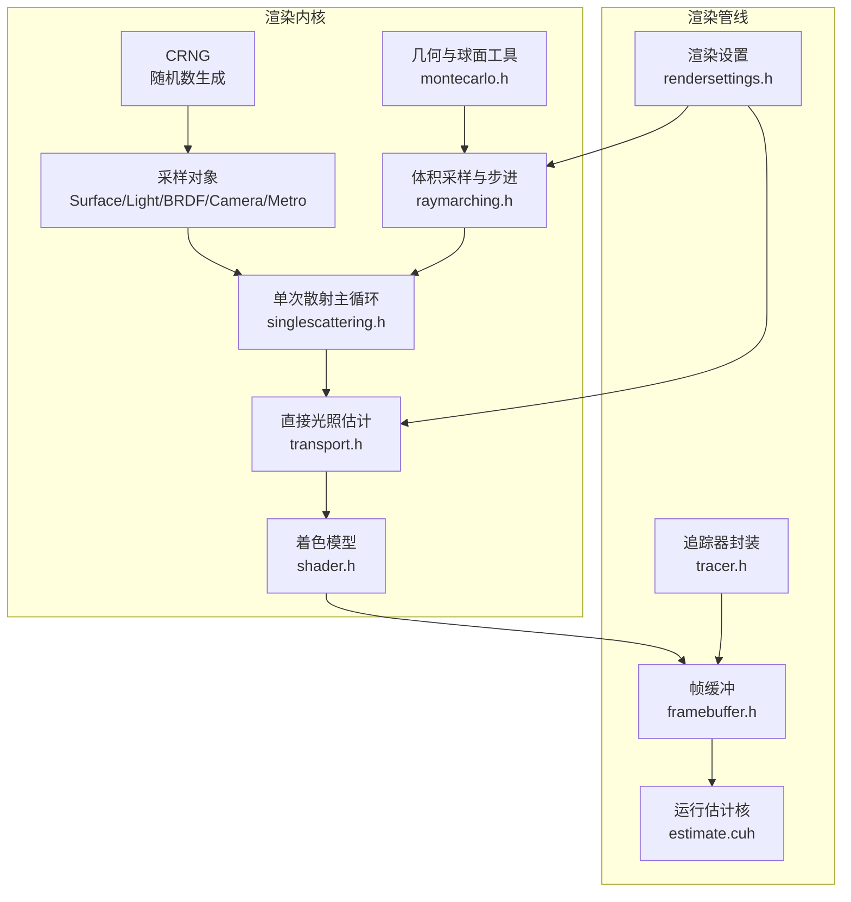

**图示来源**
- [singlescattering.h:76-102](file://Source/singlescattering.h#L76-L102)
- [raymarching.h:30-71](file://Source/raymarching.h#L30-L71)
- [transport.h:58-156](file://Source/transport.h#L58-L156)
- [shader.h:415-483](file://Source/shader.h#L415-L483)
- [framebuffer.h:26-105](file://Source/framebuffer.h#L26-L105)
- [estimate.cuh:27-38](file://Source/estimate.cuh#L27-L38)
- [rendersettings.h:27-131](file://Source/rendersettings.h#L27-L131)
- [tracer.h:31-55](file://Source/tracer.h#L31-L55)

**章节来源**
- [singlescattering.h:76-102](file://Source/singlescattering.h#L76-L102)
- [raymarching.h:30-113](file://Source/raymarching.h#L30-L113)
- [transport.h:58-156](file://Source/transport.h#L58-L156)
- [shader.h:415-483](file://Source/shader.h#L415-L483)
- [framebuffer.h:26-105](file://Source/framebuffer.h#L26-L105)
- [estimate.cuh:27-38](file://Source/estimate.cuh#L27-L38)
- [rendersettings.h:27-131](file://Source/rendersettings.h#L27-L131)
- [tracer.h:31-55](file://Source/tracer.h#L31-L55)

## 核心组件
- 随机数生成器：提供主机/设备端统一的伪随机浮点与向量采样能力，用于所有概率采样与抖动。
- 采样对象族：SurfaceSample、LightSample、BrdfSample、CameraSample、LightingSample、MetroSample，覆盖相机采样、光源采样、BRDF采样与马尔可夫链变异。
- 几何与球面工具：提供球坐标、半球采样、方位角/余弦权重半球、圆盘映射等基础采样函数。
- 体积采样与步进：基于指数分布的自由程采样与步进推进，支持阴影射线步进。
- 单次散射主循环：整合相机采样、光线传播、最近散射事件选择与直接光照估计。
- 着色模型：BRDF与各向同性相函数组合，支持重要性采样与PDF计算。
- 帧缓冲与估计：多通道估计缓存、运行估计核、随机种子管理与复位。

**章节来源**
- [rng.h:26-66](file://Source/rng.h#L26-L66)
- [sample.h:57-277](file://Source/sample.h#L57-L277)
- [montecarlo.h:27-229](file://Source/montecarlo.h#L27-L229)
- [raymarching.h:30-113](file://Source/raymarching.h#L30-L113)
- [singlescattering.h:76-102](file://Source/singlescattering.h#L76-L102)
- [transport.h:58-156](file://Source/transport.h#L58-L156)
- [shader.h:29-483](file://Source/shader.h#L29-L483)
- [framebuffer.h:26-105](file://Source/framebuffer.h#L26-L105)
- [estimate.cuh:27-38](file://Source/estimate.cuh#L27-L38)

## 架构总览
渲染从像素级循环开始，每个像素使用独立的随机种子初始化CRNG，随后按顺序执行：
- 相机采样：根据FilmUV与LensUV生成主光线。
- 光线传播：体积步进采样，直到满足指数自由程条件或越界。
- 散射事件选择：比较体积、光源与物体三类事件的时间T，取最近者。
- 直接光照估计：根据事件类型选择BRDF或相函数，结合重要性采样与功率权衡（Power Heuristic）。
- 帧缓冲更新：累计运行估计，供后续显示与滤波。

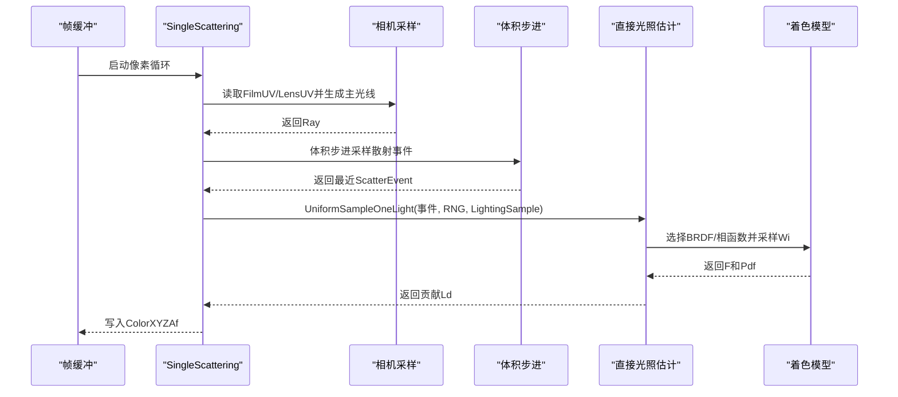

**图示来源**
- [singlescattering.h:76-102](file://Source/singlescattering.h#L76-L102)
- [raymarching.h:30-71](file://Source/raymarching.h#L30-L71)
- [transport.h:115-156](file://Source/transport.h#L115-L156)
- [shader.h:415-483](file://Source/shader.h#L415-L483)

**章节来源**
- [singlescattering.h:76-102](file://Source/singlescattering.h#L76-L102)
- [transport.h:115-156](file://Source/transport.h#L115-L156)

## 详细组件分析

### 随机数生成器（CRNG）
- 提供主机/设备端一致的伪随机序列，通过两个32位种子寄存器递推，输出[-1,1]范围的浮点与向量。
- 作为所有采样与抖动的基础，确保像素间与迭代间的可重现性与统计均匀性。

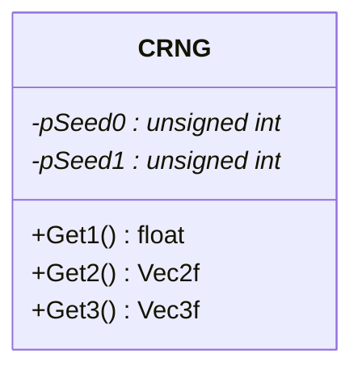

**图示来源**
- [rng.h:26-66](file://Source/rng.h#L26-L66)

**章节来源**
- [rng.h:26-66](file://Source/rng.h#L26-L66)

### 采样对象族（Surface/Light/BRDF/Camera/Lighting/Metro）
- SurfaceSample：表面点P、法线N、UV纹理坐标。
- LightSample：光源上的连续参数（UVW），支持大步长初始化与变异。
- BrdfSample：BRDF分量选择与方向参数，支持变异。
- CameraSample：胶片FilmUV与镜头LensUV，支持变异步长。
- LightingSample：组合BRDF与Light采样，含Light编号。
- MetroSample：马尔可夫链样本，包含LightingSample与CameraSample，支持Mutate生成候选。

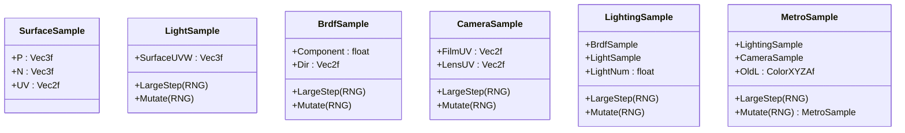

**图示来源**
- [sample.h:57-277](file://Source/sample.h#L57-L277)

**章节来源**
- [sample.h:57-277](file://Source/sample.h#L57-L277)

### 几何与球面采样工具（montecarlo.h）
- 球坐标与半球采样：SphericalDirection、UniformSampleHemisphere、CosineWeightedHemisphere、ConcentricSampleDisk。
- 角度与方位：CosTheta/SinTheta/CosPhi/SinPhi、SameHemisphere/InShadingHemisphere。
- 权重与重要性：CosineWeightedHemispherePdf、PowerHeuristic（幂法则权衡）。

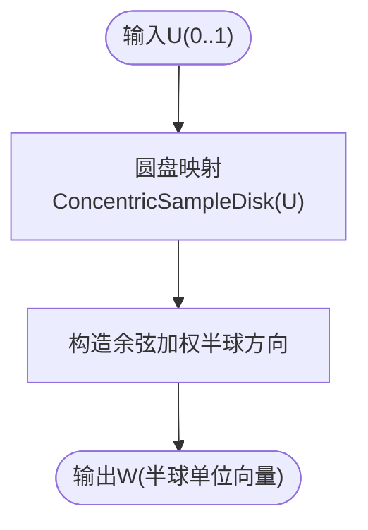

**图示来源**
- [montecarlo.h:86-143](file://Source/montecarlo.h#L86-L143)

**章节来源**
- [montecarlo.h:27-229](file://Source/montecarlo.h#L27-L229)

### 体积采样与步进（raymarching.h）
- 自由程采样：S = -log(RNG.Get1)/密度尺度，步进推进直至累积衰减Sum>=S。
- 步长因子：StepFactorPrimary/StepFactorShadow×MinStep，分别用于主光与阴影射线。
- 事件判定：返回ScatterEvent（位置、法线、入射方向、有效标记）。

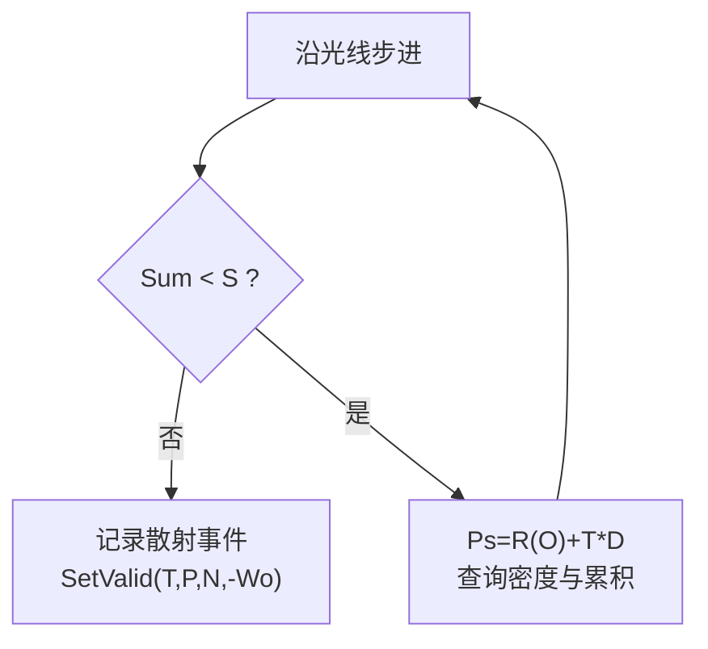

**图示来源**
- [raymarching.h:30-71](file://Source/raymarching.h#L30-L71)

**章节来源**
- [raymarching.h:30-113](file://Source/raymarching.h#L30-L113)

### 单次散射主循环（singlescattering.h）
- 每像素初始化CRNG与MetroSample。
- 相机采样：FilmUV/LensUV生成Ray，考虑景深。
- 事件选择：SampleRay比较体积、光源、物体三类ScatterEvent，取最近者。
- 直接光照：根据事件类型调用UniformSampleOneLight，估计贡献。

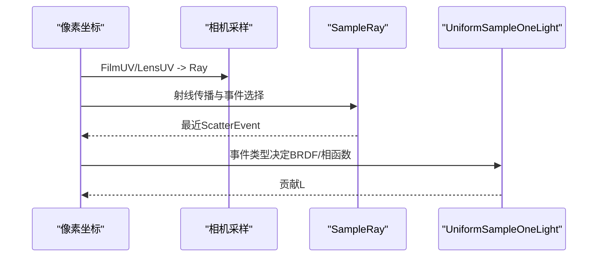

**图示来源**
- [singlescattering.h:76-102](file://Source/singlescattering.h#L76-L102)

**章节来源**
- [singlescattering.h:76-102](file://Source/singlescattering.h#L76-L102)

### 直接光照估计与重要性采样（transport.h）
- EstimateDirectLight：对选定光源进行重要性采样，结合BSDF与光源PDF，使用PowerHeuristic平衡两类采样。
- UniformSampleOneLight：按LightNum选择一个光源，构建Shader（BRDF或相函数），估计直接光照贡献并放大期望。

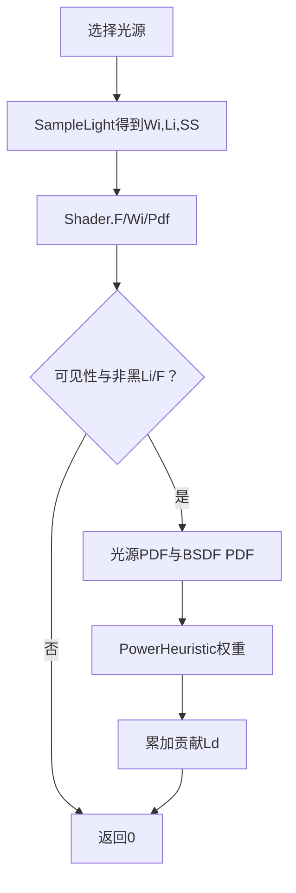

**图示来源**
- [transport.h:58-156](file://Source/transport.h#L58-L156)

**章节来源**
- [transport.h:58-156](file://Source/transport.h#L58-L156)

### 着色模型（shader.h）
- BRDF：Lambertian（漫反射）+ Microfacet（镜面反射，Fresnel+分布），支持World/Local变换。
- 相函数：IsotropicPhase（各向同性）。
- Shader：统一F与Pdf接口，根据类型选择BRDF或相函数；SampleF支持按混合系数采样不同分量。

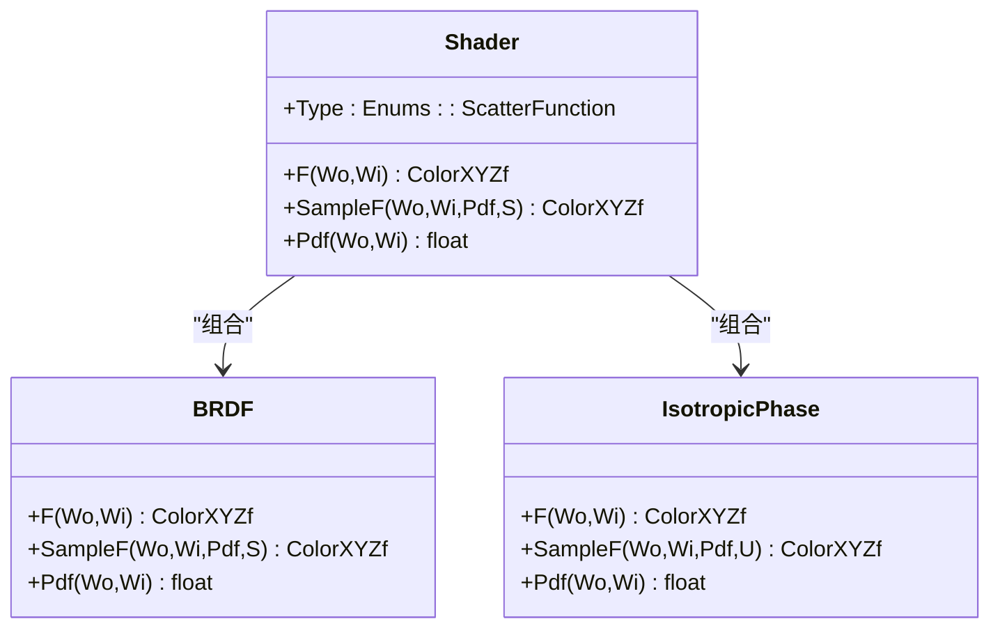

**图示来源**
- [shader.h:29-483](file://Source/shader.h#L29-L483)

**章节来源**
- [shader.h:29-483](file://Source/shader.h#L29-L483)

### 帧缓冲与运行估计（framebuffer.h、estimate.cuh）
- 帧缓冲：维护FrameEstimate、RunningEstimateXyza、DisplayEstimate等多通道缓存，以及两套随机种子缓存。
- 运行估计核：逐像素更新RunningEstimateXyza = A + (Ax − A)/N，CUDA核并行执行。
- 追踪器封装：继承ErTracer，持有FrameBuffer。

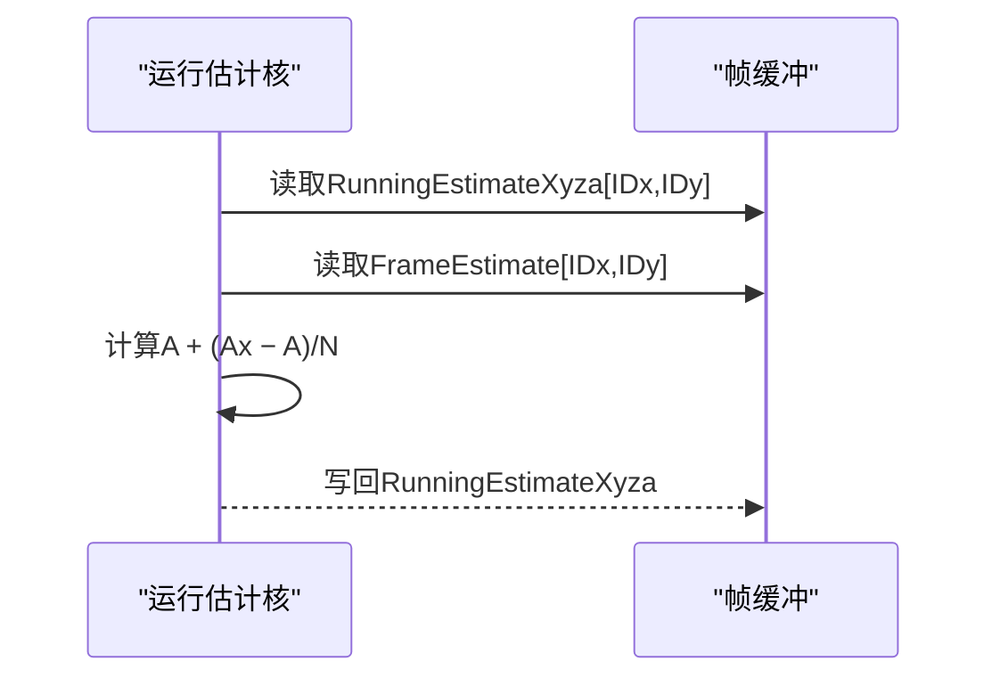

**图示来源**
- [estimate.cuh:27-38](file://Source/estimate.cuh#L27-L38)
- [framebuffer.h:26-105](file://Source/framebuffer.h#L26-L105)

**章节来源**
- [framebuffer.h:26-105](file://Source/framebuffer.h#L26-L105)
- [estimate.cuh:27-38](file://Source/estimate.cuh#L27-L38)
- [tracer.h:31-55](file://Source/tracer.h#L31-L55)

## 依赖分析
- 低耦合高内聚：采样对象与几何工具相互独立，体积步进与直接光照估计通过ScatterEvent解耦。
- 关键依赖链：
  - CRNG → 所有采样对象与体积步进
  - montecarlo.h → shader.h（CosineWeightedHemisphere等）
  - raymarching.h → transport.h（Visible/Intersect）
  - singlescattering.h → raymarching.h/transport.h
  - framebuffer.h/estimate.cuh → 渲染结果输出
  - rendersettings.h → 体积步长与密度参数

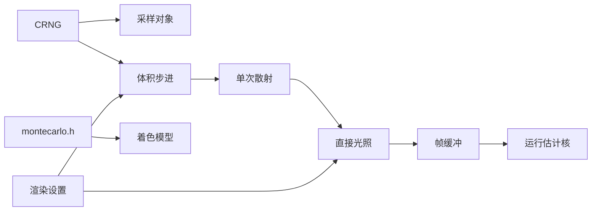

**图示来源**
- [singlescattering.h:76-102](file://Source/singlescattering.h#L76-L102)
- [raymarching.h:30-113](file://Source/raymarching.h#L30-L113)
- [transport.h:58-156](file://Source/transport.h#L58-L156)
- [shader.h:29-483](file://Source/shader.h#L29-L483)
- [framebuffer.h:26-105](file://Source/framebuffer.h#L26-L105)
- [estimate.cuh:27-38](file://Source/estimate.cuh#L27-L38)
- [rendersettings.h:27-131](file://Source/rendersettings.h#L27-L131)

**章节来源**
- [singlescattering.h:76-102](file://Source/singlescattering.h#L76-L102)
- [raymarching.h:30-113](file://Source/raymarching.h#L30-L113)
- [transport.h:58-156](file://Source/transport.h#L58-L156)
- [shader.h:29-483](file://Source/shader.h#L29-L483)
- [framebuffer.h:26-105](file://Source/framebuffer.h#L26-L105)
- [estimate.cuh:27-38](file://Source/estimate.cuh#L27-L38)
- [rendersettings.h:27-131](file://Source/rendersettings.h#L27-L131)

## 性能考量
- 步长与密度：StepFactorPrimary/StepFactorShadow与MinStep共同决定体积步进效率；密度尺度越大，平均自由程越短，步进次数越多。
- 随机种子管理：每像素独立种子，避免相关性；帧间复位RandomSeedsCopy以保证可重现性。
- 重要性采样：BRDF/相函数采样与PDF计算降低方差；Power Heuristic在光源采样与BRDF采样之间平衡。
- CUDA核并行：运行估计核与相机采样核并行度高，建议合理设置块尺寸与网格维度。
- 可见性测试：Shadow开启时Visible会触发额外体积步进，建议在复杂场景中适度调整最大阴影距离。

[本节为通用性能讨论，不直接分析具体文件]

## 故障排查指南
- 收敛缓慢/噪声大
  - 检查密度尺度与步长因子是否过小导致步进过多或过少。
  - 确认LightingSample的LightNum与BrdfSample的Component变异是否合理。
  - 参考：[rendersettings.h:66-106](file://Source/rendersettings.h#L66-L106)、[sample.h:180-192](file://Source/sample.h#L180-L192)
- 相机景深异常
  - 检查LensUV与ApertureSize是否正确映射到镜头平面。
  - 参考：[singlescattering.h:29-50](file://Source/singlescattering.h#L29-L50)
- 方向采样退化
  - 确保余弦加权半球采样与方位角映射正确，避免法线朝向错误导致PDF为0。
  - 参考：[montecarlo.h:139-155](file://Source/montecarlo.h#L139-L155)
- 运行估计不更新
  - 确认NoIterations与核函数参数传递正确，检查CUDA启动配置。
  - 参考：[estimate.cuh:27-38](file://Source/estimate.cuh#L27-L38)
- 随机种子一致性问题
  - 检查FrameBuffer::Reset是否正确恢复RandomSeedsCopy。
  - 参考：[framebuffer.h:70-74](file://Source/framebuffer.h#L70-L74)

**章节来源**
- [rendersettings.h:66-106](file://Source/rendersettings.h#L66-L106)
- [sample.h:180-192](file://Source/sample.h#L180-L192)
- [singlescattering.h:29-50](file://Source/singlescattering.h#L29-L50)
- [montecarlo.h:139-155](file://Source/montecarlo.h#L139-L155)
- [estimate.cuh:27-38](file://Source/estimate.cuh#L27-L38)
- [framebuffer.h:70-74](file://Source/framebuffer.h#L70-L74)

## 结论
该蒙特卡洛采样系统以CRNG为核心，结合几何采样工具、体积步进与重要性采样，在单次散射路径上实现了高效且可控的体积渲染。通过合理的步长与密度参数、BRDF/相函数混合与功率权衡，系统在质量与性能之间取得良好平衡。帧缓冲与运行估计核进一步支撑了交互式渲染与可视化输出。针对常见收敛与噪声问题，可通过调整渲染设置、采样策略与CUDA并行度进行优化。

[本节为总结性内容，不直接分析具体文件]

## 附录
- 术语对照
  - 自由程：光子在两次散射之间的平均行程，与吸收/散射截面相关。
  - 重要性采样：按概率密度分布进行采样以降低方差。
  - 功率权衡：Power Heuristic在不同采样策略间动态平衡权重。
- 相关枚举与类型
  - 散射类型：Volume/Light/Object/SlicePlane
  - 散射函数：Brdf/PhaseFunction
  - 着色模式：BrdfOnly/PhaseFunctionOnly/Hybrid/Modulation/Threshold/GradientMagnitude

**章节来源**
- [enums.h:101-107](file://Source/enums.h#L101-L107)
- [enums.h:95-99](file://Source/enums.h#L95-L99)
- [enums.h:63-71](file://Source/enums.h#L63-L71)