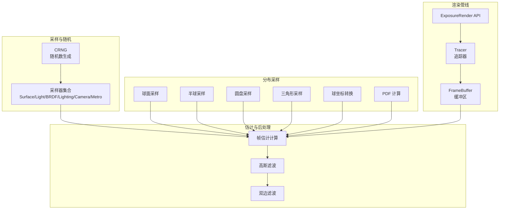
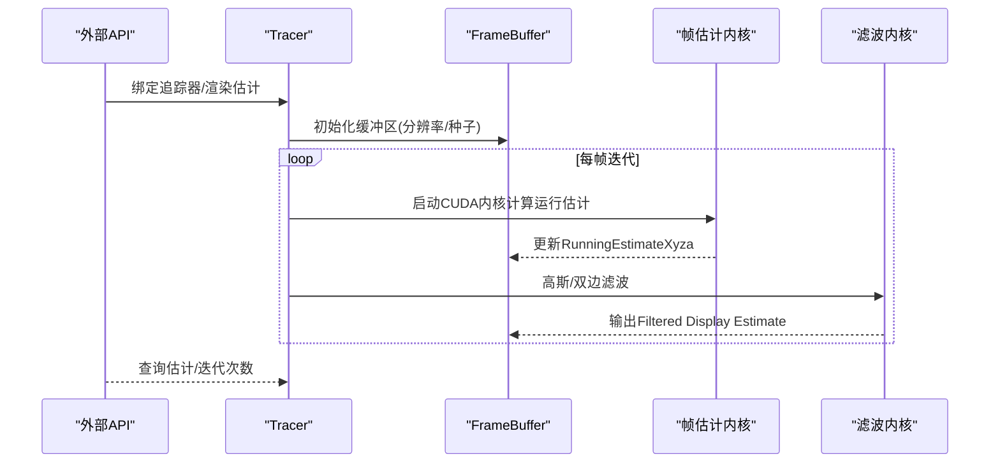
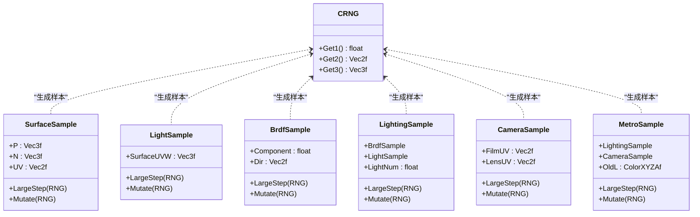
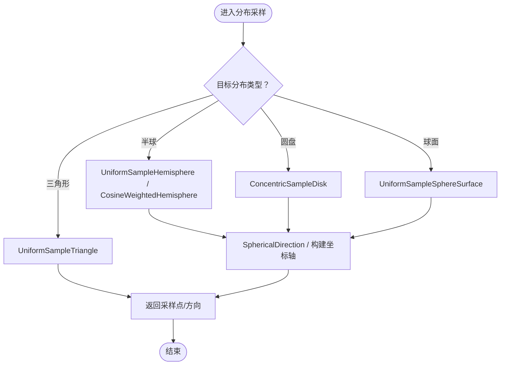
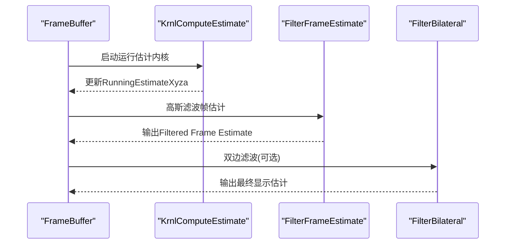
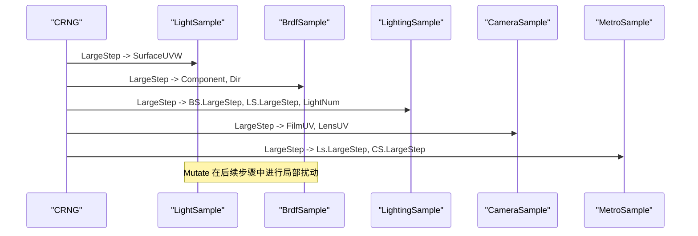
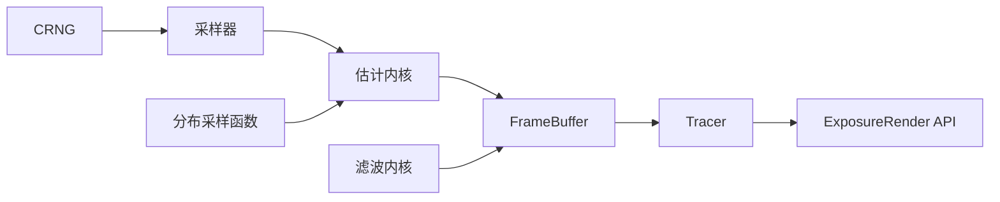

# 采样策略

<cite>
**本文引用的文件**
- [sample.h](file://Source/sample.h)
- [montecarlo.h](file://Source/montecarlo.h)
- [rng.h](file://Source/rng.h)
- [estimate.cuh](file://Source/estimate.cuh)
- [filterframeestimate.cuh](file://Source/filterframeestimate.cuh)
- [filterrunningestimate.cuh](file://Source/filterrunningestimate.cuh)
- [framebuffer.h](file://Source/framebuffer.h)
- [tracer.h](file://Source/tracer.h)
- [exposurerender.h](file://Source/exposurerender.h)
- [rendersettings.h](file://Source/rendersettings.h)
</cite>

## 目录
1. [引言](#引言)
2. [项目结构](#项目结构)
3. [核心组件](#核心组件)
4. [架构总览](#架构总览)
5. [详细组件分析](#详细组件分析)
6. [依赖分析](#依赖分析)
7. [性能考虑](#性能考虑)
8. [故障排查指南](#故障排查指南)
9. [结论](#结论)
10. [附录](#附录)

## 引言
本文件围绕体积渲染框架中的“采样策略系统”展开，系统性阐述采样对象建模（如相机采样、光照采样、BRDF采样）、分布采样函数族（球面、半球、圆盘、三角形等）以及马尔可夫链蒙特卡洛（MCMC）风格的局部扰动（Metropolis）策略。文档结合代码路径给出具体示例，说明样本生成流程、策略选择与调用关系、接口设计与使用模式，并讨论样本质量评估、分布均匀性、收敛性、偏差与方差控制、计算复杂度，以及与渲染算法的集成与参数调优策略。

## 项目结构
采样策略相关代码主要分布在以下模块：
- 随机数与采样对象：CRNG、各类采样器（Surface/Light/BRDF/Lighting/Camera/Metro）
- 分布采样与几何工具：球面、半球、圆盘、三角形、球坐标系转换、权重PDF
- 帧估计与后处理：帧估计计算、高斯滤波、双边滤波
- 渲染缓冲与追踪器：帧缓冲区、追踪器封装
- 外部接口：渲染估计绑定与查询

**图表来源**
- [sample.h:27-279](file://Source/sample.h#L27-L279)
- [montecarlo.h:27-229](file://Source/montecarlo.h#L27-L229)
- [estimate.cuh:27-39](file://Source/estimate.cuh#L27-L39)
- [filterframeestimate.cuh:33-74](file://Source/filterframeestimate.cuh#L33-L74)
- [filterrunningestimate.cuh:55-200](file://Source/filterrunningestimate.cuh#L55-L200)
- [framebuffer.h:26-105](file://Source/framebuffer.h#L26-L105)
- [tracer.h:31-55](file://Source/tracer.h#L31-L55)
- [exposurerender.h:32-43](file://Source/exposurerender.h#L32-L43)

**章节来源**
- [sample.h:27-279](file://Source/sample.h#L27-L279)
- [montecarlo.h:27-229](file://Source/montecarlo.h#L27-L229)
- [estimate.cuh:27-39](file://Source/estimate.cuh#L27-L39)
- [filterframeestimate.cuh:33-74](file://Source/filterframeestimate.cuh#L33-L74)
- [filterrunningestimate.cuh:55-200](file://Source/filterrunningestimate.cuh#L55-L200)
- [framebuffer.h:26-105](file://Source/framebuffer.h#L26-L105)
- [tracer.h:31-55](file://Source/tracer.h#L31-L55)
- [exposurerender.h:32-43](file://Source/exposurerender.h#L32-L43)

## 核心组件
- 随机数生成器 CRNG：提供一维/二维/三维均匀分布样本，用于驱动各类采样器。
- 采样器集合：
  - 表面采样 SurfaceSample：点、法线、UV 参数。
  - 光源采样 LightSample：表面 UVW 参数，支持大步与局部扰动。
  - BRDF 采样 BrdfSample：成分概率与方向参数，支持大步与局部扰动。
  - 灯光采样 LightingSample：组合 BRDF 与光源采样，含额外标量分量。
  - 相机采样 CameraSample：胶片平面与镜头 UV 参数，支持局部扰动。
  - Metropolis 采样 MetroSample：组合灯光与相机采样，支持大步与局部扰动。
- 分布采样函数族：半球、圆盘、球面、三角形、球坐标转换、余弦加权半球 PDF。
- 帧估计与后处理：CUDA 内核逐像素更新运行估计，高斯滤波与双边滤波平滑估计。

**章节来源**
- [rng.h:26-66](file://Source/rng.h#L26-L66)
- [sample.h:57-279](file://Source/sample.h#L57-L279)
- [montecarlo.h:72-229](file://Source/montecarlo.h#L72-L229)
- [estimate.cuh:27-39](file://Source/estimate.cuh#L27-L39)
- [filterframeestimate.cuh:33-74](file://Source/filterframeestimate.cuh#L33-L74)
- [filterrunningestimate.cuh:55-200](file://Source/filterrunningestimate.cuh#L55-L200)

## 架构总览
采样策略在渲染管线中的位置如下：
- 每帧开始，追踪器持有帧缓冲区，其中包含帧估计、运行估计、显示估计等缓冲。
- 采样器通过 CRNG 获取均匀随机样本，生成初始样本或进行局部扰动。
- 分布采样函数根据几何约束生成符合目标分布的样本。
- 帧估计内核逐像素累积移动平均，随后应用高斯或双边滤波提升视觉质量。
- 外部 API 提供估计绑定与查询，便于交互式渲染与自动对焦等特性。

**图表来源**
- [exposurerender.h:32-43](file://Source/exposurerender.h#L32-L43)
- [tracer.h:31-55](file://Source/tracer.h#L31-L55)
- [framebuffer.h:26-105](file://Source/framebuffer.h#L26-L105)
- [estimate.cuh:27-39](file://Source/estimate.cuh#L27-L39)
- [filterframeestimate.cuh:66-74](file://Source/filterframeestimate.cuh#L66-L74)
- [filterrunningestimate.cuh:193-200](file://Source/filterrunningestimate.cuh#L193-L200)

## 详细组件分析

### 随机数与扰动（CRNG 与 Metropolis 扰动）
- CRNG 提供一维/二维/三维均匀样本，内部采用线性同余与位操作构造浮点样本，保证在 [-1,1] 区间均匀分布。
- Metropolis 类型的扰动函数（Mutate1/2/3）在当前样本附近以自适应步长进行局部扰动，维持遍历性与细致探索能力。
- 各采样器的 LargeStep 与 Mutate 接口统一了初始化与局部扰动的调用模式，便于在 MCMC 步骤中切换。

**图表来源**
- [rng.h:26-66](file://Source/rng.h#L26-L66)
- [sample.h:57-279](file://Source/sample.h#L57-L279)

**章节来源**
- [rng.h:26-66](file://Source/rng.h#L26-L66)
- [sample.h:28-55](file://Source/sample.h#L28-L55)
- [sample.h:101-112](file://Source/sample.h#L101-L112)
- [sample.h:142-156](file://Source/sample.h#L142-L156)
- [sample.h:180-197](file://Source/sample.h#L180-L197)
- [sample.h:221-235](file://Source/sample.h#L221-L235)
- [sample.h:258-277](file://Source/sample.h#L258-L277)

### 分布采样与几何工具
- 半球采样：支持均匀半球与余弦加权半球采样，提供球坐标转换与 PDF。
- 圆盘采样：集中式映射（ConcentricSampleDisk），避免边缘退化。
- 球面采样：均匀球面表面采样。
- 三角形采样：均匀三角形内的参数化采样。
- 几何辅助：余弦/正弦/方位角计算、同半球/阴影半球判断、向量归一化与坐标轴构建。

**图表来源**
- [montecarlo.h:72-229](file://Source/montecarlo.h#L72-L229)

**章节来源**
- [montecarlo.h:72-229](file://Source/montecarlo.h#L72-L229)

### 帧估计与后处理
- 运行估计计算：CUDA 内核逐像素执行累计移动平均，融合当前帧估计与历史运行估计。
- 高斯滤波：对帧估计进行局部加权平均，抑制噪声，保留边缘。
- 双边滤波：在空间域与亮度相似性上加权，更好地保持边缘的同时平滑纹理。

**图表来源**
- [estimate.cuh:27-39](file://Source/estimate.cuh#L27-L39)
- [filterframeestimate.cuh:33-74](file://Source/filterframeestimate.cuh#L33-L74)
- [filterrunningestimate.cuh:55-200](file://Source/filterrunningestimate.cuh#L55-L200)

**章节来源**
- [estimate.cuh:27-39](file://Source/estimate.cuh#L27-L39)
- [filterframeestimate.cuh:33-74](file://Source/filterframeestimate.cuh#L33-L74)
- [filterrunningestimate.cuh:55-200](file://Source/filterrunningestimate.cuh#L55-L200)

### 采样器使用模式与调用关系
- 初始化：采样器构造时传入 CRNG，调用 LargeStep 生成初始样本。
- 局部扰动：在 MCMC 步骤中调用 Mutate 对样本进行小范围扰动，维持遍历性。
- 组合采样：LightingSample 将 BRDF 与 Light 采样组合；MetroSample 将 Lighting 与 Camera 采样组合，并携带旧估计值以便接受/拒绝决策。

**图表来源**
- [sample.h:89-112](file://Source/sample.h#L89-L112)
- [sample.h:123-156](file://Source/sample.h#L123-L156)
- [sample.h:166-197](file://Source/sample.h#L166-L197)
- [sample.h:208-235](file://Source/sample.h#L208-L235)
- [sample.h:244-277](file://Source/sample.h#L244-L277)

**章节来源**
- [sample.h:89-112](file://Source/sample.h#L89-L112)
- [sample.h:123-156](file://Source/sample.h#L123-L156)
- [sample.h:166-197](file://Source/sample.h#L166-L197)
- [sample.h:208-235](file://Source/sample.h#L208-L235)
- [sample.h:244-277](file://Source/sample.h#L244-L277)

## 依赖分析
- 低耦合高内聚：采样器仅依赖 CRNG；分布采样函数独立于采样器，便于替换与组合。
- CUDA 内核与主机侧协同：估计与滤波在设备端执行，缓冲区由 FrameBuffer 管理，Tracer 负责生命周期与尺寸调整。
- 外部接口：通过 ExposureRender API 绑定追踪器、渲染估计与查询迭代次数，便于上层应用集成。

**图表来源**
- [rng.h:26-66](file://Source/rng.h#L26-L66)
- [sample.h:57-279](file://Source/sample.h#L57-L279)
- [montecarlo.h:72-229](file://Source/montecarlo.h#L72-L229)
- [estimate.cuh:27-39](file://Source/estimate.cuh#L27-L39)
- [filterframeestimate.cuh:33-74](file://Source/filterframeestimate.cuh#L33-L74)
- [filterrunningestimate.cuh:55-200](file://Source/filterrunningestimate.cuh#L55-L200)
- [framebuffer.h:26-105](file://Source/framebuffer.h#L26-L105)
- [tracer.h:31-55](file://Source/tracer.h#L31-L55)
- [exposurerender.h:32-43](file://Source/exposurerender.h#L32-L43)

**章节来源**
- [framebuffer.h:26-105](file://Source/framebuffer.h#L26-L105)
- [tracer.h:31-55](file://Source/tracer.h#L31-L55)
- [exposurerender.h:32-43](file://Source/exposurerender.h#L32-L43)

## 性能考虑
- 随机数生成：CRNG 使用线性同余与位变换，开销极低，适合每像素/每样本生成。
- 分布采样：三角形/球面/半球/圆盘采样均为常数时间，几何转换与坐标轴构建为轻量级操作。
- CUDA 内核：估计与滤波均采用二维块/网格并行，内存访问局部性强，适合大规模并行。
- 收敛与方差：运行估计采用移动平均，估计值随迭代增加更稳定；滤波进一步降低方差，但可能引入模糊。
- 参数敏感性：步长与扰动幅度影响混合速度；滤波半径与强度影响清晰度与速度。

[本节为通用性能讨论，不直接分析具体文件]

## 故障排查指南
- 样本退化或不均匀
  - 检查 CRNG 种子是否正确复制与重置（帧缓冲区 Reset 会恢复种子副本）。
  - 确认采样器 LargeStep 是否被调用，Mutate 是否按需启用。
- 估计不收敛或噪声大
  - 增加迭代次数，检查运行估计内核是否正常执行。
  - 调整滤波参数（高斯核半径/强度或双边滤波相似性窗口）。
- 边缘模糊或伪影
  - 减小滤波强度或改用双边滤波以保留边缘。
- 性能瓶颈
  - 确认分辨率与块大小配置合理；检查是否存在不必要的同步或分支。

**章节来源**
- [framebuffer.h:70-91](file://Source/framebuffer.h#L70-L91)
- [estimate.cuh:34-39](file://Source/estimate.cuh#L34-L39)
- [filterframeestimate.cuh:66-74](file://Source/filterframeestimate.cuh#L66-L74)
- [filterrunningestimate.cuh:193-200](file://Source/filterrunningestimate.cuh#L193-L200)

## 结论
该采样策略系统以 CRNG 为核心，提供统一的采样器接口与丰富的分布采样函数族，配合 CUDA 内核实现高效的帧估计与后处理。通过 Metropolis 风格的局部扰动与滤波手段，系统在交互式体积渲染中实现了较好的质量与性能平衡。针对不同场景，可通过调整采样步长、滤波参数与渲染设置获得更优的视觉与计算表现。

[本节为总结性内容，不直接分析具体文件]

## 附录

### 关键接口与使用模式速查
- 随机数生成
  - [CRNG::Get1/Get2/Get3:35-61](file://Source/rng.h#L35-L61)
- 采样器
  - [LightSample::LargeStep/Mutate:101-112](file://Source/sample.h#L101-L112)
  - [BrdfSample::LargeStep/Mutate:142-156](file://Source/sample.h#L142-L156)
  - [LightingSample::LargeStep/Mutate:180-197](file://Source/sample.h#L180-L197)
  - [CameraSample::LargeStep/Mutate:221-235](file://Source/sample.h#L221-L235)
  - [MetroSample::LargeStep/Mutate:258-277](file://Source/sample.h#L258-L277)
- 分布采样
  - [UniformSampleHemisphere / CosineWeightedHemisphere:201-221](file://Source/montecarlo.h#L201-L221)
  - [ConcentricSampleDisk:86-137](file://Source/montecarlo.h#L86-L137)
  - [UniformSampleSphereSurface:191-199](file://Source/montecarlo.h#L191-L199)
  - [UniformSampleTriangle:184-189](file://Source/montecarlo.h#L184-L189)
  - [SphericalDirection / 坐标轴构建:162-182](file://Source/montecarlo.h#L162-L182)
- 估计与后处理
  - [ComputeEstimate:34-39](file://Source/estimate.cuh#L34-L39)
  - [FilterFrameEstimate:66-74](file://Source/filterframeestimate.cuh#L66-L74)
  - [FilterBilateral:193-200](file://Source/filterrunningestimate.cuh#L193-L200)
- 缓冲区与追踪器
  - [FrameBuffer::Resize/Reset/Free:45-91](file://Source/framebuffer.h#L45-L91)
  - [Tracer 构造与赋值:34-52](file://Source/tracer.h#L34-L52)
- 外部接口
  - [BindTracer/RenderEstimate/GetEstimate:32-43](file://Source/exposurerender.h#L32-L43)
- 渲染设置
  - [RenderSettings::Traversal/Shading:27-131](file://Source/rendersettings.h#L27-L131)