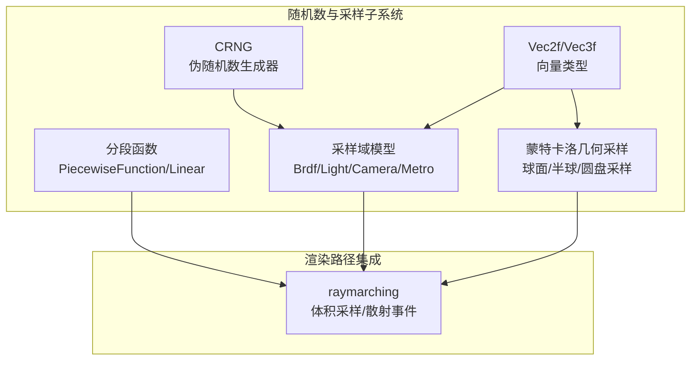
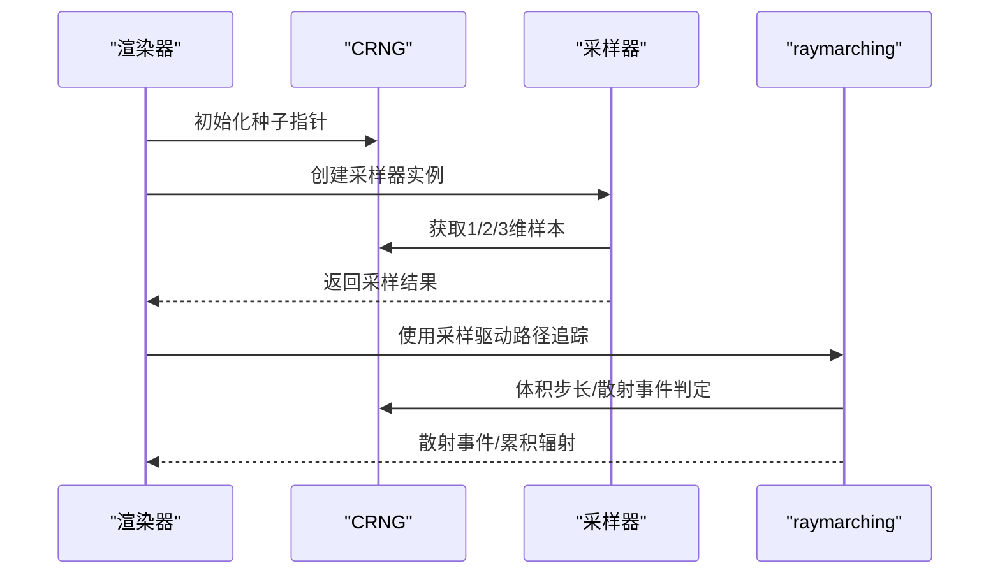
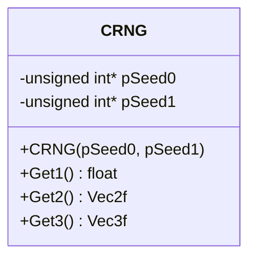
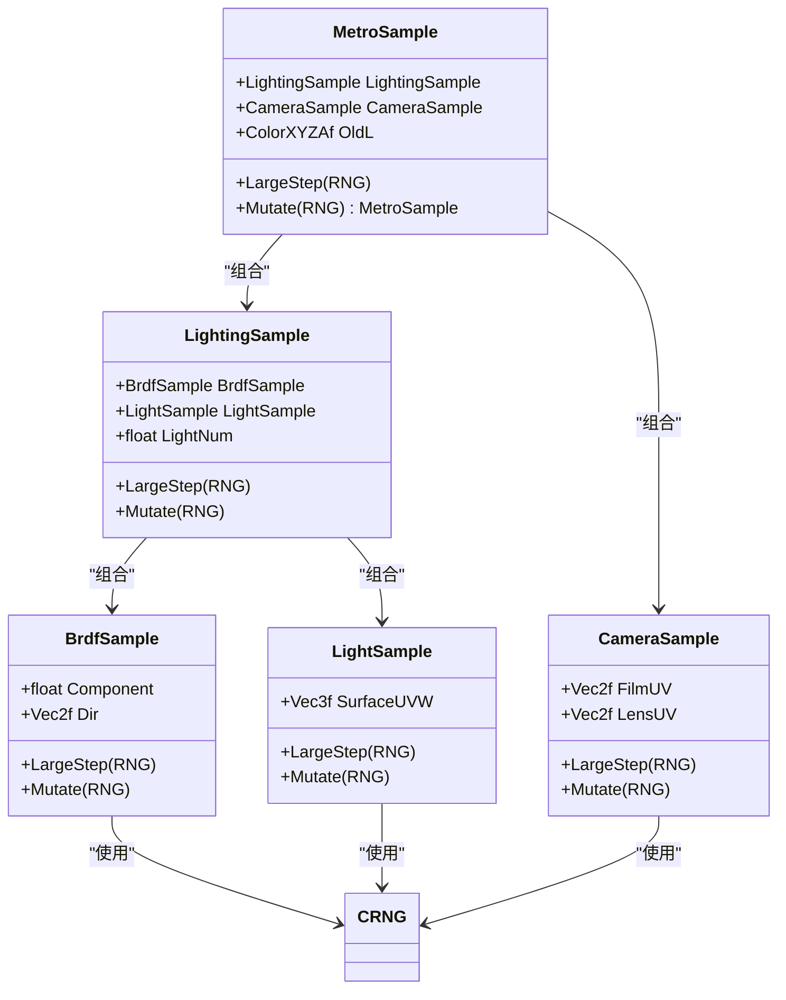
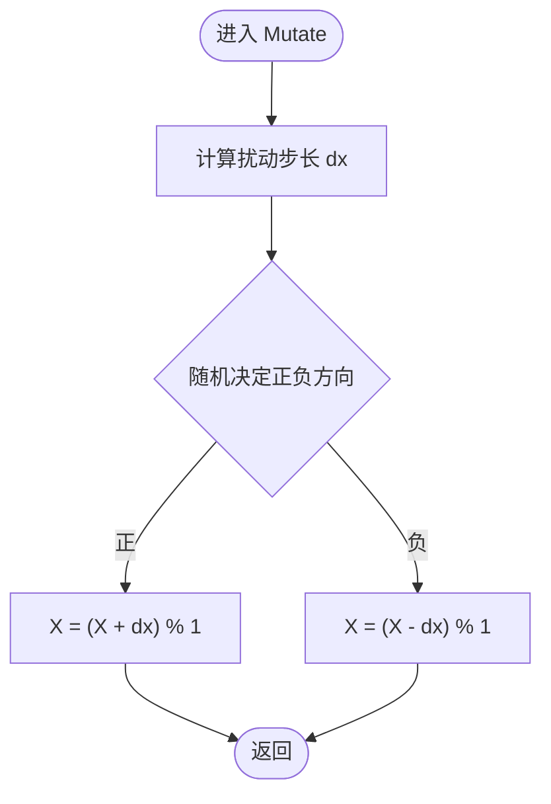
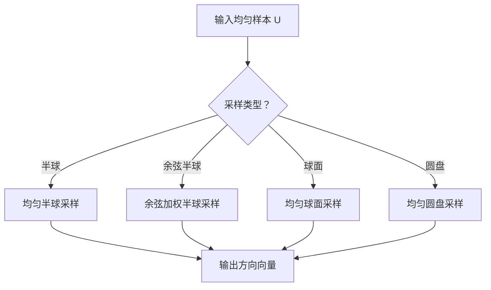
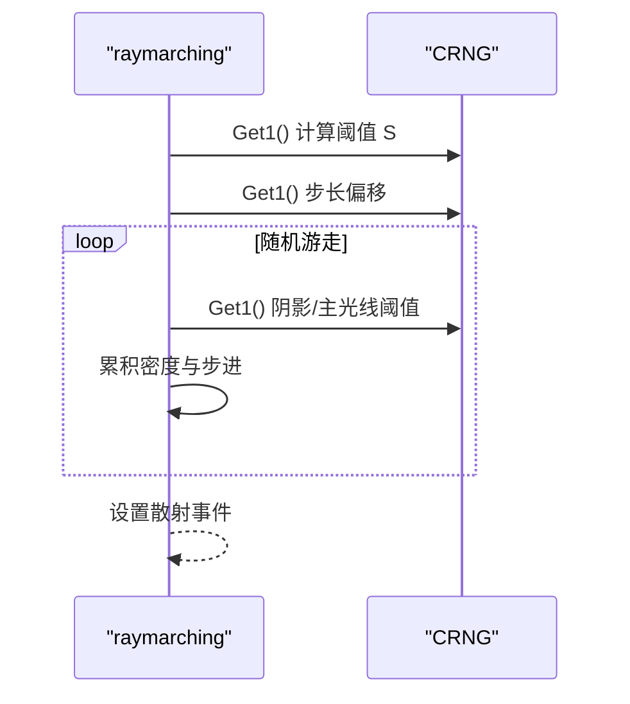
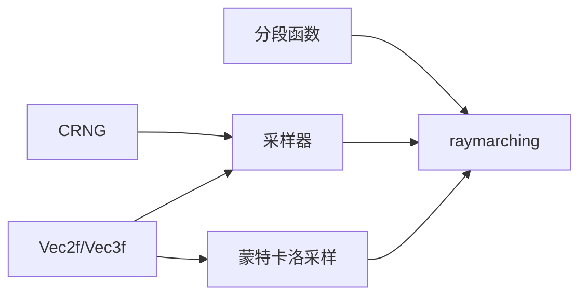

# 随机数和采样

<cite>
**本文引用的文件**
- [rng.h](file://Source/rng.h)
- [sample.h](file://Source/sample.h)
- [montecarlo.h](file://Source/montecarlo.h)
- [geometry.h](file://Source/geometry.h)
- [vector.h](file://Source/vector.h)
- [raymarching.h](file://Source/raymarching.h)
- [color.h](file://Source/color.h)
- [pf.h](file://Source/pf.h)
- [plf.h](file://Source/plf.h)
- [defines.h](file://Source/defines.h)
- [enums.h](file://Source/enums.h)
</cite>

## 目录
1. [引言](#引言)
2. [项目结构](#项目结构)
3. [核心组件](#核心组件)
4. [架构总览](#架构总览)
5. [详细组件分析](#详细组件分析)
6. [依赖分析](#依赖分析)
7. [性能考虑](#性能考虑)
8. [故障排查指南](#故障排查指南)
9. [结论](#结论)
10. [附录](#附录)

## 引言
本文件围绕“随机数与采样”子系统进行深入解析，覆盖底层伪随机数生成器、采样域模型（BRDF、光照、相机、蒙特卡洛采样）、马尔可夫链采样策略（Metropolis-Hastings）以及在体积渲染路径追踪中的具体应用。文档以循序渐进的方式组织：先从基础随机数与几何向量类型入手，再逐步过渡到采样类与蒙特卡洛辅助函数，最后结合体积渲染路径追踪展示真实调用流程与参数影响。

## 项目结构
该子系统主要分布在以下头文件中：
- 底层随机数与向量：[rng.h](file://Source/rng.h)、[vector.h](file://Source/vector.h)
- 几何与常量：[geometry.h](file://Source/geometry.h)、[defines.h](file://Source/defines.h)
- 采样域模型与马尔可夫链：[sample.h](file://Source/sample.h)
- 蒙特卡洛几何采样辅助：[montecarlo.h](file://Source/montecarlo.h)
- 体积渲染路径追踪中的随机使用：[raymarching.h](file://Source/raymarching.h)
- 颜色空间与线性函数：[color.h](file://Source/color.h)、[pf.h](file://Source/pf.h)、[plf.h](file://Source/plf.h)
- 枚举与类型定义：[enums.h](file://Source/enums.h)

**图表来源**
- [rng.h:26-66](file://Source/rng.h#L26-L66)
- [vector.h:410-495](file://Source/vector.h#L410-L495)
- [sample.h:57-277](file://Source/sample.h#L57-L277)
- [montecarlo.h:72-221](file://Source/montecarlo.h#L72-L221)
- [pf.h:26-71](file://Source/pf.h#L26-L71)
- [raymarching.h:30-113](file://Source/raymarching.h#L30-L113)

**章节来源**
- [rng.h:26-66](file://Source/rng.h#L26-L66)
- [vector.h:410-495](file://Source/vector.h#L410-L495)
- [sample.h:57-277](file://Source/sample.h#L57-L277)
- [montecarlo.h:72-221](file://Source/montecarlo.h#L72-L221)
- [pf.h:26-71](file://Source/pf.h#L26-L71)
- [raymarching.h:30-113](file://Source/raymarching.h#L30-L113)

## 核心组件
- 伪随机数生成器 CRNG
  - 提供主机/设备端统一接口，通过两个32位整型种子生成均匀分布的浮点样本。
  - 支持一维、二维、三维样本输出，用于后续采样。
- 向量与几何类型 Vec2f/Vec3f
  - 提供点、方向、长度、归一化、点积、叉积等常用操作，支撑采样与几何变换。
- 采样域模型
  - BrdfSample：BRDF分量与方向采样。
  - LightSample：表面UVW坐标采样。
  - CameraSample：胶片平面与镜头平面采样。
  - LightingSample：组合BRDF与光源采样。
  - MetroSample：整体状态采样，支持大步长初始化与变异。
- 蒙特卡洛几何采样
  - 半球、球面、圆盘等几何体上的均匀/余弦加权采样，以及PDF计算。
- 分段函数
  - PiecewiseFunction/PiecewiseLinearFunction：用于传输函数等分段线性插值。

**章节来源**
- [rng.h:26-66](file://Source/rng.h#L26-L66)
- [vector.h:410-495](file://Source/vector.h#L410-L495)
- [sample.h:57-277](file://Source/sample.h#L57-L277)
- [montecarlo.h:72-221](file://Source/montecarlo.h#L72-L221)
- [pf.h:26-71](file://Source/pf.h#L26-L71)
- [plf.h:68-91](file://Source/plf.h#L68-L91)

## 架构总览
随机数与采样贯穿渲染管线的关键环节：
- CRNG 作为全局随机源，被各采样器共享。
- 采样器根据物理意义选择合适的几何采样策略（如余弦加权半球）。
- 在体积渲染路径追踪中，RNG 用于步长采样、散射事件判定与随机游走。
- 分段函数用于传输函数等非均匀映射。

**图表来源**
- [rng.h:29-51](file://Source/rng.h#L29-L51)
- [sample.h:101-109](file://Source/sample.h#L101-L109)
- [raymarching.h:44-71](file://Source/raymarching.h#L44-L71)

## 详细组件分析

### 组件A：CRNG 伪随机数生成器
- 设计要点
  - 双种子线性同余风格生成器，分别更新两组状态，组合得到更高维度的均匀性。
  - 将无符号整型位模式转换为[-1,1]范围内的浮点数，适配采样需求。
- 接口与行为
  - 构造：接收两个无符号整型指针作为种子。
  - Get1/Get2/Get3：分别返回单精度标量与二维/三维向量样本。
- 复杂度与性能
  - 时间复杂度 O(1)，空间复杂度 O(1)。
  - 适合GPU设备端内核调用，避免频繁内存访问。
- 使用模式
  - 在采样器构造时注入 CRNG 实例；在需要随机性时调用相应维度的取样方法。

**图表来源**
- [rng.h:26-66](file://Source/rng.h#L26-L66)

**章节来源**
- [rng.h:26-66](file://Source/rng.h#L26-L66)

### 组件B：采样域模型（Brdf/Light/Camera/Lighting/Metro）
- 设计要点
  - 每个采样器包含 LargeStep 与 Mutate 两种模式：LargeStep 进行大步长初始化，Mutate 进行局部小扰动。
  - 参数 S1/S2 控制扰动幅度，支持不同维度的扰动强度。
- 关键类与方法
  - SurfaceSample：表面位置、法线、UV。
  - LightSample：表面UVW坐标，LargeStep 使用三元均匀样本，Mutate 使用三维扰动。
  - BrdfSample：BRDF分量与方向，LargeStep 使用一元与二元均匀样本，Mutate 使用一元与二元扰动。
  - LightingSample：组合 BRDF 与 Light 采样，另含一个标量 LightNum。
  - CameraSample：胶片平面与镜头平面UV，Mutate 对 FilmUV/LensUV 分别扰动。
  - MetroSample：整体状态采样，包含 LightingSample 与 CameraSample，以及旧的辐射值。
- 调用关系
  - 采样器在构造时可直接传入 CRNG 完成 LargeStep。
  - Mutate 通过通用扰动函数对各分量进行局部扰动。

**图表来源**
- [sample.h:57-277](file://Source/sample.h#L57-L277)
- [rng.h:26-66](file://Source/rng.h#L26-L66)

**章节来源**
- [sample.h:57-277](file://Source/sample.h#L57-L277)

### 组件C：马尔可夫链扰动（Metropolis-Hastings）
- 设计要点
  - 通用扰动函数 Mutate1/Mutate2/Mutate3：基于指数分布的自适应步长，保证遍历性与效率。
  - MetroSample 的 Mutate 返回新状态，便于 Metropolis 判定接受/拒绝。
- 参数说明
  - S1/S2：控制初始与最大扰动幅度，默认值针对典型采样场景优化。
- 使用模式
  - 在采样迭代中，先 LargeStep 初始化，再多次 Mutate 局部扰动，提高探索效率。

**图表来源**
- [sample.h:28-42](file://Source/sample.h#L28-L42)

**章节来源**
- [sample.h:28-42](file://Source/sample.h#L28-L42)

### 组件D：蒙特卡洛几何采样（半球/球面/圆盘）
- 设计要点
  - 均匀半球采样、余弦加权半球采样、均匀球面采样、均匀圆盘采样。
  - 提供球坐标到直角坐标的转换与PDF计算。
- 典型用途
  - BRDF采样、光源采样、随机方向生成。
- 参数与返回
  - 输入：均匀二维/三维样本 U。
  - 输出：采样方向向量（可选返回法线方向）。
  - PDF：余弦加权半球的PDF。

**图表来源**
- [montecarlo.h:72-221](file://Source/montecarlo.h#L72-L221)

**章节来源**
- [montecarlo.h:72-221](file://Source/montecarlo.h#L72-L221)

### 组件E：体积渲染路径追踪中的随机使用
- 设计要点
  - 使用 RNG 生成体积步长与散射事件阈值，驱动随机游走。
  - 在阴影射线与主光线中分别采用不同的步长因子与密度尺度。
- 关键调用
  - 体积采样：RNG.Get1() 生成累积密度阈值，RNG.Get1() 作为起始偏移。
  - 散射事件判定：RNG.Get1() 与纹理查询比较，决定是否终止或继续。

**图表来源**
- [raymarching.h:30-113](file://Source/raymarching.h#L30-L113)
- [raymarching.h:136-272](file://Source/raymarching.h#L136-L272)

**章节来源**
- [raymarching.h:30-113](file://Source/raymarching.h#L30-L113)
- [raymarching.h:136-272](file://Source/raymarching.h#L136-L272)

### 组件F：颜色空间与分段函数
- 颜色空间
  - 提供 RGB/XYZ/RGBA 等类型及相互转换，支持亮度计算与插值。
- 分段函数
  - PiecewiseFunction：节点范围、位置与值数组。
  - PiecewiseLinearFunction：线性插值评估，支持边界外处理。

**章节来源**
- [color.h:59-142](file://Source/color.h#L59-L142)
- [pf.h:26-71](file://Source/pf.h#L26-L71)
- [plf.h:68-91](file://Source/plf.h#L68-L91)

## 依赖分析
- 内聚与耦合
  - CRNG 低耦合，仅依赖向量类型；采样器高内聚于 CRNG 与几何类型。
  - 蒙特卡洛采样函数独立于渲染器，可复用。
- 外部依赖
  - CUDA 宏与数学库（在 defines.h 中统一管理）。
  - 渲染器通过 RNG 注入采样器，采样器不反向依赖渲染器。

**图表来源**
- [rng.h:26-66](file://Source/rng.h#L26-L66)
- [sample.h:57-277](file://Source/sample.h#L57-L277)
- [montecarlo.h:72-221](file://Source/montecarlo.h#L72-L221)
- [pf.h:26-71](file://Source/pf.h#L26-L71)
- [raymarching.h:30-113](file://Source/raymarching.h#L30-L113)

**章节来源**
- [defines.h:40-56](file://Source/defines.h#L40-L56)
- [enums.h:24-108](file://Source/enums.h#L24-L108)

## 性能考虑
- 生成器开销
  - CRNG 为纯寄存器运算，适合高频调用；注意避免在热点循环中重复分配对象。
- 采样器扰动
  - S1/S2 默认值已针对典型场景优化；在高动态范围或高对比度场景可适当调整。
- 几何采样
  - 余弦加权半球采样避免了低效的拒绝采样；注意避免在极端角度下数值不稳定。
- 路径追踪
  - RNG 的使用应尽量减少分支差异，确保 GPU 并行效率。

## 故障排查指南
- 采样退化
  - 症状：图像出现条纹或噪声集中。
  - 排查：检查 S1/S2 是否过大导致探索不足；确认 LargeStep 与 Mutate 的混合比例。
- 散射事件缺失
  - 症状：体积渲染过暗或无散射。
  - 排查：检查 RNG.Get1() 的调用是否正确；确认密度尺度与步长因子设置。
- 方向采样异常
  - 症状：光照方向不自然或能量不守恒。
  - 排查：核对余弦加权半球采样与PDF一致性；检查坐标系变换与法线方向。
- 数值不稳定
  - 症状：NaN 或 Inf。
  - 排查：检查除零与平方根负数；确认向量归一化与夹角范围。

**章节来源**
- [montecarlo.h:157-160](file://Source/montecarlo.h#L157-L160)
- [raymarching.h:44-71](file://Source/raymarching.h#L44-L71)

## 结论
该随机数与采样子系统以 CRNG 为核心，结合采样域模型与蒙特卡洛几何采样，在体积渲染路径追踪中实现了高效且稳定的随机驱动。通过合理的参数设计与模块化封装，既满足初学者的理解需求，也为高级用户提供了充分的扩展与调优空间。

## 附录
- 关键宏与常量
  - 数学常量与单位换算：PI_F、INV_PI_F、RAD_F 等。
  - CUDA 宏：HOST_DEVICE、DEVICE_NI 等。
- 类型与枚举
  - 向量类型：Vec2f/Vec3f/Vec4f。
  - 枚举：ShadingMode、ScatterFunction 等。

**章节来源**
- [defines.h:58-77](file://Source/defines.h#L58-L77)
- [vector.h:410-495](file://Source/vector.h#L410-L495)
- [enums.h:63-107](file://Source/enums.h#L63-L107)