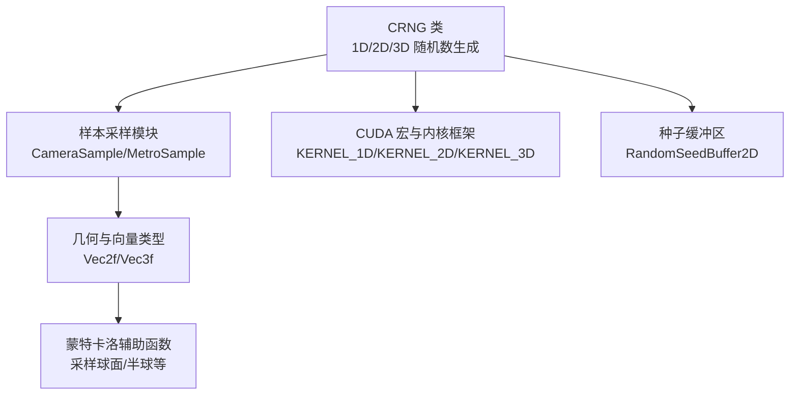
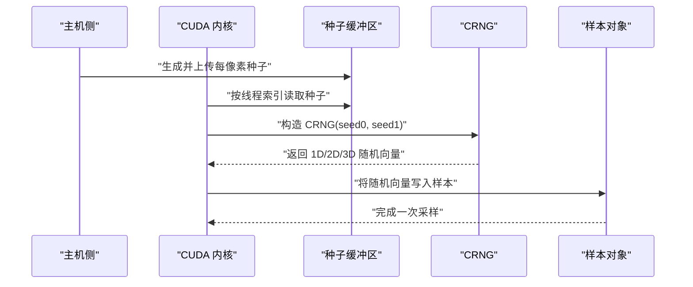
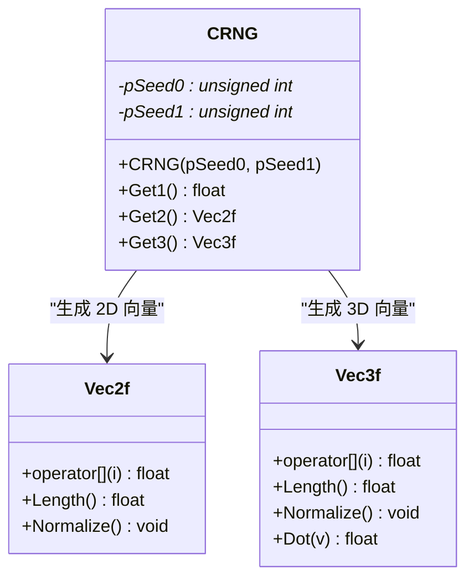
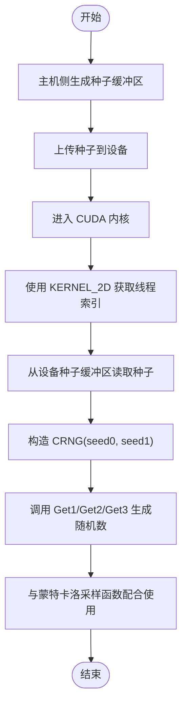
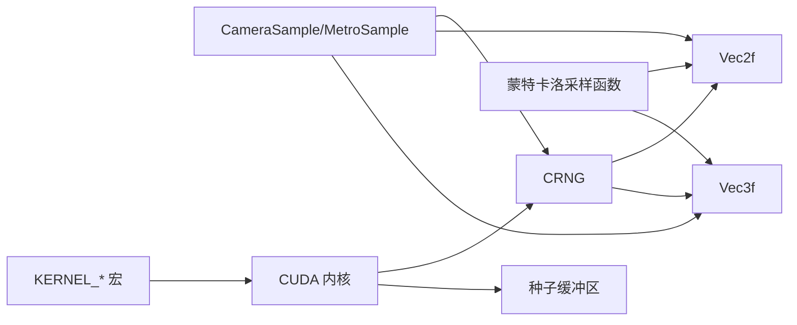

# 随机数生成器

<cite>
**本文引用的文件**
- [rng.h](file://Source/rng.h)
- [montecarlo.h](file://Source/montecarlo.h)
- [sample.h](file://Source/sample.h)
- [geometry.h](file://Source/geometry.h)
- [vector.h](file://Source/vector.h)
- [macros.cuh](file://Source/macros.cuh)
- [buffer2d.h](file://Source/buffer2d.h)
- [core.cu](file://Source/core.cu)
</cite>

## 目录
1. [简介](#简介)
2. [项目结构](#项目结构)
3. [核心组件](#核心组件)
4. [架构总览](#架构总览)
5. [详细组件分析](#详细组件分析)
6. [依赖分析](#依赖分析)
7. [性能考虑](#性能考虑)
8. [故障排查指南](#故障排查指南)
9. [结论](#结论)
10. [附录](#附录)

## 简介
本文件围绕随机数生成器系统进行深入解析，重点覆盖 CRNG 类的实现细节、调用关系、接口设计与使用模式，并结合实际代码库中的示例说明如何初始化种子、生成 1D/2D/3D 随机数，以及在 CUDA 内核中使用。文档还记录了配置选项、参数与返回值，解释 HOST_DEVICE 修饰符的作用与 GPU/CPU 兼容性，讨论随机数质量、性能优化与线程安全问题，力求对初学者友好且对有经验的开发者提供足够的技术深度。

## 项目结构
随机数生成器系统主要由以下模块组成：
- CRNG 类：提供 CPU/GPU 双端可编译的伪随机数生成能力（1D/2D/3D）。
- 样本采样模块：CameraSample、MetroSample 等使用 CRNG 进行大步进与变异。
- 几何与向量类型：Vec2f、Vec3f 等用于返回多维随机向量。
- 宏与内核框架：CUDA 内核启动宏与线程块/网格维度定义。
- 缓冲区与种子：二维种子缓冲区用于在设备侧存储每像素/每线程的种子状态。

**图表来源**
- [rng.h:26-66](file://Source/rng.h#L26-L66)
- [sample.h:175-249](file://Source/sample.h#L175-L249)
- [montecarlo.h:72-221](file://Source/montecarlo.h#L72-L221)
- [macros.cuh:75-101](file://Source/macros.cuh#L75-L101)
- [buffer2d.h:265-286](file://Source/buffer2d.h#L265-L286)

**章节来源**
- [rng.h:26-66](file://Source/rng.h#L26-L66)
- [sample.h:175-249](file://Source/sample.h#L175-L249)
- [montecarlo.h:72-221](file://Source/montecarlo.h#L72-L221)
- [macros.cuh:75-101](file://Source/macros.cuh#L75-L101)
- [buffer2d.h:265-286](file://Source/buffer2d.h#L265-L286)

## 核心组件
- CRNG 类
  - 接口：构造函数接收两个无符号整型指针作为种子；提供 Get1、Get2、Get3 方法分别生成 1D/2D/3D 浮点随机向量。
  - 实现要点：内部通过线性同余法更新两个 32 位种子，组合为 32 位整数后按 IEEE 754 规则转换为浮点数，再映射到 [-1,1] 区间。
  - 修饰符：所有成员函数带有 HOST_DEVICE，确保在 CPU 与 CUDA 设备上均可编译与运行。
- 样本采样模块
  - CameraSample 使用 CRNG 生成二维随机样本（胶片平面与镜头平面）。
  - MetroSample 与 MetroSample::LargeStep/Mutate 使用 CRNG 进行大步进与变异。
- 蒙特卡洛辅助函数
  - 提供均匀/各向异性分布的几何采样（如半球、球面、圆盘），常与 CRNG 的 1D/2D 输出配合使用。
- 宏与内核框架
  - 提供 KERNEL_1D/KERNEL_2D/KERNEL_3D 宏，用于在 CUDA 内核中快速声明线程索引与边界检查。
- 种子缓冲区
  - RandomSeedBuffer2D 在主机侧生成每像素种子并上传至设备，供内核按线程索引访问。

**章节来源**
- [rng.h:26-66](file://Source/rng.h#L26-L66)
- [sample.h:175-249](file://Source/sample.h#L175-L249)
- [montecarlo.h:72-221](file://Source/montecarlo.h#L72-L221)
- [macros.cuh:75-101](file://Source/macros.cuh#L75-L101)
- [buffer2d.h:265-286](file://Source/buffer2d.h#L265-L286)

## 架构总览
CRNG 位于渲染管线的采样阶段，通常与样本对象（如 CameraSample）协作，生成随机方向或偏移，随后被蒙特卡洛采样函数使用。在 CUDA 内核中，通过 KERNEL_* 宏确定线程索引，从设备侧的种子缓冲区读取对应种子，构造 CRNG 并生成随机数。

**图表来源**
- [buffer2d.h:265-286](file://Source/buffer2d.h#L265-L286)
- [rng.h:29-61](file://Source/rng.h#L29-L61)
- [sample.h:208-231](file://Source/sample.h#L208-L231)
- [macros.cuh:75-101](file://Source/macros.cuh#L75-L101)

## 详细组件分析

### CRNG 类分析
- 类图

- 接口与行为
  - 构造函数：接收两个无符号整型指针作为种子，分别保存在类成员中。
  - Get1：更新两个种子并组合为 32 位整数，按 IEEE 754 将其解释为浮点数，映射到 [-1,1]。
  - Get2/Get3：连续调用 Get1 组合为二维/三维向量。
- 数据流与复杂度
  - 每次 Get1 执行 O(1) 的算术与位操作，空间复杂度 O(1)。
  - Get2/Get3 为 O(1) 复杂度，额外开销为多次 Get1 调用。
- 错误处理与边界
  - 该实现未显式错误处理；调用方需保证传入的种子指针有效且在 GPU/CPU 上均可访问。
- 线程安全
  - CRNG 不持有全局状态；只要每个线程/像素拥有独立的种子副本，即可避免竞争。

**图表来源**
- [rng.h:26-66](file://Source/rng.h#L26-L66)
- [vector.h:450-549](file://Source/vector.h#L450-L549)

**章节来源**
- [rng.h:26-66](file://Source/rng.h#L26-L66)
- [vector.h:450-549](file://Source/vector.h#L450-L549)

### HOST_DEVICE 修饰符与兼容性
- 作用
  - HOST_DEVICE 修饰符确保函数既能在 CPU（主机）编译，也能在 CUDA 设备（内核）编译，从而实现跨端复用。
- 兼容性
  - 在 CPU 端，该函数以普通函数形式编译；在 CUDA 编译时，函数体被嵌入到设备代码路径。
- 注意事项
  - 使用该修饰符的函数应仅依赖可移植的标量与向量类型，避免使用不支持的平台特性。

**章节来源**
- [rng.h:29-61](file://Source/rng.h#L29-L61)

### 初始化种子与在 CUDA 内核中使用
- 主机侧初始化
  - RandomSeedBuffer2D::Resize 在主机侧为每个像素生成随机种子并设置缓冲区数据。
- 设备侧使用
  - 在 CUDA 内核中，通过 KERNEL_* 宏获取线程索引，从设备侧种子缓冲区读取对应种子，构造 CRNG 并生成随机数。
- 示例流程（概念性）

**图表来源**
- [buffer2d.h:273-285](file://Source/buffer2d.h#L273-L285)
- [macros.cuh:83-90](file://Source/macros.cuh#L83-L90)
- [rng.h:29-61](file://Source/rng.h#L29-L61)

**章节来源**
- [buffer2d.h:273-285](file://Source/buffer2d.h#L273-L285)
- [macros.cuh:83-90](file://Source/macros.cuh#L83-L90)
- [rng.h:29-61](file://Source/rng.h#L29-L61)

### 与样本对象的集成
- CameraSample
  - LargeStep 使用 CRNG 生成二维随机样本（胶片与镜头）。
- MetroSample
  - LargeStep/Mutate 使用 CRNG 进行大步进与局部变异。
- 与蒙特卡洛采样函数配合
  - 例如均匀采样半球、球面等，常与 CRNG 的 2D/3D 输出配合使用。

**章节来源**
- [sample.h:175-249](file://Source/sample.h#L175-L249)
- [montecarlo.h:72-221](file://Source/montecarlo.h#L72-L221)

## 依赖分析
- CRNG 依赖
  - Vec2f/Vec3f：用于返回多维随机向量。
  - HOST_DEVICE：确保跨端编译。
- 样本模块依赖
  - CRNG：用于生成随机样本。
  - Vec2f/Vec3f：承载样本值。
- 蒙特卡洛模块依赖
  - Vec2f/Vec3f：几何采样结果。
  - 常与 CRNG 的 1D/2D 输出配合使用。
- 宏与内核框架
  - KERNEL_* 宏：简化内核索引计算与边界检查。
- 种子缓冲区
  - 为设备侧提供每像素/每线程种子，供 CRNG 使用。

**图表来源**
- [rng.h:26-66](file://Source/rng.h#L26-L66)
- [sample.h:175-249](file://Source/sample.h#L175-L249)
- [montecarlo.h:72-221](file://Source/montecarlo.h#L72-L221)
- [macros.cuh:75-101](file://Source/macros.cuh#L75-L101)
- [buffer2d.h:265-286](file://Source/buffer2d.h#L265-L286)

**章节来源**
- [rng.h:26-66](file://Source/rng.h#L26-L66)
- [sample.h:175-249](file://Source/sample.h#L175-L249)
- [montecarlo.h:72-221](file://Source/montecarlo.h#L72-L221)
- [macros.cuh:75-101](file://Source/macros.cuh#L75-L101)
- [buffer2d.h:265-286](file://Source/buffer2d.h#L265-L286)

## 性能考虑
- 复杂度与吞吐
  - CRNG 的 Get1/Get2/Get3 均为 O(1)，适合高并发内核执行。
- 内存访问
  - 种子缓冲区建议与像素布局一致，减少设备内存带宽压力。
- 线程绑定
  - 每个线程/像素拥有独立种子，避免同步与竞争。
- 与采样函数协同
  - 将 CRNG 的 1D/2D 输出与蒙特卡洛采样函数组合，可减少额外分支与临时变量。
- CUDA 启动与同步
  - 使用宏与事件计时可帮助定位内核瓶颈。

[本节为通用性能指导，无需特定文件引用]

## 故障排查指南
- 常见问题
  - 种子无效：确保传入 CRNG 的种子指针在设备/主机侧均有效且可访问。
  - 结果异常：确认种子初始值合理，避免全零或退化种子导致序列质量差。
  - 线程冲突：确保每线程/像素拥有独立种子副本，避免共享同一种子地址。
- 定位方法
  - 在主机侧打印/验证种子缓冲区内容。
  - 在内核中加入简单断言或调试输出，检查索引与边界。
  - 使用 CUDA 宏进行内核计时，识别热点。

**章节来源**
- [buffer2d.h:273-285](file://Source/buffer2d.h#L273-L285)
- [macros.cuh:41-73](file://Source/macros.cuh#L41-L73)

## 结论
CRNG 类提供了轻量、高效且跨端兼容的随机数生成能力，适合作为渲染管线采样阶段的基础组件。通过与样本对象、蒙特卡洛采样函数及 CUDA 内核宏的协同，可在 CPU/GPU 上稳定生成高质量的 1D/2D/3D 随机向量。实践中需关注种子初始化、内存布局与线程隔离，以获得最佳性能与质量。

[本节为总结性内容，无需特定文件引用]

## 附录

### 接口与参数速查
- CRNG 构造函数
  - 参数：seed0、seed1（指向无符号整型的指针）
  - 返回：无
- CRNG::Get1
  - 返回：单精度浮点数，范围近似 [-1,1]
- CRNG::Get2
  - 返回：二维向量（Vec2f）
- CRNG::Get3
  - 返回：三维向量（Vec3f）
- HOST_DEVICE
  - 作用：允许在 CPU 与 CUDA 设备上编译

**章节来源**
- [rng.h:29-61](file://Source/rng.h#L29-L61)

### 使用模式示例（基于实际文件）
- 初始化种子缓冲区（主机侧）
  - 参考：[buffer2d.h:273-285](file://Source/buffer2d.h#L273-L285)
- 在 CUDA 内核中使用
  - 参考：[macros.cuh:83-90](file://Source/macros.cuh#L83-L90)
  - 参考：[rng.h:29-61](file://Source/rng.h#L29-L61)
- 与样本对象集成
  - 参考：[sample.h:208-231](file://Source/sample.h#L208-L231)
- 与蒙特卡洛采样函数配合
  - 参考：[montecarlo.h:72-221](file://Source/montecarlo.h#L72-L221)