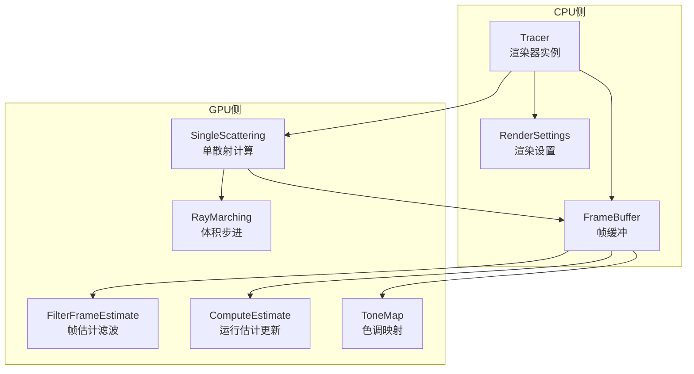
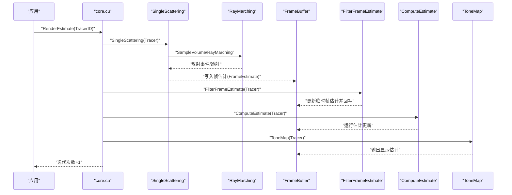
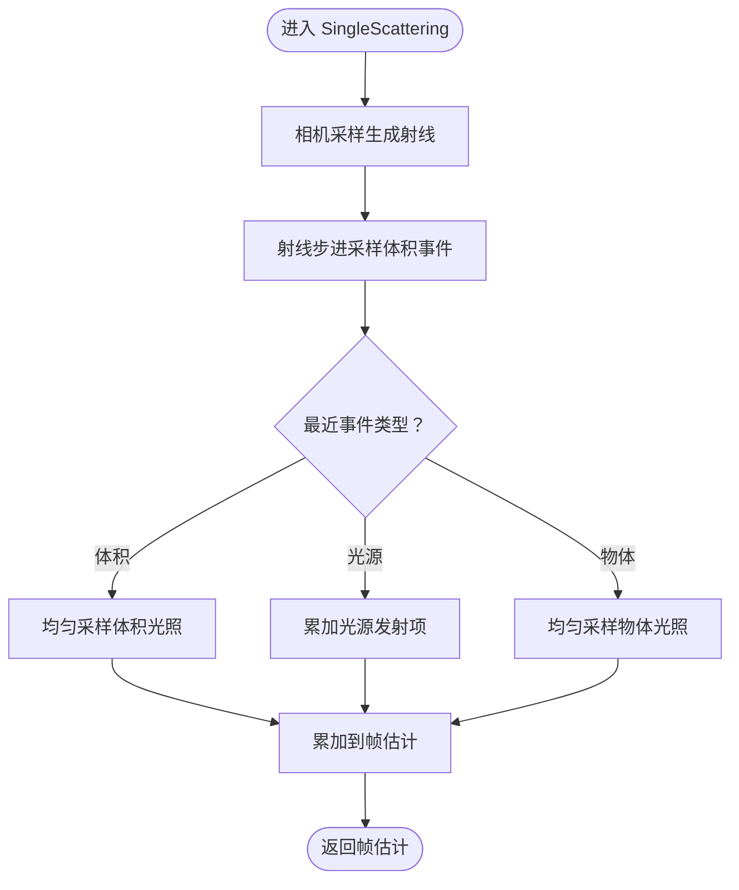
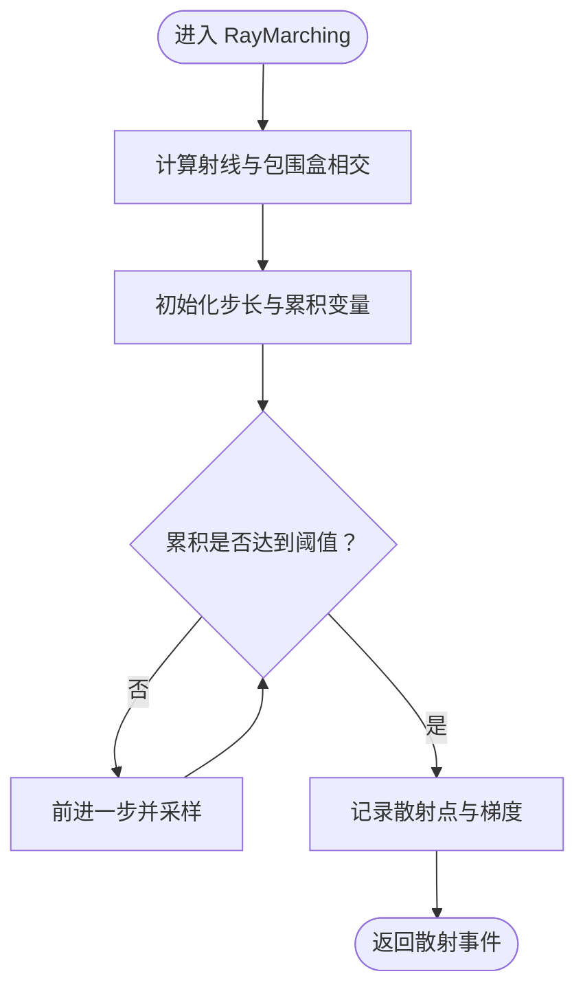
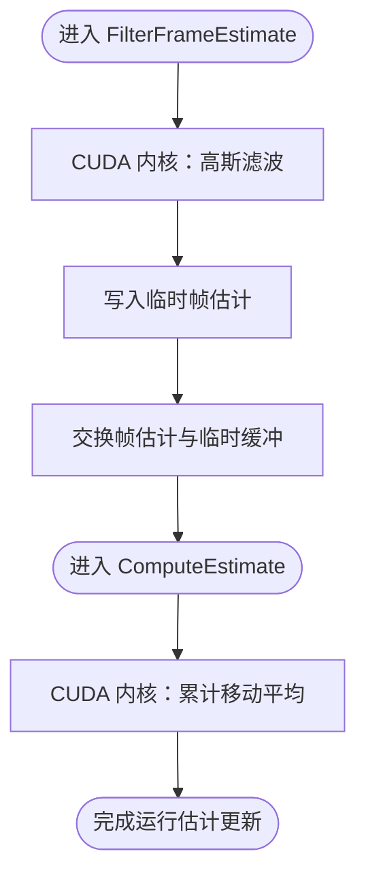
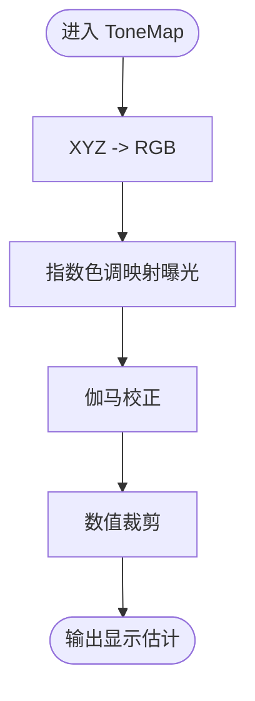
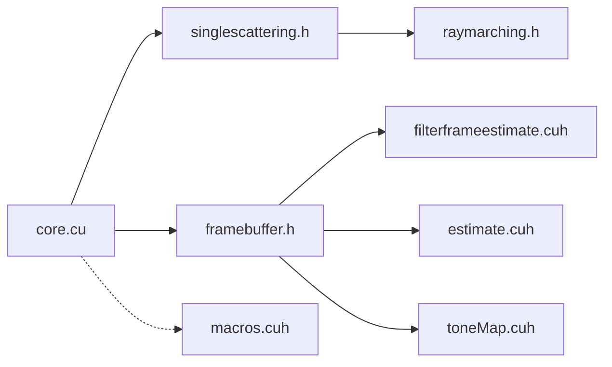

# 技术特色

<cite>
**本文引用的文件**
- [core.cu](file://Source/core.cu)
- [singlescattering.h](file://Source/singlescattering.h)
- [raymarching.h](file://Source/raymarching.h)
- [filterframeestimate.cuh](file://Source/filterframeestimate.cuh)
- [estimate.cuh](file://Source/estimate.cuh)
- [toneMap.cuh](file://Source/toneMap.cuh)
- [tracer.h](file://Source/tracer.h)
- [framebuffer.h](file://Source/framebuffer.h)
- [rendersettings.h](file://Source/rendersettings.h)
- [volume.h](file://Source/volume.h)
- [macros.cuh](file://Source/macros.cuh)
- [README.md](file://README.md)
</cite>

## 目录
1. [引言](#引言)
2. [项目结构](#项目结构)
3. [核心组件](#核心组件)
4. [架构总览](#架构总览)
5. [详细组件分析](#详细组件分析)
6. [依赖关系分析](#依赖关系分析)
7. [性能考量](#性能考量)
8. [故障排查指南](#故障排查指南)
9. [结论](#结论)
10. [附录](#附录)

## 引言
本文件系统化阐述曝光渲染框架（Exposure Render）的技术特色与实现要点，聚焦以下核心能力：
- 基于CUDA的GPU加速渲染管线
- 物理正确的光线传输算法（单散射、阴影、重要性采样）
- 交互式实时渲染流程（多帧采样与降噪、可见性扫描）
- 在医学影像与科学可视化的应用优势
- 通过关键算法模块与数据流图示，直观展示从相机采样到最终显示的完整路径

该框架以CUDA为核心执行平台，采用体积光线步进（volume ray marching）与单散射积分相结合的方式，在保证视觉真实感的同时，实现可交互的渲染体验。

## 项目结构
围绕“渲染管线”这一主线，项目采用分层组织：核心调度与绑定（core.cu）、几何与采样（raymarching.h、singlescattering.h）、帧缓冲与估计（framebuffer.h、estimate.cuh、filterframeestimate.cuh）、色调映射（toneMap.cuh）、渲染设置（rendersettings.h）、以及体积数据抽象（volume.h）。宏与设备侧工具（macros.cuh）贯穿所有CUDA内核调用与计时。

图表来源
- [core.cu:126-136](file://Source/core.cu#L126-L136)
- [singlescattering.h:76-102](file://Source/singlescattering.h#L76-L102)
- [raymarching.h:30-71](file://Source/raymarching.h#L30-L71)
- [filterframeestimate.cuh:66-74](file://Source/filterframeestimate.cuh#L66-L74)
- [estimate.cuh:34-38](file://Source/estimate.cuh#L34-L38)
- [toneMap.cuh:61-65](file://Source/toneMap.cuh#L61-L65)
- [framebuffer.h:26-105](file://Source/framebuffer.h#L26-L105)
- [rendersettings.h:27-131](file://Source/rendersettings.h#L27-L131)

章节来源
- [core.cu:19-156](file://Source/core.cu#L19-L156)
- [README.md:14-22](file://README.md#L14-L22)

## 核心组件
- 渲染器与帧缓冲：Tracer封装渲染状态与FrameBuffer；FrameBuffer管理多通道缓冲（帧估计、运行估计、显示估计、随机种子等），支持动态尺寸调整与重置。
- 单散射计算：对每个像素生成一次相机采样，沿射线步进，采样体积散射事件，统一采样光照贡献，输出帧估计。
- 体积步进：基于体积包围盒与步长策略进行主光线步进，累积透射与密度，确定首次散射点。
- 多帧估计与降噪：高斯滤波对帧估计进行空间平滑，结合运行平均更新显示估计，逐步收敛。
- 色调映射：将XYZ颜色空间估计映射到RGB并进行曝光与伽马校正，输出最终像素值。
- 渲染设置：包含遍历步长因子、阴影开关与最大距离、密度缩放、梯度阈值与因子等参数，直接影响质量与性能。

章节来源
- [tracer.h:31-55](file://Source/tracer.h#L31-L55)
- [framebuffer.h:26-105](file://Source/framebuffer.h#L26-L105)
- [singlescattering.h:76-102](file://Source/singlescattering.h#L76-L102)
- [raymarching.h:30-71](file://Source/raymarching.h#L30-L71)
- [filterframeestimate.cuh:66-74](file://Source/filterframeestimate.cuh#L66-L74)
- [estimate.cuh:34-38](file://Source/estimate.cuh#L34-L38)
- [toneMap.cuh:61-65](file://Source/toneMap.cuh#L61-L65)
- [rendersettings.h:27-131](file://Source/rendersettings.h#L27-L131)

## 架构总览
下图展示了从渲染器入口到最终显示的关键步骤：绑定资源、单散射计算、帧估计滤波、运行估计更新、色调映射与像素输出。

图表来源
- [core.cu:126-136](file://Source/core.cu#L126-L136)
- [singlescattering.h:76-102](file://Source/singlescattering.h#L76-L102)
- [raymarching.h:30-71](file://Source/raymarching.h#L30-L71)
- [filterframeestimate.cuh:66-74](file://Source/filterframeestimate.cuh#L66-L74)
- [estimate.cuh:34-38](file://Source/estimate.cuh#L34-L38)
- [toneMap.cuh:61-65](file://Source/toneMap.cuh#L61-L65)

## 详细组件分析

### 单散射计算（Single Scattering）
- 功能概述：为每个像素生成一次相机射线，沿射线步进采样体积散射事件，统一采样光照贡献，得到当前帧的估计值。
- 关键流程：
  - 相机采样：根据像素坐标与相机配置生成射线（含景深与焦距）。
  - 射线事件：分别采样体积散射、光源相交与物体相交，取最近事件。
  - 光照采样：对体积散射事件进行均匀重要性采样，对光源与物体散射事件直接累加相应辐射或发射项。
- 算法特性：单次散射近似简化了多次散射的复杂度，同时保留主要光照贡献，适合交互式渲染。

图表来源
- [singlescattering.h:29-50](file://Source/singlescattering.h#L29-L50)
- [singlescattering.h:52-74](file://Source/singlescattering.h#L52-L74)
- [singlescattering.h:76-102](file://Source/singlescattering.h#L76-L102)

章节来源
- [singlescattering.h:29-102](file://Source/singlescattering.h#L29-L102)

### 体积步进与可见性扫描（Ray Marching）
- 功能概述：在射线与体积包围盒相交范围内进行步进，依据密度与步长累积透射，确定首次散射点；同时提供阴影步进策略。
- 关键流程：
  - 计算射线与包围盒的近远参数。
  - 按步长因子与最小步长进行随机偏移后步进。
  - 采样体素强度，查表获得消光系数，累积至阈值后停止，记录散射点与梯度。
- 可见性扫描：通过阴影步进策略评估遮挡，控制阴影质量与性能。

图表来源
- [raymarching.h:30-71](file://Source/raymarching.h#L30-L71)
- [raymarching.h:73-113](file://Source/raymarching.h#L73-L113)

章节来源
- [raymarching.h:30-113](file://Source/raymarching.h#L30-L113)

### 多帧采样与降噪（FilterFrameEstimate + ComputeEstimate）
- 功能概述：对每帧估计进行高斯空间滤波，抑制噪声；使用累计移动平均更新运行估计，提升稳定性与收敛速度。
- 关键流程：
  - 高斯滤波：对邻域像素按权重求和并归一化，生成临时帧估计并回写。
  - 运行估计：对当前帧估计与历史运行估计做移动平均，逐步消除方差。
- 性能特征：滤波与平均均为2D并行操作，适合GPU大规模线程并行。

图表来源
- [filterframeestimate.cuh:66-74](file://Source/filterframeestimate.cuh#L66-L74)
- [estimate.cuh:34-38](file://Source/estimate.cuh#L34-L38)

章节来源
- [filterframeestimate.cuh:28-74](file://Source/filterframeestimate.cuh#L28-L74)
- [estimate.cuh:27-38](file://Source/estimate.cuh#L27-L38)

### 色调映射（ToneMapping）
- 功能概述：将XYZ颜色估计映射到RGB，应用曝光与伽马校正，输出显示估计。
- 关键流程：指数色调映射函数与分量级伽马校正，确保高光不过曝并保持细节。

图表来源
- [toneMap.cuh:30-47](file://Source/toneMap.cuh#L30-L47)
- [toneMap.cuh:49-65](file://Source/toneMap.cuh#L49-L65)

章节来源
- [toneMap.cuh:30-65](file://Source/toneMap.cuh#L30-L65)

### 渲染设置与体积数据抽象
- 渲染设置：包含遍历步长因子、阴影开关与最大距离、密度缩放、梯度计算模式与阈值等，影响渲染质量与速度平衡。
- 体积数据：封装体数据的间距、尺寸、最小步长与梯度增量，提供体素查询接口。

章节来源
- [rendersettings.h:27-131](file://Source/rendersettings.h#L27-L131)
- [volume.h:26-150](file://Source/volume.h#L26-L150)

## 依赖关系分析
- 组件耦合：core.cu作为入口协调各阶段；singlescattering.h与raymarching.h共同完成单散射与步进；framebuffer.h承载中间结果；estimate.cuh与filterframeestimate.cuh负责估计更新与滤波；toneMap.cuh负责最终输出。
- 设备侧宏：macros.cuh提供内核启动维度、计时与通用索引宏，统一CUDA内核风格与性能监控。

图表来源
- [core.cu:126-136](file://Source/core.cu#L126-L136)
- [singlescattering.h:76-102](file://Source/singlescattering.h#L76-L102)
- [raymarching.h:30-71](file://Source/raymarching.h#L30-L71)
- [filterframeestimate.cuh:66-74](file://Source/filterframeestimate.cuh#L66-L74)
- [estimate.cuh:34-38](file://Source/estimate.cuh#L34-L38)
- [toneMap.cuh:61-65](file://Source/toneMap.cuh#L61-L65)
- [framebuffer.h:26-105](file://Source/framebuffer.h#L26-L105)
- [macros.cuh:27-101](file://Source/macros.cuh#L27-L101)

章节来源
- [macros.cuh:27-101](file://Source/macros.cuh#L27-L101)

## 性能考量
- GPU并行策略：所有关键内核均采用2D线程块布局，利用CUDA的线程级并行与共享内存优化，显著缩短单帧渲染时间。
- 步长与收敛：通过密度缩放与步长因子控制体积步进效率；累计移动平均与空间滤波降低噪声，提高视觉质量。
- 实时交互：结合多帧估计与降噪，可在较低帧率下维持稳定画面，满足交互式浏览需求。
- 系统要求：支持NVIDIA CUDA兼容GPU，具备较高显存容量以容纳体积数据与中间缓冲。

章节来源
- [README.md:17-22](file://README.md#L17-L22)
- [rendersettings.h:66-106](file://Source/rendersettings.h#L66-L106)
- [framebuffer.h:45-74](file://Source/framebuffer.h#L45-L74)

## 故障排查指南
- CUDA错误检查：内核调用前后使用统一的错误检查与计时宏，便于定位异常与测量耗时。
- 帧缓冲一致性：确保在滤波与估计更新之间正确交换缓冲指针，避免读写竞争。
- 参数敏感性：若出现过曝或欠曝，调整曝光与伽马参数；若噪声明显，增加迭代次数或增大滤波半径。

章节来源
- [macros.cuh:41-73](file://Source/macros.cuh#L41-L73)
- [filterframeestimate.cuh:66-74](file://Source/filterframeestimate.cuh#L66-L74)
- [toneMap.cuh:61-65](file://Source/toneMap.cuh#L61-L65)

## 结论
曝光渲染框架通过“单散射 + 体积步进 + 多帧估计 + 降噪 + 色调映射”的组合，实现了在GPU上的高效、可交互体积渲染。其物理正确的光线传输与稳定的收敛机制，使其在医学影像与科学可视化领域具有突出价值：既能呈现真实的光学现象，又能在交互场景中快速响应用户操作。

## 附录
- 算法参考：框架实现与论文《An interactive photo-realistic volume rendering framework》及《Visibility sweeps for joint-hierarchical importance sampling of direct lighting for stochastic volume rendering》一致，强调可见性扫描与重要性采样的结合。
- 应用场景：医学影像（CT/MRI）解剖结构可视化、科学计算（流场、等值面）展示、工业CT等高对比度体积数据的高质量渲染。

章节来源
- [README.md:4-8](file://README.md#L4-L8)