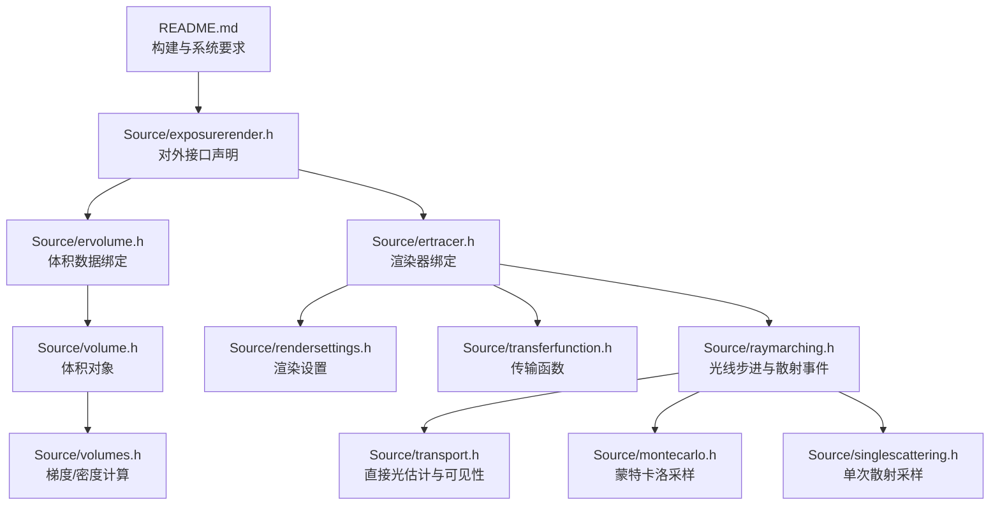
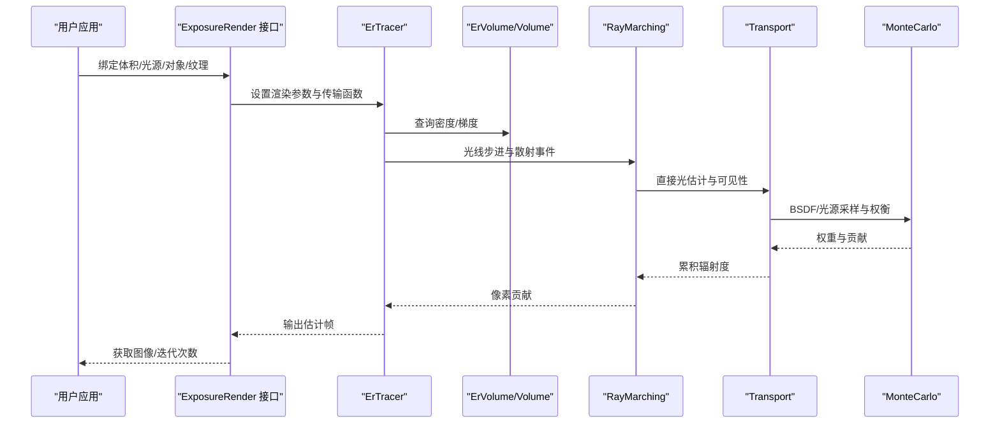
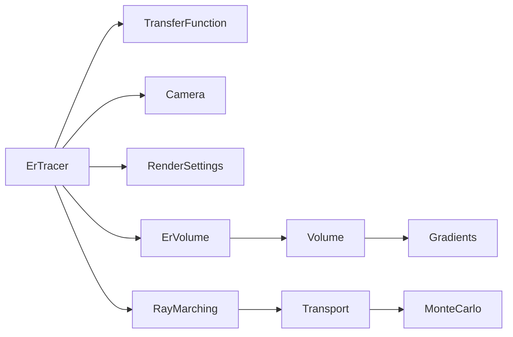

# 目标用户

<cite>
**本文引用的文件**
- [README.md](file://README.md)
- [exposurerender.h](file://Source/exposurerender.h)
- [exposurerender.cpp](file://Source/exposurerender.cpp)
- [ervolume.h](file://Source/ervolume.h)
- [volume.h](file://Source/volume.h)
- [volumes.h](file://Source/volumes.h)
- [ertracer.h](file://Source/ertracer.h)
- [rendersettings.h](file://Source/rendersettings.h)
- [transferfunction.h](file://Source/transferfunction.h)
- [enums.h](file://Source/enums.h)
- [raymarching.h](file://Source/raymarching.h)
- [transport.h](file://Source/transport.h)
- [montecarlo.h](file://Source/montecarlo.h)
- [singlescattering.h](file://Source/singlescattering.h)
</cite>

## 目录
1. [简介](#简介)
2. [项目结构](#项目结构)
3. [核心组件](#核心组件)
4. [架构总览](#架构总览)
5. [详细组件分析](#详细组件分析)
6. [依赖关系分析](#依赖关系分析)
7. [性能考量](#性能考量)
8. [故障排查指南](#故障排查指南)
9. [结论](#结论)
10. [附录](#附录)

## 简介
本文件聚焦于曝光渲染框架（Exposure Render）的目标用户群体与典型应用场景，结合源码中的数据模型、渲染管线与接口设计，系统阐述以下用户群体的需求与适配性：医学影像处理工程师、科学研究人员、计算机图形学研究人员、以及需要进行高质量体积数据可视化的专业用户。同时给出入门建议与技术要求，帮助判断该框架是否适用于特定任务。

## 项目结构
从仓库结构可见，该项目采用分层与模块化组织方式：
- 核心渲染与绑定接口位于 Source 目录，包含体积、光线步进、传输、着色器、采样、枚举、渲染设置、传输函数等子系统。
- README 提供了构建说明、系统要求与开发者信息，明确了平台与硬件要求。
- Images/Movies 为示例资源目录，便于快速验证与演示。

图表来源
- [README.md:14-22](file://README.md#L14-L22)
- [exposurerender.h:32-42](file://Source/exposurerender.h#L32-L42)
- [ervolume.h:63-69](file://Source/ervolume.h#L63-L69)
- [ertracer.h:105-116](file://Source/ertracer.h#L105-L116)
- [rendersettings.h:27-131](file://Source/rendersettings.h#L27-L131)
- [transferfunction.h:82-154](file://Source/transferfunction.h#L82-L154)
- [volume.h:26-150](file://Source/volume.h#L26-L150)
- [volumes.h:26-114](file://Source/volumes.h#L26-L114)
- [raymarching.h:30-113](file://Source/raymarching.h#L30-L113)
- [transport.h:30-101](file://Source/transport.h#L30-L101)
- [montecarlo.h:27-229](file://Source/montecarlo.h#L27-L229)
- [singlescattering.h:76-102](file://Source/singlescattering.h#L76-L102)

章节来源
- [README.md:14-22](file://README.md#L14-L22)
- [exposurerender.h:32-42](file://Source/exposurerender.h#L32-L42)

## 核心组件
- 渲染器绑定（ErTracer）：封装传输函数、相机、渲染设置、光源与对象索引，负责驱动一次渲染迭代。
- 体积绑定（ErVolume）：承载体数据（分辨率、间距、体素缓冲），支持主机侧绑定与归一化尺寸控制。
- 体积对象（Volume）：在设备侧维护边界盒、间距、最小步长、梯度增量等，提供体数据查询与梯度计算。
- 渲染设置（RenderSettings）：包含遍历步长因子、阴影、最大阴影距离、着色类型、密度缩放、梯度计算模式等。
- 传输函数（Scalar/Color Transfer Function）：基于分段线性函数（PLF）定义不透明度、漫反射、镜面反射、光泽度与发射的颜色映射。
- 光线步进与散射（RayMarching/Transport）：实现体积内随机行走、散射事件判定、直接光估计与可见性检测。
- 蒙特卡洛采样（MonteCarlo）：提供球面、半球、圆盘等几何采样与 PDF 计算，支撑 BSDF 与光源采样。
- 单次散射（SingleScattering）：对像素级光线进行单次散射采样，作为基础渲染通道之一。

章节来源
- [ertracer.h:33-117](file://Source/ertracer.h#L33-L117)
- [ervolume.h:28-74](file://Source/ervolume.h#L28-L74)
- [volume.h:26-150](file://Source/volume.h#L26-L150)
- [rendersettings.h:27-131](file://Source/rendersettings.h#L27-L131)
- [transferfunction.h:82-154](file://Source/transferfunction.h#L82-L154)
- [raymarching.h:30-113](file://Source/raymarching.h#L30-L113)
- [transport.h:30-101](file://Source/transport.h#L30-L101)
- [montecarlo.h:27-229](file://Source/montecarlo.h#L27-L229)
- [singlescattering.h:76-102](file://Source/singlescattering.h#L76-L102)

## 架构总览
曝光渲染框架以“体积数据 + 物理光照 + 随机行走”的路径为基础，通过绑定接口将用户数据注入到渲染器中，并由渲染设置与传输函数共同决定最终图像质量与风格。下图展示了从外部调用到渲染管线的关键交互：

图表来源
- [exposurerender.h:32-42](file://Source/exposurerender.h#L32-L42)
- [ertracer.h:105-116](file://Source/ertracer.h#L105-L116)
- [ervolume.h:63-69](file://Source/ervolume.h#L63-L69)
- [volume.h:131-138](file://Source/volume.h#L131-L138)
- [volumes.h:76-91](file://Source/volumes.h#L76-L91)
- [raymarching.h:30-113](file://Source/raymarching.h#L30-L113)
- [transport.h:58-101](file://Source/transport.h#L58-L101)
- [montecarlo.h:223-229](file://Source/montecarlo.h#L223-L229)

## 详细组件分析

### 医学影像处理工程师
- 典型需求
  - 高保真可视化：利用物理光照与体积渲染增强解剖结构细节，满足诊断与术前规划。
  - 可定制传输函数：通过不透明度与颜色映射突出血管、器官或病变区域。
  - 实时交互：在可接受延迟内调整渲染参数，提升工作流效率。
- 适配性与入口
  - 使用体积绑定接口导入 DICOM 或 NIfTI 等医学数据，设置间距与归一化。
  - 通过渲染设置调节密度缩放与梯度计算，改善边界感知。
  - 利用传输函数为不同组织设定映射，结合光源与材质参数优化明暗层次。
- 技术要求
  - 拥有 CUDA 兼容 GPU 与足够显存；遵循系统要求与测试配置。
  - 熟悉体积数据格式与坐标系，确保间距与方向正确。
  - 了解基本的光学与散射概念，有助于调参与效果评估。

章节来源
- [README.md:17-22](file://README.md#L17-L22)
- [ervolume.h:63-69](file://Source/ervolume.h#L63-L69)
- [rendersettings.h:66-106](file://Source/rendersettings.h#L66-L106)
- [transferfunction.h:82-154](file://Source/transferfunction.h#L82-L154)

### 科学研究人员
- 典型需求
  - 多尺度可视化：从分子到宏观尺度的数据统一渲染，强调真实感与一致性。
  - 定量分析：通过传输函数与着色参数量化密度、梯度等特征。
  - 批量生成：自动化渲染序列（时间序列、参数扫描）以支持论文与报告。
- 适配性与入口
  - 使用体积对象与梯度计算接口，结合传输函数实现多通道映射。
  - 通过渲染设置中的步长因子与阴影策略平衡质量与性能。
  - 在单次散射与直接光估计之间选择，兼顾真实感与速度。
- 技术要求
  - 熟练掌握 CUDA 编程与内存管理，以便扩展与优化。
  - 理解随机行走与重要性采样的原理，指导参数选择。

章节来源
- [volumes.h:76-114](file://Source/volumes.h#L76-L114)
- [rendersettings.h:30-64](file://Source/rendersettings.h#L30-L64)
- [raymarching.h:30-113](file://Source/raymarching.h#L30-L113)
- [transport.h:58-101](file://Source/transport.h#L58-L101)

### 计算机图形学研究人员
- 典型需求
  - 算法验证与对比：在统一框架下评估不同散射模型、采样策略与着色方案。
  - 参数敏感性分析：探索密度缩放、步长因子、梯度阈值对收敛与视觉质量的影响。
  - 扩展与插件化：基于现有绑定接口添加新光源、材质或传输函数。
- 适配性与入口
  - 通过枚举与渲染设置切换着色模式与梯度计算方法。
  - 使用蒙特卡洛采样模块进行重要性采样与权衡策略实验。
  - 借助单次散射与体积步进模块进行算法级调试与性能剖析。
- 技术要求
  - 深入理解光线步进、散射事件与直接光估计的实现细节。
  - 具备图形学理论基础（BRDF、相函数、路径追踪思想）。

章节来源
- [enums.h:63-107](file://Source/enums.h#L63-L107)
- [rendersettings.h:66-106](file://Source/rendersettings.h#L66-L106)
- [montecarlo.h:223-229](file://Source/montecarlo.h#L223-L229)
- [singlescattering.h:76-102](file://Source/singlescattering.h#L76-L102)

### 教育演示与教学
- 典型需求
  - 清晰直观：通过传输函数与着色参数展示体积渲染的物理意义。
  - 交互式教学：实时调整步长、密度与光源，观察对渲染结果的影响。
  - 多媒体素材：配合医学或科学数据集进行课堂演示。
- 适配性与入口
  - 使用体积绑定接口加载公开数据集，快速生成演示图像。
  - 通过渲染设置与传输函数的可视化调整，讲解渲染原理。
  - 结合自动对焦与估计迭代接口，展示交互式渲染流程。
- 技术要求
  - 熟悉基本的渲染参数含义与调优思路。
  - 了解体积渲染在医学与科学可视化中的价值。

章节来源
- [README.md:34-42](file://README.md#L34-L42)
- [exposurerender.h:39-42](file://Source/exposurerender.h#L39-L42)
- [rendersettings.h:27-131](file://Source/rendersettings.h#L27-L131)
- [transferfunction.h:82-154](file://Source/transferfunction.h#L82-L154)

## 依赖关系分析
- 组件耦合
  - 渲染器（ErTracer）依赖传输函数、相机与渲染设置，同时通过索引关联光源与对象。
  - 体积（Volume）依赖传输函数中的不透明度映射与梯度计算。
  - 光线步进（RayMarching）依赖体积对象的密度查询与渲染设置的步长策略。
  - 直接光估计（Transport）依赖蒙特卡洛采样与可见性检测。
- 外部依赖
  - CUDA 运行时与兼容 GPU 是执行条件。
  - 平台与驱动版本需满足系统要求与测试配置。

图表来源
- [ertracer.h:105-116](file://Source/ertracer.h#L105-L116)
- [transferfunction.h:82-154](file://Source/transferfunction.h#L82-L154)
- [rendersettings.h:27-131](file://Source/rendersettings.h#L27-L131)
- [ervolume.h:63-69](file://Source/ervolume.h#L63-L69)
- [volume.h:131-138](file://Source/volume.h#L131-L138)
- [volumes.h:76-91](file://Source/volumes.h#L76-L91)
- [raymarching.h:30-113](file://Source/raymarching.h#L30-L113)
- [transport.h:58-101](file://Source/transport.h#L58-L101)
- [montecarlo.h:223-229](file://Source/montecarlo.h#L223-L229)

章节来源
- [ertracer.h:33-117](file://Source/ertracer.h#L33-L117)
- [ervolume.h:28-74](file://Source/ervolume.h#L28-L74)
- [volume.h:26-150](file://Source/volume.h#L26-L150)
- [volumes.h:26-114](file://Source/volumes.h#L26-L114)
- [raymarching.h:30-113](file://Source/raymarching.h#L30-L113)
- [transport.h:30-101](file://Source/transport.h#L30-L101)
- [montecarlo.h:27-229](file://Source/montecarlo.h#L27-L229)

## 性能考量
- 数据规模与显存
  - README 明确指出当前对大规模数据集存在挑战，建议优先处理中小规模数据或优化内存布局。
- 渲染参数影响
  - 密度缩放与步长因子直接影响收敛速度与噪声水平；过小的步长会增加迭代成本。
  - 梯度计算模式（前向/中心/滤波）在精度与性能间折衷。
- 硬件要求
  - 需要满足最低 CUDA 计算能力与显存容量，推荐更高规格 GPU 以获得更佳交互体验。

章节来源
- [README.md:22](file://README.md#L22)
- [rendersettings.h:66-106](file://Source/rendersettings.h#L66-L106)
- [volumes.h:76-91](file://Source/volumes.h#L76-L91)

## 故障排查指南
- 系统与硬件问题
  - 若出现崩溃或异常，按 README 要求提供完整系统配置（操作系统位数、显卡型号、驱动版本等）。
- 渲染质量问题
  - 检查传输函数节点设置与密度缩放，确认步长因子与阴影策略合理。
  - 对比不同梯度计算模式，定位伪影来源。
- 数据相关问题
  - 确认体积绑定时的分辨率、间距与归一化选项一致，避免坐标系与尺度不匹配导致的渲染错误。

章节来源
- [README.md:60](file://README.md#L60)
- [rendersettings.h:27-131](file://Source/rendersettings.h#L27-L131)
- [ervolume.h:63-69](file://Source/ervolume.h#L63-L69)

## 结论
曝光渲染框架面向需要高质量体积可视化的专业用户，具备物理光照与随机行走的渲染能力，适合医学影像诊断、科学研究可视化、计算机图形学研究与教学演示等场景。用户应根据自身背景选择合适的入门路径：医学用户可从传输函数与渲染设置入手；研究人员可深入光线步进与采样模块；教学用户可借助公开数据集与交互参数进行演示。同时需关注系统要求与性能限制，结合实际数据规模与硬件条件进行取舍。

## 附录
- 入门建议
  - 从最小可行流程开始：绑定体积 → 设置传输函数 → 启动渲染 → 观察估计帧 → 循环调参。
  - 参考 README 的系统要求与测试配置，确保软硬件环境稳定。
- 关键接口路径
  - 绑定与渲染：[exposurerender.h:32-42](file://Source/exposurerender.h#L32-L42)
  - 体积绑定：[ervolume.h:63-69](file://Source/ervolume.h#L63-L69)
  - 渲染器与设置：[ertracer.h:105-116](file://Source/ertracer.h#L105-L116)，[rendersettings.h:27-131](file://Source/rendersettings.h#L27-L131)
  - 体积与梯度：[volume.h:131-138](file://Source/volume.h#L131-L138)，[volumes.h:76-91](file://Source/volumes.h#L76-L91)
  - 光线步进与传输：[raymarching.h:30-113](file://Source/raymarching.h#L30-L113)，[transport.h:58-101](file://Source/transport.h#L58-L101)
  - 采样与单次散射：[montecarlo.h:223-229](file://Source/montecarlo.h#L223-L229)，[singlescattering.h:76-102](file://Source/singlescattering.h#L76-L102)