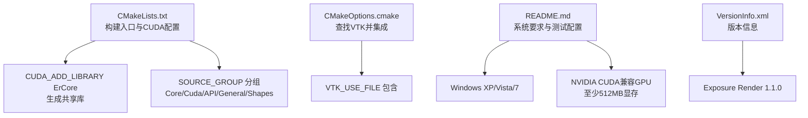
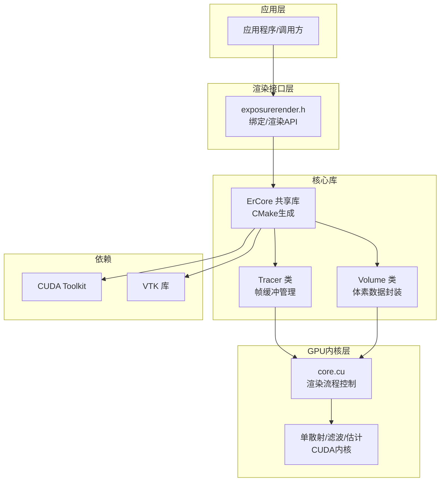
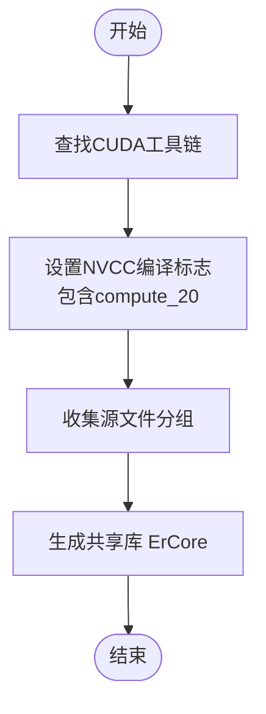
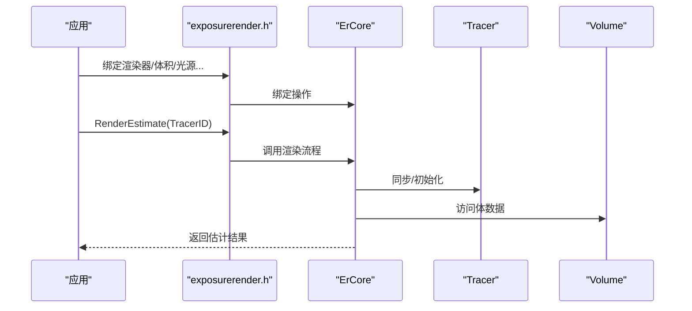

# 系统要求

<cite>
**本文引用的文件**
- [README.md](file://README.md)
- [CMakeLists.txt](file://Source/CMakeLists.txt)
- [CMakeOptions.cmake](file://Source/CMakeOptions.cmake)
- [VersionInfo.xml](file://VersionInfo.xml)
- [device.h](file://Source/device.h)
- [enums.h](file://Source/enums.h)
- [defines.h](file://Source/defines.h)
- [exposurerender.h](file://Source/exposurerender.h)
- [core.cu](file://Source/core.cu)
- [tracer.h](file://Source/tracer.h)
- [volume.h](file://Source/volume.h)
</cite>

## 目录
1. [简介](#简介)
2. [项目结构](#项目结构)
3. [核心组件](#核心组件)
4. [架构总览](#架构总览)
5. [详细组件分析](#详细组件分析)
6. [依赖关系分析](#依赖关系分析)
7. [性能考虑](#性能考虑)
8. [故障排除指南](#故障排除指南)
9. [结论](#结论)
10. [附录](#附录)

## 简介
本文件为 Exposure Render 的系统要求与兼容性说明，覆盖操作系统、硬件、软件依赖、性能表现与故障排除等内容。Exposure Render 是一个基于 CUDA 的体积光线渲染器，结合物理光照传输，支持交互式逼真体积渲染。根据仓库提供的信息，项目在 Windows 平台下构建与运行，并使用 CUDA 进行 GPU 加速计算。

## 项目结构
该工程采用 CMake 构建系统，源码主要位于 Source 目录，包含 C++ 核心逻辑与 CUDA 内核。CMakeLists 负责查找 CUDA、组织源文件分组并生成共享库；CMakeOptions.cmake 负责查找并集成 VTK。README 提供了系统要求、构建说明与已测试硬件配置。

图表来源
- [CMakeLists.txt:17-155](file://Source/CMakeLists.txt#L17-L155)
- [CMakeOptions.cmake:1-65](file://Source/CMakeOptions.cmake#L1-L65)
- [README.md:14-61](file://README.md#L14-L61)
- [VersionInfo.xml:1-10](file://VersionInfo.xml#L1-L10)

章节来源
- [CMakeLists.txt:17-155](file://Source/CMakeLists.txt#L17-L155)
- [CMakeOptions.cmake:1-65](file://Source/CMakeOptions.cmake#L1-L65)
- [README.md:14-61](file://README.md#L14-L61)
- [VersionInfo.xml:1-10](file://VersionInfo.xml#L1-L10)

## 核心组件
- CUDA 核心：通过 CMake 查找 CUDA 并编译核心内核，生成共享库 ErCore。CUDA NVCC 编译标志中包含 compute_20 的目标架构，表明对较老的 GPU 架构有支持。
- VTK 集成：CMakeOptions.cmake 中查找 VTK 并包含其 use 文件，用于图形与可视化功能。
- 渲染接口：exposurerender.h 暴露绑定渲染器、体积数据、光源、对象、纹理与位图的 API，并提供渲染估计、获取估计结果等函数。
- 设备抽象：device.h 定义了 DeviceObject 基类，配合 defines.h 中的 HOST/DEVICE 宏在主机与设备间切换。
- 枚举与类型：enums.h 定义了内存类型、形状类型、着色模式、异常级别等枚举，支撑渲染管线与错误处理。

章节来源
- [CMakeLists.txt:21-42](file://Source/CMakeLists.txt#L21-L42)
- [CMakeLists.txt:148-155](file://Source/CMakeLists.txt#L148-L155)
- [CMakeOptions.cmake:9-12](file://Source/CMakeOptions.cmake#L9-L12)
- [exposurerender.h:32-42](file://Source/exposurerender.h#L32-L42)
- [device.h:28-43](file://Source/device.h#L28-L43)
- [defines.h:31-56](file://Source/defines.h#L31-L56)
- [enums.h:24-108](file://Source/enums.h#L24-L108)

## 架构总览
Exposure Render 的运行时架构围绕 CUDA GPU 执行与 VTK 图形界面展开。CMake 将核心 C++ 与 CUDA 源文件编译为共享库，应用层通过暴露的 DLL 接口绑定渲染器与数据，CUDA 内核执行体积光线步进、散射估计、滤波与色调映射等步骤。

图表来源
- [exposurerender.h:32-42](file://Source/exposurerender.h#L32-L42)
- [CMakeLists.txt:148-155](file://Source/CMakeLists.txt#L148-L155)
- [tracer.h:31-55](file://Source/tracer.h#L31-L55)
- [volume.h:26-150](file://Source/volume.h#L26-L150)
- [core.cu:56-136](file://Source/core.cu#L56-L136)

## 详细组件分析

### CUDA 构建与目标架构
- CMake 查找 CUDA 并设置 NVCC 编译标志，包含 compute_20 的目标架构，表明对 Fermi 及以上架构的兼容性。
- 通过 CUDA_ADD_LIBRARY 生成 ErCore 共享库，包含通用核心、形状、API 绑定与 CUDA 内核源文件。

图表来源
- [CMakeLists.txt:21-42](file://Source/CMakeLists.txt#L21-L42)
- [CMakeLists.txt:148-155](file://Source/CMakeLists.txt#L148-L155)

章节来源
- [CMakeLists.txt:21-42](file://Source/CMakeLists.txt#L21-L42)
- [CMakeLists.txt:148-155](file://Source/CMakeLists.txt#L148-L155)

### VTK 集成与图形界面
- CMakeOptions.cmake 查找 VTK 并包含其 use 文件，确保图形与可视化功能可用。
- 该集成方式与 CMakeLists 的库生成相互独立，分别负责图形与核心渲染。

章节来源
- [CMakeOptions.cmake:9-12](file://Source/CMakeOptions.cmake#L9-L12)

### 渲染接口与数据绑定
- 暴露的 DLL 接口包括绑定渲染器、体积、光源、对象、裁剪对象、纹理与位图，以及渲染估计与获取估计结果等。
- 接口通过 ErTracer/ErVolume/ErLight 等包装类与内部 C++ 类进行桥接。

图表来源
- [exposurerender.h:32-42](file://Source/exposurerender.h#L32-L42)
- [core.cu:126-136](file://Source/core.cu#L126-L136)
- [tracer.h:31-55](file://Source/tracer.h#L31-L55)
- [volume.h:26-150](file://Source/volume.h#L26-L150)

章节来源
- [exposurerender.h:32-42](file://Source/exposurerender.h#L32-L42)
- [core.cu:126-136](file://Source/core.cu#L126-L136)
- [tracer.h:31-55](file://Source/tracer.h#L31-L55)
- [volume.h:26-150](file://Source/volume.h#L26-L150)

### 设备抽象与内存模型
- DeviceObject 提供统一的设备/主机对象基类，配合 HOST/DEVICE 宏在编译期选择执行位置。
- enums.h 中定义 MemoryType（Host/Device）与 MemoryUnit（K/M/G），用于描述内存分配与单位。

章节来源
- [device.h:28-43](file://Source/device.h#L28-L43)
- [enums.h:26-37](file://Source/enums.h#L26-L37)

## 依赖关系分析
- 外部依赖
  - CUDA Toolkit：用于 GPU 内核编译与执行。
  - VTK：用于图形界面与可视化。
  - CMake：用于跨平台构建。
- 内部依赖
  - CMakeLists 依赖 CUDA 与 VTK 的安装路径与头文件。
  - ErCore 共享库依赖通用核心、形状、API 绑定与 CUDA 内核源文件。

图表来源
- [CMakeLists.txt:21-42](file://Source/CMakeLists.txt#L21-L42)
- [CMakeLists.txt:148-155](file://Source/CMakeLists.txt#L148-L155)

章节来源
- [CMakeLists.txt:21-42](file://Source/CMakeLists.txt#L21-L42)
- [CMakeLists.txt:148-155](file://Source/CMakeLists.txt#L148-L155)

## 性能考虑
- 最低配置建议
  - 操作系统：Windows XP/Vista/7（32/64 位）
  - 显卡：NVIDIA CUDA 兼容 GPU，计算能力 1.0+，至少 512MB 显存
  - 内存：至少 1GB 系统内存
  - 已测试硬件：Windows 7（64 位）+ Quadro FX1700、GTS240、GTS250、GTS450、GTX260、GTX270、GTX460、GTX470、GTX560、GTX570、GTX580
- 推荐配置
  - 建议使用 GTX270 或更高性能的 GPU，以获得更流畅的交互体验
  - 对于较大的数据集，当前版本可能存在性能问题，需关注后续优化
- 性能差异
  - 不同 GPU 的计算能力与显存容量直接影响光线步进、散射估计与滤波的速度
  - 数据集大小与分辨率越高，对显存与带宽的要求越大

章节来源
- [README.md:17-22](file://README.md#L17-L22)
- [README.md:44-59](file://README.md#L44-L59)

## 故障排除指南
- 构建失败（未找到 CUDA/VTK）
  - 确认已正确安装 CUDA Toolkit 与 VTK，并在系统 PATH 或 CMake 变量中可被发现
  - 检查 CMake 输出，确认 CUDA 和 VTK 的 FIND_PACKAGE 是否成功
- 版本不匹配
  - README 指明构建环境为 Visual Studio 2017、Qt5.11.1、VTK 7.1.1、CUDA 9.2
  - 若使用其他版本，请先验证兼容性或参考官方构建说明
- 运行时崩溃或黑屏
  - 确认显卡驱动与 CUDA 驱动版本兼容
  - 检查显存是否满足需求（至少 512MB，建议更高）
  - 使用已测试的硬件配置进行对比，逐步排查问题
- 大数据集问题
  - 当前版本对较大数据集可能存在性能问题，建议减小数据分辨率或分块加载
- 报告问题时请提供
  - 完整系统配置（OS 位数、显卡型号、驱动版本等）
  - 错误截图与日志信息，以便开发者定位

章节来源
- [README.md:14-15](file://README.md#L14-L15)
- [README.md:17-22](file://README.md#L17-L22)
- [README.md:44-59](file://README.md#L44-L59)
- [README.md:60-61](file://README.md#L60-L61)

## 结论
Exposure Render 在 Windows 平台下通过 CUDA 实现体积光线渲染，具备对较老 GPU 的兼容性（compute_20）。构建与运行需要 CUDA Toolkit 与 VTK 支持。根据 README 的系统要求与已测试配置，建议在满足最低显存与计算能力的前提下，优先选择 GTX270 或更高性能的 GPU，并关注大数据集的性能限制。遇到兼容性问题时，应从 CUDA/VTK 版本、驱动版本与硬件配置入手排查。

## 附录

### 已测试硬件配置清单
- Windows 7（64 位）+ Quadro FX1700
- Windows 7（64 位）+ GTS240
- Windows 7（64 位）+ GTS250
- Windows 7（64 位）+ GTS450
- Windows 7（64 位）+ GTX260
- Windows 7（64 位）+ GTX270
- Windows 7（64 位）+ GTX460
- Windows 7（64 位）+ GTX470
- Windows 7（64 位）+ GTX560
- Windows 7（64 位）+ GTX570
- Windows 7（64 位）+ GTX580

章节来源
- [README.md:44-59](file://README.md#L44-L59)