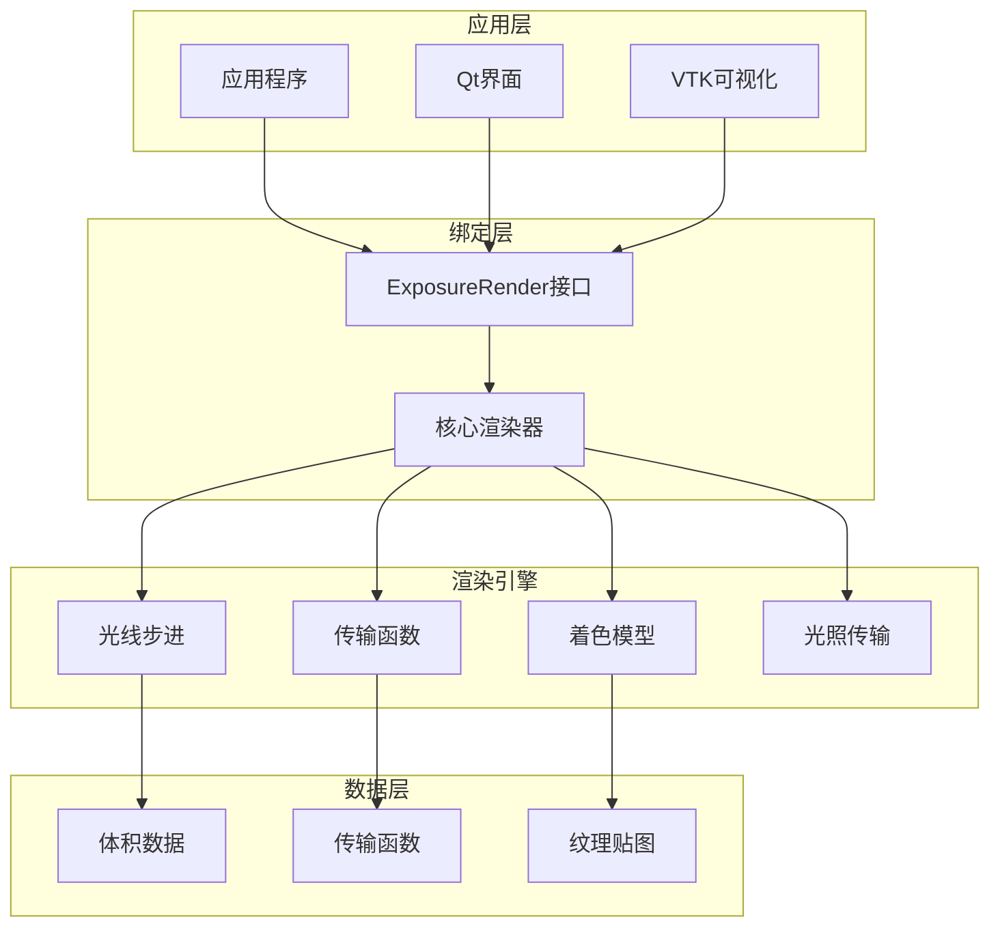
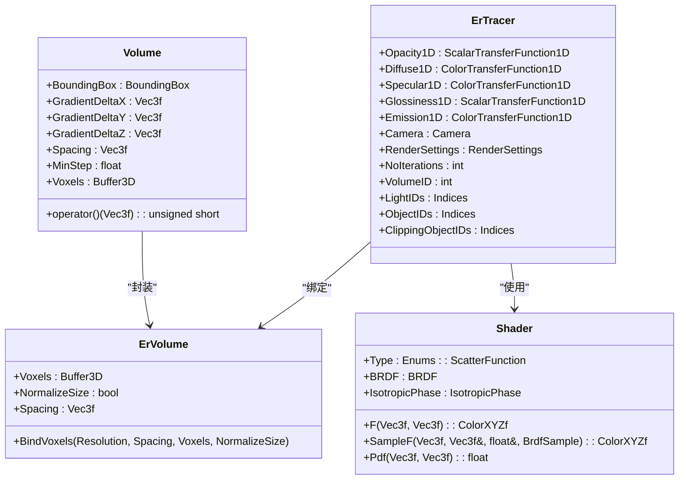
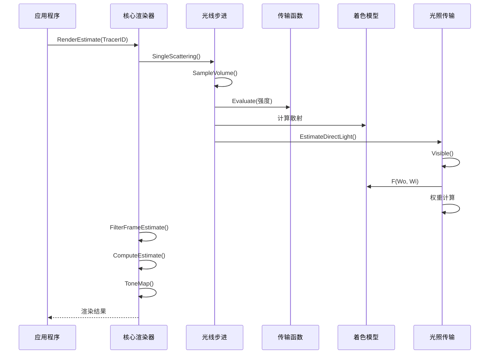
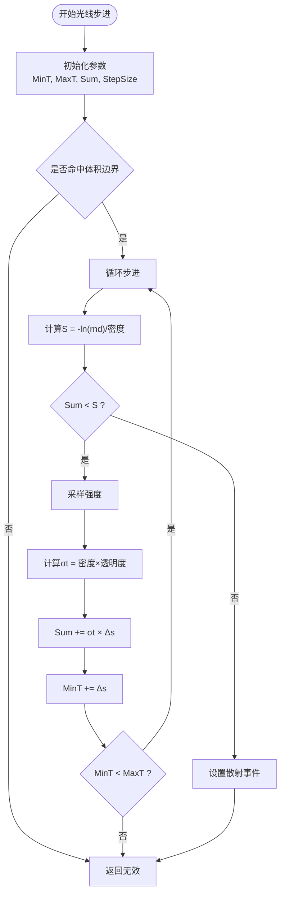
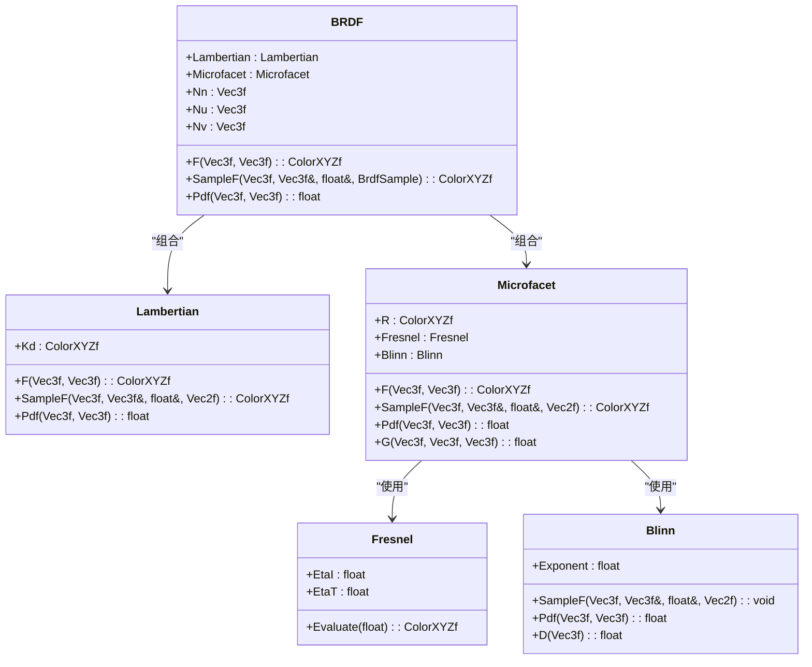
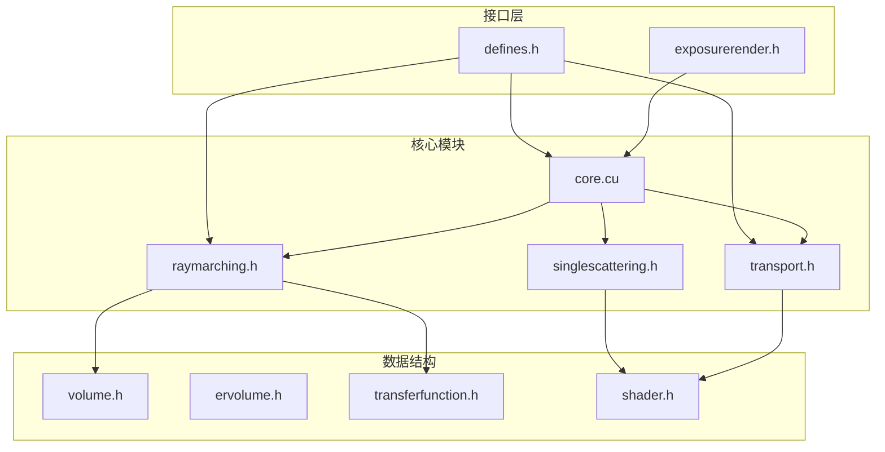

# 项目介绍

<cite>
**本文档引用的文件**
- [README.md](file://README.md)
- [exposurerender.h](file://Source/exposurerender.h)
- [exposurerender.cpp](file://Source/exposurerender.cpp)
- [core.cu](file://Source/core.cu)
- [volume.h](file://Source/volume.h)
- [ervolume.h](file://Source/ervolume.h)
- [raymarching.h](file://Source/raymarching.h)
- [transport.h](file://Source/transport.h)
- [singlescattering.h](file://Source/singlescattering.h)
- [shader.h](file://Source/shader.h)
- [transferfunction.h](file://Source/transferfunction.h)
- [defines.h](file://Source/defines.h)
</cite>

## 目录
1. [引言](#引言)
2. [项目结构](#项目结构)
3. [核心组件](#核心组件)
4. [架构总览](#架构总览)
5. [详细组件分析](#详细组件分析)
6. [依赖关系分析](#依赖关系分析)
7. [性能考量](#性能考量)
8. [故障排除指南](#故障排除指南)
9. [结论](#结论)

## 引言
Exposure Render是一个基于CUDA的交互式照片级真实感体积渲染框架，融合了基于物理的光线传输算法。该项目由荷兰代尔夫特理工大学（TU Delft）计算机图形学与可视化实验室（CGV）开发，并得到莱顿大学医学中心（LUMC）临床与实验成像处理实验室（LKEB）的支持。项目旨在为医学影像与科学可视化提供高质量、实时的体积渲染能力，通过物理上正确的光照模型实现逼真的视觉效果。

本项目的核心目标是：
- 提供交互式的体积渲染体验，支持实时调整渲染参数
- 基于物理的光线传输，确保渲染结果符合真实的光学现象
- 支持医学影像数据集，服务于医学诊断与教学
- 通过CUDA加速，充分利用GPU并行计算能力

## 项目结构
Exposure Render采用模块化设计，主要分为以下层次：
- 核心渲染引擎：负责光线步进、散射事件检测、光照计算等核心功能
- 数据绑定层：提供与外部系统（如Qt、VTK）的接口，支持数据绑定与渲染控制
- 物理光照模型：包含BRDF、相位函数、材质属性等基于物理的着色模型
- 体积数据处理：支持体素数据加载、梯度计算、传输函数映射等功能
- 系统接口：提供DLL导出函数，便于集成到其他应用程序中

**图表来源**
- [exposurerender.h:32-43](file://Source/exposurerender.h#L32-L43)
- [core.cu:56-136](file://Source/core.cu#L56-L136)

**章节来源**
- [README.md:14-22](file://README.md#L14-L22)
- [exposurerender.h:29-44](file://Source/exposurerender.h#L29-L44)

## 核心组件
Exposure Render的核心组件包括：

### 渲染追踪器（ErTracer）
渲染追踪器是整个渲染系统的核心控制器，负责管理渲染设置、光源绑定、相机参数等。它包含了传输函数（Opacity1D、Diffuse1D等）、相机对象、渲染设置以及绑定的光源、物体、裁剪对象等资源。

### 体积数据（ErVolume）
体积数据类封装了3D体素数据，提供了体素采样、梯度计算、空间变换等功能。它支持不同分辨率的体素数据，并能够根据间距进行归一化处理。

### 光线步进（Ray Marching）
光线步进算法是体积渲染的基础，通过沿着射线方向进行步进采样，检测散射事件并计算累积透射率。该实现支持随机步进大小和密度场采样。

### 物理着色模型（Shader）
框架实现了完整的基于物理的着色模型，包括Lambertian漫反射、微平面镜面反射（Blinn分布）、菲涅尔效应等，能够准确模拟不同材质的光学特性。

**章节来源**
- [ertracer.h:33-117](file://Source/ertracer.h#L33-L117)
- [ervolume.h:28-74](file://Source/ervolume.h#L28-L74)
- [raymarching.h:30-113](file://Source/raymarching.h#L30-L113)
- [shader.h:415-483](file://Source/shader.h#L415-L483)

## 架构总览
Exposure Render采用分层架构设计，从底层的CUDA内核到上层的应用接口，形成了清晰的功能划分。

**图表来源**
- [ertracer.h:33-117](file://Source/ertracer.h#L33-L117)
- [ervolume.h:28-74](file://Source/ervolume.h#L28-L74)
- [volume.h:26-150](file://Source/volume.h#L26-L150)
- [shader.h:415-483](file://Source/shader.h#L415-L483)

## 详细组件分析

### 体积渲染流程
Exposure Render的体积渲染遵循以下核心流程：

**图表来源**
- [core.cu:126-136](file://Source/core.cu#L126-L136)
- [singlescattering.h:76-102](file://Source/singlescattering.h#L76-L102)
- [transport.h:58-156](file://Source/transport.h#L58-L156)

### 光线步进算法
光线步进是体积渲染的核心算法，通过概率密度函数控制步进长度，确保在高密度区域有更精细的采样。

**图表来源**
- [raymarching.h:30-113](file://Source/raymarching.h#L30-L113)

### 物理着色模型
Exposure Render实现了多种基于物理的着色模型，能够准确模拟不同材质的光学特性：

**图表来源**
- [shader.h:316-413](file://Source/shader.h#L316-L413)
- [shader.h:198-274](file://Source/shader.h#L198-L274)
- [shader.h:79-128](file://Source/shader.h#L79-L128)

**章节来源**
- [raymarching.h:30-113](file://Source/raymarching.h#L30-L113)
- [transport.h:58-156](file://Source/transport.h#L58-L156)
- [shader.h:316-483](file://Source/shader.h#L316-L483)

## 依赖关系分析
Exposure Render的依赖关系体现了清晰的模块化设计：

**图表来源**
- [core.cu:22-52](file://Source/core.cu#L22-L52)
- [exposurerender.h:21-28](file://Source/exposurerender.h#L21-L28)
- [defines.h:21-56](file://Source/defines.h#L21-L56)

**章节来源**
- [core.cu:22-52](file://Source/core.cu#L22-L52)
- [exposurerender.h:21-28](file://Source/exposurerender.h#L21-L28)

## 性能考量
Exposure Render在性能优化方面采用了多项策略：

### CUDA并行优化
- 使用CUDA内核进行大规模并行计算
- 通过线程块和线程网格优化内存访问模式
- 利用GPU的高吞吐量特性处理大量光线步进

### 内存管理
- 体素数据在设备内存中存储，减少主机-设备数据传输
- 梯度计算使用共享内存优化访问局部性
- 传输函数采用纹理缓存提高采样效率

### 算法优化
- 基于概率密度的自适应步进，避免固定步长的浪费
- 随机数生成器优化，减少伪随机序列相关性
- 直接光照重要性采样，提高收敛速度

## 故障排除指南
针对Exposure Render可能遇到的问题，提供以下排查建议：

### 系统兼容性问题
- 确认GPU满足最低要求（CUDA兼容、至少512MB显存）
- 检查驱动版本与CUDA版本的兼容性
- 验证系统内存充足，特别是大体积数据集时

### 渲染质量问题
- 调整步进因子以平衡质量和性能
- 检查传输函数设置是否合理
- 确认光源配置正确，避免过度衰减

### 性能问题
- 监控GPU利用率，确保充分利用硬件资源
- 调整渲染分辨率和采样参数
- 检查是否有过多的复杂几何体影响性能

**章节来源**
- [README.md:17-22](file://README.md#L17-L22)

## 结论
Exposure Render作为一个成熟的CUDA体积渲染框架，在医学影像和科学可视化领域具有重要价值。其基于物理的光线传输算法确保了渲染的真实感，而CUDA并行优化则保证了交互性能。

项目的主要优势包括：
- 完整的物理光照模型，支持复杂的材质表现
- 高效的CUDA实现，适合大规模数据集
- 模块化的架构设计，便于扩展和维护
- 丰富的传输函数支持，满足不同应用场景需求

对于初学者，建议从简单的体积数据开始，逐步学习传输函数调优和光照配置。对于专业用户，可以深入研究CUDA内核优化和高级光照技术，以获得最佳的渲染效果和性能表现。

随着GPU技术的发展和CUDA生态系统的完善，Exposure Render有望在更多领域发挥重要作用，为科学研究和医学诊断提供强有力的可视化工具。