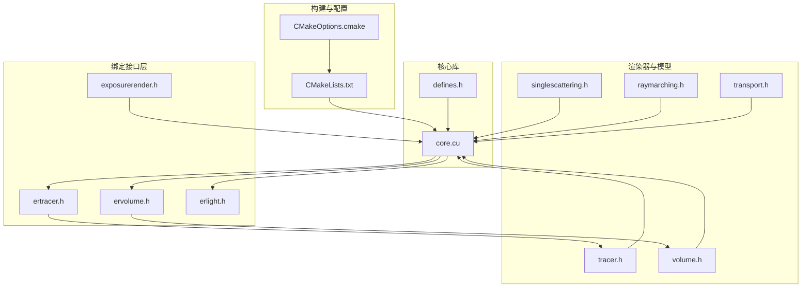
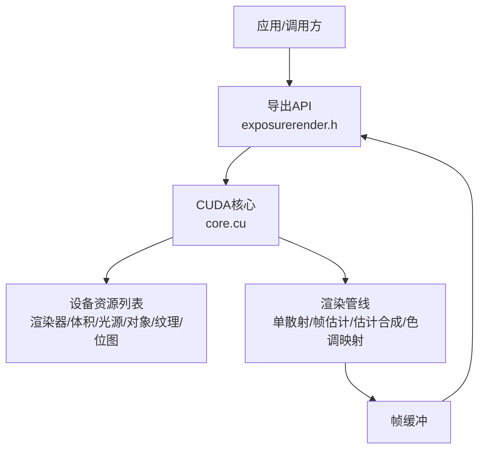
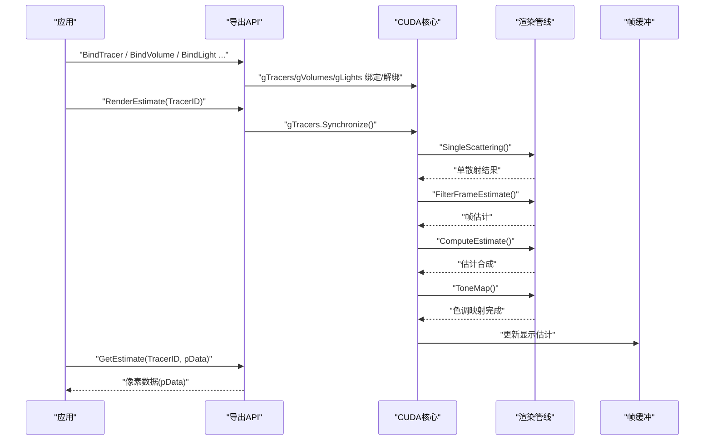
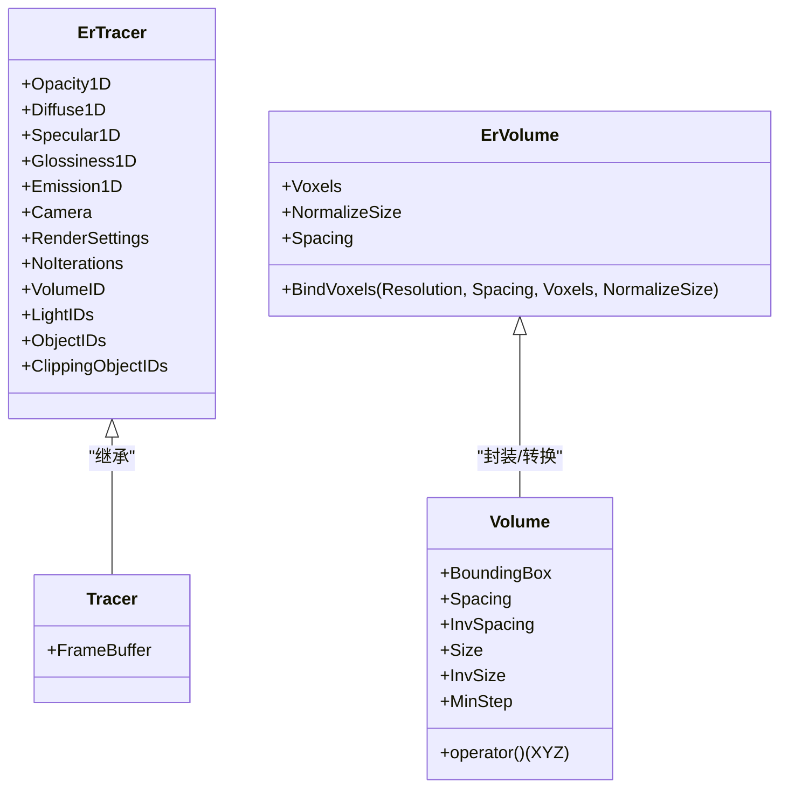
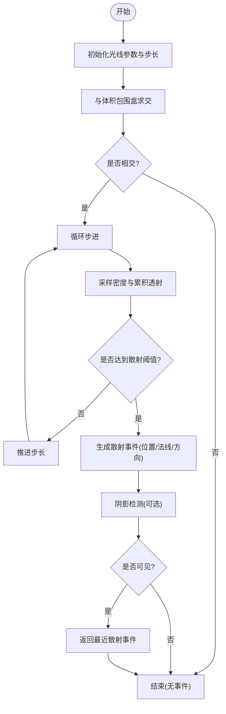
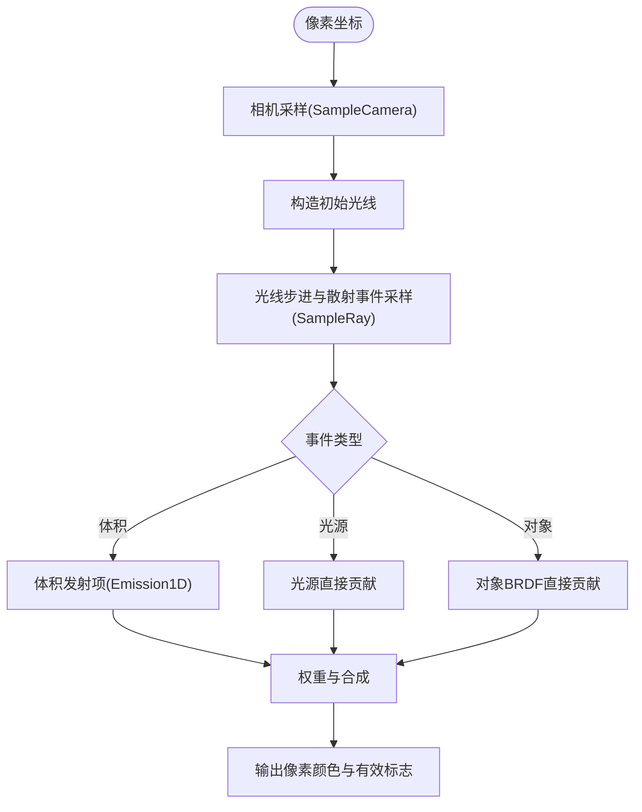
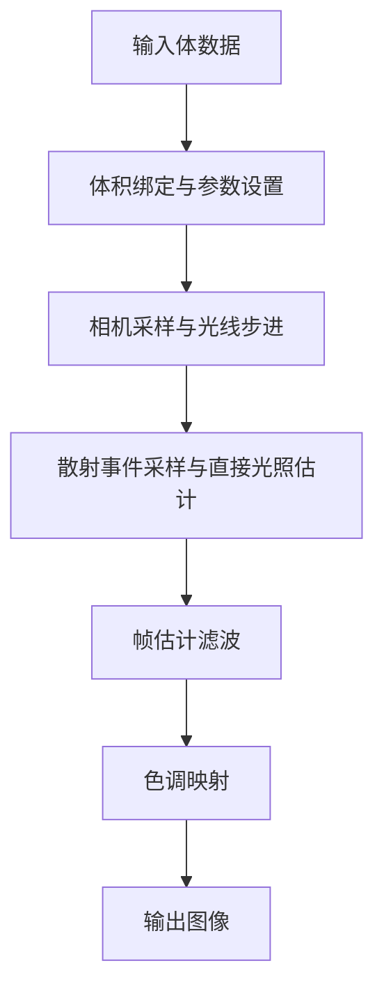
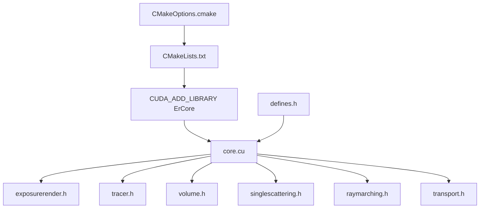

# 项目概述

<cite>
**本文引用的文件**
- [README.md](file://README.md)
- [CMakeLists.txt](file://Source/CMakeLists.txt)
- [CMakeOptions.cmake](file://Source/CMakeOptions.cmake)
- [exposurerender.h](file://Source/exposurerender.h)
- [exposurerender.cpp](file://Source/exposurerender.cpp)
- [core.cu](file://Source/core.cu)
- [ertracer.h](file://Source/ertracer.h)
- [ervolume.h](file://Source/ervolume.h)
- [erlight.h](file://Source/erlight.h)
- [tracer.h](file://Source/tracer.h)
- [volume.h](file://Source/volume.h)
- [singlescattering.h](file://Source/singlescattering.h)
- [raymarching.h](file://Source/raymarching.h)
- [transport.h](file://Source/transport.h)
- [defines.h](file://Source/defines.h)
</cite>

## 目录
1. [简介](#简介)
2. [项目结构](#项目结构)
3. [核心组件](#核心组件)
4. [架构总览](#架构总览)
5. [详细组件分析](#详细组件分析)
6. [依赖关系分析](#依赖关系分析)
7. [性能考量](#性能考量)
8. [故障排查指南](#故障排查指南)
9. [结论](#结论)
10. [附录](#附录)

## 简介
本项目是一个基于CUDA的交互式照片级真实感体积渲染框架，融合了物理基础的光传输算法，支持在GPU上进行高效体积光线步进与直接光照估计，适用于医学影像等体数据的高质量可视化。项目提供了从数据绑定、渲染估计到色调映射的完整管线，并通过一组导出的C API对外暴露能力。

- 目标：在交互时间内生成照片级真实感体积渲染图像，支持多光源、材质属性（漫反射/镜面/光泽）、体积发射与阴影等。
- 技术栈：C++（主机侧）+ CUDA（设备侧），构建系统采用CMake，结合VTK与Qt（由构建说明提及）。
- 关键特性：体积光线步进、单散射估计、帧估计滤波、色调映射、自动对焦接口占位、可绑定的渲染器、体积、光源、对象、纹理与位图资源。

**章节来源**
- [README.md:1-61](file://README.md#L1-L61)

## 项目结构
仓库采用按“模块/层次”组织的源码结构，主要目录与文件如下：
- Source：核心源码与头文件，包含通用几何/数学工具、渲染器与体积模型、绑定接口、CUDA核函数与滤波器等。
- Images/Movies：示例或输出目录（未在本概述中深入分析）。
- 根目录：构建脚本与版本信息。

**图示来源**
- [CMakeLists.txt:1-155](file://Source/CMakeLists.txt#L1-L155)
- [core.cu:1-156](file://Source/core.cu#L1-L156)
- [exposurerender.h:1-45](file://Source/exposurerender.h#L1-L45)
- [ertracer.h:1-120](file://Source/ertracer.h#L1-L120)
- [ervolume.h:1-77](file://Source/ervolume.h#L1-L77)
- [erlight.h:1-69](file://Source/erlight.h#L1-L69)
- [tracer.h:1-58](file://Source/tracer.h#L1-L58)
- [volume.h:1-153](file://Source/volume.h#L1-L153)
- [singlescattering.h:1-105](file://Source/singlescattering.h#L1-L105)
- [raymarching.h:1-275](file://Source/raymarching.h#L1-L275)
- [transport.h:1-158](file://Source/transport.h#L1-L158)
- [defines.h:1-114](file://Source/defines.h#L1-L114)

**章节来源**
- [CMakeLists.txt:1-155](file://Source/CMakeLists.txt#L1-L155)
- [CMakeOptions.cmake:1-65](file://Source/CMakeOptions.cmake#L1-L65)

## 核心组件
- 导出API（exposurerender.h）：提供绑定与渲染控制接口，包括绑定渲染器、体积、光源、对象、裁剪对象、纹理与位图；执行渲染估计、获取估计结果、查询迭代次数与自动对焦距离等。
- 渲染器（ErTracer/Tracer）：封装相机、渲染设置、1D传输函数（不透明度/漫反射/镜面/光泽/发射）、光源与对象索引、帧缓冲等。
- 体积（ErVolume/Volume）：管理体素数据（主机侧绑定后拷贝至设备），计算边界盒、间距、最小步长与梯度采样增量。
- 光源（ErLight）：支持可见性、形状、纹理ID、辐射度单位与倍数。
- CUDA核心（core.cu）：维护各类资源列表（渲染器、体积、光源、对象、纹理、位图），实现渲染估计流程（单散射、帧估计滤波、估计合成、色调映射）与结果读取。

**章节来源**
- [exposurerender.h:32-43](file://Source/exposurerender.h#L32-L43)
- [ertracer.h:33-117](file://Source/ertracer.h#L33-L117)
- [ervolume.h:28-74](file://Source/ervolume.h#L28-L74)
- [erlight.h:27-66](file://Source/erlight.h#L27-L66)
- [tracer.h:31-55](file://Source/tracer.h#L31-L55)
- [volume.h:26-150](file://Source/volume.h#L26-L150)
- [core.cu:40-156](file://Source/core.cu#L40-L156)

## 架构总览
整体架构分为三层：
- 绑定接口层：对外导出API，负责资源绑定与渲染控制。
- 渲染管线层：在CUDA核函数中完成光线步进、散射事件采样、直接光照估计、帧估计与色调映射。
- 资源管理层：通过列表容器在设备端维护渲染器与场景资源，支持同步与更新。

**图示来源**
- [exposurerender.h:32-43](file://Source/exposurerender.h#L32-L43)
- [core.cu:40-156](file://Source/core.cu#L40-L156)

## 详细组件分析

### 组件A：渲染估计流程（序列图）
该序列图展示一次渲染估计的典型调用链：绑定资源 → 执行渲染估计 → 获取估计结果。

**图示来源**
- [core.cu:126-143](file://Source/core.cu#L126-L143)
- [exposurerender.h:39-42](file://Source/exposurerender.h#L39-L42)

**章节来源**
- [core.cu:126-143](file://Source/core.cu#L126-L143)
- [exposurerender.h:39-42](file://Source/exposurerender.h#L39-L42)

### 组件B：体积光线步进与散射事件（类图）
该类图展示体积与渲染器之间的关系，以及光线步进与散射事件的关键方法。

**图示来源**
- [ertracer.h:33-117](file://Source/ertracer.h#L33-L117)
- [tracer.h:31-55](file://Source/tracer.h#L31-L55)
- [ervolume.h:28-74](file://Source/ervolume.h#L28-L74)
- [volume.h:26-150](file://Source/volume.h#L26-L150)

**章节来源**
- [ertracer.h:33-117](file://Source/ertracer.h#L33-L117)
- [tracer.h:31-55](file://Source/tracer.h#L31-L55)
- [ervolume.h:28-74](file://Source/ervolume.h#L28-L74)
- [volume.h:26-150](file://Source/volume.h#L26-L150)

### 组件C：光线步进与散射事件采样（流程图）
该流程图描述光线在体积内步进直至发生散射事件的过程，以及阴影检测与可见性判断。

**图示来源**
- [raymarching.h:30-113](file://Source/raymarching.h#L30-L113)
- [transport.h:46-56](file://Source/transport.h#L46-L56)

**章节来源**
- [raymarching.h:30-113](file://Source/raymarching.h#L30-L113)
- [transport.h:46-56](file://Source/transport.h#L46-L56)

### 组件D：单散射与直接光照估计（流程图）
该流程图展示针对每个像素的单散射估计过程，包括相机采样、光线步进、散射事件采样与直接光照估计。

**图示来源**
- [singlescattering.h:76-102](file://Source/singlescattering.h#L76-L102)
- [transport.h:115-156](file://Source/transport.h#L115-L156)

**章节来源**
- [singlescattering.h:76-102](file://Source/singlescattering.h#L76-L102)
- [transport.h:115-156](file://Source/transport.h#L115-L156)

### 概念性总览
- 体积渲染：通过沿视线步进，根据不透明度与密度场累积透射，随机决定散射距离，从而在体积内部或表面产生散射事件。
- 单散射估计：对每个像素进行一次散射事件采样，结合直接光照估计得到初步估计。
- 帧估计滤波与色调映射：对多帧估计进行滤波与色调映射，提升视觉质量与稳定性。
- 自动对焦：提供接口占位，用于基于焦点深度的自动对焦计算（当前为空实现）。

[此图为概念性流程图，无需图示来源]

## 依赖关系分析
- 构建与外部依赖：CMakeLists定义CUDA编译选项与包含路径，查找并使用VTK；CMakeOptions处理VTK相关选项与Python包装开关。
- 内部依赖：
  - 导出API依赖CUDA核心实现（core.cu）。
  - 渲染器（Tracer）依赖帧缓冲与相机设置。
  - 体积（Volume）依赖缓冲区与边界盒。
  - 光线步进与散射事件依赖传输函数与着色模型。
  - 宏与常量定义（defines.h）贯穿所有模块。

**图示来源**
- [CMakeLists.txt:1-155](file://Source/CMakeLists.txt#L1-L155)
- [CMakeOptions.cmake:1-65](file://Source/CMakeOptions.cmake#L1-L65)
- [core.cu:1-156](file://Source/core.cu#L1-L156)
- [exposurerender.h:1-45](file://Source/exposurerender.h#L1-L45)
- [tracer.h:1-58](file://Source/tracer.h#L1-L58)
- [volume.h:1-153](file://Source/volume.h#L1-L153)
- [singlescattering.h:1-105](file://Source/singlescattering.h#L1-L105)
- [raymarching.h:1-275](file://Source/raymarching.h#L1-L275)
- [transport.h:1-158](file://Source/transport.h#L1-L158)
- [defines.h:1-114](file://Source/defines.h#L1-L114)

**章节来源**
- [CMakeLists.txt:1-155](file://Source/CMakeLists.txt#L1-L155)
- [CMakeOptions.cmake:1-65](file://Source/CMakeOptions.cmake#L1-L65)
- [core.cu:1-156](file://Source/core.cu#L1-L156)

## 性能考量
- 步长策略：主路径与阴影路径采用不同的步长因子，平衡速度与质量。
- 随机数与采样：Metro采样与分层采样减少噪声，提高收敛速度。
- 设备内存：体素数据在主机侧绑定后拷入设备，避免频繁主机-设备拷贝。
- 迭代统计：跟踪NoIterations便于用户了解渲染进度与停止条件。
- CUDA架构：NVCC标志指定目标架构，确保在不同GPU上获得最佳性能。

[本节为通用性能讨论，无需章节来源]

## 故障排查指南
- 构建问题：确认已安装Visual Studio、Qt、VTK与CUDA，并按照构建说明配置环境变量与路径。
- 显存不足：体数据较大时可能导致显存溢出，建议降低分辨率或启用数据降采样。
- 光照异常：检查光源可见性、单位与倍数设置，以及传输函数节点数量与范围。
- 渲染卡顿：调整步长因子、阴影开关与最大阴影距离，减少复杂几何与高密度区域的渲染负担。
- 自动对焦：当前接口为占位实现，如需使用请参考接口签名并自行实现。

**章节来源**
- [README.md:14-22](file://README.md#L14-L22)
- [core.cu:145-153](file://Source/core.cu#L145-L153)

## 结论
本项目提供了一个完整的基于CUDA的照片级真实感体积渲染框架，具备清晰的模块化设计与高效的渲染管线。通过绑定接口与渲染估计流程，用户可以在交互时间内生成高质量的体积渲染图像。建议在实际使用中关注体数据规模、传输函数设置与CUDA架构匹配，以获得最佳性能与视觉效果。

[本节为总结性内容，无需章节来源]

## 附录

### 公共接口与参数说明
- 绑定接口
  - BindTracer(const ErTracer&, bool bind=true)
  - BindVolume(const ErVolume&, bool bind=true)
  - BindLight(const ErLight&, bool bind=true)
  - BindObject(const ErObject&, bool bind=true)
  - BindClippingObject(const ErClippingObject&, bool bind=true)
  - BindTexture(const ErTexture&, bool bind=true)
  - BindBitmap(const ErBitmap&, bool bind=true)
- 渲染控制
  - RenderEstimate(int TracerID)
  - GetEstimate(int TracerID, unsigned char* pData)
  - GetAutoFocusDistance(int TracerID, int FilmU, int FilmV, float& AutoFocusDistance)
  - GetNoIterations(int TracerID, int& NoIterations)

以上接口均在导出头文件中声明，具体行为由CUDA核心实现。

**章节来源**
- [exposurerender.h:32-43](file://Source/exposurerender.h#L32-L43)
- [core.cu:126-153](file://Source/core.cu#L126-L153)

### 使用模式与常见用例
- 基础渲染流程
  1) 绑定体数据与相机参数
  2) 设置传输函数（不透明度/漫反射/镜面/光泽/发射）
  3) 绑定光源与对象
  4) 循环调用RenderEstimate并读取GetEstimate
  5) 在UI中显示像素数据
- 参数调节
  - 调整步长因子与阴影开关以平衡速度与质量
  - 修改传输函数节点以适配不同体数据对比度
  - 控制光源单位与倍数以调节亮度
- 自动对焦
  - 通过GetAutoFocusDistance接口传入像素坐标，获取对应焦点深度（当前实现为空）

**章节来源**
- [core.cu:126-143](file://Source/core.cu#L126-L143)
- [exposurerender.h:39-42](file://Source/exposurerender.h#L39-L42)
- [ertracer.h:105-116](file://Source/ertracer.h#L105-L116)